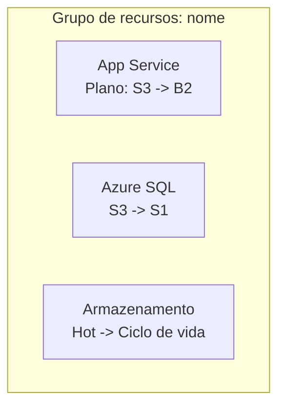

# Otimização de custos do Azure

Analise arquivos de infraestrutura como código e recursos implantados no Azure para gerar recomendações de otimização de custos. Depois, crie um item de trabalho individual (`issue`) no GitHub para cada oportunidade e um épico de coordenação.

> [!NOTE]
> Esta habilidade depende da autenticação no **servidor MCP do Azure** e no **servidor MCP do GitHub** (ou `gh`). A IaC deste kit usa **Terraform**. Portanto, os arquivos `.tf` são a fonte primária da verdade. Trate os outros arquivos do repositório como não oficiais. Quando disponíveis, prefira as ferramentas MCP do Azure (`azmcp-*`) à Azure CLI direta.

## Quando usar

- "Reduza nossos gastos do Azure com a carga de trabalho do SIFAP."
- "Redimensione estes recursos superdimensionados e acompanhe o trabalho."
- "Abra itens de trabalho no GitHub para nossas oportunidades de otimização de custos do Azure."
- "Onde estamos desperdiçando dinheiro neste grupo de recursos?"

## Pré-requisitos

- Servidor MCP do Azure configurado e autenticado.
- Servidor MCP do GitHub (ou `gh`) configurado e autenticado.
- Repositório de destino do GitHub identificado.
- Recursos do Azure implantados (arquivos de IaC são opcionais, mas úteis).

## Etapas do fluxo de trabalho

### Etapa 1: obter as boas práticas do Azure

Execute `azmcp-bestpractices-get` para carregar as orientações atuais de otimização do Azure. Use-as para embasar a análise e as recomendações. Cite a boa prática relevante em cada recomendação.

### Etapa 2: descobrir a infraestrutura do Azure

1. **Descoberta de recursos**:
   - Use `azmcp-subscription-list` para localizar assinaturas.
   - Use `azmcp-group-list --subscription <id>` para localizar grupos de recursos.
   - Use `az resource list --subscription <id> --resource-group <name>` para obter um inventário completo.
   - Prefira as ferramentas MCP por tipo de recurso, com a CLI como alternativa: `azmcp-cosmos-account-list`, `azmcp-storage-account-list`, `azmcp-monitor-workspace-list`, `azmcp-keyvault-key-list`; e `az webapp list`, `az appservice plan list`, `az functionapp list`, `az sql server list`, `az redis list` quando não existir uma ferramenta MCP.
2. **Detecção de IaC**:
   - Procure arquivos de IaC: `**/*.tf` (principal neste kit), além de `**/*.bicep`, `**/main.json` e `**/*template*.json`.
   - Analise as definições dos recursos e compare-as aos recursos descobertos.
   - Use somente arquivos de IaC como fonte da verdade, não outros arquivos do repositório.
   - Se nenhum arquivo de IaC for encontrado, pare e informe a pessoa.
3. **Análise da configuração**: extraia as SKUs, as camadas e as configurações atuais; mapeie dependências e padrões de utilização.

### Etapa 3: coletar métricas de uso e validar os custos atuais

1. **Localize as fontes de monitoramento**: use `azmcp-monitor-workspace-list` e depois `azmcp-monitor-table-list` para descobrir as tabelas.
2. **Execute consultas de uso** com `azmcp-monitor-log-query` (opções predefinidas `recent` e `errors`) ou KQL personalizada:

```kql
AppServiceAppLogs
| where TimeGenerated > ago(7d)
| summarize avg(CpuTime) by Resource, bin(TimeGenerated, 1h)
```

```kql
AzureDiagnostics
| where ResourceProvider == "MICROSOFT.DOCUMENTDB"
| where TimeGenerated > ago(7d)
| summarize avg(RequestCharge) by Resource
```

3. **Calcule as métricas de referência**: médias de CPU/memória, taxa de transferência do banco de dados, frequência de acesso ao armazenamento e taxas de execução de funções.
4. **Valide os custos atuais**: usando as SKUs/camadas descobertas, consulte os preços atuais do Azure (ou use a habilidade `azure-pricing`) e documente Recurso → SKU atual → Custo mensal estimado antes de recomendar alterações.

### Etapa 4: gerar recomendações de otimização de custos

1. **Aplique padrões de otimização**:

| Área | Padrão |
|---|---|
| Computação | Redimensionar planos do App Service; mover Functions com pouco uso de Premium para Consumption; reduzir VMs superdimensionadas |
| Bancos de dados | Mover Cosmos DB provisionado para o modo sem servidor em cargas variáveis; redimensionar RU/s; redimensionar camadas do SQL por DTU |
| Armazenamento | Aplicar políticas de ciclo de vida (Hot para Cool e depois Archive); consolidar contas redundantes; redimensionar camadas |
| Infraestrutura | Remover recursos não usados; adicionar dimensionamento automático; agendar o desligamento de ambientes que não sejam de produção |

2. **Calcule economias baseadas em evidências**: subtraia o custo de destino do custo atual validado e documente a fonte de preços de ambos.
3. **Calcule uma pontuação de prioridade** para cada recomendação:

```text
Pontuação de prioridade = (Pontuação de valor x Economia mensal) / (Pontuação de risco x Dias de implementação)

Prioridade alta:  Pontuação > 20
Prioridade média: Pontuação 5-20
Prioridade baixa: Pontuação < 5
```

4. **Valide as recomendações**: verifique os comandos da CLI, confirme os cálculos de economia e avalie os riscos e pré-requisitos. Toda economia deve ter evidências de suporte.

### Etapa 5: obter a confirmação da pessoa

Apresente o resumo e condicione a criação de itens de trabalho à aprovação explícita:

```text
Resumo da otimização de custos do Azure

Resultados da análise:
- Total de recursos analisados: X
- Custo mensal atual: $X
- Economia mensal potencial: $Y
- Oportunidades de otimização: Z
- Itens de alta prioridade: N

Recomendações:
1. [Recurso]: [SKU atual] -> [SKU de destino] = $X/mês - [Risco] | [Esforço]
2. [Recurso]: [Atual] -> [Destino] = $Y/mês - [Risco] | [Esforço]

Isso criará Z itens de trabalho individuais no GitHub e um épico.

Prosseguir com a criação dos itens de trabalho no GitHub? (s/n)
```

> [!IMPORTANT]
> Crie itens de trabalho no GitHub somente após uma resposta afirmativa explícita. Diante de uma resposta negativa, ambígua ou ausente, imprima as recomendações no console e pare.

### Etapa 6: criar itens de trabalho individuais de otimização

Crie um item de trabalho no GitHub por oportunidade, com os rótulos `cost-optimization` e `azure`, usando o modelo de item individual em [Modelo de saída](#modelo-de-saída). Formato do título: `[COST-OPT] [Tipo de recurso] - [Descrição breve] - economia de $X/mês`.

### Etapa 7: criar o épico de coordenação

Crie um épico com os rótulos `cost-optimization`, `azure` e `epic`, usando o modelo de épico em [Modelo de saída](#modelo-de-saída). Verifique se cada diagrama Mermaid tem sintaxe válida e é acessível (estilo e cores). Formato do título: `[EPIC] Iniciativa de otimização de custos do Azure - economia potencial de $X/mês`.

## Tratamento de erros

| Situação | Ação |
|---|---|
| Estimativas de economia sem evidências | Verifique novamente as configurações e as fontes de preços antes de prosseguir |
| Falha na autenticação do Azure | Forneça etapas manuais de configuração da Azure CLI |
| Nenhum recurso encontrado | Crie um item de trabalho informativo sobre a implantação de recursos |
| Falha ao criar no GitHub | Exiba as recomendações formatadas no console |
| Dados de uso insuficientes | Registre a limitação e forneça somente recomendações baseadas na configuração |

## Modelo de saída

Item de trabalho individual de otimização:

````markdown
## Otimização de custos: <Título breve>

**Economia mensal**: $X | **Nível de risco**: <Baixo/Médio/Alto> | **Esforço de implementação**: X dias

### Descrição
<Explicação clara da otimização e do motivo de sua necessidade>

### Implementação

Arquivos de IaC detectados: <Sim/Não>

Quando arquivos de IaC forem encontrados, aplique a alteração no Terraform (por exemplo, em `infra/app_service.tf`, altere `sku_name = "S3"` para `sku_name = "B2"`):

```bash
terraform -chdir=infra apply
```

Quando nenhum arquivo de IaC for encontrado, use a Azure CLI diretamente e avise que pode existir um arquivo de IaC oficial em outro local:

```bash
az appservice plan update --name <plan> --sku B2
```

### Evidências
- Configuração atual: <detalhes>
- Padrão de uso: <evidência dos dados de monitoramento>
- Impacto no custo: $X/mês -> $Y/mês
- Alinhamento às boas práticas: <referência>

### Etapas de validação
- [ ] Testar em um ambiente que não seja de produção
- [ ] Verificar se não houve degradação de desempenho
- [ ] Confirmar a redução de custos no Azure Cost Management
- [ ] Atualizar o monitoramento e os alertas, se necessário

### Riscos e considerações
- <Risco e mitigação>

**Pontuação de prioridade**: X | **Valor**: X/10 | **Risco**: X/10
````

Épico de coordenação:

````markdown
## Épico de otimização de custos do Azure

**Economia potencial total**: $X/mês | **Prazo de implementação**: X semanas

### Resumo executivo
- Recursos analisados: X
- Oportunidades de otimização: Y
- Economia mensal potencial total: $X
- Itens de alta prioridade: N

### Visão geral da arquitetura atual



### Acompanhamento da implementação

Prioridade alta (implementar primeiro):
- [ ] #<issue>: <Título> - economia de $X/mês

Prioridade média:
- [ ] #<issue>: <Título> - economia de $X/mês

Prioridade baixa:
- [ ] #<issue>: <Título> - economia de $X/mês

### Acompanhamento do progresso
- Concluídas: 0 de Y otimizações
- Economia obtida: $0 de $X/mês

### Critérios de sucesso
- [ ] Todas as otimizações de alta prioridade implementadas
- [ ] Mais de 80% da economia estimada obtida
- [ ] Nenhuma degradação de desempenho observada
- [ ] Painel de monitoramento de custos atualizado
````

## Critérios de qualidade

- [ ] Cada estimativa de custo foi verificada em relação à configuração real do recurso e aos preços do Azure.
- [ ] As recomendações derivam somente dos arquivos de IaC que são a fonte da verdade, ou a execução para quando nenhum é encontrado.
- [ ] Cada recomendação contém evidências, uma pontuação de prioridade e comandos executáveis específicos.
- [ ] Um item de trabalho rastreável do GitHub foi criado por oportunidade, além de um épico de coordenação.
- [ ] Os itens de trabalho foram criados somente após confirmação explícita da pessoa.
- [ ] Cada diagrama de arquitetura é um Mermaid válido e representa com precisão o estado atual.
