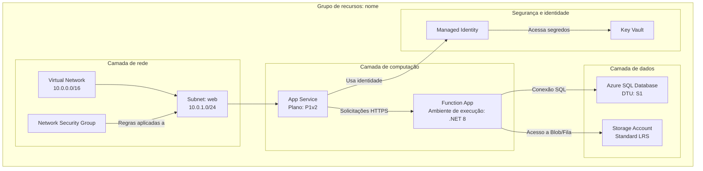
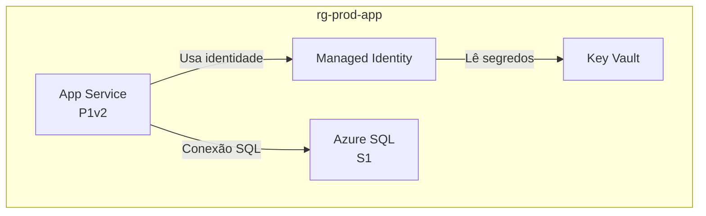

# Visualizador de recursos do Azure

Examine grupos de recursos do Azure, entenda sua estrutura e seus relacionamentos e gere diagramas Mermaid abrangentes que ilustrem claramente a arquitetura. Esta habilidade faz análises **somente leitura** e nunca modifica nem exclui recursos do Azure.

> [!NOTE]
> Esta habilidade depende do **servidor MCP do Azure** (ou da CLI `az`) para listar e descrever recursos. Se nenhum estiver disponível, informe isso e solicite um inventário exportado dos recursos.

## Quando usar

- "Desenhe um diagrama Mermaid do meu grupo de recursos de produção."
- "Ajude-me a entender como os recursos em rg-sifap se conectam."
- "Visualize os fluxos de rede e dados desta assinatura."
- "Documente a arquitetura de nosso ambiente implantado no Azure."

## Responsabilidades principais

1. **Descoberta do grupo de recursos**: liste os grupos disponíveis quando nenhum for especificado.
2. **Análise aprofundada dos recursos**: examine todos os recursos, suas configurações e interdependências.
3. **Mapeamento dos relacionamentos**: identifique e documente todas as conexões entre os recursos.
4. **Geração do diagrama**: crie um diagrama Mermaid detalhado e preciso.
5. **Documentação**: produza um arquivo Markdown claro com o diagrama incorporado.

## Fluxo de trabalho

### Etapa 1: Seleção do grupo de recursos

Se a pessoa não tiver especificado um grupo de recursos:

1. Consulte os grupos de recursos disponíveis (ferramentas MCP do Azure ou `az group list` como alternativa).
2. Apresente uma lista numerada dos grupos de recursos com seus locais.
3. Peça que a pessoa selecione um grupo pelo número ou nome e aguarde a resposta.

Se um grupo de recursos for especificado, valide sua existência e prossiga.

### Etapa 2: Descoberta e análise dos recursos

1. **Consulte todos os recursos** do grupo (ferramentas MCP do Azure ou `az resource list --resource-group <name> --output json`).
2. **Analise cada recurso** e registre nome e tipo, SKU/camada, local, configuração principal, configurações de rede (VNets, sub-redes, pontos de extremidade privados), identidade e acesso (identidade gerenciada, RBAC) e dependências.
3. **Mapeie os relacionamentos**:
   - **Rede**: emparelhamento de VNets, atribuições de sub-redes, regras de NSG e pontos de extremidade privados.
   - **Fluxo de dados**: aplicações para bancos de dados, funções para armazenamento e API Management para serviços de destino.
   - **Identidade**: identidades gerenciadas que se conectam aos recursos.
   - **Configuração**: configurações de aplicações que apontam para Key Vaults e cadeias de conexão.
   - **Dependências**: relações entre recurso pai e filho e entre recursos obrigatórios.

### Etapa 3: Construção do diagrama

Crie um diagrama Mermaid detalhado com `graph TB` (de cima para baixo) ou `graph LR` (da esquerda para a direita):



Requisitos do diagrama:

- **Agrupe por camada ou finalidade**: rede, computação, dados, segurança e monitoramento.
- **Inclua detalhes**: SKUs, camadas e configurações importantes nos rótulos dos nós (use `<br/>` para quebras de linha).
- **Rotule todas as conexões**: descreva o que flui entre os recursos (dados, identidade, rede).
- **Use IDs de nós significativos**: abreviações que façam sentido (`APP`, `FUNC`, `SQL`, `KV`).
- **Tipos de conexão**: `-->` para fluxo de dados ou dependências, `-.->` para opcionais/condicionais e `==>` para caminhos críticos/principais.

Inclua o detalhe de configuração relevante para cada tipo de recurso:

| Tipo de recurso | Incluir no rótulo |
|---|---|
| App Service | Camada do plano (B1, S1, P1v2) |
| Functions | Ambiente de execução (.NET, Python, Node) |
| Bancos de dados | Camada (Basic, Standard, Premium) |
| Storage | Redundância (LRS, GRS, ZRS) |
| VNets | Espaço de endereços |
| Sub-redes | Intervalo de endereços |

### Etapa 4: Criação do arquivo

Use [assets/template-architecture.md](./assets/template-architecture.md) como modelo e crie `<resource-group-name>-architecture.md` com cabeçalho (grupo de recursos, assinatura, região), resumo de 2 a 3 parágrafos, tabela de inventário de recursos, diagrama Mermaid, detalhes dos relacionamentos e observações. Crie-o na raiz do espaço de trabalho ou em uma pasta `docs/`, se houver.

## Diretrizes operacionais

| Padrão | Requisito |
|---|---|
| Precisão | Verifique cada detalhe do recurso antes de incluí-lo |
| Completude | Inclua todos os recursos do grupo, sem omissões |
| Clareza | Use rótulos claros e agrupamento lógico |
| Detalhamento | Inclua detalhes de configuração que afetem a arquitetura |
| Relacionamentos | Mostre todas as conexões significativas, não apenas as óbvias |

| Sempre | Nunca |
|---|---|
| Liste os grupos de recursos se nenhum for especificado | Ignore recursos por parecerem pouco importantes |
| Aguarde a seleção da pessoa antes de prosseguir | Presuma relacionamentos sem verificação |
| Analise todos os recursos do grupo | Produza diagramas incompletos ou com marcadores de posição |
| Inclua detalhes de configuração nos rótulos dos nós | Omita detalhes que afetem a arquitetura |
| Agrupe os recursos logicamente com subgrafos | Gere sintaxe Mermaid inválida |
| Mantenha a análise somente leitura | Modifique ou exclua recursos do Azure |

Casos extremos:

- **Nenhum recurso encontrado**: informe a pessoa e verifique o nome do grupo de recursos.
- **Problemas de permissão**: explique o que está ausente e sugira verificar o RBAC.
- **Arquiteturas complexas (mais de 50 recursos)**: considere vários diagramas por camada.
- **Dependências entre grupos de recursos**: registre as dependências externas nas observações do diagrama.

## Modelo de saída

A habilidade produz `<resource-group-name>-architecture.md`. Abaixo do título H1 (`Arquitetura do Azure: <resource group>`), ele contém um bloco de cabeçalho, uma tabela de inventário, o diagrama e observações sobre relacionamentos:

````markdown
**Assinatura**: sub-sifap-prod
**Região**: eastus
**Quantidade de recursos**: 4

## Inventário de recursos

| Recurso | Tipo | Camada/SKU | Local | Observações |
|---|---|---|---|---|
| app-prod-001 | App Service | P1v2 | eastus | Aplicação Web de produção |
| sql-prod-001 | Azure SQL | S1 | eastus | Banco de dados principal |
| kv-prod-001 | Key Vault | standard | eastus | Segredos da aplicação |

## Diagrama da arquitetura



## Detalhes dos relacionamentos

- O App Service autentica-se no Key Vault e no SQL por uma identidade gerenciada.
````

## Critérios de qualidade

- [ ] Um grupo de recursos válido foi identificado e confirmado antes da análise.
- [ ] Todos os recursos do grupo foram descobertos e analisados.
- [ ] Todos os relacionamentos significativos (rede, dados, identidade e configuração) estão mapeados.
- [ ] O diagrama Mermaid usa subgrafos lógicos e é renderizado com sintaxe válida.
- [ ] Um arquivo `<resource-group-name>-architecture.md` completo foi criado a partir do modelo.
- [ ] A análise permaneceu somente leitura. Nenhum recurso do Azure foi modificado.

## Licença

O material incluído nesta habilidade é fornecido sob a [Licença MIT](LICENSE.txt).
