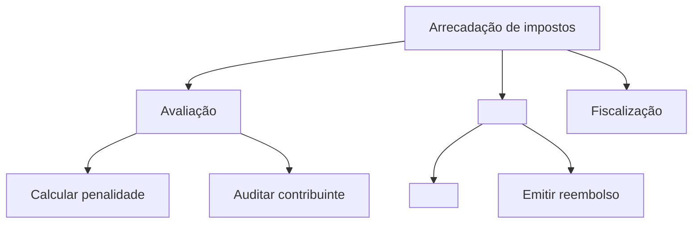

# Mapa de capacidades

## Quando usar

- "Crie um mapa de capacidades para o domínio identificado pela equipe."
- "Onde há sobreposição de responsabilidade entre duas equipes?"
- "Quais capacidades são essenciais e quais são comuns?"

## Conceito

Uma **capacidade** descreve *o que* a empresa faz, não *como* ela faz. As capacidades permanecem estáveis por décadas, enquanto aplicações e processos mudam com frequência.

## Estrutura (3 níveis)

- **L1**: área de negócio de nível superior (por exemplo, "Arrecadação de impostos" ou "Atendimento ao cliente").
- **L2**: principais subfunções identificadas pela equipe.
- **L3**: capacidades específicas confirmadas por evidências.

Regra geral: de 8 a 12 capacidades L1 para uma empresa de médio porte.

## Etapas

1. **Comece pelos resultados**, não pelo organograma. "O que esta empresa faz para seus clientes?"
2. **Decomponha de cima para baixo** até L3. Pare quando uma capacidade corresponder a uma única pessoa responsável.
3. **Classifique cada capacidade**:

- **Core (Essencial)**: diferenciadora, desenvolva internamente.
- **Supporting (Suporte)**: necessária, compre ou configure.
- **Commodity (Comum)**: não diferenciada, terceirize ou use software como serviço (SaaS).

4. **Sobreponha os sistemas**: identifique quais aplicações fornecem cada capacidade L3. Procure:

- Duplicação (dois sistemas fazendo a mesma coisa)
- Lacunas (uma capacidade sem responsável)
- Monólitos (um sistema abrangendo muitas capacidades L1)

5. **Sobreponha os investimentos**: compare para onde vai o dinheiro com onde ocorre a diferenciação.

## Exemplo em Mermaid



## Modelo de saída

```markdown
## Mapa de capacidades - <Domain>

### L1: <Top area>
#### L2: <Sub-function>
- **<L3 capability>** [Core|Supporting|Commodity]
 - Responsável: <team>
 - Sistemas: <app1>, <app2>
 - Maturidade: 1-5
 - Investimento: $$$
```

## Critérios de qualidade

- [ ] Cada capacidade L3 tem exatamente uma pessoa responsável.
- [ ] Cada capacidade L3 está classificada como Core (Essencial), Supporting (Suporte) ou Commodity (Comum).
- [ ] Cada capacidade L3 está sobreposta aos sistemas que a fornecem.
- [ ] Duplicações, lacunas e monólitos estão sinalizados para acompanhamento.
