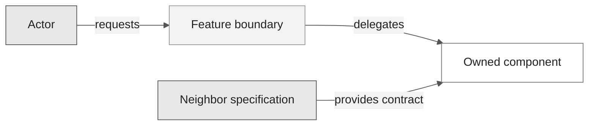
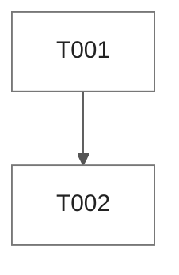

# SDD artifact templates

Use these concise templates to build a complete, traceable Spec-Driven Development package. Requirement statements use the [EARS notation](./ears-notation.md). Adapt paths and filenames to established repository conventions instead of creating a parallel structure.

## Artifact policy

| Artifact | Scope | Responsibility |
| --- | --- | --- |
| `CONSTITUTION.md` | Repository or product | Non-negotiable principles, governance, and amendment rules |
| `SPECIFICATION.md` | Feature or increment | Normative EARS requirements, scope, actors, and acceptance |
| `ANALYSIS.md` | Feature or increment | Evidence, gaps, risks, alternatives, and confidence |
| `DESIGN.md` | Feature or increment | Architecture, data, interfaces, errors, security, and trade-offs |
| `TASKS.md` | Feature or increment | Dependency-ordered implementation and validation tasks |
| `TESTING.md` | Feature or increment | Test strategy, the test catalog, and the verification status of every requirement |
| `CHECKLIST.md` | Feature or increment | Review and release gates |
| `CROSS_ANALYSIS.md` | Feature or increment | Requirement-to-design-to-task-to-verification consistency |
| `VERIFICATION.md` | Feature or increment | Planned checks and executed evidence |
| `DECISIONS.md` | Feature or increment | Consequential decisions and revisit triggers |
| `SOURCE_TRACEABILITY.md` | Feature or increment | Provenance for every active and historical requirement ID |

Reuse an existing constitution. Create one only when the repository has no governing artifact and the requested scope includes governance.

## Suggested layout

```text
.specs/
  CONSTITUTION.md
  001-feature-name/
    SPECIFICATION.md
    ANALYSIS.md
    DESIGN.md
    TASKS.md
    TESTING.md
    CHECKLIST.md
    CROSS_ANALYSIS.md
    VERIFICATION.md
    DECISIONS.md
    SOURCE_TRACEABILITY.md
    checkpoints/
      spec-to-plan.yaml
      plan-to-tasks.yaml
      test-coverage.yaml
    contracts/
      manifest.yaml
```

All ten markdown artifacts, both subdirectories and every file above are
required. `scripts/validate-spec-artifacts.py` enforces the markdown set and
`scripts/validate-specs.py` enforces `checkpoints/` and `contracts/`.
`CHECKLIST.md`, `CROSS_ANALYSIS.md`, `VERIFICATION.md` and
`SOURCE_TRACEABILITY.md` are generated from the other six by
`scripts/generate-sdd-support-artifacts.py`; author the six and run the
generator rather than writing those four by hand.

Use a different layout when the repository already has one.

## CONSTITUTION.md

```markdown
# Constitution: <Repository or Product>

- Status: Draft | Ready for review | Approved
- Owner: <accountable owner>
- Last reviewed: <YYYY-MM-DD or not-reviewed>

## Scope
<What this constitution governs and excludes.>

## Principles

### CON-001: <Principle>
- Rule: <non-negotiable rule>
- Rationale: <why>
- Evidence: <source>
- Enforcement: <gate or review>
- Exception authority: <role>

## Governance
- Approval authority: <role>
- Amendment process: <steps>
- Review trigger: <event or interval>
```

## SPECIFICATION.md

```markdown
# Specification: <Feature>

- Feature ID: <NNN or repository convention>
- Status: Draft
- Sources: <SRC-IDs>
- Constitution: <path or not-applicable with rationale>

## Problem and outcome
<Problem, actors, and desired observable outcome.>

## Scope and non-goals
- In scope: <items>
- Out of scope: <items>

## Actors and dependencies
| Actor or dependency | Role | Source |
| --- | --- | --- |
| <name> | <responsibility> | SRC-... |

## Requirements

### FR-<DOMAIN>-001: <Title>
- Pattern: <EARS pattern>
- Priority: <P0-P3>
- Source: <SRC-###>
- Status: Proposed
> <EARS statement>

**Acceptance signals**
- AC-FR-<DOMAIN>-001-01: <pass/fail signal>

**Verification**
- <planned method and evidence>

## Assumptions, blockers, and open questions
| ID | Type | Statement | Owner | Impact |
| --- | --- | --- | --- | --- |
| <ID> | assumption/blocker/question | <text> | <owner> | <impact> |
```

## ANALYSIS.md

```markdown
# Analysis: <Feature>

- Status: Draft
- Scope: <requirement IDs>

## Evidence inventory
| Source ID | Evidence | Relevance | Confidence |
| --- | --- | --- | --- |
| SRC-001 | <path, user decision, or official URL> | <requirements> | high/medium/low |

## Gap analysis
| Finding ID | Severity | Affected IDs | Finding | Resolution |
| --- | --- | --- | --- | --- |
| GAP-001 | blocker/high/medium/low | FR-... | <gap> | <action> |

## Options and trade-offs
| Option | Benefits | Costs and risks | Decision status |
| --- | --- | --- | --- |
| <option> | <benefits> | <trade-offs> | selected/rejected/open |

## Risk register
| Risk ID | Trigger | Impact | Mitigation | Owner |
| --- | --- | --- | --- | --- |
| RISK-001 | <trigger> | <impact> | <mitigation> | <owner> |
```

## DESIGN.md

````markdown
# Design: <Feature>

## Table of Contents

- [Feature Metadata](#feature-metadata)
- [Architecture Overview](#architecture-overview)
- [System Context](#system-context)
- [Architectural Invariants](#architectural-invariants)
- [Deployment View](#deployment-view)
- [State Model](#state-model)
- [Critical Sequences](#critical-sequences)
- [Data Model](#data-model)
- [Interfaces and Contracts](#interfaces-and-contracts)
- [Error Model](#error-model)
- [Security Design](#security-design)
- [Threat Model](#threat-model)
- [Observability Design](#observability-design)
- [Testing Strategy](#testing-strategy)
- [Implementation Surface](#implementation-surface)
- [Delivery and Traceability View](#delivery-and-traceability-view)
- [Risks and Trade-Offs](#risks-and-trade-offs)
- [Phased Development](#phased-development)
- [Change Log](#change-log)
- [References](#references)

## Feature Metadata

| Field | Value |
| --- | --- |
| Feature ID | <NNN> |
| Slug | <kebab-slug> |
| Status | Draft |
| Traces | <requirement IDs> |

## Architecture Overview
<Components, boundaries, and rationale.>

## System Context


## Component Map
| Component | Responsibility | Interfaces | Requirement IDs |
| --- | --- | --- | --- |
| <name> | <responsibility> | <contracts> | FR-..., NFR-... |

## Deployment View
<Runtime zones, current deployment, planned surfaces, and external services.>

## State Model
<Lifecycle states, transitions, blockers, and terminal outcomes.>

## Critical Sequences
<Success, denial, failure, retry, rollback, and human-gate sequences.>

## Data Flow and Lifecycle
<Entities, ownership, movement, retention, deletion, and prohibited flows.>

## Data Model
| Entity | Key fields | Content policy | Requirement IDs |
| --- | --- | --- | --- |
| <name> | <fields> | <retention and sensitivity> | FR-..., NFR-... |

## Interfaces and Contracts
<Inputs, outputs, errors, versioning, idempotency, and compatibility.>

## Error Model
| Failure | Detection | System response | Requirement IDs |
| --- | --- | --- | --- |
| <failure> | <signal> | <recovery or degradation> | FR-..., NFR-... |

## Architectural Invariants

| Invariant | Why it holds | Where enforced |
| --- | --- | --- |
| <invariant> | <reason> | <path> |

## Security Design

<Trust boundaries, identity, authorization, data protection, and abuse cases.>

## Threat Model

| Threat | Vector | Mitigation | Residual risk |
| --- | --- | --- | --- |
| <threat> | <vector> | <mitigation> | <residual> |

## Testing Strategy

Name the tiers, what each proves, and where the evidence lands.

## Observability Design
<Correlations, metrics, traces, logs, evidence, redaction, and ownership.>

## Implementation Surface
| Surface | Current state | Planned change |
| --- | --- | --- |
| <path or component> | exists/partial/planned/blocked | <bounded delta> |

## Delivery and Traceability View
| Requirements | Design components | Tasks or plan | Dependencies | Tests or evidence | Current versus target |
| --- | --- | --- | --- | --- | --- |
| FR-..., NFR-... | <components> | T001 / P1.1 | <dependency IDs/specs> | <test/evidence> | exists/partial/planned/blocked/target |

## Risks and Trade-Offs

<Link decisions, current state, partial state, blockers, target state, migration, and rollback.>
## Phased Development

| Phase | Scope | Exit criteria |
| --- | --- | --- |
| P1.1 | <scope> | <criteria> |

## Change Log

| Version | Date | Change |
| --- | --- | --- |
| 0.1.0 | <YYYY-MM-DD> | Initial design. |

## References

- [SPECIFICATION.md](SPECIFICATION.md)
- [TASKS.md](TASKS.md)
````

Every additional Mermaid block uses the same universal theme directive. Add the
canonical `default`, `zone`, and `external` classes to flowchart, graph, state,
and class diagrams. Sequence, ER, and gantt diagrams inherit the theme without
`classDef`.

## TASKS.md

````markdown
# Tasks: <Feature>

## Table of Contents

- [Feature Metadata](#feature-metadata)
- [Pre-Implementation Gate](#pre-implementation-gate)
- [Execution Rules](#execution-rules)
- [Dependency Graph](#dependency-graph)
- [Test Case Mapping](#test-case-mapping)
- [Completion Gate](#completion-gate)
- [Change Log](#change-log)
- [References](#references)

## Feature Metadata

| Field | Value |
| --- | --- |
| Feature ID | <NNN> |
| Slug | <kebab-slug> |
| Status | Planned |
| Approved scope | <requirement IDs or not-approved> |

## Pre-Implementation Gate
- [ ] Requirements are ready for review or approved as required by repository policy.
- [ ] Design covers every in-scope requirement.
- [ ] Blockers have owners and no blocker is hidden in a task.
- [ ] Constitution checks pass or approved exceptions exist.

## Execution Rules
- `[S]` means sequential.
- `[P]` means dependency- and change-surface independent.
- RED precedes GREEN.
- `[x]` requires complete acceptance evidence and a matching execution-ledger entry.

## Dependency Graph


## Test Case Mapping
| Task | Tests | Requirement IDs |
| --- | --- | --- |
| T001 | TST-C001 | FR-... |
| T002 | TST-C001 | FR-... |

## Phase 1
- [ ] **T001 [S] [Plan:P1.1] RED** Add the failing contract test. Traces FR-...
  - Files: `<test path>`.
  - Acceptance: TST-C001 fails for the missing behavior.

- [ ] **T002 [S] [Plan:P1.1] GREEN** Implement the minimum behavior. Traces FR-...
  - Files: `<implementation path>`, `<test path>`.
  - Acceptance: TST-C001 passes with retained evidence.

## Completion Gate
- [ ] Every task has evidence.
- [ ] No requirement or test is orphaned.
- [ ] Verification results are recorded in `VERIFICATION.md`.

## Execution log (<YYYY-MM-DD>)
Task closure: **0 of 2**. No task is checked until acceptance evidence exists.

## Change Log

| Version | Date | Change |
| --- | --- | --- |
| 0.1.0 | <YYYY-MM-DD> | Initial task set. |

## References

- `SPECIFICATION.md`
- `DESIGN.md`
- `TESTING.md`
````

Use `[P]` only when the dependency graph and change surfaces both permit
parallel work. A checked task must appear in a single-line
`Marked complete by verification sweep: T001, ...` ledger.

## CHECKLIST.md

```markdown
# Checklist: <Feature>

## Requirements
- [ ] EARS checks pass.
- [ ] Scope, non-goals, sources, and priorities are explicit.

## Design
- [ ] Components, interfaces, data, security, and failures cover in-scope requirements.

## Implementation readiness
- [ ] Tasks are dependency ordered and traceable.
- [ ] Blockers are resolved or explicitly stop handoff.

## Verification and release
- [ ] Planned checks cover each acceptance signal.
- [ ] Executed evidence is linked without overstating status.
```

## CROSS_ANALYSIS.md

```markdown
# Cross-analysis: <Feature>

| Requirement ID | Source | Design | Tasks | Acceptance | Verification | Result |
| --- | --- | --- | --- | --- | --- | --- |
| FR-<DOMAIN>-001 | SRC-001 | DES-COMP-001 | T001 | AC-FR-...-01 | VER-001 | covered |

## Orphan analysis
- Requirements without downstream coverage: <none or IDs>
- Design elements without requirements: <none or IDs>
- Tasks without requirements: <none or IDs>
- Verification without requirements: <none or IDs>

## Lifecycle dispositions
| Historical ID | Disposition | Replacement IDs | Decision | Date |
| --- | --- | --- | --- | --- |
| <ID> | transferred/superseded/split/merged/retired | <IDs or none> | DEC-... | <date> |
```

## VERIFICATION.md

```markdown
# Verification: <Feature>

- Status: Planned

| Verification ID | Requirement and AC | Method | Environment | Expected result | Evidence | Status |
| --- | --- | --- | --- | --- | --- | --- |
| VER-001 | FR-... / AC-... | test/inspection/analysis/demonstration/measurement | <context> | <pass rule> | <path or pending> | planned |

## Deviations
| ID | Expected | Actual | Impact | Decision |
| --- | --- | --- | --- | --- |
| DEV-001 | <expected> | <actual> | <impact> | <decision or open> |
```

Change `Planned` to a stronger status only after evidence exists.

## DECISIONS.md

```markdown
# Decisions: <Feature>

### DEC-001: <Decision>
- Status: proposed | accepted | superseded
- Date: <YYYY-MM-DD>
- Requirement IDs: <IDs>
- Context: <decision driver>
- Options: <considered alternatives>
- Decision: <selected option>
- Consequences: <positive and negative>
- Evidence: <sources>
- Revisit trigger: <condition>
```

## SOURCE_TRACEABILITY.md

```markdown
# Source traceability: <Feature>

## Source register
| Source ID | Class | Location or decision | Date | Authority | Notes |
| --- | --- | --- | --- | --- | --- |
| SRC-001 | user/repository/official/assumption | <path, URL, or decision> | <date> | <owner> | <notes> |

## Active requirements
| Requirement ID | Primary source | Supporting sources | Governing decision | Source excerpt or summary |
| --- | --- | --- | --- | --- |
| FR-<DOMAIN>-001 | SRC-001 | <SRC-IDs or none> | <DEC-ID or none> | <bounded summary> |

## Historical dispositions
| Historical ID | Last source | Disposition | Replacement IDs | Decision |
| --- | --- | --- | --- | --- |
| <ID> | SRC-... | transferred/superseded/split/merged/retired | <IDs or none> | DEC-... |
```

## Optional artifacts

- `IMPLEMENTATION_PLAN.md`: use when strategy, rollout, migration, or cross-team sequencing needs more detail than `TASKS.md`.
- `TEST_PLAN.md`: use when test environments, data, ownership, non-functional measurement, or release qualification needs a dedicated plan.
- Machine-readable test manifest: use only when repository automation consumes a documented schema.

## Consistency rules

- One active requirement ID has one canonical normative statement.
- Other artifacts link to the ID and may summarize without redefining it.
- Every active requirement has source, design, task, acceptance, and verification coverage.
- Every historical ID has an explicit disposition.
- Status is evidence-based: `Draft`, `Ready for review`, `Approved`, `Implemented`, or `Verified`.
- No artifact claims current external behavior without a dated first-party source.
