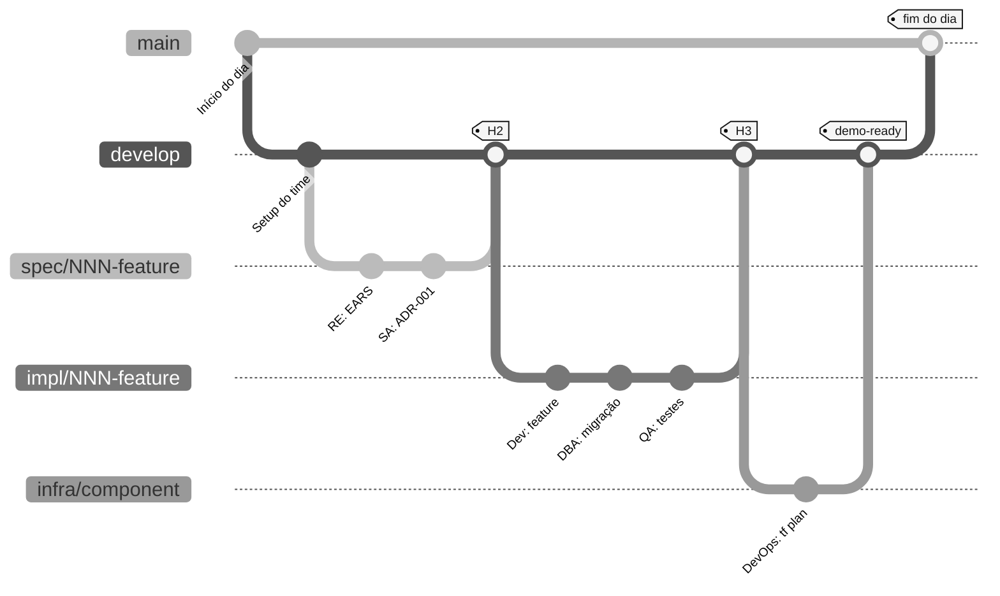

# Workflow Git do time: cada persona na sua própria branch

> **Trilha:** [Kit do time](README.md) › **Workflow Git**

**Guia completo de Git para a imersão: branches, commits, Pull Requests e handoffs entre duplas.**

  

| Campo | Valor |
|---|---|
| **Público-alvo** | O time inteiro, principalmente quem nunca usou uma branch por feature |
| **Pré-requisitos** | Git instalado, repositório clonado, `develop` criada |
| **Tempo estimado** | 10 minutos de leitura |
| **Resultado esperado** | Você sabe criar uma branch, fazer commit, abrir um PR e passar o trabalho adiante |

---

## Branches de idioma e de integração

O kit publicado mantém a `main` como branch padrão em inglês e a `develop` como branch de integração em inglês.
As branches permanentes `portugues-br` e `espanol` contêm documentação e instruções do Copilot em português do Brasil e espanhol, não trabalho de funcionalidades.
Use o [seletor de idiomas](README.md#idiomas-do-repositório) para abrir qualquer edição.

As branches de funcionalidades seguem o fluxo `develop` -> `main` descrito abaixo. Merges na `main` exigem CI verde e pelo menos uma revisão por pares.
Para uma correção compartilhada, integre a mudança em inglês pela `develop`, depois porte e traduza a mudança pertinente para `portugues-br` e `espanol`.
Mantenha correções específicas de idioma na respectiva branch. Nunca faça merge da árvore inteira de documentação em português na `main` ou na `develop`.

## O que cada conceito significa (referência rápida)

| Conceito Git | Significado prático |
|---|---|
| `main` | Versão estável, pronta para a demo; protegida contra push direto |
| `develop` | Versão integrada do dia; ponto de partida para novas branches |
| `spec/<NNN>-<feature>` | Branch onde você trabalha durante o Estágio 2 |
| `git commit` | Salva uma versão local (só você enxerga) |
| `git push` | Envia para o GitHub (o time enxerga) |
| **Pull Request (PR)** | Pede revisão antes de integrar sua branch em `develop` |
| `git merge` | Integra sua branch em `develop` depois da revisão aprovada |
| **CI verde** | Pipeline de integração contínua passou; obrigatório antes do merge |
| **CI vermelho** | Alguma coisa quebrou - conserte antes do merge |
| **Conflito de merge** | Duas branches mudaram o mesmo trecho e você precisa resolver na mão |

---

## A árvore de branches do dia (visual)



---

## Como nomear sua branch (convenção por persona)

| Quem | Estágio | Prefixo da branch | Origem | Exemplo |
|---|---|---|---|---|
| RE + SA | 2 - Spec | `spec/<NNN>-<feature>` | `develop` | `spec/001-calculo-beneficio` |
| Dev + DBA | 3 - Impl | `impl/<NNN>-<feature>` | `develop` | `impl/001-calculo-beneficio` |
| QA | 3 - Testes | `impl/<NNN>-<feature>` | `develop` | `impl/001-calculo-beneficio` |
| DevOps | 4 - Infra | `infra/<componente>` | `develop` | `infra/azure-postgres` |
| Tech Writer | Transversal | `docs/<topico>` | `develop` | `docs/glossario-sifap` |
| Modo Agent | 4 - Delegação | `agent/<issue-NN>` | `develop` | `agent/issue-42` |

> [!IMPORTANT]
> O fluxo é `spec/<NNN>-<feature>` -> `develop` -> `main`. Não existe branch `stage`.
> Toda branch `impl/<NNN>-<feature>` sai de `develop`, nunca de `spec/*`.

> [!TIP]
> Padrão de mensagem de commit: sempre cite o REQ-ID ou a Issue. Exemplo: `feat: Implements REQ-XXX: describes the behavior`.

---

## Sequência de merge: passo a passo

### Passo 1: Crie sua branch a partir de `develop`

- [ ] **Atualize `develop` e crie a branch.**

```bash
git checkout develop && git pull        # atualiza o ponto de partida
git checkout -b spec/001-feature-name  # cria a sua branch
```

### Passo 2: Trabalhe (faça commit a cada passo com significado)

- [ ] **Faça commits com frequência - uma ideia por commit.**

```bash
git add .
git commit -m "Implements REQ-XXX: behavior"
git push -u origin spec/001-feature-name   # envia para o GitHub
```

> [!NOTE]
> Faça commits pequenos e frequentes. Cada commit = uma ideia. Não empilhe cinco horas de trabalho em um único commit.

### Passo 3: Abra um PR para `develop`

- [ ] **Abra o Pull Request.**

```bash
gh pr create \
  --base develop \
  --head spec/001-feature-name \
  --title "spec/001: feature name" \
  --body "Implements REQ-XXX.

  ## What changes
  - EARS spec
  - Team-recorded decisions

  ## Source legacy
  - <legacy-file:lines>

  ## How to test
  - See the 'acceptance' section for each REQ-ID"
```

### Passo 4: A CI roda

- [ ] **Confira o status da CI no PR.**
- CI verde -> siga para o Passo 5
- CI vermelho -> leia o erro, conserte, faça um novo commit e espere a CI rodar de novo

### Passo 5: A dupla seguinte, que recebe o trabalho, revisa

| Você está na dupla... | Quem revisa o seu PR |
|---|---|
| 1 (Visão) | Dupla 2 (Arquitetura) |
| 2 (Arquitetura) | Dupla 3 (Implementação) |
| 3 (Implementação) | Dupla 4 (Qualidade) |
| 4 (Qualidade) | Dupla 5 (Operações) |
| 5 (Operações) | Dupla 1 (Visão) |

### Passo 6: Merge em `develop`

- [ ] **Faça o merge depois da aprovação.** Clique em **"Merge pull request"** no GitHub (ou use `gh pr merge`). Use **squash merge** para manter o histórico limpo.

### Passo 7: No fim do estágio, o líder abre o PR `develop -> main`

- [ ] **O líder abre o PR de integração.** Só o líder do time faz esse merge. É o ponto de controle de cada estágio.

---

## As cinco regras de ouro

> [!IMPORTANT]
> **Sem exceções.**
>
> 1. Nunca faça commit direto em `main`. Sempre passe por um PR.
> 2. Nunca use `git push --force` em uma branch compartilhada. Use `--force-with-lease` só se for absolutamente necessário.
> 3. Toda mensagem de commit cita o REQ-ID: `feat: Implements REQ-XXX: ...`.
> 4. CI vermelho não faz merge. Conserte primeiro.
> 5. PR sem descrição não faz merge. Descreva *o que* mudou e *por quê*.

---

## Modelos de mensagem de commit

Copie e cole, depois adapte o REQ-ID e a descrição.

```bash
# Nova feature que implementa um REQ-ID
git commit -m "feat: Implements REQ-XXX (behavior)"

# Correção de bug
git commit -m "fix: corrects behavior for REQ-XXX"

# Documentação
git commit -m "docs: records ADR-XXXX"

# Testes
git commit -m "test: covers acceptance criteria for REQ-XXX"

# Migração de banco de dados
git commit -m "db: V2__feature_change (REQ-XXX)"

# Refatoração sem mudança de comportamento
git commit -m "refactor: extracts component (keeps REQ-XXX)"

# Configuração / build / CI
git commit -m "chore: adds spec-quality.yml workflow"

# Modo Agent (Estágio 4)
git commit -m "agent: PR #42 - implements REQ-XXX"
```

**Regras da mensagem:**

- A primeira linha tem no máximo 72 caracteres
- Comece com um tipo: `feat:` `fix:` `docs:` `test:` `db:` `refactor:` `chore:` `agent:`
- Cite o REQ-ID quando ele se aplicar
- Não use `wip` nem `temp` - use só commits com significado claro

---

## Minitutorial para quem nunca usou Git

Se hoje é seu primeiro contato com Git, faça este aquecimento de cinco minutos:

- [ ] **Verifique o estado do repositório.**

```bash
# 1. Veja onde você está
git status

# 2. Veja em qual branch você está
git branch --show-current

# 3. Atualize a develop
git checkout develop
git pull

# 4. Crie sua primeira branch
git checkout -b docs/meu-primeiro-commit

# 5. Edite um arquivo
echo "# Hello world" >> docs/playground.md

# 6. Veja o que mudou
git diff
git status

# 7. Salve (commit)
git add docs/playground.md
git commit -m "docs: first commit"

# 8. Envie para o GitHub
git push -u origin docs/meu-primeiro-commit

# 9. Abra um PR
gh pr create --base develop --title "docs: first commit" --body "Warm-up"
```

Se você completou os nove passos, **sabe Git o suficiente para a imersão**. Todo o resto é variação dos mesmos comandos.

---

## Comandos de emergência

| Situação | Comando |
|---|---|
| Fiz commit em `develop` sem criar uma branch | `git reset --soft HEAD~1 && git stash && git checkout -b nova-branch && git stash pop` |
| O rebase travou | `git rebase --abort` (sem problema, comece limpo de novo) |
| Conflito de merge | Abra o arquivo, procure `<<<<<<<`, escolha as linhas certas, `git add <file> && git rebase --continue` |
| Apaguei uma branch por engano | `git reflog` -> ache o SHA -> `git checkout -b nome SHA` |
| Quero descartar mudanças não commitadas | `git restore .` |
| Tudo deu errado e quero voltar 30 minutos | **Pare. Chame o Technical Lead. Não tente sozinho.** |

---

## Definição de pronto: você está confortável com Git quando...

- [ ] Você sabe criar uma branch a partir de `develop`
- [ ] Você faz commits pequenos (uma ideia por commit) com o REQ-ID na mensagem
- [ ] Você sabe fazer `git push` da sua branch
- [ ] Você sabe abrir um PR com `gh pr create` ou pelo site do GitHub
- [ ] Você sabe ler o status da CI no PR (verde/vermelho)
- [ ] Você sabe quem revisa o seu PR (a dupla seguinte)
- [ ] Você sabe pedir ajuda antes de tentar `--force`

---

## Para ir além

- [`00-SETUP.md`](00-SETUP.md) - passos 3 e 4 sobre proteção de branch
- [`00-TEAM-FLOW.md`](00-TEAM-FLOW.md) - os três handoffs (H1, H2, H3) entre duplas
- [`docs/persona-agent-matrix.md`](docs/persona-agent-matrix.md) - quem depende de quem
- [GitHub: documentação da CLI gh](https://cli.github.com/manual/)

---

### Continue lendo

| Anterior | Próximo |
|---|---|
| [Fluxo do time](00-TEAM-FLOW.md)<br/><sub>Cronograma do dia, handoffs, regra dos 20 minutos, definição de pronto.</sub> | [Estágio 1: arqueologia](01-archaeology/GUIDE.md)<br/><sub>Leia o sistema legado e catalogue as regras de negócio.</sub> |

<sub>[Voltar ao índice do kit](README.md)</sub>
