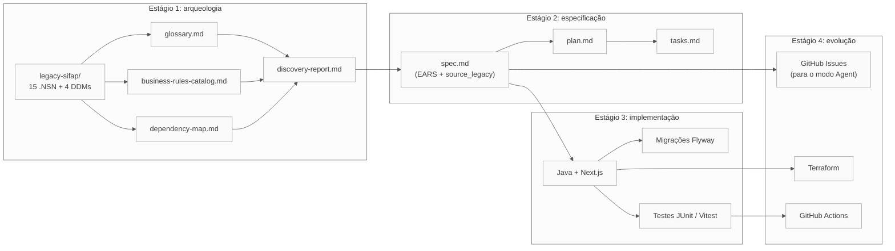

# Sitemap: mapa visual do kit

> **Trilha:** [Kit do time](README.md) › **Sitemap**

**Mapa completo de navegação do kit:** onde vive cada arquivo, como os artefatos fluem entre os estágios e qual caminho cada persona deve seguir na imersão do Sistema de Fiscalização e Administração de Pagamentos (SIFAP).

 

---

## Visão geral: fluxo dos quatro estágios

```mermaid
%%{init: {'theme':'neutral','themeVariables':{'fontFamily':'ui-sans-serif, system-ui, sans-serif','primaryColor':'#F5F5F5','primaryTextColor':'#171717','primaryBorderColor':'#171717','lineColor':'#525252','secondaryColor':'#FFFFFF','tertiaryColor':'#FAFAFA','background':'#FFFFFF'}}}%%
flowchart LR
    classDef step fill:#F5F5F5,stroke:#171717,color:#171717
    classDef handoff fill:#FFFFFF,stroke:#525252,color:#171717
    classDef result fill:#FFFFFF,stroke:#171717,color:#171717,stroke-width:2px

    E1["Estágio 1<br/>Arqueologia<br/>@archaeologist"]:::step
    H1["Handoff H1<br/>5 min"]:::handoff
    E2["Estágio 2<br/>Especificação<br/>@architect"]:::step
    H2["Handoff H2<br/>5 min"]:::handoff
    E3["Estágio 3<br/>Implementação<br/>@builder"]:::step
    H3["Handoff H3<br/>5 min"]:::handoff
    E4["Estágio 4<br/>Evolução<br/>@evolution"]:::step
    R["SIFAP 2.0<br/>rodando"]:::result

    E1 --> H1 --> E2 --> H2 --> E3 --> H3 --> E4 --> R
```

---

## Estrutura ordenada do repositório

| Prefixo | Pasta / arquivo | Quando ler |
|---|---|---|
| **00** | [`README.md`](README.md) | Primeira chegada - visão geral da imersão |
| **00** | [`00-START-HERE.md`](00-START-HERE.md) | Passo a passo de 15 minutos para qualquer pessoa |
| **00** | [`00-SETUP.md`](00-SETUP.md) | Preparar laptop e Copilot |
| **00** | [`00-TEAM-FLOW.md`](00-TEAM-FLOW.md) | Cronograma canônico do dia |
| **00** | [`00-SITEMAP.md`](00-SITEMAP.md) | Este arquivo |
| **00** | [`00-GIT-WORKFLOW.md`](00-GIT-WORKFLOW.md) | Branches, PRs, merges |
| **01** | [`01-archaeology/`](01-archaeology/) | Estágio 1 - ler o SIFAP legado |
| **01** | [`01-archaeology/legacy-sifap/`](01-archaeology/legacy-sifap/) | 24 membros Natural/JCL + quatro DDMs + uma listagem FDT + docs históricos |
| **02** | [`02-modern-spec/`](02-modern-spec/) | Estágio 2 - EARS, ADRs, C4 |
| **03** | [`03-implementation/`](03-implementation/) | Estágio 3 - Java + Next.js + testes |
| **04** | [`04-evolution/`](04-evolution/) | Estágio 4 - modo Agent + Terraform |
| **05** | [`05-personas/`](05-personas/) | 10 personas (escolha duas - sua dupla) |
| **06** | [`06-stage-agents/`](06-stage-agents/) | Quatro agentes do Copilot (um por estágio) |
| **07** | [`07-concepts/`](07-concepts/) | Conceitos centrais: EARS, ADR, SDD, agentes |
| **09** | [`09-cheat-sheets/`](09-cheat-sheets/) | Cartões de referência rápida (uma página cada) |
| `docs/` | [`docs/`](docs/) | FAQ, troubleshooting, runbook, STATUS |
| `assets/` | [`assets/`](assets/) | SVGs e diagramas |
| `specs/` | [`specs/`](specs/) | Artefatos do Spec-Kit criados pelo time durante a imersão |

---

## Primitivas do Copilot em `.github/`

O kit traz quatro tipos de primitiva do Copilot. Cada uma tem um índice legível por humanos; o próprio Copilot carrega os arquivos subjacentes automaticamente.

| Primitiva | Índice | O que contém |
|---|---|---|
| Instruções | [`.github/instructions/README.md`](.github/instructions/README.md) | Regras `*.instructions.md` com escopo por caminho, aplicadas pelo glob `applyTo` |
| Prompts | [`.github/prompts/README.md`](.github/prompts/README.md) | Tarefas `*.prompt.md` em slash command para os agentes de estágio e de persona |
| Skills | [`.github/skills/README.md`](.github/skills/README.md) | 42 capacidades `SKILL.md` carregadas automaticamente e casadas pela `description` |
| Agentes | [`.github/agents/README.md`](.github/agents/README.md) | 17 agentes invocáveis com `@` em duas camadas (estágio + persona) |

---

## Conteúdo de `07-concepts/`

| Arquivo | Conteúdo |
|---|---|
| [`00-README.md`](07-concepts/00-README.md) | Índice e visão geral da pasta |
| [`01-spec-driven-development.md`](07-concepts/01-spec-driven-development.md) | O que é Spec-Driven Development e por que a imersão usa |
| [`02-agents-and-personas.md`](07-concepts/02-agents-and-personas.md) | Agentes de estágio que você seleciona e skills de papel que carregam sozinhas |
| [`03-visual-glossary.md`](07-concepts/03-visual-glossary.md) | Glossário com mais de 30 termos do domínio |
| [`04-3-copilot-modes.md`](07-concepts/04-3-copilot-modes.md) | Ask, Plan e Agent - quando usar cada modo |
| [`05-ears-notation.md`](07-concepts/05-ears-notation.md) | Notação EARS para requisitos sem ambiguidade |
| [`06-architecture-decision-records.md`](07-concepts/06-architecture-decision-records.md) | ADRs - o que são, como escrever, template |
| [`07-method-beyond-mainframe.md`](07-concepts/07-method-beyond-mainframe.md) | Os mesmos quatro estágios aplicados a COBOL, Delphi, VB6, PL/SQL e monolitos sem documentação |

---

## Fluxo de artefatos entre estágios

> Como ler: seta = dependência. O artefato de destino depende do artefato de origem para ser criado com qualidade.

---

## Caminho recomendado por persona

| Você é... | Comece por... | Depois... | Depois... |
|---|---|---|---|
| **Qualquer pessoa, primeira vez aqui** | [00-START-HERE.md](00-START-HERE.md) | [00-TEAM-FLOW.md](00-TEAM-FLOW.md) | seu `PERSONA.md` |
| **Líder do time** | [00-SETUP.md](00-SETUP.md) | [00-TEAM-FLOW.md](00-TEAM-FLOW.md) | [docs/CHECKLIST-LIDER.md](docs/CHECKLIST-LIDER.md) |
| **PO ou RE (Dupla 1)** | [05-personas/01-product-owner/PERSONA.md](05-personas/01-product-owner/PERSONA.md) | [01-archaeology/GUIDE.md](01-archaeology/GUIDE.md) | [02-modern-spec/GUIDE.md](02-modern-spec/GUIDE.md) |
| **EA ou SA (Dupla 2)** | [05-personas/03-enterprise-architect/PERSONA.md](05-personas/03-enterprise-architect/PERSONA.md) | [02-modern-spec/ADR-TEMPLATE.md](02-modern-spec/ADR-TEMPLATE.md) | [02-modern-spec/GUIDE.md](02-modern-spec/GUIDE.md) |
| **TL ou Dev (Dupla 3)** | [05-personas/06-developer/PERSONA.md](05-personas/06-developer/PERSONA.md) | [03-implementation/GUIDE.md](03-implementation/GUIDE.md) | - |
| **DBA ou QA (Dupla 4)** | [05-personas/07-dba/PERSONA.md](05-personas/07-dba/PERSONA.md) | [03-implementation/GUIDE.md](03-implementation/GUIDE.md) | - |
| **DevOps ou TW (Dupla 5)** | [05-personas/09-devops-engineer/PERSONA.md](05-personas/09-devops-engineer/PERSONA.md) | [04-evolution/GUIDE.md](04-evolution/GUIDE.md) | - |
| **Você não lê Natural** | [01-archaeology/legacy-sifap/HOW-TO-READ-NATURAL.md](01-archaeology/legacy-sifap/HOW-TO-READ-NATURAL.md) | [01-archaeology/GUIDE.md](01-archaeology/GUIDE.md) | (sua persona) |
| **Você encontrou um termo estranho** | [07-concepts/03-visual-glossary.md](07-concepts/03-visual-glossary.md) | (volte de onde você veio) | - |

---

## Se você se perdeu

1. **Não sabe em qual estágio você está?** Consulte [`00-TEAM-FLOW.md`](00-TEAM-FLOW.md) - a seção do cronograma.
2. **Não sabe o que sua persona faz?** Abra a visão geral das personas: [`05-personas/OVERVIEW.md`](05-personas/OVERVIEW.md).
3. **Não sabe o que entregar?** Abra o `GUIDE.md` do estágio atual e procure a seção "Como saber que você terminou (DoD)".
4. **Encontrou um termo estranho?** Consulte [`07-concepts/03-visual-glossary.md`](07-concepts/03-visual-glossary.md).
5. **Algo deu errado tecnicamente?** Consulte [`docs/troubleshooting.md`](docs/troubleshooting.md).
6. **Bloqueado por mais de 20 minutos?** Sinalize o facilitador. A regra está descrita em [`00-TEAM-FLOW.md`](00-TEAM-FLOW.md).

---

### Continue lendo

| Anterior | Próximo |
|---|---|
| [Kit do time](README.md) Visão geral da imersão e ponto de entrada principal. | [00 - Comece aqui](00-START-HERE.md) Passo a passo de abertura de 15 minutos para qualquer pessoa. |

[Voltar ao índice do kit](README.md)
