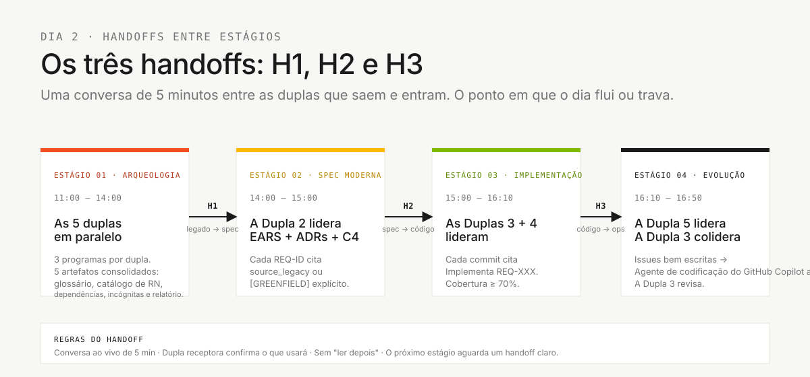

# Fluxo do time: como cinco pessoas cobrem 10 personas

> **Trilha:** [Kit do time](README.md) › **Fluxo do time**

**Mantenha este documento fixado na sua tela durante toda a imersão.** Ele responde às quatro perguntas essenciais: qual fase do SDLC suas personas lideram, quem alimenta o seu trabalho, quem recebe o seu handoff e quando pedir ajuda.

  

| Campo | Valor |
|---|---|
| **Público-alvo** | Todo participante da imersão |
| **Pré-requisitos** | Leia este documento antes dos cartões de persona |
| **Tempo estimado** | 10 minutos |
| **Resultado esperado** | Você sabe o que cada dupla faz, quando faz e quem recebe o trabalho em seguida |

---

## Onde isso se encaixa no SDLC


As cinco duplas trabalham **em paralelo dentro de cada estágio**, e a liderança muda conforme o SDLC avança. Os três handoffs entre estágios (**H1** legado -> spec, **H2** spec -> código, **H3** código -> ops) são os pontos em que o dia flui ou trava. Ninguém fica ocioso. Ninguém repete trabalho.

---

## 1. As cinco duplas e suas fases do SDLC

Cada pessoa escolhe **uma dupla** (duas personas). As duas personas de uma dupla são coautoras do trabalho. Não existe handoff interno entre elas. Elas colaboram continuamente.

| # | Dupla | Personas | Fase do SDLC liderada |
|---|---|---|---|
| 1 | **Visão** | Product Owner + Requirements Engineer | Descoberta + Especificação |
| 2 | **Arquitetura** | Enterprise Architect + Software Architect | Especificação + Design |
| 3 | **Implementação** | Technical Lead + Developer | Implementação + Evolução |
| 4 | **Qualidade** | DBA + QA Engineer | Implementação (dados + testes) |
| 5 | **Operações** | DevOps Engineer + Tech Writer | Transversal + Evolução |

> Os kits de papel ficam juntos em [`05-personas/`](05-personas/) como perfil de referência. Os artefatos ativos já estão consolidados em `.github/`: leia o `PERSONA.md` do seu papel e observe que cada papel é uma **skill** que carrega automaticamente — somente os quatro agentes de estágio e o `@dba` são selecionados com `@nome`. Consulte o [ADR-0002](docs/adr/0002-team-roles-as-skills-not-agents.md).


### Divisão sugerida dentro de cada dupla

| Dupla | Foco da persona A | Foco da persona B |
|---|---|---|
| 1 - Visão | **PO**: escopo, valor, prioridades, roteiro da demo | **RE**: requisitos EARS, critérios de aceitação, REQ-IDs |
| 2 - Arquitetura | **EA**: dependências externas e decisões de escopo | **SA**: fronteiras e plano da fatia técnica |
| 3 - Implementação | **TL**: padrões, revisão de PR, orquestração de agentes | **Dev**: código Java + TypeScript, testes unitários |
| 4 - Qualidade | **DBA**: schema PostgreSQL, migrações Flyway | **QA**: cenários BDD, gates de cobertura, testes de contrato |
| 5 - Operações | **DevOps**: Terraform, GitHub Actions, secrets | **TW**: glossário, revisão de clareza dos ADRs, runbook, README |

Faça rodízio dentro da dupla a cada ~45 minutos para ninguém monopolizar o conhecimento.

---

## 2. Cronograma (8 horas, Dia 2, 10:00-18:00)

> [!IMPORTANT]
> O setup do Copilot, do Docker e o clone do repositório precisam estar prontos **antes das 10:00**. Na manhã do Dia 2, às 10:00, o time só confirma que tudo abre. Não instala do zero. Sem o setup pronto, o cronograma não cabe.


| Horário | Bloco | Duplas líderes | Duplas de apoio |
|---|---|---|---|
| **10:00-10:15** | Abertura + confirmação das duplas | Facilitador | Cada pessoa confirma suas duas personas e abre seu `PERSONA.md` |
| **10:15-10:45** | Validação do setup + kits de persona | Dupla 3 + Dupla 5 | Git, Java/Node, Docker, Spec-Kit `specify version`, GitHub Copilot |
| **10:45-11:00** | Orientação rápida sobre o legado | Dupla 1 + Dupla 4 | Visão geral dos 15 programas Natural + quatro DDMs |
| **11:00-12:00** | **Estágio 1** - Arqueologia (parte 1) | As cinco duplas em paralelo | Cada dupla recebe três programas - descoberta + extração |
| **12:00-13:30** | Almoço | - | - |
| **13:30-14:00** | **Estágio 1** - Síntese + **Handoff H1** | **Dupla 1** consolida evidências + escopo | A Dupla 5 esclarece termos; a Dupla 2 identifica dependências |
| **14:00-15:00** | **Estágio 2** - Especificação moderna | **Dupla 2** (EA + SA) | A Dupla 1 valida o escopo · a Dupla 5 revisa a clareza · **Handoff H2** no fim |
| **15:00-16:10** | **Estágio 3** - Implementação | **Dupla 3** (TL + Dev), **Dupla 4** (DBA + QA) | A Dupla 5 rascunha o scaffold de CI · **Handoff H3** no fim |
| **16:10-16:50** | **Estágio 4** - Evolução com agentes | **Dupla 5** (DevOps + TW) | A **Dupla 3** escreve Issues e revisa os PRs do Agent |
| **16:50-17:00** | Buffer + preparação da demo | Todos | Cada time ensaia 30 segundos por persona |
| **17:00-17:30** | **Demos dos times** (~3 min cada) | Time inteiro | O PO conduz · o facilitador controla o tempo |
| **17:30-17:50** | Retrospectiva | Todos | Keep / Change / Try - por persona |
| **17:50-18:00** | Encerramento + feedback final | Facilitador | - |

> [!NOTE]
> Ninguém fica ocioso. As duplas que não estão liderando um estágio ainda têm trabalho concreto de apoio. Veja a §4.

---

## 3. Mapa de handoffs



Cada dupla tem trabalho concreto em todos os estágios. Os pontos críticos são os três handoffs (H1, H2, H3). A regra é sempre a mesma: **uma conversa ao vivo de cinco minutos** entre a dupla que sai do estágio e a que entra.

**Como ler o diagrama de handoffs:**

- As setas são dependências bloqueantes. Sem o `spec.md`, o `plan.md` e o `tasks.md` da fatia, as Duplas 3 e 4 não conseguem começar direito.
- Todo handoff é uma conversa de cinco minutos entre duplas. "É só ler o documento" não basta. Converse ao vivo.

---

## 4. O que cada dupla faz em cada estágio

Nenhuma dupla fica ociosa. Mesmo quando não está liderando, a dupla tem trabalho de apoio explícito.

| Dupla | Estágio 1 (Arqueologia) | Estágio 2 (Spec) | Estágio 3 (Implementação) | Estágio 4 (Evolução) |
|---|---|---|---|---|
| **1 - Visão** | **Lidera.** Extrai regras; o PO prioriza o escopo. | Valida os EARS; assina o escopo no H2. | Fica disponível para esclarecer requisitos. Constrói a narrativa da demo. | Ensaia a demo. |
| **2 - Arquitetura** | Mapeia evidências e dependências relevantes para a fatia. | **Lidera.** `spec.md`, `plan.md` e `tasks.md`; registra decisões bloqueantes. | Fica disponível para dúvidas de fronteira; revisa PRs que tocam contratos. | Valida a IaC contra as decisões existentes. |
| **3 - Implementação** | Define convenções (branches, template de PR, DoD) e o esqueleto-alvo do protótipo. | Comenta a viabilidade; estima a complexidade. | **Lidera.** Código, testes, integração. | **Colidera.** Delegação em modo Agent, revisão de PR. |
| **4 - Qualidade** | Lê os DDMs, planeja o mapeamento do schema. | Comenta as implicações de dados; escreve os primeiros cenários BDD. | **Lidera.** Schema, migrações, cobertura de testes. | Gate final de cobertura; testes de contrato na CI. |
| **5 - Operações** | Constrói o glossário e os termos que sustentam a fatia. | Revisa a clareza e as decisões de escopo. | Rascunha a estrutura do pipeline de CI. | **Lidera.** Uma delegação pequena; CI/IaC só se for relevante. |

---

## 5. Primeiros 45 minutos: checklist por dupla

Entre **10:00 e 10:45**, **todas as duplas** fazem as mesmas quatro ações. A especialização começa depois disso.

- [ ] **Passo 1: Leia `00-TEAM-FLOW.md` (este arquivo).** (10 min)
- [ ] **Passo 2: Leia o `PERSONA.md` dos dois kits em [`05-personas/`](05-personas/).** (15 min)
- [ ] **Passo 3: Valide o `.github/` consolidado.** `ls .github/agents .github/prompts .github/instructions .github/skills` - agentes, prompts, instruções e skills já vêm prontos. (5 min)
- [ ] **Passo 4: Abra o GitHub Copilot, rode o prompt de smoke test e valide as ferramentas locais.** (15 min)

### Primeira ação de cada dupla na arqueologia, às 11:00

| Dupla | Ação às 11:00 |
|---|---|
| **1 - Visão** | O PO abre [`00-TEAM-FLOW.md`](00-TEAM-FLOW.md) e o cronograma do dia; o RE abre [`01-archaeology/legacy-sifap/natural-programs/`](01-archaeology/legacy-sifap/natural-programs/) e começa o catálogo de regras. |
| **2 - Arquitetura** | O EA abre [`01-archaeology/legacy-sifap/legacy-docs/`](01-archaeology/legacy-sifap/legacy-docs/) e registra as dependências que afetam a fatia; o SA prepara as perguntas de fronteira. |
| **3 - Implementação** | O TL define a estratégia de branches, o template de PR, a definição de pronto e os caminhos padrão (`backend/`, `frontend/`, `infra/` quando necessário). |
| **4 - Qualidade** | O DBA abre [`01-archaeology/legacy-sifap/adabas-ddms/`](01-archaeology/legacy-sifap/adabas-ddms/) e começa o mapeamento de campos; o QA prepara a estratégia de testes para o protótipo que o time vai criar. |
| **5 - Operações** | O DevOps planeja o trabalho de CI/IaC que o time vai criar neste repositório; o TW abre o template em [`01-archaeology/glossary.md`](01-archaeology/glossary.md). |

---

## 6. A regra dos 20 minutos

> [!IMPORTANT]
> **Se você, ou sua dupla, ficar travado no mesmo problema por 20 minutos, pare e peça ajuda.**

A regra vale para todo mundo. Pedir ajuda não é fraqueza. Ficar calado e insistir sozinho coloca o cronograma do time em risco.

### Escada de escalonamento

| Travado há | Fale com |
|---|---|
| 5 min | Tente o modo Ask do GitHub Copilot com outro enquadramento, ou confira com a pessoa da sua dupla |
| 10 min | Fale com a dupla imediatamente antes ou depois da sua (veja a §3) |
| 20 min | Fale com a Dupla 3 (o TL coordena o time) |
| 30 min | Levante a mão para um facilitador (cordão azul) |

### Como escalar (formato de três linhas)

```text
1. Objetivo: O que eu estou tentando alcançar
2. Tentei: O que eu já tentei (e o que aconteceu)
3. Bloqueio: O que está me impedindo agora
```

Ruim: "Não está funcionando."

Bom: "Objetivo: validar CPF em `BeneficioService`. Tentei: `@CPF` do Bean Validation e validação manual. Bloqueio: preciso confirmar se o Sistema de Fiscalização e Administração de Pagamentos (SIFAP) aceita CPF de estrangeiros em outro formato."

---

## 7. Definição de pronto por handoff

### Handoff H1: do legado para a spec (fim do Estágio 1, ~14:00)

**Responsável:** Dupla 1 (Visão)
**Recebem:** Dupla 2 (Arquitetura), Dupla 5 (Operações)

| Artefato | Caminho | Pronto significa |
|---|---|---|
| Catálogo de regras | `01-archaeology/business-rules-catalog.md` | As regras candidatas da fatia têm o `.NSN` ou `.ddm` de origem registrado |
| Relatório de descoberta | `01-archaeology/discovery-report.md` | Fatia fina, evidências e questões em aberto da feature escolhida |
| Materiais de apoio consultados | `01-archaeology/` | Glossário, dependências e mistérios aparecem só quando ajudam a explicar a fatia |

### Handoff H2: da spec para o código (fim do Estágio 2, ~15:00)

**Responsável:** Dupla 2 (Arquitetura)
**Recebem:** Dupla 3 (Implementação), Dupla 4 (Qualidade)

| Artefato | Caminho | Pronto significa |
|---|---|---|
| Especificação formal | `specs/<NNN>-<feature>/spec.md` | Feature fina com REQ-IDs, EARS e `source_legacy:` em cada requisito |
| Plano formal | `specs/<NNN>-<feature>/plan.md` | Decisões, riscos e abordagem são suficientes para começar a implementação |
| Tarefas formais | `specs/<NNN>-<feature>/tasks.md` | A ordem de implementação e de testes está definida para a feature |
| Decisão de escopo | `02-modern-spec/scope-decisions.md` | O PO confirmou o que está no escopo e o que fica adiado |

### Handoff H3: do código para as operações (fim do Estágio 3, ~16:10)

**Responsável:** Dupla 3 (Implementação)
**Recebem:** Dupla 5 (Operações)

| Artefato | Caminho | Pronto significa |
|---|---|---|
| Backend funcionando | `backend/` | `mvn test` está verde; o OpenAPI está documentado |
| Frontend funcionando | `frontend/` | `npm test` está verde; os fluxos principais são utilizáveis |
| Migrações | `backend/src/main/resources/db/migration/` | Os scripts Flyway estão numerados e idempotentes (a Dupla 4 é responsável) |
| Relatório de cobertura | Artefato da CI | Backend >= 70%, frontend >= 60% de cobertura de linhas (a Dupla 4 verifica) |

---

## 8. Padrões de comunicação

| Padrão | Quando | Exemplo |
|---|---|---|
| **Stand-up** | A cada transição de estágio (4x) | Rodada de dois minutos, uma frase por dupla: "Terminamos X, estamos fazendo Y, estamos bloqueados por Z" |
| **Check-in da dupla** | A cada 30 minutos dentro de um estágio | "Nós dois continuamos alinhados?" |
| **Sync entre duplas** | Durante os handoffs | Conversa de cinco minutos, sem slides |
| **Comentários de PR** | Assíncrono entre duplas | Mencione a dupla que recebe explicitamente (`@par-3`) |
| **Quiet hour** | Últimos 30 minutos do Estágio 3 | Sem reuniões; todo mundo programa ou testa |

---

## 9. Antipadrões: não faça isso

| Antipadrão | Faça isto no lugar |
|---|---|
| Uma persona da dupla faz tudo | Faça rodízio a cada ~45 minutos para a outra pessoa se manter aquecida |
| Pular um handoff | Faça a conversa de cinco minutos entre duplas em toda transição |
| A Dupla 4 (Qualidade) espera o fim do Estágio 3 para começar | A Dupla 4 escreve cenários BDD assim que os REQ-IDs existirem (meio do Estágio 2) |
| A Dupla 5 (Operações) fica ociosa até o Estágio 4 | A Dupla 5 lidera o glossário no Estágio 1, a clareza dos ADRs no Estágio 2 e o scaffold de CI no Estágio 3 |
| A Dupla 1 (Visão) desaparece depois do Estágio 1 | O PO valida o escopo no H2 e ensaia a demo no Estágio 4 |
| A Dupla 3 faz merge sem revisão | Todo PR recebe pelo menos uma revisão de outra dupla |

---

## 10. Referência rápida

| Pergunta | Onde encontrar |
|---|---|
| Em qual dupla eu estou? | §1 (tabela das cinco duplas) |
| O que minha dupla faz no estágio N? | §4 (matriz dupla x estágio) |
| Travado? | Regra dos 20 minutos (§6) |
| Preciso de um handoff? | Critérios de definição de pronto (§7) |
| Qual modo do Copilot? | `09-cheat-sheets/copilot-3-modes.md` |
| Qual modelo? | `09-cheat-sheets/model-routing.md` |
| Qual comando do Spec-Kit? | `09-cheat-sheets/spec-kit-workflow.md` |

---

### Continue lendo

| Anterior | Próximo |
|---|---|
| [Primeiros 15 minutos](00-START-HERE.md)<br/><sub>Passo a passo de abertura com cinco passos numerados para qualquer pessoa começar.</sub> | [Setup](00-SETUP.md)<br/><sub>Setup do laptop: Git, VS Code, Copilot, Spec-Kit, proteção de branch.</sub> |

<sub>[Voltar ao índice do kit](README.md)</sub>
