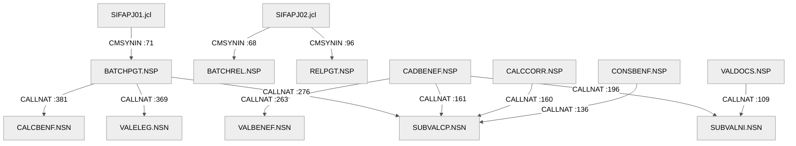

# Mapa de Dependências — SIFAP Legado

> **Trilha:** [Kit do Time](../README.md) › [Estágio 1](README.md) › **Mapa de Dependências**

**Mapa da execução individual de paula no Estágio 1.** Registra as dependências dos programas Natural e DDMs Adabas de todo o acervo local.

| Campo | Valor |
|---|---|
| **Público-alvo** | paula, responsável pela leitura e pela revisão do mapa |
| **Pré-requisitos** | Catálogo de regras com as origens identificadas |
| **Estágio** | Estágio 1 — Arqueologia |
| **Resultado esperado** | Diagrama Mermaid e tabelas de arestas com evidência `arquivo:linha` |

> [!IMPORTANT]
> Mapeie apenas as dependências que explicam o escopo selecionado: programas `.NSN` que chamam outros programas (`CALLNAT`, `FETCH`) e programas que acessam DDMs (`READ`, `FIND`, `STORE`, `UPDATE`, `DELETE`). Toda aresta precisa estar apoiada em `arquivo:linha` — nenhuma inferência sem evidência. Este mapa alimenta as hipóteses de fatiamento em [`discovery-report.md`](discovery-report.md).

> [!NOTE]
> Guia passo a passo: [`GUIDE.md`](GUIDE.md).

**Responsável:** paula. **Modalidade:** individual.
**Data:** 2026-09-17.
**Escopo:** os 24 membros locais, com rastreamento recursivo e quatro DDMs publicados. Fontes legadas somente para leitura; bibliotecas e ambientes externos não foram acessados.

O [grafo completo](dependency-map.mmd) contém 28 nós e 80 arestas: 9 `CALLNAT`, 9 `INCLUDE`, 23 `USING`, 3 invocações por JCL e 36 arestas Adabas. Estas últimas agrupam 49 instruções por origem, DDM e operação; as linhas repetidas permanecem nas tabelas. `PERFORM`, arquivos de trabalho e comentários de agendamento são documentados separadamente, sem inflar essa contagem.

---

## Diagrama Mermaid



O diagrama acima é apenas o recorte de chamadas. Cada número refere-se ao arquivo do nó de origem. Inclusões, áreas e acessos a dados estão no arquivo completo e nas tabelas abaixo.

---

## Arestas CALLNAT

| Origem | Destino | Parâmetros | Evidência |
|---|---|---|---|
| BATCHPGT | SUBVALCP | DOC | [BATCHPGT.NSP:276-278](legacy-sifap/natural-programs/BATCHPGT.NSP#L276) |
| BATCHPGT | VALELEG | CALC | [BATCHPGT.NSP:369-375](legacy-sifap/natural-programs/BATCHPGT.NSP#L369) |
| BATCHPGT | CALCBENF | CALC | [BATCHPGT.NSP:381-387](legacy-sifap/natural-programs/BATCHPGT.NSP#L381) |
| CADBENEF | SUBVALCP | DOC | [CADBENEF.NSP:161-163](legacy-sifap/natural-programs/CADBENEF.NSP#L161) |
| CADBENEF | SUBVALNI | DOC | [CADBENEF.NSP:196-198](legacy-sifap/natural-programs/CADBENEF.NSP#L196) |
| CADBENEF | VALBENEF | CAD | [CADBENEF.NSP:263-265](legacy-sifap/natural-programs/CADBENEF.NSP#L263) |
| CALCCORR | SUBVALCP | DOC | [CALCCORR.NSP:160-162](legacy-sifap/natural-programs/CALCCORR.NSP#L160) |
| CONSBENF | SUBVALCP | DOC | [CONSBENF.NSP:136-138](legacy-sifap/natural-programs/CONSBENF.NSP#L136) |
| VALDOCS | SUBVALNI | DOC | [VALDOCS.NSP:109-111](legacy-sifap/natural-programs/VALDOCS.NSP#L109) |

Listas de argumentos, preservadas na ordem das chamadas:

```text
DOC: #PV-TYPE-DOC #PV-CPF #PV-NIS #PV-COD-RETURN #PV-MSG #PV-IND-SPECIAL
CALC: #PC-CPF #PC-COD-PROGRAM #PC-PERIOD #PC-COD-REGION #PC-FAMILY-INCOME
    #PC-QTY-DEPEND #PC-AGE #PC-STAT-BENEF #PC-AMT-BASE #PC-AMT-GROSS
    #PC-AMT-DISC #PC-AMT-BONUS #PC-AMT-NET #PC-TYPE-PAYMENT
    #PC-COD-RETURN #PC-MSG
CAD: #CPF-STR #NAME #DT-BIRTH #SEX #UF #CEP #STATUS #RESULT #QTY-ERRS #MSG-ERR(*)
```

## Inclusões e áreas de dados

| Origem | Destino | Tipo | Evidência |
|---|---|---|---|
| BATCHCON | CCAUDIT | INCLUDE | [BATCHCON.NSP:345](legacy-sifap/natural-programs/BATCHCON.NSP#L345) |
| BATCHPGT | CCAUDIT | INCLUDE | [BATCHPGT.NSP:594](legacy-sifap/natural-programs/BATCHPGT.NSP#L594) |
| CADBENEF | CCAUDIT | INCLUDE | [CADBENEF.NSP:418](legacy-sifap/natural-programs/CADBENEF.NSP#L418) |
| CADDEPEN | CCVALCPF | INCLUDE | [CADDEPEN.NSP:230](legacy-sifap/natural-programs/CADDEPEN.NSP#L230) |
| CADDEPEN | CCAUDIT | INCLUDE | [CADDEPEN.NSP:235](legacy-sifap/natural-programs/CADDEPEN.NSP#L235) |
| CADPROG | CCAUDIT | INCLUDE | [CADPROG.NSP:176](legacy-sifap/natural-programs/CADPROG.NSP#L176) |
| CALCCORR | CCAUDIT | INCLUDE | [CALCCORR.NSP:243](legacy-sifap/natural-programs/CALCCORR.NSP#L243) |
| CONSBENF | CCAUDIT | INCLUDE | [CONSBENF.NSP:314](legacy-sifap/natural-programs/CONSBENF.NSP#L314) |
| SUBVALCP | CCVALCPF | INCLUDE | [SUBVALCP.NSN:94](legacy-sifap/natural-programs/SUBVALCP.NSN#L94) |
| BATCHCON | LDASIFAP | LOCAL USING | [BATCHCON.NSP:21](legacy-sifap/natural-programs/BATCHCON.NSP#L21) |
| BATCHPGT | PDAVALID | LOCAL USING | [BATCHPGT.NSP:28](legacy-sifap/natural-programs/BATCHPGT.NSP#L28) |
| BATCHPGT | PDACALC | LOCAL USING | [BATCHPGT.NSP:29](legacy-sifap/natural-programs/BATCHPGT.NSP#L29) |
| BATCHPGT | LDASIFAP | LOCAL USING | [BATCHPGT.NSP:30](legacy-sifap/natural-programs/BATCHPGT.NSP#L30) |
| BATCHREL | LDASIFAP | LOCAL USING | [BATCHREL.NSP:23](legacy-sifap/natural-programs/BATCHREL.NSP#L23) |
| CADBENEF | PDAVALID | LOCAL USING | [CADBENEF.NSP:14](legacy-sifap/natural-programs/CADBENEF.NSP#L14) |
| CADDEPEN | LDASIFAP | LOCAL USING | [CADDEPEN.NSP:13](legacy-sifap/natural-programs/CADDEPEN.NSP#L13) |
| CADPROG | LDASIFAP | LOCAL USING | [CADPROG.NSP:13](legacy-sifap/natural-programs/CADPROG.NSP#L13) |
| CALCBENF | PDACALC | PARAMETER USING | [CALCBENF.NSN:17](legacy-sifap/natural-programs/CALCBENF.NSN#L17) |
| CALCBENF | LDASIFAP | LOCAL USING | [CALCBENF.NSN:18](legacy-sifap/natural-programs/CALCBENF.NSN#L18) |
| CALCCORR | PDAVALID | LOCAL USING | [CALCCORR.NSP:13](legacy-sifap/natural-programs/CALCCORR.NSP#L13) |
| CALCCORR | LDASIFAP | LOCAL USING | [CALCCORR.NSP:14](legacy-sifap/natural-programs/CALCCORR.NSP#L14) |
| CALCDSCT | LDASIFAP | LOCAL USING | [CALCDSCT.NSP:13](legacy-sifap/natural-programs/CALCDSCT.NSP#L13) |
| CONSBENF | PDAVALID | LOCAL USING | [CONSBENF.NSP:19](legacy-sifap/natural-programs/CONSBENF.NSP#L19) |
| CONSBENF | LDASIFAP | LOCAL USING | [CONSBENF.NSP:20](legacy-sifap/natural-programs/CONSBENF.NSP#L20) |
| RELAUDIT | LDASIFAP | LOCAL USING | [RELAUDIT.NSP:19](legacy-sifap/natural-programs/RELAUDIT.NSP#L19) |
| RELPGT | LDASIFAP | LOCAL USING | [RELPGT.NSP:18](legacy-sifap/natural-programs/RELPGT.NSP#L18) |
| SUBVALCP | PDAVALID | PARAMETER USING | [SUBVALCP.NSN:29](legacy-sifap/natural-programs/SUBVALCP.NSN#L29) |
| SUBVALNI | PDAVALID | PARAMETER USING | [SUBVALNI.NSN:39](legacy-sifap/natural-programs/SUBVALNI.NSN#L39) |
| VALBENEF | LDASIFAP | LOCAL USING | [VALBENEF.NSN:27](legacy-sifap/natural-programs/VALBENEF.NSN#L27) |
| VALDOCS | PDAVALID | LOCAL USING | [VALDOCS.NSP:15](legacy-sifap/natural-programs/VALDOCS.NSP#L15) |
| VALELEG | PDACALC | PARAMETER USING | [VALELEG.NSN:16](legacy-sifap/natural-programs/VALELEG.NSN#L16) |
| VALELEG | LDASIFAP | LOCAL USING | [VALELEG.NSN:17](legacy-sifap/natural-programs/VALELEG.NSN#L17) |

---

## Arestas entre membros e DDMs

Aliases verificados nas declarações: `BENEFICIARY-V` corresponde a BENEFIC; `PROGRAM-V` a SOCPROG; `PAYMENT-V` a PAYMENT; `AUDIT-V` a AUDIT. No copycode, a view é fornecida por cada chamador. Os descritores correspondentes estão documentados em [data-map.md](data-map.md).

| ID | Origem | DDM | Operação e descritor | Evidência |
|---|---|---|---|---|
| D01 | BATCHCON | AUDIT | READ, NUM-AUDIT descendente, limite 1 | [BATCHCON.NSP:116](legacy-sifap/natural-programs/BATCHCON.NSP#L116) |
| D02 | BATCHCON | PAYMENT | FIND, NUM-PAYMENT | [171](legacy-sifap/natural-programs/BATCHCON.NSP#L171), [206](legacy-sifap/natural-programs/BATCHCON.NSP#L206), [215](legacy-sifap/natural-programs/BATCHCON.NSP#L215), [222](legacy-sifap/natural-programs/BATCHCON.NSP#L222) |
| D03 | BATCHCON | PAYMENT | UPDATE | [211](legacy-sifap/natural-programs/BATCHCON.NSP#L211), [218](legacy-sifap/natural-programs/BATCHCON.NSP#L218), [225](legacy-sifap/natural-programs/BATCHCON.NSP#L225) |
| D04 | BATCHCON | AUDIT | STORE | [322](legacy-sifap/natural-programs/BATCHCON.NSP#L322), [341](legacy-sifap/natural-programs/BATCHCON.NSP#L341) |
| D05 | BATCHPGT | PAYMENT | READ, NUM-PAYMENT descendente, limite 1 | [BATCHPGT.NSP:240](legacy-sifap/natural-programs/BATCHPGT.NSP#L240) |
| D06 | BATCHPGT | BENEFIC | READ, NUM-CPF | [BATCHPGT.NSP:250](legacy-sifap/natural-programs/BATCHPGT.NSP#L250) |
| D07 | BATCHPGT | PAYMENT | FIND NUMBER, SUPER-CPF-PERIOD | [BATCHPGT.NSP:294](legacy-sifap/natural-programs/BATCHPGT.NSP#L294) |
| D08 | BATCHPGT | SOCPROG | FIND, COD-PROGRAM | [BATCHPGT.NSP:302](legacy-sifap/natural-programs/BATCHPGT.NSP#L302) |
| D09 | BATCHPGT | PAYMENT | STORE | [BATCHPGT.NSP:488](legacy-sifap/natural-programs/BATCHPGT.NSP#L488) |
| D10 | BATCHREL | PAYMENT | READ, YEAR-MONTH-REF | [BATCHREL.NSP:125](legacy-sifap/natural-programs/BATCHREL.NSP#L125) |
| D11 | BATCHREL | BENEFIC | FIND, NUM-CPF | [BATCHREL.NSP:142](legacy-sifap/natural-programs/BATCHREL.NSP#L142) |
| D12 | CADBENEF | BENEFIC | FIND, NUM-CPF | [206](legacy-sifap/natural-programs/CADBENEF.NSP#L206), [306](legacy-sifap/natural-programs/CADBENEF.NSP#L306) |
| D13 | CADBENEF | BENEFIC | STORE | [CADBENEF.NSP:295](legacy-sifap/natural-programs/CADBENEF.NSP#L295) |
| D14 | CADBENEF | BENEFIC | UPDATE | [CADBENEF.NSP:318](legacy-sifap/natural-programs/CADBENEF.NSP#L318) |
| D15 | CADDEPEN | BENEFIC | FIND, NUM-CPF | [96](legacy-sifap/natural-programs/CADDEPEN.NSP#L96), [175](legacy-sifap/natural-programs/CADDEPEN.NSP#L175), [191](legacy-sifap/natural-programs/CADDEPEN.NSP#L191) |
| D16 | CADDEPEN | BENEFIC | UPDATE | [CADDEPEN.NSP:203](legacy-sifap/natural-programs/CADDEPEN.NSP#L203) |
| D17 | CADPROG | SOCPROG | FIND, COD-PROGRAM | [111](legacy-sifap/natural-programs/CADPROG.NSP#L111), [158](legacy-sifap/natural-programs/CADPROG.NSP#L158) |
| D18 | CADPROG | SOCPROG | STORE | [CADPROG.NSP:139](legacy-sifap/natural-programs/CADPROG.NSP#L139) |
| D19 | CALCBENF | BENEFIC | FIND, NUM-CPF | [CALCBENF.NSN:166](legacy-sifap/natural-programs/CALCBENF.NSN#L166) |
| D20 | CALCBENF | SOCPROG | FIND, COD-PROGRAM | [CALCBENF.NSN:188](legacy-sifap/natural-programs/CALCBENF.NSN#L188) |
| D21 | CALCBENF | PAYMENT | STORE | [CALCBENF.NSN:319](legacy-sifap/natural-programs/CALCBENF.NSN#L319) |
| D22 | CALCCORR | PAYMENT | READ, NUM-CPF | [CALCCORR.NSP:174](legacy-sifap/natural-programs/CALCCORR.NSP#L174) |
| D23 | CALCCORR | PAYMENT | UPDATE | [CALCCORR.NSP:208](legacy-sifap/natural-programs/CALCCORR.NSP#L208) |
| D24 | CALCDSCT | PAYMENT | FIND, NUM-PAYMENT | [79](legacy-sifap/natural-programs/CALCDSCT.NSP#L79), [113](legacy-sifap/natural-programs/CALCDSCT.NSP#L113), [184](legacy-sifap/natural-programs/CALCDSCT.NSP#L184) |
| D25 | CALCDSCT | BENEFIC | FIND, NUM-CPF | [CALCDSCT.NSP:93](legacy-sifap/natural-programs/CALCDSCT.NSP#L93) |
| D26 | CALCDSCT | PAYMENT | UPDATE | [CALCDSCT.NSP:186](legacy-sifap/natural-programs/CALCDSCT.NSP#L186) |
| D27 | CCAUDIT | AUDIT | READ, NUM-AUDIT descendente, limite 1 | [CCAUDIT.NSC:66](legacy-sifap/natural-programs/CCAUDIT.NSC#L66) |
| D28 | CCAUDIT | AUDIT | STORE | [CCAUDIT.NSC:98](legacy-sifap/natural-programs/CCAUDIT.NSC#L98) |
| D29 | CONSBENF | BENEFIC | FIND, NUM-CPF ou NUM-NIS | [149](legacy-sifap/natural-programs/CONSBENF.NSP#L149), [157](legacy-sifap/natural-programs/CONSBENF.NSP#L157) |
| D30 | CONSBENF | PAYMENT | READ, NUM-CPF | [CONSBENF.NSP:271](legacy-sifap/natural-programs/CONSBENF.NSP#L271) |
| D31 | RELAUDIT | AUDIT | READ, DT-EVENT | [RELAUDIT.NSP:111](legacy-sifap/natural-programs/RELAUDIT.NSP#L111) |
| D32 | RELAUDIT | AUDIT | HISTOGRAM, DT-EVENT | [RELAUDIT.NSP:260](legacy-sifap/natural-programs/RELAUDIT.NSP#L260) |
| D33 | RELPGT | PAYMENT | READ, YEAR-MONTH-REF | [RELPGT.NSP:123](legacy-sifap/natural-programs/RELPGT.NSP#L123) |
| D34 | RELPGT | BENEFIC | FIND, NUM-CPF | [RELPGT.NSP:154](legacy-sifap/natural-programs/RELPGT.NSP#L154) |
| D35 | VALELEG | BENEFIC | FIND, NUM-CPF | [VALELEG.NSN:84](legacy-sifap/natural-programs/VALELEG.NSN#L84) |
| D36 | VALELEG | SOCPROG | FIND, COD-PROGRAM | [VALELEG.NSN:100](legacy-sifap/natural-programs/VALELEG.NSN#L100) |

Não foram encontradas instruções ativas `GET`, `DELETE`, `FETCH` ou `INPUT USING MAP` no escopo. As views de BENEFIC em VALBENEF e VALDOCS não geram arestas de dados, pois não há operação correspondente nesses corpos.

## PERFORM e resolução interna

Há 36 pontos de chamada `PERFORM`. Uma linha abaixo pode reunir chamadas repetidas à mesma rotina no mesmo membro. A implementação é local ou inserida por copycode, nunca um novo `CALLNAT`.

| Chamador | Rotina | Chamada(s) | Definição |
|---|---|---|---|
| BATCHCON | WRITE-AUDIT-DIVERG | [200](legacy-sifap/natural-programs/BATCHCON.NSP#L200) | [326](legacy-sifap/natural-programs/BATCHCON.NSP#L326) |
| BATCHCON | WRITE-AUDIT-RECONC | [234](legacy-sifap/natural-programs/BATCHCON.NSP#L234) | [311](legacy-sifap/natural-programs/BATCHCON.NSP#L311) |
| BATCHCON | WRITE-AUDIT | [283](legacy-sifap/natural-programs/BATCHCON.NSP#L283) | [CCAUDIT.NSC:60](legacy-sifap/natural-programs/CCAUDIT.NSC#L60) |
| BATCHPGT | DET-INCOME-BAND-BATCH | [412](legacy-sifap/natural-programs/BATCHPGT.NSP#L412) | [585](legacy-sifap/natural-programs/BATCHPGT.NSP#L585) |
| BATCHPGT | WRITE-AUDIT | [545](legacy-sifap/natural-programs/BATCHPGT.NSP#L545) | [CCAUDIT.NSC:60](legacy-sifap/natural-programs/CCAUDIT.NSC#L60) |
| BATCHREL | PRINT-HEADER | [209](legacy-sifap/natural-programs/BATCHREL.NSP#L209) | [269](legacy-sifap/natural-programs/BATCHREL.NSP#L269) |
| CADBENEF | VALID-CPF | [152](legacy-sifap/natural-programs/CADBENEF.NSP#L152) | [344](legacy-sifap/natural-programs/CADBENEF.NSP#L344) |
| CADBENEF | WRITE-AUDIT | [302](legacy-sifap/natural-programs/CADBENEF.NSP#L302), [325](legacy-sifap/natural-programs/CADBENEF.NSP#L325) | [CCAUDIT.NSC:60](legacy-sifap/natural-programs/CCAUDIT.NSC#L60) |
| CADDEPEN | VALID-CPF-STANDARD | [168](legacy-sifap/natural-programs/CADDEPEN.NSP#L168) | [CCVALCPF.NSC:39](legacy-sifap/natural-programs/CCVALCPF.NSC#L39) |
| CADDEPEN | WRITE-AUDIT | [210](legacy-sifap/natural-programs/CADDEPEN.NSP#L210) | [CCAUDIT.NSC:60](legacy-sifap/natural-programs/CCAUDIT.NSC#L60) |
| CADPROG | QUERY-PROG | [90](legacy-sifap/natural-programs/CADPROG.NSP#L90) | [156](legacy-sifap/natural-programs/CADPROG.NSP#L156) |
| CADPROG | WRITE-AUDIT | [146](legacy-sifap/natural-programs/CADPROG.NSP#L146) | [CCAUDIT.NSC:60](legacy-sifap/natural-programs/CCAUDIT.NSC#L60) |
| CALCBENF | DET-BAND-INCOME | [222](legacy-sifap/natural-programs/CALCBENF.NSN#L222) | [347](legacy-sifap/natural-programs/CALCBENF.NSN#L347) |
| CALCBENF | CALC-DISC | [296](legacy-sifap/natural-programs/CALCBENF.NSN#L296) | [358](legacy-sifap/natural-programs/CALCBENF.NSN#L358) |
| CALCCORR | CALC-INDEX-ACCUM | [195](legacy-sifap/natural-programs/CALCCORR.NSP#L195) | [229](legacy-sifap/natural-programs/CALCCORR.NSP#L229) |
| CALCCORR | WRITE-AUDIT | [216](legacy-sifap/natural-programs/CALCCORR.NSP#L216) | [CCAUDIT.NSC:60](legacy-sifap/natural-programs/CCAUDIT.NSC#L60) |
| CALCDSCT | CALC-CONTRIB-SOCIAL | [104](legacy-sifap/natural-programs/CALCDSCT.NSP#L104) | [197](legacy-sifap/natural-programs/CALCDSCT.NSP#L197) |
| CONSBENF | SHOW-BENEFICIARY | [154](legacy-sifap/natural-programs/CONSBENF.NSP#L154), [162](legacy-sifap/natural-programs/CONSBENF.NSP#L162) | [199](legacy-sifap/natural-programs/CONSBENF.NSP#L199) |
| CONSBENF | MASK-CPF | [205](legacy-sifap/natural-programs/CONSBENF.NSP#L205) | [298](legacy-sifap/natural-programs/CONSBENF.NSP#L298) |
| CONSBENF | WRITE-AUDIT | [178](legacy-sifap/natural-programs/CONSBENF.NSP#L178) | [CCAUDIT.NSC:60](legacy-sifap/natural-programs/CCAUDIT.NSC#L60) |
| RELAUDIT | PRINT-AUDIT-HEADER | [191](legacy-sifap/natural-programs/RELAUDIT.NSP#L191) | [279](legacy-sifap/natural-programs/RELAUDIT.NSP#L279) |
| RELPGT | PRINT-SUBTOTAL | [144](legacy-sifap/natural-programs/RELPGT.NSP#L144), [227](legacy-sifap/natural-programs/RELPGT.NSP#L227) | [252](legacy-sifap/natural-programs/RELPGT.NSP#L252) |
| RELPGT | PRINT-HEADER | [199](legacy-sifap/natural-programs/RELPGT.NSP#L199) | [246](legacy-sifap/natural-programs/RELPGT.NSP#L246) |
| RELPGT | PRINT-GRAND-TOTAL | [229](legacy-sifap/natural-programs/RELPGT.NSP#L229) | [262](legacy-sifap/natural-programs/RELPGT.NSP#L262) |
| SUBVALCP | VALID-CPF-STANDARD | [72](legacy-sifap/natural-programs/SUBVALCP.NSN#L72) | [CCVALCPF.NSC:39](legacy-sifap/natural-programs/CCVALCPF.NSC#L39) |
| SUBVALNI | VALID-NIS-MOD11 | [80](legacy-sifap/natural-programs/SUBVALNI.NSN#L80) | [102](legacy-sifap/natural-programs/SUBVALNI.NSN#L102) |
| VALBENEF | VALID-CPF-COMPLETE | [126](legacy-sifap/natural-programs/VALBENEF.NSN#L126) | [196](legacy-sifap/natural-programs/VALBENEF.NSN#L196) |
| VALBENEF | VALID-DATE | [136](legacy-sifap/natural-programs/VALBENEF.NSN#L136) | [284](legacy-sifap/natural-programs/VALBENEF.NSN#L284) |
| VALBENEF | VALID-NAME | [146](legacy-sifap/natural-programs/VALBENEF.NSN#L146) | [316](legacy-sifap/natural-programs/VALBENEF.NSN#L316) |
| VALDOCS | VALID-CPF-DOC | [78](legacy-sifap/natural-programs/VALDOCS.NSP#L78) | [137](legacy-sifap/natural-programs/VALDOCS.NSP#L137) |
| VALDOCS | VALID-RG | [88](legacy-sifap/natural-programs/VALDOCS.NSP#L88) | [207](legacy-sifap/natural-programs/VALDOCS.NSP#L207) |
| VALDOCS | CHECK-DOC-SPECIAL | [98](legacy-sifap/natural-programs/VALDOCS.NSP#L98) | [228](legacy-sifap/natural-programs/VALDOCS.NSP#L228) |
| VALELEG | CHECK-ELIG-SPECIFIC | [225](legacy-sifap/natural-programs/VALELEG.NSN#L225) | [249](legacy-sifap/natural-programs/VALELEG.NSN#L249) |

## JCL e arquivos de trabalho

| Job/step | Programa ou recurso | Evidência e limite |
|---|---|---|
| SIFAPJ01 STEP010 | BATCHPGT via NATBATCH | [SIFAPJ01.jcl:46](legacy-sifap/natural-programs/SIFAPJ01.jcl#L46), [CMSYNIN:69-74](legacy-sifap/natural-programs/SIFAPJ01.jcl#L69); competência literal 202601 |
| SIFAPJ02 STEP010 | BATCHREL via NATBATCH | [SIFAPJ02.jcl:49](legacy-sifap/natural-programs/SIFAPJ02.jcl#L49), [CMSYNIN:66-71](legacy-sifap/natural-programs/SIFAPJ02.jcl#L66) |
| SIFAPJ02 STEP020 | RELPGT via NATBATCH | [SIFAPJ02.jcl:77](legacy-sifap/natural-programs/SIFAPJ02.jcl#L77), [CMSYNIN:94-101](legacy-sifap/natural-programs/SIFAPJ02.jcl#L94); início/fim 202601 e filtro 0000 |
| SIFAPJ01 STEP020/030 | Cópia e step de aviso | `COND=(4,LT,STEP010)` omite a cópia quando RC > 4; `COND=(5,GT,STEP010)` omite o step 030 quando RC < 5: [80](legacy-sifap/natural-programs/SIFAPJ01.jcl#L80), [92](legacy-sifap/natural-programs/SIFAPJ01.jcl#L92). Não foi executado JCL. |
| SIFAPJ02 STEP020 | Controle por RC do relatório anterior | Mesma condição de omissão quando RC > 4: [SIFAPJ02.jcl:77](legacy-sifap/natural-programs/SIFAPJ02.jcl#L77) |
| BATCHPGT work files 1/2 | Extrato A240 e rejeições A120 | Escritas em [284](legacy-sifap/natural-programs/BATCHPGT.NSP#L284), [309](legacy-sifap/natural-programs/BATCHPGT.NSP#L309), [502](legacy-sifap/natural-programs/BATCHPGT.NSP#L502); DDs em [SIFAPJ01.jcl:54](legacy-sifap/natural-programs/SIFAPJ01.jcl#L54) e [60](legacy-sifap/natural-programs/SIFAPJ01.jcl#L60) |
| BATCHREL work file 1 | Arquivo A132 | Escritas em [223](legacy-sifap/natural-programs/BATCHREL.NSP#L223), [235](legacy-sifap/natural-programs/BATCHREL.NSP#L235), [249](legacy-sifap/natural-programs/BATCHREL.NSP#L249); DD em [SIFAPJ02.jcl:61](legacy-sifap/natural-programs/SIFAPJ02.jcl#L61) |
| BATCHCON work file 1 | Retorno CNAB A240 | [BATCHCON.NSP:131-135](legacy-sifap/natural-programs/BATCHCON.NSP#L131); não há invocação nos dois JCLs locais |
| Relatórios, impressora 1 | CMPRT01, largura 132 e página 66 | DDs FBA/LRECL 133 em [SIFAPJ02.jcl:57-58](legacy-sifap/natural-programs/SIFAPJ02.jcl#L57), [85-86](legacy-sifap/natural-programs/SIFAPJ02.jcl#L85); CMPRT02 é alocado, sem uso ativo encontrado nesses relatórios |

A ordem SIFAPJ01 antes de SIFAPJ02 e a condição RC=0 pertencem aos comentários de Control-M ([SIFAPJ01.jcl:20](legacy-sifap/natural-programs/SIFAPJ01.jcl#L20), [SIFAPJ02.jcl:20](legacy-sifap/natural-programs/SIFAPJ02.jcl#L20)), não a uma chamada entre os dois arquivos. O agendador não foi inspecionado.

## Referências quebradas e limites externos

- Todos os destinos literais de `CALLNAT`, `INCLUDE` e `USING` existem no acervo; nenhuma referência quebrada nessas 41 instruções.
- Todos os 36 `PERFORM` resolvem para definição local ou copycode incluído.
- `CALCDSCT` é mencionado por comentários, mas não é chamado por `CALLNAT` no corpus. Isso não comprova código morto: ele possui entrada própria.
- HYPEREXIT 03, bibliotecas NATBATCH, configuração real de Control-M, datasets e DDMs históricos 154/155/156 não estão disponíveis como fontes locais. São limites de evidência, não nós fictícios nem falhas de resolução de `CALLNAT`.
- Nenhum arquivo de map foi encontrado; o comentário de CONSBENF sobre MAP não foi transformado em aresta.

---

## Observações

- **Programa mais conectado neste grafo:** BATCHPGT, com 13 arestas incidentes (12 de saída e uma do JCL). A área LDASIFAP recebe 13 `USING`; as métricas incluem áreas e dados, não apenas chamadas.
- **DDM acessado por mais fontes distintas:** BENEFIC, por nove membros; PAYMENT por oito; SOCPROG por quatro; AUDIT por três fontes que contêm operações, uma delas o copycode compartilhado. Expandir inclusões muda a contagem de objetos executáveis, não a origem textual das instruções.
- **Isolamento:** nenhum dos 28 nós tem grau zero. Não receber `CALLNAT` não é evidência de código morto, especialmente para programas online ou invocados externamente.
- **Persistência na cadeia:** CALCBENF e BATCHPGT têm `STORE PAYMENT-V`; as consequências e a política de transação estão registradas como questões, não resolvidas pelo grafo.

---

## Definição de pronto

- [x] Toda aresta está ligada a instrução ativa com arquivo e linha.
- [x] Destinos locais e definições de sub-rotinas foram conferidos.
- [x] Diagrama completo gerado com cabeçalho de tema e paleta neutra.
- [ ] Renderização visual do Mermaid conferida; não havia renderizador disponível nesta sessão.

A conferência visual é uma verificação técnica ainda não realizada, não uma dependência de outra dupla. Os destinos e as contagens foram conferidos por busca; isso não equivale a testar a renderização.

---

### Continue lendo

| Anterior | Próximo |
|---|---|
| [Catálogo de Regras](business-rules-catalog.md)<br/><sub>Passo 2 — extração de regras.</sub> | [Questões em Aberto](mysteries-found.md)<br/><sub>Passo 4 — registro de incertezas.</sub> |

<sub>[Voltar ao índice do kit](../README.md)</sub>
