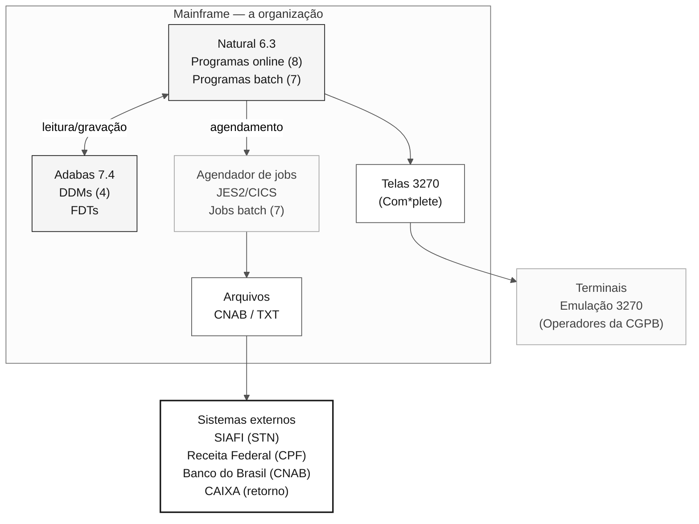

# SIFAP — Sistema de Fiscalização e Administração de Pagamentos

> **Trilha:** [Kit do Time](../../README.md) › [Estágio 1](../README.md) › **Legado SIFAP**

**Documentação técnica do sistema SIFAP legado.** Contém a história, a arquitetura, o inventário de programas e as orientações de leitura para a Arqueologia do Estágio 1.

| Campo | Valor |
|---|---|
| **Público-alvo** | Todas as duplas durante o Estágio 1 |
| **Pré-requisitos** | Nenhum, este é o ponto de entrada para o sistema legado |
| **Estágio** | Estágio 1 — Arqueologia |
| **Resultado esperado** | Compreender o contexto do sistema antes de abrir os arquivos `.NSN` |

  

> [!IMPORTANT]
> **Este é um documento de ficção, não a verdade do kit.** Ele é o dossiê
> técnico do SIFAP como a equipe de suporte o teria montado e, por isso, carrega
> os erros de atribuição, as notas de versão reconstruídas em retrospecto e os
> inventários parciais que dossiês reais carregam. Onde ele discorda do
> cabeçalho de uma fonte, o cabeçalho vence. Para as datas que o próprio kit
> sustenta, leia [`CHRONOLOGY.md`](CHRONOLOGY.md); para as divergências que são
> deliberadas, leia a [divergência declarada](DECLARED-DRIFT.md). Trate cada
> afirmação abaixo como uma pista a verificar em `natural-programs/` e
> `adabas-ddms/`, nunca como fato estabelecido.

> **Classificação:** Documento interno, a organização / SUPDE / DESIF
> **Versão do sistema:** 4.1.2
> **Ambiente:** Produção, mainframe da organização / Regional Brasília
> **Linguagem:** Natural 6.3.12 | Banco de dados: Adabas 7.4.3

---

## 1. Finalidade do sistema

O **SIFAP, Sistema de Fiscalização e Administração de Pagamentos**, gerencia, controla e fiscaliza pagamentos de benefícios sociais administrados pelo Governo Federal em todo o país.

O sistema atende às seguintes necessidades operacionais:

- **Cadastro e manutenção** de beneficiários de programas sociais federais;
- **Cálculo e processamento** da folha mensal;
- **Fiscalização e auditoria** dos pagamentos realizados, incluindo cruzamento de dados cadastrais;
- **Geração de arquivos de remessa** para as instituições financeiras pagadoras;
- **Conciliação financeira** com o SIAFI (Sistema Integrado de Administração Financeira do Governo Federal);
- **Emissão de relatórios gerenciais e operacionais** para os órgãos gestores.

### 1.1. Órgãos atendidos

| Sigla | Órgão | Responsabilidade |
| --------- | -------------------------------------------------- | ---------------------------------------------- |
| MDAS | Ministério do Desenvolvimento e Assistência Social | Gestão dos programas de transferência de renda |
| SENARC | Secretaria Nacional de Renda de Cidadania | Regulamentação e acompanhamento dos benefícios |
| CGPB | Coordenação-Geral de Processamento de Benefícios | Operação direta do processamento mensal |
| DEFIS | Departamento de Fiscalização | Auditoria e controle de pagamentos indevidos |
| CGTI/MDAS | Coordenação-Geral de Tecnologia da Informação | Interface técnica com a organização |

O SIFAP é um sistema fundamental para o ciclo de pagamento de benefícios e está classificado como **sistema de missão crítica** pelo Comitê de Governança de TI do MDAS.

---

## 2. Histórico

> [!WARNING]
> A linha do tempo agrupa o trabalho pelo projeto que o financiou, que é como
> notas de versão costumam ser escritas e por que quatro de suas linhas
> discordam das datas de criação registradas nos próprios membros (`DRIFT-01` a
> `DRIFT-04` na [divergência declarada](DECLARED-DRIFT.md)). A cronologia de
> versões derivada das evidências está em
> [`CHRONOLOGY.md`](CHRONOLOGY.md#5-cronologia-canônica-das-versões).

### 2.1. Linha do tempo

| Ano | Evento | Observações |
| -------- | ---------------------------------------------- | ------------------------------------------------------------------------------------------------------------------------------------------------------------------------------------------------------------------- |
| **1997** | Desenvolvimento inicial do SIFAP | Natural 4.2 / Adabas 6.1. Equipe de oito analistas da SUPDE/DESIF, coordenada por Roberto Meirelles. Prazo original: 14 meses. Entrega em 18 meses. |
| **1998** | Entrada em produção (v1.0) | Módulos CADBENEF, CADPROG e CONSBENF. Carga inicial de 1,2 milhão de beneficiários migrados do sistema anterior (SIPAG/DOS). |
| **1999** | Primeira grande atualização (v2.0) | Processamento batch implantado para os ciclos mensais de pagamento. Programas BATCHPGT e BATCHREL. Integração com o Banco do Brasil para remessa de arquivo CNAB 240. |
| **2002** | Integração com o SIAFI (v2.5) | Módulo de conciliação financeira. Programa BATCHCON para conciliação automática de ordens bancárias. Homologado pela STN. |
| **2005** | Migração tecnológica (v3.0) | Atualização para Natural 6.3 / Adabas 7.4. Novo módulo de auditoria (RELAUDIT). Criação do DDM AUDIT. Refatoração parcial dos programas de cálculo. |
| **2008** | Esforço de documentação técnica | Projeto de documentação liderado por Fernanda Oliveira (analista de negócio). **Parcialmente concluído**, cobre apenas os módulos de cadastro. Os módulos de cálculo e batch continuam sem documentação formal. |
| **2012** | Tentativa de documentar as regras de negócio | Iniciativa da CGTI/MDAS. O levantamento foi interrompido após a aposentadoria de três analistas-chave. Produziu "RN-SIFAP-2012-parcial.doc" (47 páginas, incompleto). |
| **2015** | Última funcionalidade significativa (v4.0) | Módulo CALCDSCT, cálculo de descontos legais. Implementado por Marcos Antônio Ferreira, o último programador Natural com conhecimento abrangente do sistema. |
| **2018** | Última manutenção (v4.1.2) | Correções de segurança (patches do Adabas). Ajuste no tratamento de timeout do BATCHPGT. Atualização das tabelas de faixas de desconto. Nenhuma nova funcionalidade. |

### 2.2. Nota de continuidade

Desde 2018, o SIFAP opera em **modo de manutenção mínima**. Não há novas funcionalidades planejadas. O contrato de suporte cobre apenas correções emergenciais e ajustes nas tabelas de parâmetros.

---

## 3. Equipe original

> [!WARNING]
> Esta lista é memória institucional e não corresponde aos nomes registrados nos
> cabeçalhos das fontes. Registrada como `DRIFT-05` e `DRIFT-08` na
> [divergência declarada](DECLARED-DRIFT.md); o índice de nomes que resolve as
> duas grafias de um mesmo autor está em
> [`CHRONOLOGY.md`](CHRONOLOGY.md#6-índice-canônico-de-nomes).

A equipe que desenvolveu e manteve o SIFAP ao longo dos anos está listada abaixo. **A maioria das pessoas se aposentou ou foi transferida para outras unidades**, criando um risco significativo de perda de conhecimento.

| Nome | Papel | Período | Situação atual |
| ----------------------------- | ----------------------------------------- | --------- | ---------------------------------------------------------------------------------------------------------------------------------------------- |
| Roberto Carlos Meirelles | Analista de Sistemas Sênior (coordenador) | 1997–2010 | Aposentado (2010). Responsável pela arquitetura original e pelas decisões de modelagem de dados. |
| Fernanda Cristina de Oliveira | Analista de Negócio | 1997–2012 | Aposentada (2012). Única pessoa que documentou parcialmente as regras de negócio. Autora de "RN-SIFAP-2012-parcial.doc". |
| Marcos Antônio Ferreira | Programador Natural Sênior | 2001–2017 | Transferido para SUPDE/DESIN (2017). Último desenvolvedor com conhecimento abrangente do código. Implementou o CALCDSCT e as refatorações de 2005. |
| Cláudia Regina dos Santos | DBA Adabas | 1997–2008 | Aposentada (2008). Projetou os quatro DDMs e as rotinas de backup/recuperação. |
| José Aparecido Lima | Programador Natural | 1997–2005 | Aposentado (2005). Responsável pelos módulos batch originais. |
| Patrícia Helena Moura | Analista de Sistemas | 2003–2016 | Transferida para SUPDE/DEGED (2016). Trabalhou na integração com o SIAFI e no módulo de auditoria. |
| Antônio Carlos Ribeiro | Analista de Suporte / Operações | 1999–2014 | Aposentado (2014). Detinha o conhecimento operacional sobre agendamento e monitoramento do batch. |
| Luciana Barbosa de Freitas | Programadora Natural Júnior | 2010–2018 | Ativa na SUPDE/DESIF. Única integrante remanescente com algum conhecimento do sistema, embora limitado aos módulos de consulta. |

> [!WARNING]
> O conhecimento técnico detalhado das regras de cálculo (CALCBENF, CALCCORR, CALCDSCT) existe **exclusivamente no código-fonte**. Não há documentação funcional atualizada para esses módulos.

---

## 4. Arquitetura do sistema

### 4.1. Visão geral



### 4.2. Camada de programas Natural

Os programas Natural do SIFAP estão organizados na biblioteca Natural **SIFAP** e divididos em:

- **Programas online (interativos):** executados por emulação de terminal 3270 com maps (telas) Natural. Acessados por operadores da CGPB e da DEFIS.
- **Programas batch:** executados pelo agendador JES2, mensalmente (folha) ou sob demanda (relatórios e conciliação).
- **Subprogramas e copycode:** rotinas utilitárias compartilhadas (validação de CPF, cálculo de dígito verificador e formatação de valores).

### 4.3. Banco de dados, DDMs do Adabas

O SIFAP usa quatro DDMs (Data Definition Modules) no Adabas:

| DDM | Arquivo Adabas (FNR) | Descrição | Registros (estimativa de 2018) |
| ------------------- | -------------------- | ----------------------------------------------------------------------------------------------------------- | ------------------------------ |
| **BENEFICIARY** | FNR 150 | Registros de beneficiários: dados pessoais, documentação, endereço, situação cadastral e histórico de situações | ~4.200.000 |
| **SOCIAL-PROGRAM** | FNR 151 | Registros de programas sociais: regras de elegibilidade, faixas de valores e parâmetros de cálculo | ~45 (registros de parâmetros) |
| **PAYMENT** | FNR 152 | Registros de pagamentos: valor bruto, descontos, valor líquido, data de crédito, banco pagador e situação | ~180.000.000 |
| **AUDIT** | FNR 153 | Log de auditoria: ações de usuários, alterações cadastrais e eventos de fiscalização | ~25.000.000 |

**Observações de modelagem:**

- Os nomes de campos seguem a **convenção abreviada da década de 1990** (por exemplo, `BN-NM-BENEF` = nome do beneficiário, `PG-VL-BRUTO` = valor bruto do pagamento, `AU-DT-OCORR` = data do evento de auditoria).
- Os campos de valor usam formato decimal packed.
- O Adabas não gerencia integridade referencial. Toda validação ocorre nos programas Natural.
- O DDM SOCIAL-PROGRAM contém campos MU (multiple value) e PE (periodic group) para armazenar faixas de valores por exercício fiscal.

### 4.4. Processamento batch

O ciclo mensal de processamento batch segue esta sequência:

1. **BATCHPGT** — processamento principal da folha (executa no primeiro dia útil do mês; janela batch de quatro horas)
2. **BATCHCON** — conciliação com os arquivos de retorno do Banco do Brasil / CAIXA
3. **BATCHREL** — geração de relatórios gerenciais após o processamento

**Janela batch:** 22:00 às 06:00 (horário de Brasília)
**Tempo médio de execução do BATCHPGT:** 3h20min (referência: ciclo de fevereiro de 2018)
**Volume mensal processado:** ~3.800.000 pagamentos

### 4.5. Interface do operador

As telas do SIFAP usam **maps Natural** no formato 3270 (24 linhas × 80 colunas), acessadas por um emulador de terminal. A navegação usa códigos de transação (por exemplo, `SF01` = cadastro de beneficiário, `SF05` = consulta, `SF10` = relatório de auditoria).

---

## 5. Inventário de programas

> [!WARNING]
> As colunas de autor, ano e última alteração abaixo vêm do esforço de
> documentação de 2008, não dos próprios membros. Várias linhas discordam dos
> cabeçalhos `* AUTHOR:` e `* DATE:` em `natural-programs/`. Isso está
> registrado como `DRIFT-06` e `DRIFT-07` na
> [divergência declarada](DECLARED-DRIFT.md). Use
> [`CHRONOLOGY.md`](CHRONOLOGY.md) quando precisar da atribuição que o kit
> sustenta, e abra o membro quando precisar da verdade.

### 5.1. Módulo de cadastro

| Programa | Descrição | Autor | Ano | Última alteração | Situação |
| --------- | ------------------------------------------------------- | -------------- | ---- | -------------- | -------- |
| CADBENEF | Cadastro de beneficiário: inclusão, alteração e exclusão | R. Meirelles | 1997 | 2015 | Produção |
| CADDEPEN | Dependentes vinculados ao beneficiário titular | J. A. Lima | 1998 | 2008 | Produção |
| CADPROG | Cadastro de programa social: parâmetros e faixas de valores | F. C. Oliveira | 1997 | 2015 | Produção |

### 5.2. Módulo de cálculo

| Programa | Descrição | Autor | Ano | Última alteração | Situação |
| -------- | ---------------------------------------------------- | -------------- | ---- | -------------- | -------- |
| CALCBENF | Cálculo do valor do benefício: regras por programa/faixa | R. Meirelles | 1998 | 2015 | Produção |
| CALCCORR | Correções e reajustes: índices anuais | M. A. Ferreira | 2005 | 2015 | Produção |
| CALCDSCT | Cálculo de descontos legais (consignações, IR) | M. A. Ferreira | 2015 | 2018 | Produção |

### 5.3. Módulo de validação

| Programa | Descrição | Autor | Ano | Última alteração | Situação |
| -------- | -------------------------------------------------------- | -------------- | ---- | -------------- | -------- |
| VALBENEF | Validação dos dados cadastrais do beneficiário (CPF, NIS) | R. Meirelles | 1997 | 2005 | Produção |
| VALELEG | Validação de elegibilidade segundo as regras do programa | F. C. Oliveira | 1999 | 2012 | Produção |
| VALDOCS | Validação de documentos comprobatórios, checklist por tipo | P. H. Moura | 2003 | 2008 | Produção |

### 5.4. Módulo batch

| Programa | Descrição | Autor | Ano | Última alteração | Situação |
| -------- | ----------------------------------------------------- | ----------- | ---- | -------------- | -------- |
| BATCHPGT | Processamento mensal da folha: geração de créditos | J. A. Lima | 1999 | 2018 | Produção |
| BATCHREL | Geração de relatórios batch (totalizadores, resumos) | J. A. Lima | 1999 | 2008 | Produção |
| BATCHCON | Conciliação financeira: retorno bancário × SIAFI | P. H. Moura | 2002 | 2012 | Produção |

### 5.5. Módulo de consulta e relatórios

| Programa | Descrição | Autor | Ano | Última alteração | Situação |
| -------- | --------------------------------------------------- | -------------- | ---- | -------------- | -------- |
| CONSBENF | Consulta de beneficiário: tela 3270 com filtros | R. Meirelles | 1997 | 2005 | Produção |
| RELPGT | Relatório de pagamentos: por período/programa/UF | P. H. Moura | 2003 | 2012 | Produção |
| RELAUDIT | Relatório de auditoria: eventos e divergências | M. A. Ferreira | 2005 | 2015 | Produção |

### 5.6. Subprogramas e copycode (parcialmente documentados)

| Componente | Tipo | Descrição |
| ---------- | ----------- | ------------------------------------------------ |
| VALCPF | Subprograma | Validação de CPF (dígito verificador) |
| VALNISN | Subprograma | Validação de NIS/NIT |
| FMTVLR | Copycode | Formatação de valores monetários |
| FMTDT | Copycode | Formatação e validação de datas |
| LOGAUDIT | Subprograma | Grava um registro de auditoria |
| CALCIDX | Subprograma | Aplica um índice de correção (tabela interna) |

> **Observação:** podem existir outros subprogramas não catalogados. O inventário acima reflete o levantamento realizado em 2008.

---

## 6. Volumes de dados

### 6.1. Volume de dados atual (referência: março de 2018)

| Métrica | Volume |
| --------------------------------------------- | ---------------------- |
| Beneficiários cadastrados (ativos + inativos) | ~4.200.000 registros |
| Beneficiários ativos | ~3.850.000 registros |
| Programas sociais parametrizados | 45 programas |
| Registros de pagamentos (histórico completo) | ~180.000.000 registros |
| Registros de auditoria | ~25.000.000 registros |
| Pagamentos processados por ciclo mensal | ~3.800.000 |
| Arquivo mensal de remessa CNAB | ~380 MB |
| Espaço total em disco do Adabas (ASSO + DATA) | ~120 GB |

### 6.2. Picos de processamento

- **Pico mensal:** processamento da folha, no primeiro dia útil de cada mês
- **Pico anual:** reajuste de benefícios (janeiro), reprocessamento completo com novos índices
- **Pico extraordinário:** pagamentos complementares ou 13º benefício (quando autorizado por decreto)

### 6.3. Crescimento

O volume de registros na tabela PAYMENT cresce aproximadamente **46 milhões de registros/ano** (3,8 milhões × 12 meses + estornos e pagamentos complementares). Não há política de expurgo implementada. Os registros mais antigos são de **1998**.

---

## 7. Criticidade operacional

### 7.1. Classificação

| Atributo | Valor |
| -------------------------- | ------------------------------------------------------------------- |
| **Nível de criticidade** | **Nível 1, missão crítica** |
| **SLA de disponibilidade** | 99,5% (exceto a janela de manutenção) |
| **Janela de manutenção** | Domingos, 02:00–06:00 |
| **Famílias afetadas** | ~4.000.000 de famílias em todo o país |
| **Plano de contingência** | Processamento manual por planilha (último recurso, nunca acionado) |

### 7.2. Impacto da indisponibilidade

A indisponibilidade do SIFAP causa diretamente:

- **Atraso no pagamento de benefícios** a famílias em situação de vulnerabilidade social;
- **Impossibilidade de realizar consultas** em toda a rede de atendimento (CRAS, unidades do MDAS);
- **Descumprimento de prazos legais** para créditos em conta;
- **Repercussões institucionais** junto ao Ministério e à imprensa.

### 7.3. Registro de incidentes significativos

| Data | Incidente | Impacto | Resolução |
| -------- | ---------------------------------------------------------------- | ------------------------------------------ | ---------------------------------------------------------------------------------------------------------------------- |
| Mar/2016 | Timeout do BATCHPGT, ciclo com volume atípico (4,1 milhões de pagamentos) | Atraso de 18 horas na folha | Aumento de MAXTIME no JCL; otimização da leitura sequencial no FNR 152. Correção definitiva aplicada na v4.1.2 (2018). |
| Jan/2014 | Falha na conciliação com o SIAFI, divergência de totais | 3.200 pagamentos duplicados detectados | Correção manual + ajuste no BATCHCON para validar o hash totalizador. |
| Set/2009 | Corrupção parcial de índice Adabas (FNR 150) | Sistema indisponível por 6 horas | Recuperação por ADASAV. Procedimento de backup revisado por Cláudia Regina dos Santos. |

---

## 8. Sistemas integrados

| Sistema | Órgão/entidade | Tipo de integração | Descrição |
| --------------------------- | ------------------------------------ | -------------------------- | ---------------------------------------------------------------------------------------------------------------------------------------------- |
| **SIAFI** | Secretaria do Tesouro Nacional (STN) | Batch (arquivo TXT) | Envia ordens bancárias e recebe confirmações de pagamento. Conciliação mensal pelo BATCHCON. |
| **CPF / Receita Federal** | Receita Federal do Brasil | Online (consulta) | Validação de CPF na inclusão e alteração cadastral. Consulta por transação Natural com timeout de 30 segundos. |
| **Banco do Brasil** | BB, Central de Pagamentos | Batch (arquivo CNAB 240) | Remessa de créditos para pagamento em conta. Arquivo de retorno com confirmações e rejeições. |
| **CAIXA Econômica Federal** | CAIXA, Pagamentos Sociais | Batch (arquivo CNAB 240) | Canal alternativo de pagamento para beneficiários com conta na CAIXA. Integração adicionada em 2004. |
| **CadÚnico** | MDAS / SENARC | Batch (arquivo posicional) | Recebimento periódico de atualizações cadastrais do Cadastro Único. Processado por job específico não catalogado no inventário principal. |

> **Observação:** a integração com o CadÚnico foi implementada em caráter emergencial em 2006 e **não segue o padrão arquitetural** dos demais módulos. O programa responsável não está no inventário oficial.

---

## 9. Observações importantes

> **Este documento reflete o estado do conhecimento em março de 2018. Muitas das informações abaixo são alertas recorrentes da equipe de suporte.**

### 9.1. Documentação parcial e desatualizada

- A documentação funcional cobre **apenas os módulos de cadastro** (esforço de 2008).
- "RN-SIFAP-2012-parcial.doc" contém regras de negócio levantadas em 2012, mas está **incompleto** (47 páginas de um total estimado em mais de 200).
- Não existe documentação técnica dos programas de cálculo (CALCBENF, CALCCORR, CALCDSCT). As regras existem **exclusivamente no código-fonte**.
- Os comentários no código-fonte estão em português, mas são **escassos e frequentemente desatualizados**.

### 9.2. Regras de negócio no código

- Várias regras de negócio críticas foram implementadas diretamente nos programas Natural **sem documentação correspondente**.
- O programa CALCBENF contém aproximadamente **4.800 linhas** de código, com lógica condicional aninhada em até sete níveis.
- Constantes hardcoded representam parâmetros de cálculo cujo significado **não é evidente** sem conhecimento do contexto regulatório da época.

### 9.3. Perda de conhecimento

- Das oito pessoas da equipe original, **apenas uma permanece** na DESIF (Luciana Barbosa de Freitas), com conhecimento limitado aos módulos de consulta.
- Marcos Antônio Ferreira (transferido em 2017) é o último profissional com conhecimento abrangente do sistema, mas não está mais alocado ao projeto.
- **Recomendação registrada em 2016 (não implementada):** realizar sessões de transferência de conhecimento antes das aposentadorias previstas.

### 9.4. Interdependências não documentadas

- Alguns programas usam **Global Data Areas (GDAs)** compartilhadas cujas dependências não estão mapeadas.
- O subprograma LOGAUDIT é chamado por quase todos os programas, mas seu comportamento varia conforme parâmetros não documentados.
- A ordem de execução dos jobs batch é **crítica** e está registrada apenas nos JCLs de produção e na memória operacional da equipe.

### 9.5. Convenções de nomenclatura

Os nomes dos campos nos DDMs seguem a convenção abreviada típica da década de 1990:

| Prefixo | Entidade | Exemplos |
| ------- | --------------- | ---------------------------------------- |
| `BN-` | Beneficiário | `BN-NM-BENEF`, `BN-NR-CPF`, `BN-CD-SIT` |
| `PS-` | Programa social | `PS-NM-PROG`, `PS-VL-MIN`, `PS-VL-MAX` |
| `PG-` | Pagamento | `PG-VL-BRUTO`, `PG-VL-LIQ`, `PG-DT-CRED` |
| `AU-` | Auditoria | `AU-DT-OCORR`, `AU-CD-ACAO`, `AU-NR-USR` |

Os nomes de campos têm limite de **20 caracteres** e usam abreviações padronizadas: `NM` (nome), `NR` (número), `CD` (código), `DT` (data), `VL` (valor), `QT` (quantidade), `SG` (sigla), `IN` (indicador).

---

## 10. Estrutura de diretórios deste cenário

```
02-cenario-sifap-legado/
├── README.md ← este documento
├── natural-programs/ ← programas Natural (.NSN) - código-fonte
├── adabas-ddms/ ← DDMs (Data Definition Modules) - definições de dados
├── legacy-docs/ ← documentação parcial original (2008/2012)
└── demo/ ← demonstração interativa no terminal (Estágio 1)
```

---

## Documentos relacionados

- [`01-archaeology/LEGACY-EXPLORATION-CHECKLIST.md`](../LEGACY-EXPLORATION-CHECKLIST.md), gate obrigatório antes de iniciar o Estágio 2.
- [`01-archaeology/GUIDE.md`](../GUIDE.md), roteiro cronometrado para ler este sistema legado.
- [`02-modern-spec/GUIDE.md`](../../02-modern-spec/GUIDE.md), próximo passo: especificação moderna (EARS) com `source_legacy:` apontando para arquivos desta pasta.

---

### Continue lendo

| Anterior | Próximo |
|---|---|
| [GUIDE do Estágio 1](../GUIDE.md)<br/><sub>Roteiro cronometrado de 90 minutos.</sub> | [Como ler Natural](HOW-TO-READ-NATURAL.md)<br/><sub>Tutorial de sintaxe para pessoas não desenvolvedoras.</sub> |

<sub>[Voltar ao índice do kit](../../README.md)</sub>
