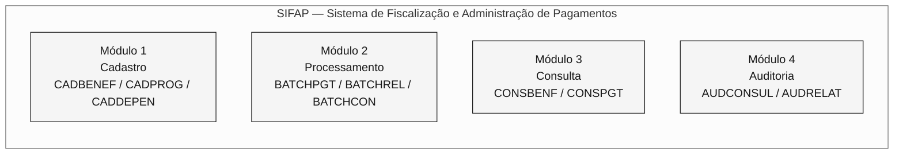
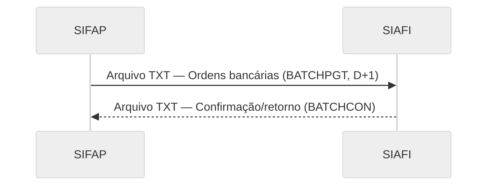
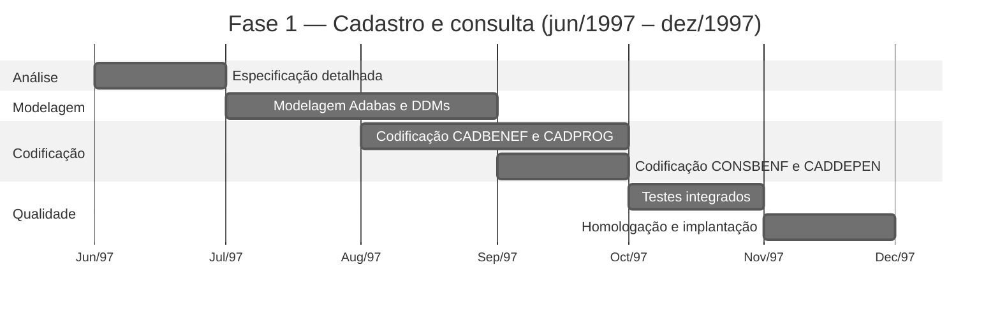
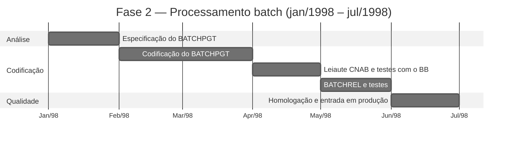

---

title: "Projeto SIFAP - Documento de Arquitetura Técnica"
author: "Roberto Carlos Ferreira - Analista de Sistemas Sênior"
date: "1997-05-20"
version: "1.0.0"
classification: "CONFIDENCIAL"
project: "SIFAP - Sistema de Fiscalização e Administração de Pagamentos"
sponsor: "SUPDE/DESIF - a organização"
client: "SAS/MPAS - Secretaria de Assistência Social"
---

> [!NOTE]
> Este é um documento histórico reconstituído para o exercício de arqueologia da imersão SIFAP 2.0. O documento simula a documentação técnica original de 1997, como teria sido produzida pela equipe SUPDE/DESIF. A linguagem da época e os nomes de pessoas e unidades organizacionais foram preservados intencionalmente. **Este documento não deve ser usado como especificação atual do sistema.** As lacunas e inconsistências registradas nos comentários fazem parte do exercício: representam os desafios reais de arqueologia que a equipe deve investigar.

<!-- ====================================================================== -->
<!-- PROJETO SIFAP - DOCUMENTO DE ARQUITETURA TÉCNICA -->
<!-- Versão 1.0.0 - maio de 1997 -->
<!-- a organização - a organização federal de processamento de dados -->
<!-- Superintendência de Desenvolvimento - SUPDE -->
<!-- Divisão de Desenvolvimento de Sistemas de Fiscalização - DESIF -->
<!-- ====================================================================== -->

# PROJETO SIFAP - DOCUMENTO DE ARQUITETURA TÉCNICA

**SISTEMA DE FISCALIZAÇÃO E ADMINISTRAÇÃO DE PAGAMENTOS**

---

|                      |                                       |
| -------------------- | ------------------------------------- |
| **Documento:** | ARQ-SIFAP-1997-v1.0 |
| **Classificação:** | CONFIDENCIAL |
| **Data de emissão:** | 20/05/1997 |
| **Projeto:** | SIFAP - Desenvolvimento inicial |
| **Prazo previsto:** | 14 meses (jun/1997 - jul/1998) |
| **Equipe:** | 8 analistas/programadores SUPDE/DESIF |
| **Coordenador:** | Roberto Carlos Ferreira |
| **Gerência:** | Antônio Marcos Silva - Gerente SUPDE |

---

> **Apresentação**
>
> Este documento descreve a arquitetura técnica proposta para o SIFAP, Sistema de Fiscalização e Administração de Pagamentos, a ser desenvolvido pela equipe SUPDE/DESIF da organização em resposta à demanda da Secretaria de Assistência Social do Ministério da Previdência e Assistência Social (SAS/MPAS).
>
> O SIFAP substituirá o atual sistema SIPAG/DOS, desenvolvido em Clipper e operado em microcomputadores nas regionais. A migração para uma plataforma mainframe busca garantir a centralização dos dados, a integridade das informações e a capacidade adequada de processamento para o crescimento previsto dos programas sociais federais.
>
> Este documento foi elaborado durante a fase de projeto, antes do início da codificação, e representa a **visão arquitetural planejada** para o sistema.

---

## 1. Introdução

### 1.1. Contexto

O Governo Federal, por meio do Ministério da Previdência e Assistência Social, administra diversos programas de transferência de renda para famílias em situação de vulnerabilidade social. Atualmente, o controle desses pagamentos é realizado pelo sistema SIPAG/DOS, uma aplicação desenvolvida em Clipper 5.2 que opera de forma descentralizada nas regionais da organização.

A descentralização do SIPAG/DOS causa os seguintes problemas:

- Impossibilidade de consolidação nacional em tempo hábil;
- Risco de duplicidade de cadastros entre regionais;
- Dificuldade de auditoria e acompanhamento;
- Limitação do volume de processamento (máximo de 200.000 registros por regional);
- Ausência de integração com sistemas financeiros federais (SIAFI).

### 1.2. Finalidade do SIFAP

Desenvolver um sistema centralizado, em plataforma mainframe, capaz de:

- Gerenciar um cadastro nacional unificado de beneficiários;
- Processar a folha mensal com volume projetado de até 5 milhões de beneficiários;
- Integrar-se ao SIAFI para conciliação financeira automatizada;
- Fornecer mecanismos de auditoria e fiscalização;
- Garantir disponibilidade e segurança compatíveis com a criticidade da operação.

### 1.3. Plataforma tecnológica escolhida

Após avaliar as alternativas disponíveis na infraestrutura da organização, foi escolhida a seguinte plataforma:

| Componente | Produto | Versão | Justificativa |
| ---------- | ---------- | ------- | ----------------------------------------------------------------------------------------------------------------------------- |
| Linguagem | Natural | 4.2.6 | Padrão da organização para desenvolvimento mainframe. Maior produtividade que COBOL em aplicações de cadastro/consulta. |
| SGBD | Adabas | 6.1.4 | SGBD invertido, alto desempenho em consultas por múltiplos descritores. Padrão da organização. |
| Monitor TP | Com\*plete | 6.1.2 | Monitor de teleprocessamento para telas 3270. Integrado ao Natural. |
| Agendador | JES2 | MVS/ESA | Subsistema padrão para processamento batch. |
| S.O. | MVS/ESA | 5.2.2 | Sistema operacional do mainframe da organização, Regional Brasília. |

> **Observação:** a escolha de Natural/Adabas segue a norma técnica da SUPDE (NT-SUPDE-003/1996), que estabelece essa plataforma como padrão para novos sistemas de cadastro e processamento de médio/grande porte.

---

## 2. Arquitetura modular

### 2.1. Módulos previstos

O SIFAP será organizado em **4 módulos funcionais**:



#### Módulo 1 - CADASTRO

Responsável pela manutenção dos dados cadastrais de beneficiários, dependentes e programas sociais.

| Programa previsto | Descrição | Prioridade |
| ----------------- | --------------------------------------------------------- | ---------- |
| CADBENEF | Cadastro de beneficiário, inclusão, alteração e exclusão | Fase 1 |
| CADPROG | Cadastro e parametrização de programas sociais | Fase 1 |
| CADDEPEN | Cadastro de dependentes do beneficiário | Fase 1 |

#### Módulo 2 - PROCESSAMENTO

Responsável pelo processamento batch da folha e pela geração de arquivos para integração.

| Programa previsto | Descrição | Prioridade |
| ----------------- | ------------------------------------------- | ---------- |
| BATCHPGT | Processamento mensal da folha | Fase 2 |
| BATCHREL | Geração de relatórios batch (totalizadores) | Fase 2 |
| BATCHCON | Conciliação financeira com o SIAFI | Fase 3 |

#### Módulo 3 - CONSULTA

Responsável pelas consultas online de cadastro e pagamentos.

| Programa previsto | Descrição | Prioridade |
| ----------------- | ------------------------------------------------- | ---------- |
| CONSBENF | Consulta de beneficiários por múltiplos critérios | Fase 1 |
| CONSPGT | Consulta de pagamentos por beneficiário/período | Fase 2 |

#### Módulo 4 - AUDITORIA

Responsável pelo registro e pela consulta de trilhas de auditoria e ocorrências de fiscalização.

| Programa previsto | Descrição | Prioridade |
| ----------------- | --------------------------------------------------- | ---------- |
| AUDCONSUL | Consulta da trilha de auditoria por período/usuário | Fase 3 |
| AUDRELAT | Relatório de ocorrências de auditoria | Fase 3 |

> **Total previsto:** 11 programas, distribuídos em 3 fases de desenvolvimento.

---

## 3. Modelo de dados

### 3.1. DDMs previstos

O SIFAP usará **3 DDMs** (Módulos de Definição de Dados) no Adabas:

```mermaid
%%{init: {'theme':'neutral','themeVariables':{'fontFamily':'ui-sans-serif, system-ui, sans-serif','primaryColor':'#F5F5F5','primaryTextColor':'#171717','primaryBorderColor':'#171717','lineColor':'#525252','secondaryColor':'#FFFFFF','tertiaryColor':'#FAFAFA','background':'#FFFFFF'}}}%%
erDiagram
    BENEFICIARY {
        string BN-NR-CPF PK
        string BN-NM-BENEF DE
        date BN-DT-NASC
        string BN-CD-SIT DE
        string BN-CD-PROG DE
        string BN-NR-NIS
        string BN-CD-REGIAO DE
        int BN-QT-DEPEND
        decimal BN-VL-RENDA-PC
        date BN-DT-ULT-ATUAL
        string BN-CD-BANCO
        string BN-CD-AGENCIA
        string BN-NR-CONTA
    }

    SOCIAL-PROGRAM {
        string PS-CD-PROG PK
        string PS-NM-PROG
        decimal PS-VL-MIN
        decimal PS-VL-MAX
        string PS-IN-ATIVO
        date PS-DT-INICIO
        date PS-DT-FIM
        string PS-VL-FAIXAS PE
    }

    PAYMENT {
        int PG-NR-SEQ PK
        string PG-NR-CPF DE
        string PG-CD-PROG DE
        string PG-AA-MM-REF DE
        decimal PG-VL-BRUTO
        decimal PG-VL-LIQ
        date PG-DT-CRED
        string PG-CD-STATUS DE
        string PG-CD-BANCO
    }

    BENEFICIARY ||--o{ PAYMENT : "gera"
    BENEFICIARY }o--|| SOCIAL-PROGRAM : "vincula-se a"
```

Legenda: PK = chave primária (superdescritor) · DE = descritor (índice Adabas) · PE = grupo periódico · MU = campo multivalorado

<!-- O DDM AUDIT (FNR 153) não estava incluído no projeto original.
 Ele foi adicionado em 2005, durante a migração para Natural 6.3/Adabas 7.4,
 por solicitação do Departamento de Fiscalização (DEFIS).
 Os programas de auditoria (AUDCONSUL, AUDRELAT) previstos neste
 documento foram substituídos pelo programa RELAUDIT em 2005. -->

### 3.2. Convenção de nomes de campos

Adotaremos a seguinte convenção para nomes de campos Adabas, conforme o padrão de nomenclatura da SUPDE (NT-SUPDE-007/1995):

| Prefixo | Entidade |
| ------- | --------------- |
| `BN-` | Beneficiário |
| `PS-` | Programa social |
| `PG-` | Pagamento |

Os sufixos indicam o tipo de dado:

| Sufixo | Significado | Exemplo |
| ------ | ---------------------- | -------------- |
| `NM-` | Nome/descrição | `BN-NM-BENEF` |
| `NR-` | Número/código numérico | `BN-NR-CPF` |
| `CD-` | Código/classificação | `BN-CD-SIT` |
| `DT-` | Data | `PG-DT-CRED` |
| `VL-` | Valor monetário | `PG-VL-BRUTO` |
| `QT-` | Quantidade | `BN-QT-DEPEND` |
| `IN-` | Indicador (S/N) | `PS-IN-ATIVO` |
| `SG-` | Sigla | (reservado) |

> **Restrição:** nomes de campos limitados a 20 caracteres, conforme limitação do Natural 4.2.

### 3.3. Estimativa inicial de volume

| DDM | Volume inicial | Crescimento estimado/ano | Projeção para 5 anos |
| --------------- | -------------------------- | ------------------------ | --------------- |
| BENEFICIARY | 1,200,000 (migração do SIPAG) | 300,000 | 2,700,000 |
| SOCIAL-PROGRAM | 15 | 5 | 40 |
| PAYMENT | 0 (novo) | 14,400,000 (1.2M x 12) | 72,000,000 |

> **Observação sobre a projeção:** consideramos crescimento linear de 25% ao ano no cadastro de beneficiários, compatível com a expansão prevista dos programas sociais do Governo Federal. A projeção pode variar conforme novas políticas públicas.

---

## 4. Fluxo de processamento batch

### 4.1. Diagrama do fluxo planejado

```mermaid
%%{init: {'theme':'neutral','themeVariables':{'fontFamily':'ui-sans-serif, system-ui, sans-serif','primaryColor':'#F5F5F5','primaryTextColor':'#171717','primaryBorderColor':'#171717','lineColor':'#525252','secondaryColor':'#FFFFFF','tertiaryColor':'#FAFAFA','background':'#FFFFFF'}}}%%
TB flowchart
    classDef step fill:#F5F5F5,stroke:#171717,color:#171717
    classDef artifact fill:#FAFAFA,stroke:#A3A3A3,color:#404040
    classDef result fill:#FFFFFF,stroke:#171717,color:#171717,stroke-width:2px

    START["Início do ciclo<br/>(1º dia útil)"]:::step
    PGT["BATCHPGT<br/>1. Ler BENEFICIARY<br/>2. Calcular valor<br/>3. Gravar PAYMENT<br/>4. Gerar CNAB"]:::step
    CNAB["Arquivo CNAB<br/>(remessa BB)<br/>Envio D+1"]:::artifact
    REL["BATCHREL<br/>Relatórios<br/>totalizadores"]:::step
    RET["Retorno BB<br/>(D+3)"]:::artifact
    CON["BATCHCON<br/>Conciliação<br/>CNAB x SIAFI"]:::result

    START --> PGT
    PGT --> CNAB
    PGT --> REL
    CNAB --> RET
    RET --> CON
```

### 4.2. Agendamento batch previsto

| Job | Frequência | Horário | Janela | Dependência |
| --------- | -------------- | ------- | ------ | ---------------------- |
| SIFAP-PGT | Mensal (1º dia útil) | 22:00 | 4h | Nenhuma |
| SIFAP-REL | Mensal (2º dia útil) | 06:00 | 1h | SIFAP-PGT (RC=0) |
| SIFAP-CON | Mensal (5º dia útil) | 22:00 | 2h | Recebimento do retorno do BB |

<!-- Na prática, o agendamento diferiu do planejado. O BATCHREL passou a
 ser executado tanto antes (modo prévio, D-1) quanto depois (D+5) do
 BATCHPGT. O BATCHCON foi antecipado para D+4. Além disso, o programa
 VALELEG passou a ser executado em modo batch (D-2), o que não estava
 previsto neste projeto original. -->

### 4.3. Estimativa de tempo de processamento

Com base em benchmarks realizados no ambiente de homologação da organização (mainframe IBM 9672-R36, 256 MB de RAM):

| Job | Volume-base | Tempo estimado | Observação |
| --------- | -------------------- | -------------- | --------------------------------------- |
| SIFAP-PGT | 1,200,000 registros | 1h30min | Processamento sequencial com E/S no Adabas |
| SIFAP-REL | N/A | 20min | Leitura de totalizadores |
| SIFAP-CON | ~1,200,000 registros | 45min | Correspondência entre CNAB e PAYMENT |

> **Premissa:** estes tempos são estimativas baseadas no volume inicial. O crescimento da base de beneficiários implicará aumento proporcional do tempo de processamento. Recomenda-se revisar o dimensionamento quando o volume atingir 2.500.000 registros.

<!-- O volume atingiu 4,200,000 em 2018. O tempo de processamento do BATCHPGT
 chegou a 3h20min (referência fev/2018), com um incidente de tempo limite em
 março/2016, quando processou 4.1M registros. A revisão de dimensionamento
 recomendada neste documento nunca foi realizada formalmente. -->

---

## 5. Integração com o SIAFI

### 5.1. Modelo de integração previsto

A integração com o SIAFI, Sistema Integrado de Administração Financeira do Governo Federal, será realizada conforme o seguinte modelo:



**Formato previsto:** arquivo texto posicional, leiaute definido pela STN (Secretaria do Tesouro Nacional), conforme Instrução Normativa STN nº 04/1996.

**Meio de transmissão:** transferência via VTAM/SNA entre os mainframes da organização e da STN.

**Frequência:** mensal, D+2 após o processamento da folha.

### 5.2. Campos do arquivo de integração SIAFI

| Posição | Tamanho | Campo | Formato |
| ------- | ------- | ---------------------------------------------------- | ------- |
| 001-002 | 02 | Tipo de registro (01=Cabeçalho, 02=Detalhe, 99=Rodapé) | N |
| 003-016 | 14 | CPF do beneficiário | N |
| 017-056 | 40 | Nome do beneficiário | A |
| 057-069 | 13 | Valor da ordem bancária (11 inteiros + 2 decimais) | N |
| 070-077 | 08 | Data de crédito (AAAAMMDD) | N |
| 078-080 | 03 | Código do banco pagador | N |
| 081-084 | 04 | Código da agência | N |
| 085-094 | 10 | Número da conta | N |
| 095-100 | 06 | Ano/mês de referência (AAAAMM) | N |
| 101-110 | 10 | Código da ordem bancária no SIAFI | N |
| 111-130 | 20 | Reserva para uso futuro | A |

<!-- A integração com o SIAFI não foi implementada conforme este leiaute.
 Em 2002, quando a integração foi efetivamente realizada (versão 2.5),
 o leiaute foi redefinido em conjunto com a STN, com campos adicionais
 para totalizador hash e código do programa social. O programa
 BATCHCON implementou a conciliação com base no leiaute revisado.
 Este documento original não reflete a versão implementada. -->

---

## 6. Segurança e controle de acesso

### 6.1. Modelo de acesso

O controle de acesso ao SIFAP será implementado em dois níveis:

1. **Nível Natural Security:** controle de acesso à biblioteca SIFAP e seus objetos, gerenciado pelo Natural Security (NATSEC). Perfis definidos:

- OPERATOR: acesso aos programas de cadastro e consulta;
- SUPERVISOR: acesso completo, incluindo exclusão e parametrização;
- AUDITOR: acesso somente leitura a todos os módulos + relatórios de auditoria.

1. **Nível da aplicação:** verificação adicional pela GDA de sessão (área global de dados), contendo código do usuário, perfil e regional de origem.

### 6.2. Trilha de auditoria

Toda operação que alterar dados no sistema (inclusão, alteração, exclusão) gerará um registro de auditoria contendo:

- Código do usuário;
- Data e hora da operação;
- Programa que originou a operação;
- Tipo de operação (I=Inclusão, A=Alteração, E=Exclusão);
- Identificação do registro afetado;
- Valores anterior e posterior (para alterações).

> **Nota de projeto:** na fase inicial, os registros de auditoria serão gravados em campos do tipo MU (valor múltiplo) no DDM BENEFIC, o arquivo de Beneficiários, usando um grupo periódico (PE) para o histórico. Essa abordagem simplifica a implementação e evita a criação de um DDM adicional.

<!-- Essa decisão foi revertida em 2005, quando o volume de
 auditoria no PE do DDM BENEFIC causou degradação grave de
 desempenho. O DDM AUDIT (FNR 153) foi então criado como uma entidade
 separada, e o subprograma LOGAUDIT foi refatorado para gravar nesse
 novo DDM. A DBA Cláudia Regina dos Santos liderou a migração dos
 registros de auditoria existentes para o novo arquivo Adabas. -->

---

## 7. Evolução prevista

### 7.1. Roteiro de funcionalidades

A evolução do SIFAP está planejada nas seguintes fases, sujeitas à aprovação e priorização pelo comitê gestor do projeto:

| Fase | Prazo previsto | Funcionalidade | Prioridade |
| ---------- | -------------- | ----------------------------------------------------------------------------------------------------------------------------------------------------------------------- | ----------- |
| **Fase 1** | Jun-dez/1997 | Módulos de cadastro e consulta (CADBENEF, CADDEPEN, CADPROG, CONSBENF) | Obrigatória |
| **Fase 2** | Jan-jul/1998 | Módulo de processamento batch (BATCHPGT, BATCHREL) | Obrigatória |
| **Fase 3** | Ago-dez/1998 | Módulo de auditoria (AUDCONSUL, AUDRELAT) + conciliação SIAFI (BATCHCON) | Desejável |
| **Fase 4** | 1º semestre/1999 | Módulo de validação (VALBENEF, VALDOCS), validação cadastral automatizada | Desejável |
| **Fase 5** | 2º semestre/1999 | Geração de relatórios gerenciais avançados, gráficos e consolidações | Opcional |
| **Fase 6** | 1º semestre/2000 | **Módulo web**, interface de consulta via intranet para órgãos gestores (SENARC, SAS). Tecnologia prevista: Natural Web Interface + servidor HTTP da organização. | Opcional |
| **Fase 7** | 2º semestre/2000 | Integração online com a Receita Federal para validar CPF em tempo real | Opcional |

<!-- Balanço da evolução real (anotação retrospectiva):

 Fase 1: CONCLUÍDA (dez/1997) - conforme planejado, com atraso de 2 meses.

 Fase 2: CONCLUÍDA (jul/1998) - conforme planejado. Entrada em produção
 a partir da v1.0 com os módulos CADBENEF, CADDEPEN, CADPROG, CONSBENF, BATCHPGT,
 BATCHREL.

 Fase 3: PARCIALMENTE CONCLUÍDA (2002/2005) - o BATCHCON foi implementado
 em 2002 (versão 2.5), com um leiaute SIAFI diferente do planejado. Os
 programas de auditoria AUDCONSUL e AUDRELAT NUNCA foram implementados
 conforme projetados. Em 2005, foram substituídos pelo programa RELAUDIT,
 com escopo reduzido.

 Fase 4: CONCLUÍDA COM ALTERAÇÕES (1999/2003) - o VALBENEF foi implementado
 em 1999 (Fase 2 da v2.0). O VALDOCS foi implementado em 2003 por Patrícia
 Helena Moura. Foi acrescentado o programa VALELEG (validação de
 elegibilidade), que NÃO estava incluído no projeto original.

 Fase 5: NUNCA IMPLEMENTADA - a geração de relatórios avançados nunca foi
 desenvolvida. Os relatórios do SIFAP permanecem em formato de texto com 132
 colunas para impressora matricial.

 Fase 6: NUNCA IMPLEMENTADA - o "módulo web" planejado para 2000 nunca
 saiu do papel. A tecnologia Natural Web Interface não foi adotada pela
 organização. O acesso ao SIFAP permanece exclusivamente via emulação 3270.

 Fase 7: IMPLEMENTADA DE FORMA DIFERENTE (2002) - a consulta de CPF na
 Receita Federal foi implementada em 2002, mas via transação CICS, e não
 por integração online direta, conforme planejado.

 FUNCIONALIDADES NÃO ESPECIFICADAS:
 - CALCCORR (cálculo de correções/ajustes) - implementado em 2005
 por Marcos Antônio Ferreira durante a migração para Natural 6.3.
 - CALCDSCT (cálculo de descontos) - implementado em 2015 por solicitação
 da SENARC. Esse módulo NÃO estava incluído em nenhum planejamento anterior.
 - RELPGT (relatório de pagamentos) - implementado em 2003 por Patrícia
 Helena Moura. Substituiu parte da funcionalidade do BATCHREL.
 - DDM AUDIT (FNR 153) - criado em 2005. O projeto original previa a
 auditoria como PE no DDM BENEFIC.
 - Integração com o CadÚnico - implementada em caráter emergencial em 2006, sem
 programa catalogado no inventário oficial. -->

### 7.2. Premissas para evolução

- Manutenção de uma equipe de pelo menos 4 analistas/programadores Natural dedicados ao SIFAP;
- Disponibilidade de ambiente de homologação no mainframe da organização;
- Apoio do comitê gestor da SAS/MPAS para definir requisitos;
- Estabilidade da plataforma Natural/Adabas na organização (sem descontinuação prevista);
- Orçamento para adquirir licenças do Natural Web Interface (Fase 6).

### 7.3. Considerações sobre o módulo web (Fase 6)

O módulo web previsto para o 1º semestre de 2000 usará a tecnologia **Natural Web Interface** (NWI), que permite exibir telas Natural como páginas HTML acessíveis por navegador. Essa tecnologia está em avaliação pela organização e deverá ser homologada até o fim de 1998.

A interface web do SIFAP permitirá:

- Consulta de beneficiários por CPF, NIS ou nome (equivalente ao CONSBENF);
- Consulta de pagamentos por período;
- Emissão de extratos para órgãos gestores;
- Acesso pela intranet da organização (rede INFOVIA do Governo Federal).

> **Observação:** a viabilidade técnica do NWI depende da aprovação pelo Comitê de Arquitetura da organização. Se o NWI não for aprovado, avaliar alternativa com **Entire X** (middleware Natural-HTTP) ou desenvolvimento separado de front-end em Java/Servlet com acesso ao Adabas via JDBC.

---

## 8. Cronograma de desenvolvimento

### 8.1. Fase 1 - Cadastro e consulta



### 8.2. Fase 2 - Processamento batch



---

## 9. Equipe do projeto

| Nome | Papel no projeto | Lotação |
| ----------------------------- | -------------------------------------- | ----------- |
| Roberto Carlos Ferreira | Coordenador técnico / Arquiteto | SUPDE/DESIF |
| Maria Helena Costa | Coordenadora da DESIF / Patrocinadora técnica | SUPDE/DESIF |
| José Aparecido Lima | Programador Natural, módulo batch | SUPDE/DESIF |
| Fernanda Cristina de Oliveira | Analista de Negócio / Especificação | SUPDE/DESIF |
| Cláudia Regina dos Santos | DBA Adabas, modelagem de dados | SUPDE/DESIF |
| Antônio Carlos Ribeiro | Analista de Suporte, infraestrutura | SUPDE/DESIF |
| Mário Sérgio Andrade | Programador Natural, módulo de cadastro | SUPDE/DESIF |
| Sandra Lúcia Pereira | Programadora Natural, módulo de consulta | SUPDE/DESIF |

> **Observação:** Mário Sérgio Andrade e Sandra Lúcia Pereira deixaram o projeto em dezembro de 1997 devido a remanejamento interno. Suas atividades foram absorvidas pelas demais pessoas da equipe, contribuindo para o atraso de 4 meses no prazo original do projeto (14 meses planejados → 18 meses realizados).

---

## 10. Riscos identificados

| # | Risco | Probabilidade | Impacto | Mitigação |
| --- | ---------------------------------------------------------------- | ------------- | ------- | ------------------------------------------------ |
| R1 | Atraso na migração de dados do SIPAG/DOS | Alta | Alto | Iniciar o mapeamento de dados em paralelo à Fase 1 |
| R2 | Indisponibilidade do ambiente de homologação | Média | Alto | Solicitar ambiente dedicado à SUPDE |
| R3 | Alteração de requisitos pela SAS/MPAS durante o desenvolvimento | Alta | Médio | Congelar requisitos por fase |
| R4 | Saída de integrantes da equipe por remanejamento | Média | Alto | Documentar e compartilhar conhecimento |
| R5 | Limitação de desempenho do Adabas com volumes acima de 2 milhões de registros | Baixa | Alto | Monitorar e otimizar descritores |
| R6 | Descontinuação de Natural/Adabas pela organização | Baixa | Crítico | Seguir as diretrizes técnicas da SUPDE |

> **Observação sobre o R4:** esse risco se concretizou parcialmente com a saída de Mário Sérgio e Sandra Lúcia em dezembro/1997. A mitigação por meio de documentação e compartilhamento de conhecimento foi implementada parcialmente, mas a prática não foi mantida durante toda a vida útil do sistema.

---

## 11. Aprovações

Este documento foi revisado e aprovado para o início do desenvolvimento conforme as assinaturas abaixo:

---

**Roberto Carlos Ferreira**
Analista de Sistemas Sênior - SUPDE/DESIF
Coordenador técnico do Projeto SIFAP
Brasília, 20 de maio de 1997

---

**Maria Helena Costa**
Coordenadora - DESIF/SUPDE
Brasília, 22 de maio de 1997

---

**Antônio Marcos Silva**
Gerente - SUPDE
Superintendência de Desenvolvimento
Brasília, 26 de maio de 1997

---

## Apêndice A - Glossário do projeto

| Termo | Definição |
| ---------- | --------------------------------------------------------------------------------------- |
| Adabas | Sistema de Banco de Dados Adaptável - SGBD da Software AG usado no mainframe da organização |
| CNAB | Centro Nacional de Automação Bancária - padrão de arquivo para transações bancárias |
| Com\*plete | Monitor de teleprocessamento da Software AG para terminais 3270 |
| DDM | Módulo de Definição de Dados - definição lógica de acesso a arquivos Adabas no Natural |
| FROM | Descritor - campo indexado no Adabas, usado como critério de pesquisa |
| FDT | Tabela de Definição de Campos - definição física dos campos de um arquivo Adabas |
| FNR | Número do Arquivo - número que identifica um arquivo no Adabas |
| GDA | Área Global de Dados - área de dados compartilhada entre programas Natural na sessão |
| INFOVIA | Rede de comunicação de dados do Governo Federal |
| JES2 | Subsistema de Entrada de Jobs - subsistema de gerenciamento de jobs batch no MVS |
| LDA | Área Local de Dados - área de dados local de um programa Natural |
| MU | Valor Múltiplo - campo que pode conter vários valores no Adabas |
| Natural | Linguagem de programação 4GL da Software AG para ambiente mainframe |
| NWI | Interface Web do Natural - tecnologia para exibir telas Natural como HTML |
| PE | Grupo Periódico - grupo de campos que se repetem no Adabas (histórico) |
| SIAFI | Sistema Integrado de Administração Financeira do Governo Federal |
| SIPAG/DOS | Sistema de Pagamentos - aplicação Clipper anterior ao SIFAP |
| SNA | Arquitetura de Rede de Sistemas - protocolo de comunicação da IBM |
| STN | Secretaria do Tesouro Nacional |
| VTAM | Método de Acesso a Telecomunicações Virtuais - software de comunicação da IBM |

---

**a organização - a organização federal de processamento de dados**
**Documento confidencial**
**Reprodução e distribuição restritas ao âmbito do projeto SIFAP**

---

[Voltar ao cenário legado](../README.md)
