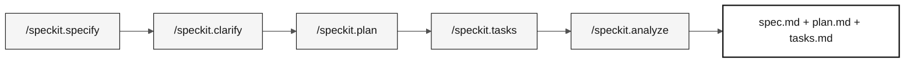

# Estágio 2 — Especificação (60 min)

> **Trilha:** [Kit do Time](../README.md) › [Estágio 2](README.md) › **GUIDE**

**Este guia conduz a Dupla 2, passo a passo, pela criação dos artefatos do Spec-Kit: requisitos EARS rastreáveis, um plano técnico e tarefas implementáveis, desde o início até o handoff H2.**

  

| Campo | Valor |
|---|---|
| **Público-alvo** | Dupla 2 (Enterprise Architect + Software Architect); a Dupla 1 valida o escopo; a Dupla 5 revisa a clareza |
| **Pré-requisitos** | Handoff H1 aceito; programas `.NSN` legados e DDMs lidos |
| **Tempo estimado** | 60 min |
| **Estágio** | Estágio 2 — Especificação |
| **Resultado esperado** | `specs/<NNN>-<feature>/spec.md`, `plan.md` e `tasks.md` com rastreabilidade completa |

---

## Conceito: desenvolvimento guiado por especificação

O Spec-Driven Development (SDD), ou desenvolvimento guiado por especificação, é a prática de escrever a especificação da feature, os requisitos, o plano técnico e as tarefas antes de escrever qualquer código. O objetivo é garantir que todas as pessoas do time entendam o que deve ser construído, por quê e como verificar se foi construído corretamente.

No SIFAP, isso significa que, antes de criar o endpoint de cálculo de benefício, o time documenta exatamente qual regra do programa `.NSN` original será modernizada, os critérios de aceitação e os testes que validam o comportamento.

O GitHub Spec-Kit automatiza esse fluxo com comandos de barra no GitHub Copilot.

### Fluxo do Spec-Kit



---

## Regra de localização dos artefatos

Os entregáveis formais do GitHub Spec-Kit ficam exclusivamente em:

```text
specs/<NNN>-<feature>/
├── spec.md
├── plan.md
└── tasks.md
```

O `spec.md` contém os requisitos EARS, o `plan.md` registra o plano técnico e o `tasks.md` ordena o trabalho implementável. Não crie arquivos paralelos com nomes legados em `02-modern-spec/`.

`02-modern-spec/` contém o material de apoio do estágio. Seus templates e o [`scope-decisions.md`](scope-decisions.md) registram decisões de escopo, trade-offs e referências para a conversa. Eles não substituem os três artefatos formais da feature.

> [!CAUTION]
> **GATE OBRIGATÓRIO de rastreabilidade.** Antes de redigir qualquer requisito EARS, leia o membro Natural ou DDM que o sustenta. Cada REQ-ID em `specs/<NNN>-<feature>/spec.md` precisa de uma linha `source_legacy:` que aponte para um membro Natural válido (`.NSP`, `.NSN`, `.NSA`, `.NSL`, `.NSC` ou `.jcl`) ou para um artefato Adabas válido (`.ddm` ou `.txt`) em `01-archaeology/legacy-sifap/`. Uma capacidade sem equivalente no legado usa `[GREENFIELD]` com uma justificativa. Sem isso, a CI rejeita o PR.

---

## Conceito: notação EARS

EARS (Easy Approach to Requirements Syntax) é uma notação estruturada para escrever requisitos de software sem ambiguidade. Cada requisito começa com uma palavra-chave que classifica o tipo de comportamento.

**Por que isso importa:** requisitos em linguagem natural são ambíguos. "O sistema SHALL calcular o benefício" não informa quando, para quem nem o que acontece em caso de falha. A notação EARS remove essa ambiguidade.

**Os cinco padrões EARS:**

| Padrão | Palavra-chave | Estrutura | Exemplo do SIFAP |
|---|---|---|---|
| **Ubíquo** | (nenhuma) | O `<sistema>` SHALL `<ação>`. | O sistema SHALL registrar a data e a hora de cada alteração de benefício. |
| **Orientado a evento** | Quando | Quando `<evento>`, o `<sistema>` SHALL `<ação>`. | Quando o pagamento for processado, o sistema SHALL emitir um recibo. |
| **Orientado a estado** | Enquanto | Enquanto `<estado>`, o `<sistema>` SHALL `<ação>`. | Enquanto o beneficiário estiver com status suspenso, o sistema SHALL bloquear pagamentos. |
| **Comportamento indesejado** | Se / Então | Se `<condição>`, então o `<sistema>` SHALL `<ação de tratamento>`. | Se o CPF informado não existir no banco de dados, então o sistema SHALL retornar HTTP 422 com uma mensagem de erro. |
| **Feature opcional** | Onde | Onde `<feature está ativa>`, o `<sistema>` SHALL `<ação>`. | Onde a auditoria avançada estiver habilitada, o sistema SHALL registrar o endereço IP de cada acesso. |

**REQ-ID:** cada requisito recebe um identificador único no formato `REQ-NNN` (por exemplo, `REQ-001`). Esse ID aparece em commits (`Implements REQ-001`), PRs e testes para rastrear o comportamento do código até a especificação.

---

## Conceito: ADR (Architecture Decision Record)

Uma ADR é um documento curto que registra uma decisão de arquitetura: a opção escolhida, as alternativas consideradas e a justificativa. Uma ADR não é burocracia; é memória institucional. Sem ela, em seis meses ninguém se lembrará por que o PostgreSQL foi escolhido em vez do MongoDB.

**Quando criar uma ADR no Estágio 2:** somente quando uma decisão bloquear o `plan.md`. Use o template em [`templates/ADR.template.md`](templates/ADR.template.md) ou execute `/generate-adr` no GitHub Copilot.

**Erro comum:** criar ADRs para decisões óbvias ou já documentadas em outro lugar. Se a decisão couber em um comentário de commit, ela não precisa de uma ADR.

---

## Conceito: bounded context

Um bounded context é uma fronteira explícita dentro da qual um modelo de domínio é válido e consistente. É o conceito central do Domain-Driven Design que permite dividir um sistema grande em partes menores e coesas.

**No SIFAP:** o módulo de pagamentos tem suas próprias regras, entidades e vocabulário. O módulo de fiscalização também. Quando os dois precisam se comunicar, fazem isso por uma interface bem definida, em vez de compartilhar tabelas ou objetos internos.

**Para a imersão:** use `/carve-bounded-contexts` no GitHub Copilot e preencha [`templates/bounded-contexts.template.md`](templates/bounded-contexts.template.md) como referência para o `plan.md`.

---

## Cronograma

| Horário | Atividade | Saída |
|---|---|---|
| 14:00–14:05 | Confirmar as evidências do handoff H1 e selecionar uma feature fina. | Nome `NNN-<feature>` e escopo aprovado pelo PO. |
| 14:05–14:25 | Executar `/speckit.specify` e `/speckit.clarify`. | `specs/<NNN>-<feature>/spec.md` com requisitos rastreáveis. |
| 14:25–14:40 | Executar `/speckit.plan`. | `plan.md` com as decisões e os riscos necessários para a implementação. |
| 14:40–14:50 | Executar `/speckit.tasks`. | `tasks.md` priorizado, incluindo testes das regras de negócio. |
| 14:50–14:55 | Executar `/speckit.analyze` e corrigir lacunas bloqueantes. | Referências e artefatos consistentes. |
| 14:55–15:00 | Fazer o handoff H2. | Escopo, arquivos formais e primeira tarefa para as Duplas 3 e 4. |

> [!WARNING]
> Se uma etapa consumir o tempo disponível, reduza a feature. Não preencha requisitos, contratos, arquitetura nem critérios de aceitação com base em suposições.

---

## Passo a passo

- [ ] **Confirme as evidências.** Releia os achados registrados no Estágio 1 antes de selecionar a feature.
- [ ] **Nomeie a pasta.** Crie `specs/<NNN>-<feature>/` com um nome que represente o comportamento, não a solução técnica.
- [ ] **Execute `/speckit.specify`.** Gere o `spec.md` com REQ-IDs, padrões EARS e `source_legacy:`.
- [ ] **Execute `/speckit.clarify`.** Resolva as ambiguidades antes do planejamento.
- [ ] **Execute `/speckit.plan`.** Documente arquitetura, dados, riscos e contratos no `plan.md`.
- [ ] **Execute `/speckit.tasks`.** Divida o plano em tarefas pequenas com testes no `tasks.md`.
- [ ] **Execute `/speckit.analyze`.** Corrija lacunas entre a spec, o plano e as tarefas.
- [ ] **Registre as decisões de escopo.** Preencha [`scope-decisions.md`](scope-decisions.md) com o que foi selecionado, adiado ou marcado como greenfield.
- [ ] **Faça o handoff H2.** Apresente ao vivo para as Duplas 3 e 4 (veja abaixo).

---

## Apoio e decisões de escopo

- Registre o que foi selecionado, adiado ou marcado como greenfield em [`scope-decisions.md`](scope-decisions.md), vinculando a decisão à pasta em `specs/`.
- Use [`ADR-TEMPLATE.md`](ADR-TEMPLATE.md) somente para uma decisão que bloqueia o plano. O estágio não tem meta de quantidade de ADRs.
- Um esboço ou diagrama de contexto pode apoiar a conversa, mas C4 L1/L2/L3 e uma arquitetura completa não são pré-requisitos para o handoff H2. A justificativa técnica necessária pertence ao `plan.md`.

---

## Handoff H2

A Dupla 2 apresenta ao vivo para as Duplas 3 e 4:

1. O caminho da pasta `specs/<NNN>-<feature>/`.
2. A feature selecionada, os requisitos e suas entradas `source_legacy:`.
3. A primeira tarefa implementável e os testes esperados.
4. Os riscos, as decisões de escopo e as questões que ainda precisam de respostas.

---

## Critérios de conclusão

- [ ] Uma feature pequena tem `spec.md`, `plan.md` e `tasks.md` em `specs/<NNN>-<feature>/`.
- [ ] Cada requisito tem um `source_legacy:` válido ou um `[GREENFIELD]` justificado.
- [ ] O `tasks.md` inclui testes junto com a implementação das regras de negócio.
- [ ] As decisões de escopo estão registradas em `02-modern-spec/`.
- [ ] O PO confirmou o escopo e o handoff H2 ocorreu até as 15:00.

---

## Erros comuns e como evitá-los

| Sintoma | Causa | Correção |
|---|---|---|
| `source_legacy:` ausente no `spec.md` | Requisito escrito sem consultar o sistema legado | Releia o programa `.NSN` correspondente antes de escrever o requisito EARS |
| O `spec.md` contém requisitos vagos ("o sistema SHALL funcionar corretamente") | A notação EARS não foi usada | Reescreva com um dos cinco padrões EARS |
| `plan.md` vazio ou copiado de outro projeto | Plano baseado em suposições | Execute `/speckit.plan` com o contexto real da feature |
| ADR criada para cada decisão | Confusão entre uma ADR e um comentário de código | Reserve ADRs para decisões que bloqueariam o plano sem um registro |
| A CI rejeita o PR | `source_legacy:` ausente ou inválido | Corrija o caminho para o arquivo `.NSN` ou `.ddm` correspondente |

---

## Referências

- [Cartão de referência do Spec-Kit](../09-cheat-sheets/spec-kit-workflow.md)
- [Notação EARS](../07-concepts/05-ears-notation.md)
- [Registros de decisão de arquitetura](../07-concepts/06-architecture-decision-records.md)
- [Spec-Kit oficial](https://github.com/github/spec-kit)
- [Sistema legado SIFAP](../01-archaeology/legacy-sifap/)

---

### Continue lendo

| Anterior | Próximo |
|---|---|
| [Estágio 1 — Arqueologia](../01-archaeology/README.md)<br/><sub>Resumo da arqueologia e links para o GUIDE detalhado.</sub> | [Estágio 3 — Implementação](../03-implementation/GUIDE.md)<br/><sub>15:00–16:10 · Java 21 + Spring Boot + Next.js, com testes.</sub> |

<sub>[Voltar ao índice do kit](../README.md)</sub>
