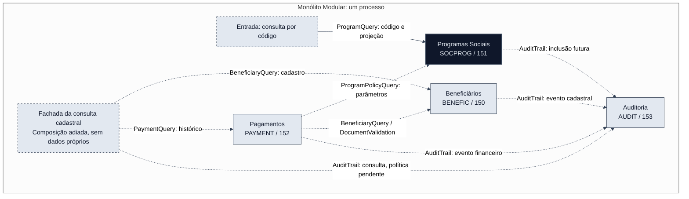

# Mapa de contextos delimitados

> **Trilha:** [Kit do Time](../README.md) > [Estágio 2](README.md) > **Contextos delimitados**

**Quatro contextos delimitados organizam o destino do SIFAP em um Monólito Modular, sem ampliar a fatia aprovada de consulta de programa por código.**

| Campo | Valor |
|---|---|
| Público-alvo | paula, acumulando os papéis de arquitetura, requisitos e implementação |
| Pré-requisitos | [Relatório de descoberta](../01-archaeology/discovery-report.md), catálogo de regras e mapa de dependências |
| Estágio | Estágio 2: especificação |
| Decisão | Aceita por paula em 2026-09-17 |
| Resultado esperado | Responsabilidades, propriedade lógica dos dados e comunicação entre quatro contextos |

**Registro do aceite:** paula respondeu "sim" à recomendação de Beneficiários, Programas Sociais, Pagamentos e Auditoria. O aceite abrange os limites recomendados e a propriedade lógica dos dados. Não aprova automaticamente regras controversas, contratos executáveis, schema físico ou a conclusão do H2.

O [ADR-0003](../docs/adr/0003-sifap-bounded-contexts.md) registra esta decisão, suas alternativas e consequências. As [decisões de escopo](scope-decisions.md) mantêm o recorte e as pendências para a especificação.

Um contexto delimitado é uma fronteira dentro da qual os termos, as regras e os dados têm responsabilidades coerentes. No SIFAP, separar os parâmetros de um programa social dos pagamentos que os consomem permite localizar a consulta atual sem transformar cada programa Natural em um módulo. Use este mapa para posicionar futuras tarefas; não o interprete como autorização para implementar todos os contextos.

## Critérios de avaliação

| Critério | Interpretação de High / Medium / Low | Evidência utilizada |
|---|---|---|
| Coesão | High: mesma capacidade e invariantes; Medium: capacidades relacionadas; Low: agrupamento principalmente técnico ou por apresentação | [Catálogo de regras](../01-archaeology/business-rules-catalog.md) e [glossário](../01-archaeology/glossary.md) |
| Acoplamento | High: dependência relevante de contratos externos ou dados com responsabilidade disputada; Medium: dependências delimitáveis; Low: pouca dependência externa observada | [Arestas do legado](../01-archaeology/dependency-map.md) |
| Frequência de mudança | High / Medium / Low indicam a propensão estimada a mudar em conjunto, não alterações por período | Nomes, chamadas, contratos e dados compartilhados |

Não foi medido histórico de mudanças conjuntas. As classificações do terceiro critério são aproximações estruturais, não estatísticas. Os três itens classificados como confirmados no catálogo têm corroboração documental restrita; os demais comportamentos não se tornam regras aprovadas por participarem desta análise.

### Contagem das dependências

A unidade de contagem é a aresta estática do [mapa](../01-archaeology/dependency-map.md), não o número de execuções. Cada hipótese contém os membros listados no relatório. As áreas, os copycodes e os JCLs ficam fora desses agrupamentos nesta contagem; sua destinação moderna aparece adiante.

| Hipótese original | CALLNAT externas, entrada / saída | INCLUDE + USING para apoio | Arestas diretas para DDMs |
|---|---|---|---|
| Cadastro e programas | 0 / 3 | 7 | 7 |
| Elegibilidade e determinação de valores | 8 / 0 | 9 | 5 |
| Ciclo de pagamentos | 0 / 4 | 10 | 14 |
| Consulta e prestação de informações | 0 / 1 | 6 | 8 |

Das nove CALLNAT, oito cruzam hipóteses; cada uma aparece na entrada de um agrupamento e na saída de outro. A chamada de VALDOCS para SUBVALNI é a única interna. As 32 dependências de apoio correspondem a nove INCLUDE e 23 USING. As 34 arestas diretas para DDMs, somadas às duas originadas no copycode CCAUDIT, recompõem as 36 do mapa. Há ainda três entradas por JCL: uma no ciclo de pagamentos e duas nos relatórios.

As arestas de dados agrupam instruções por origem, DDM e operação. Não são todas chamadas entre contextos modernos: as hipóteses ainda não tinham proprietários exclusivos para os dados. INCLUDE/USING indicam dependência de compilação ou contrato, e não chamadas em execução. O placar considera essas diferenças e o risco de persistência compartilhada, não somente a quantidade de CALLNAT.

## Avaliação das hipóteses

### Cadastro e programas: REJEITADA como contexto único

**Membros:** CADBENEF, CADDEPEN e CADPROG. **DDMs relacionados no relatório:** BENEFIC, SOCPROG e AUDIT.

| Critério | Avaliação | Justificativa |
|---|---|---|
| Coesão | Medium | Titular e dependentes compartilham o cadastro; identificação e parametrização de programas são outra responsabilidade. O prefixo CAD não demonstra uma capacidade única. |
| Acoplamento | Medium | Três chamadas saem para validação e sete dependências alcançam apoio. As sete arestas diretas de dados distinguem escrita de BENEFIC por CADBENEF/CADDEPEN e de SOCPROG por CADPROG. |
| Frequência de mudança | Medium | Cadastro e dependentes tendem a mudar juntos; não há chamada direta observada entre eles e CADPROG que sustente a mesma conclusão para programas. |

**Decisão aceita:** separar Beneficiários de Programas Sociais; o registro da trilha pertence a Auditoria. A consulta de [CADPROG](../01-archaeology/legacy-sifap/natural-programs/CADPROG.NSP#L156) encontra SOCPROG pelo código e apresenta seis campos, sem consultar BENEFIC. Os acessos cadastrais estão nas arestas D12 a D18 do mapa. A rejeição é do agrupamento único, não das capacidades.

### Elegibilidade e determinação de valores: REJEITADA como contexto único

**Membros:** VALBENEF, VALDOCS, VALELEG, CALCBENF, SUBVALCP e SUBVALNI. **DDMs relacionados:** BENEFIC, SOCPROG e PAYMENT.

| Critério | Avaliação | Justificativa |
|---|---|---|
| Coesão | Low | A validação cadastral responde pela qualidade da identificação; a elegibilidade para pagamento e a determinação de valores participam da decisão financeira. |
| Acoplamento | High | Oito chamadas entram de outros agrupamentos. CALCBENF grava PAYMENT, assim como seu chamador BATCHPGT. VALBENEF e VALDOCS declaram views, mas não possuem operações de dados no mapa. |
| Frequência de mudança | Medium | Há contratos comuns dentro da validação e dentro do cálculo, mas isso não demonstra mudança conjunta de toda a hipótese. |

**Decisão aceita:** validação cadastral em Beneficiários; elegibilidade para pagamento e cálculo em Pagamentos. Os parâmetros de programa são publicados por Programas Sociais. As escritas de [CALCBENF](../01-archaeology/legacy-sifap/natural-programs/CALCBENF.NSN#L319) e [BATCHPGT](../01-archaeology/legacy-sifap/natural-programs/BATCHPGT.NSP#L488) ficam sob uma responsabilidade financeira no destino. Qual escritor numera, qual fórmula prevalece e quando ocorre o commit continuam questões abertas.

### Ciclo de pagamentos: ACEITA com composição ajustada

**Membros originais:** BATCHPGT, BATCHCON, CALCDSCT e CALCCORR. **DDMs relacionados:** PAYMENT, BENEFIC, SOCPROG e AUDIT.

| Critério | Avaliação | Justificativa |
|---|---|---|
| Coesão | High | Geração, descontos, correções e conciliação tratam o ciclo financeiro e os valores do pagamento. |
| Acoplamento | High | Quatro chamadas saem para a hipótese de validação/cálculo; há dez dependências de apoio e 14 arestas diretas de dados, incluindo auditoria. |
| Frequência de mudança | High | Competência, valores, situação e contratos da cadeia sugerem impacto conjunto. Isso não comprova uma cadência histórica de alteração. |

**Decisão aceita:** manter Pagamentos e incorporar VALELEG, CALCBENF, BATCHREL e RELPGT. Cálculo e relatórios financeiros passam a acompanhar o proprietário de PAYMENT. A cadeia de [BATCHPGT](../01-archaeology/legacy-sifap/natural-programs/BATCHPGT.NSP#L369) sustenta a aproximação com elegibilidade e cálculo. CALCDSCT permanece uma capacidade com entrada própria: não foi encontrada CALLNAT para ele, portanto não foi inventada uma chamada no desenho.

### Consulta e prestação de informações: REJEITADA como contexto único

**Membros:** CONSBENF, BATCHREL, RELPGT e RELAUDIT. **DDMs relacionados:** BENEFIC, PAYMENT e AUDIT.

| Critério | Avaliação | Justificativa |
|---|---|---|
| Coesão | Low | Exibir informações não define um modelo único: cadastro, demonstrativos financeiros e trilha de auditoria têm vocabulários e filtros distintos. |
| Acoplamento | High | Mesmo com uma CALLNAT externa, há oito arestas diretas de leitura em três DDMs e seis dependências de apoio. CONSBENF também registra auditoria via copycode. |
| Frequência de mudança | Low | Não há chamadas entre os quatro membros; formato de saída semelhante não comprova mudança conjunta de suas regras. |

**Decisão aceita:** consulta cadastral associada a Beneficiários, relatórios financeiros em Pagamentos e relatório da trilha em Auditoria. O histórico financeiro de [CONSBENF](../01-archaeology/legacy-sifap/natural-programs/CONSBENF.NSP#L271) será composto por interfaces, não por acesso de Beneficiários ao repositório de Pagamentos. A consulta da trilha em [RELAUDIT](../01-archaeology/legacy-sifap/natural-programs/RELAUDIT.NSP#L111) não cria um contexto genérico de relatórios.

## Contextos delimitados finais

Os quatro nomes abaixo foram aceitos por paula. A propriedade é lógica e exclusiva no destino: um DDM relacionado a vários programas legados não autoriza vários módulos modernos a escrever os mesmos dados. Tabelas PostgreSQL, migração física e contratos REST serão definidos nos artefatos formais da fatia.

As assinaturas são **contratos de desenho**, não código implementado nem requisitos EARS aprovados. Os tipos representam dados de entrada e saída, sem entidades de persistência compartilhadas. Operações além de `ProgramQuery.findByCode` estão adiadas.

### Beneficiários

- **Responsabilidade:** cadastro de titulares e dependentes, identificação, validação cadastral e consulta dos dados cadastrais.
- **Dados próprios:** BENEFIC/150, incluindo dependentes e os indicadores cadastrais existentes. Ser proprietário de um indicador não resolve quem o preenche no legado.
- **Interface pública:** `BeneficiaryQuery.findByCpf(Cpf): Optional<BeneficiarySnapshot>`; `DocumentValidation.validate(DocumentInput): ValidationResult`.
- **Dados publicados:** identificação e atributos necessários ao caso de uso consumidor, por DTOs específicos. O snapshot para decisão financeira pode incluir situação, nascimento, programa, região, renda, dependentes e indicadores documentais; não é uma exportação de todo BENEFIC.
- **Membros de origem:** CADBENEF, CADDEPEN, VALBENEF, VALDOCS, SUBVALCP e SUBVALNI; parte cadastral de CONSBENF. CCVALCPF e PDAVALID sustentam a leitura dos contratos de validação.
- **Motivo para ser separado:** cadastro e dependentes compartilham dados e invariantes; validação cadastral não determina, por si só, o direito a um pagamento.
- **Limite:** a divergência entre validadores de CPF/NIS continua aberta. Não será criada uma implementação canônica por mera escolha de módulo.

Evidência: [cadastro](../01-archaeology/legacy-sifap/natural-programs/CADBENEF.NSP#L271), [dependentes](../01-archaeology/legacy-sifap/natural-programs/CADDEPEN.NSP#L191) e [contratos de validação](../01-archaeology/business-rules-catalog.md#o-contrato-da-família-de-validação).

### Programas Sociais

- **Responsabilidade:** identificação, consulta e manutenção dos parâmetros dos programas sociais. Somente a consulta por código participa da fatia atual.
- **Dados próprios:** SOCPROG/151, incluindo identificação, parâmetros e faixas. Não possui cadastro de beneficiários nem pagamentos.
- **Interface pública da fatia:** `ProgramQuery.findByCode(ProgramCode): Optional<ProgramDetails>`.
- **Projeção da fatia:** `ProgramDetails` contém código, nome, tipo, valor-base, código de elegibilidade e situação, correspondentes a `COD-PROGRAM`, `NAME-PROGRAM`, `TYPE-PROGRAM`, `AMT-BASE-INDIVIDUAL`, `COD-ELIGIBILITY` e `STAT-PROGRAM`.
- **Interface futura para consumidores financeiros:** `ProgramPolicyQuery.findParameters(ProgramCode): Optional<ProgramParameters>`. Não se amplia a resposta da consulta atual para expor todos os parâmetros.
- **Membro de origem:** CADPROG. As leituras de SOCPROG por BATCHPGT, VALELEG e CALCBENF são consumidores da futura interface, não coproprietários dos dados.
- **Motivo para ser separado:** a consulta e a manutenção do catálogo de programas têm identidade própria; pagamentos consomem seus parâmetros, sem controlar sua persistência.
- **Limite:** parâmetros não equivalem a fórmulas aprovadas. O fator K, a base ajustada e as divergências de elegibilidade não são resolvidos neste mapa.

Evidência: [consulta e projeção](../01-archaeology/legacy-sifap/natural-programs/CADPROG.NSP#L156) e [estrutura de SOCPROG](../01-archaeology/data-map.md#estruturas-de-socprog). O legado recebe código N4 e o formata com `EM=9999` para a chave A4; normalização, validação e resposta moderna para ausência exigem especificação e caracterização. A projeção preserva o valor-base armazenado, sem recalculá-lo.

### Pagamentos

- **Responsabilidade:** elegibilidade para pagamento, cálculo, geração por competência, descontos, correções, conciliação e relatórios financeiros.
- **Dados próprios:** PAYMENT/152, incluindo valores, descontos, situação e dados de conciliação. CPF e código de programa são referências, não propriedade de BENEFIC ou SOCPROG.
- **Interface pública:** `PaymentQuery.findByBeneficiary(Cpf, PaymentFilter): PaymentHistory`; `PaymentCycle.execute(Competence): CycleResult`; `PaymentReconciliation.reconcile(BankReturnBatch): ReconciliationResult`.
- **Dados publicados:** histórico filtrado e resultados do processamento financeiro. Ordenação, limites e significado das situações ainda dependem da especificação de cada capacidade.
- **Membros de origem:** BATCHPGT, BATCHCON, CALCDSCT, CALCCORR, CALCBENF, VALELEG, BATCHREL e RELPGT. PDACALC documenta contratos da cadeia; os JCLs representam entradas operacionais.
- **Motivo para ser separado:** aproxima as capacidades que afetam a consistência financeira e mantém sob um proprietário a responsabilidade por PAYMENT.
- **Limite:** elegibilidade aplica dados cadastrais e parâmetros publicados pelos respectivos proprietários. A consolidação do módulo não autoriza alterar algoritmos, eliminar escritas, definir numeração ou mudar transações sem decisão e testes de equivalência.

Evidência: [cadeia de cálculo](../01-archaeology/legacy-sifap/natural-programs/BATCHPGT.NSP#L369), [conciliação](../01-archaeology/legacy-sifap/natural-programs/BATCHCON.NSP#L169) e [estrutura de PAYMENT](../01-archaeology/data-map.md#estruturas-de-payment).

### Auditoria

- **Responsabilidade:** registro e consulta da trilha de eventos, com seu vocabulário de ações, entidades e filtros.
- **Dados próprios:** AUDIT/153. A posse da trilha não transfere para Auditoria os registros de beneficiários, programas ou pagamentos referenciados por um evento.
- **Interface pública:** `AuditTrail.record(AuditEntry): AuditReceipt`; `AuditQuery.search(AuditFilter): AuditPage`.
- **Dados trocados:** ação, tipo e chave da entidade, origem do evento e conteúdo de auditoria necessário ao caso de uso; retorno com identificação do registro. O contrato de consulta recebe filtros e devolve uma projeção da trilha.
- **Origens:** CCAUDIT e RELAUDIT, além da responsabilidade de registro das rotinas locais de auditoria em BATCHCON. A decisão de quando auditar continua no caso de uso produtor.
- **Motivo para ser separado:** a trilha tem identidade, dados e regras de consulta próprios; o compartilhamento do copycode não justifica acesso irrestrito ao repositório de AUDIT.
- **Limite:** sem nova política de retenção, ações CO/CN/DV/EX, precisão temporal ou cobertura de antes/depois. A escolha do contexto não resolve essas questões nem transforma auditoria em log técnico.

Evidência: [registro compartilhado](../01-archaeology/legacy-sifap/natural-programs/CCAUDIT.NSC#L60), [registro local da conciliação](../01-archaeology/legacy-sifap/natural-programs/BATCHCON.NSP#L311) e [estrutura de AUDIT](../01-archaeology/data-map.md#estruturas-de-audit).

### Elementos que não são novos contextos

| Elemento | Destinação no desenho |
|---|---|
| Consulta cadastral com histórico financeiro | Fachada de aplicação que compõe `BeneficiaryQuery` e `PaymentQuery`. As regras cadastrais permanecem em Beneficiários e as financeiras em Pagamentos. A fachada não possui tabelas nem constitui um quinto contexto. |
| CCVALCPF e PDAVALID | Apoio à identificação dos contratos de Beneficiários; não constituem uma autoridade automática sobre o algoritmo a preservar. |
| PDACALC | Evidência do contrato de cálculo em Pagamentos, não uma entidade global compartilhada. |
| LDASIFAP | Inventário de parâmetros a atribuir ao proprietário da regra quando cada capacidade for especificada. Não copiar toda a área para um kernel compartilhado. |
| SIFAPJ01 e SIFAPJ02 | Entradas operacionais de folha e relatórios. Modernizar o agendamento está fora da fatia atual. |
| Kernel compartilhado | Não há necessidade demonstrada na consulta atual. Futura adoção fica limitada a tipos imutáveis deliberadamente acordados, nunca entidades JPA, repositórios, fórmulas ou tabelas de parâmetros. |

## Comunicação entre contextos

Todas as interações abaixo são **chamadas em processo por interfaces públicas**, dentro de uma aplicação Spring Boot. Não há HTTP entre módulos, broker, microsserviço ou banco independente por contexto. Os módulos não importam entidades ou repositórios internos alheios e não fazem consultas diretas às tabelas de outro proprietário.

| De | Para | Interface e mecanismo | Dados trocados | Escopo |
|---|---|---|---|---|
| Entrada da consulta por código | Programas Sociais | Chamada em processo a `ProgramQuery.findByCode` | Código; seis campos da projeção ou ausência | Fatia atual; não cruza outro contexto |
| Pagamentos | Beneficiários | Chamada em processo a `BeneficiaryQuery` e, quando necessário, `DocumentValidation` | Identificação, atributos necessários à decisão e diagnóstico documental | Adiado |
| Pagamentos | Programas Sociais | Chamada em processo a `ProgramPolicyQuery` | Código de programa e parâmetros necessários à decisão financeira | Adiado |
| Beneficiários | Auditoria | Chamada em processo a `AuditTrail.record` | Ação e referência do cadastro/dependente, origem e conteúdo do evento | Adiado; política do caso de uso ainda a especificar |
| Programas Sociais | Auditoria | Chamada em processo a `AuditTrail.record` | Evento de inclusão do programa e sua referência | Adiado; não faz parte da consulta por código |
| Pagamentos | Auditoria | Chamada em processo a `AuditTrail.record` | Eventos financeiros, identificação do pagamento/ciclo e dados pertinentes | Adiado; sem redefinir transações |
| Fachada da consulta cadastral | Beneficiários e Pagamentos | Composição em processo de `BeneficiaryQuery` e `PaymentQuery` | Chave de consulta, dados cadastrais e histórico financeiro | Adiado; evita dependência circular entre os domínios |
| Fachada da consulta cadastral | Auditoria | Chamada em processo a `AuditTrail.record`, sujeita ao contrato do caso de uso | Referência e origem da consulta | Adiado; a política CO permanece aberta |

As setas representam a direção da chamada; a resposta retorna pela mesma interface. Eventos de domínio não foram escolhidos como mecanismo nesta decisão. `AuditEntry` é uma entrada de registro, não uma promessa de entrega assíncrona. Atomicidade entre escrita de negócio e auditoria, momento do registro e tratamento de falhas precisam ser decididos antes de implementar os respectivos casos de uso.

A fachada é composição de aplicação, sem retorno de Pagamentos para Beneficiários por chamada inversa. As interfaces publicam os dados necessários ao consumidor, sem expor uma entidade persistida completa. CPF e valores de benefícios não pertencem a logs técnicos.

## Diagrama Mermaid do mapa de contextos

Linha contínua: caminho da fatia atual. Linhas tracejadas: desenho das capacidades adiadas, não integrações implementadas. A entrada e a fachada são elementos de aplicação, não contextos adicionais. A paleta segue os valores solicitados pelo comando: `#0f172a`, `#334155` e `#e2e8f0`.

## Escopo e verificações

O recorte continua sendo o ramo C de CADPROG: consulta por código dos seis campos já apresentados pelo legado. Inclusão/alteração, regras financeiras, folha, conciliação, migração física e mudanças de política de auditoria permanecem adiadas. O corpo de consulta não chama auditoria; isso não comprova uma política organizacional de dispensa de auditoria.

**Hipótese local verificável:** o caminho de consulta cabe em Programas Sociais sem comunicação com outro contexto. A conferência do despacho para `QUERY-PROG` e do corpo da rotina sustenta esse limite. Uma chamada adicional ou acesso a BENEFIC/PAYMENT/AUDIT nesse caminho o refutaria. As dependências de inclusão do programa inteiro não foram confundidas com execução nesse ramo.

- [x] Quatro hipóteses avaliadas por coesão, acoplamento e aproximação de mudança conjunta.
- [x] Rejeições e ajuste da hipótese de pagamentos registrados com justificativas e fontes.
- [x] Aceite de paula registrado para quatro nomes e suas responsabilidades.
- [x] Cada DDM tem um proprietário lógico no destino; não foram criadas tabelas nem migrações.
- [x] Interfaces de desenho, direção das chamadas e dados trocados documentados.
- [x] Diagrama Mermaid incluído com o caminho atual separado das capacidades adiadas.
- [ ] Renderização visual do Mermaid conferida.
- [ ] Contratos executáveis, requisitos EARS e cenários de caracterização definidos nos artefatos Spec-Kit da fatia.

As fontes legadas permanecem somente para leitura. Não foram executados programas Natural, testes de equivalência ou inspeção de banco. A ausência de renderizador e executor de comandos nesta sessão impede afirmar validação visual, markdownlint ou CI; diagnósticos do editor não substituem essas verificações.

### Continue lendo

| Anterior | Próximo |
|---|---|
| [Relatório de descoberta](../01-archaeology/discovery-report.md) | [Decisões de escopo](scope-decisions.md) |

[Voltar ao índice do kit](../README.md)
