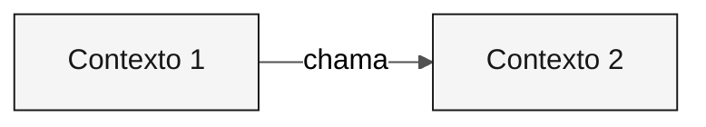

---

title: "Template: Bounded Contexts"
description: "Estrutura para definições de bounded contexts por meio de /carve-bounded-contexts"
author: "Paula Silva, Engenheira de Software AI-Native, Americas Global Black Belt na Microsoft"
date: "2026-04-29"
version: "1.0.0"
status: "approved"
tags: ["template", "bounded-contexts", "architect", "stage-2"]
---

<!-- Como usar: execute /carve-bounded-contexts. Duplique o bloco de contexto para cada contexto. -->

# Mapa de bounded contexts

 

> **Trilha:** [Kit do Time](../../README.md) › [Estágio 2](../README.md) › Templates › **bounded-contexts**

> [!NOTE]
> Este arquivo é um TEMPLATE. Copie-o para o repositório do seu time e preencha a cópia com dados reais. Não edite o original.

---

## Conceito: bounded context

Um bounded context é uma fronteira explícita dentro da qual um modelo de domínio é válido e consistente. O termo vem do Domain-Driven Design (DDD) e fornece a base para definir os módulos de um Monólito Modular.

**Por que isso importa:** no SIFAP, o módulo de pagamentos usa o termo "beneficiário" de uma forma, enquanto o módulo de fiscalização pode usar o mesmo termo com regras diferentes. Definir bounded contexts evita que um único modelo seja distorcido para atender a todos os contextos ao mesmo tempo, o que causa acoplamento indesejado e dificulta a evolução.

**Monólito Modular:** arquitetura na qual os bounded contexts são módulos Java independentes dentro de uma única JVM. Cada módulo tem suas próprias camadas (`domain/`, `application/`, `infrastructure/`) e se comunica com outros módulos somente por interfaces públicas definidas.

**Strangler Fig:** padrão de migração incremental no qual o sistema moderno cresce ao redor do sistema legado e substitui uma feature por vez. O SIFAP 2.0 não precisa substituir tudo de uma só vez. Cada bounded context pode ser modernizado de forma independente.

---

## Avaliações de hipóteses

### <!-- preencher: Nome --> — <!-- preencher: ACEITA / REJEITADA -->

| Critério | Avaliação | Evidência |
|---|---|---|
| Coesão | <!-- preencher --> | <!-- preencher --> |
| Acoplamento | <!-- preencher --> | <!-- preencher --> |
| Frequência de mudança | <!-- preencher --> | <!-- preencher --> |

---

## Bounded contexts finais

### <!-- preencher: Nome do contexto -->

| Campo | Valor |
|---|---|
| **Responsabilidade** | <!-- preencher --> |
| **Dados sob sua responsabilidade** | <!-- preencher --> |
| **Interface pública** | <!-- preencher --> |
| **Por que é um contexto próprio** | <!-- preencher --> |

---

## Comunicação entre contextos

| De | Para | Mecanismo | Dados |
|---|---|---|---|
| <!-- preencher --> | <!-- preencher --> | <!-- preencher --> | <!-- preencher --> |

---

> [!IMPORTANT]
> Definição de pronto: hipóteses avaliadas, rejeições documentadas, dois a cinco contextos nomeados e diagrama Mermaid renderizado sem erros.

---

### Continue lendo

| Anterior | Próximo |
|---|---|
| [GUIDE do Estágio 2](../GUIDE.md) Instruções passo a passo. | [Template de ADR](ADR.template.md) Template de ADR. |

[Voltar ao índice do kit](../../README.md)
