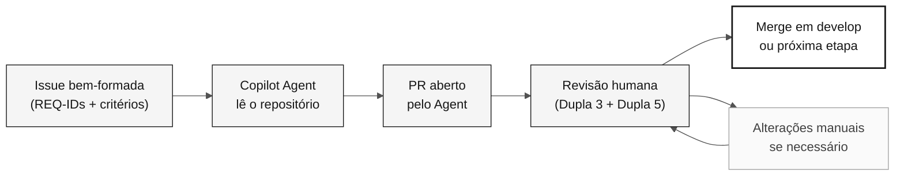

# Estágio 4 — Evolução com agentes (40 min)

> **Trilha:** [Kit do Time](../README.md) › [Estágio 4](README.md) › **GUIDE**

**Este guia conduz a Dupla 5 pelo experimento com o modo Agent do GitHub Copilot: escrever uma Issue bem-formada, delegá-la ao Agent, revisar o PR resultante e registrar evidências honestas do que funcionou.**

  

| Campo | Valor |
|---|---|
| **Público-alvo** | A Dupla 5 (DevOps + Tech Writer) lidera; a Dupla 3 colidera a revisão técnica |
| **Pré-requisitos** | Handoff H3 recebido; protótipo funcional do Estágio 3; comando de build conhecido |
| **Tempo estimado** | 40 min |
| **Estágio** | Estágio 4 — Evolução |
| **Resultado esperado** | Issue criada, delegação registrada e relatório de experiência preenchido |

> [!NOTE]
> Horário oficial: 16:10–16:50 em [`00-TEAM-FLOW.md`](../00-TEAM-FLOW.md). A Dupla 5 lidera, e a Dupla 3 colidera a revisão técnica.

---

## Conceito: modo Agent do GitHub Copilot

O modo Agent do GitHub Copilot oferece delegação autônoma. Você fornece uma Issue com contexto suficiente, e o Agent lê o repositório, escreve código, cria testes e abre um pull request.

**Por que isso importa:** o Agent não inventa requisitos. Ele lê o que você escreveu na Issue e no `spec.md`. Se a Issue for vaga, o PR será vago. Se a Issue for precisa, o PR poderá ser aprovado sem grandes alterações.

**Diferenças entre os modos do Copilot:**

| Modo | Quando usar | Controle humano |
|---|---|---|
| **Ask** | Perguntas, explicações e consultas específicas | Total |
| **Plan** | Planejar uma mudança antes da execução | Alto |
| **Agent** | Delegar com autonomia uma tarefa bem definida | Revisão após a execução |

**Ciclo Issue → Agent → PR → revisão:**

---

## Conceito: IaC com Terraform e CI/CD com GitHub Actions

O **Terraform** é a ferramenta de infraestrutura como código (IaC) usada nesta imersão. Ele descreve recursos do Azure (App Service, PostgreSQL e Key Vault) em arquivos `.tf` e os cria de forma repetível e auditável.

> [!CAUTION]
> Nunca execute `terraform apply` durante a imersão. Valide com `terraform plan` e documente o resultado. O provisionamento real da infraestrutura está fora do escopo da imersão.

O **GitHub Actions** é o mecanismo de CI/CD. Um pipeline bem configurado valida automaticamente cada PR: compila, testa, verifica a rastreabilidade (a presença de `source_legacy:`) e, opcionalmente, faz o deploy.

---

## Objetivo

Experimente uma delegação pequena e deixe evidências honestas do resultado. Este estágio não promete que um Agent abrirá um PR, que o Terraform será criado ou que ocorrerá um merge antes da demo.

---

## Conceito: fechar o arco com algo que o legado não conseguia fazer

Os Estágios 1 a 3 provam que o sistema moderno se comporta como o antigo. Isso é
necessário e não é o ponto. Uma migração que apenas reproduz o comportamento de
1997 gastou um dia para chegar onde a organização já estava.

O Estágio 4 acrescenta a metade que falta do argumento: **uma capacidade que o
sistema legado não conseguia oferecer**, entregue sobre evidência, no tempo que
resta.

| Estágio | Pergunta que responde | O que prova |
|---|---|---|
| 1 — Arqueologia | O que o sistema realmente faz? | O time lê evidência em vez de supor |
| 2 — Especificação | O que preservamos e o que mudamos deliberadamente? | O comportamento é rastreável até uma fonte |
| 3 — Implementação | O sistema novo se comporta como o antigo? | Equivalência sobre dados migrados |
| **4 — Evolução** | **O que agora é possível e antes não era?** | **A modernização comprou alguma coisa** |

A regra que mantém isso honesto: uma capacidade só é greenfield quando o time
consegue **apontar o que a impedia**. Uma tela fixa de 24x80, uma saída que só
existia em batch, um padrão de acesso por chave única, a largura de um campo —
uma restrição que alguém de fato leu no corpus. "Mainframes são antigos" não é
evidência, e o agente rejeita esse argumento.

O gate de rastreabilidade já sustenta isso. Um requisito sem equivalente no
legado é escrito como `source_legacy: [GREENFIELD]` **mais uma justificativa
escrita**; sem a justificativa, o CI rejeita o PR exatamente como faria com uma
fonte ausente. A válvula de escape é estreita de propósito.

> [!WARNING]
> Uma capacidade, deliberadamente pequena. Esta etapa nunca desloca a aceitação
> dos dados e nunca enfraquece um requisito ancorado no legado para caber no
> relógio. Uma capacidade que foi delimitada, escrita como requisito e
> explicitamente adiada é um resultado válido e honesto.

---

## Cronograma

| Horário | Atividade | Resultado |
|---|---|---|
| 16:10–16:15 | Receber o handoff H3, confirmar o build e escolher o item do Estágio 4: uma capacidade que o sistema legado não conseguia oferecer ou, quando nenhum candidato tiver uma restrição citável, um item pendente pequeno. | Escopo seguro para delegar ou registrar no backlog. |
| 16:15–16:25 | Delimitar o item com [`/greenfield-feature`](../.github/prompts/stage-evolution-greenfield-feature.prompt.md) quando for comportamento novo e, em seguida, escrever a Issue com contexto, REQ-IDs, caminho da feature, critérios verificáveis, itens fora do escopo e método de teste. | Requisito escrito; Issue criada ou rascunho pronto. |
| 16:25–16:35 | Delegar ao Copilot Agent, se disponível, e observar o status inicial. | Delegação registrada sem aguardar a implementação completa. |
| 16:35–16:45 | Se houver um PR, fazer a revisão humana. Caso contrário, registrar o status e preparar uma revisão após a imersão. | Comentários de revisão ou próxima etapa explícita. |
| 16:45–16:50 | Atualizar o relatório de experiência e informar o time para a demo. | Relato factual do que funcionou, falhou ou permanece pendente. |

Use [`../.github/prompts/stage-evolution-write-github-issue.prompt.md`](../.github/prompts/stage-evolution-write-github-issue.prompt.md) como checklist para o rascunho. Não peça ao Agent que invente requisitos, arquitetura, fontes legadas ou critérios de aceitação ausentes.

---

## Passo a passo

- [ ] **Receba o handoff H3.** Confirme o status do build e identifique um item pendente pequeno e bem delimitado.
- [ ] **Escolha o item do Estágio 4.** Prefira uma capacidade que o sistema legado não conseguia oferecer e cuja restrição bloqueadora o time consiga citar no corpus. Recorra a um item pendente quando nenhum candidato se qualificar.
- [ ] **Delimite primeiro um item greenfield.** Execute `/greenfield-feature` para reduzi-lo e escrever um `REQ-NNN` com `source_legacy: [GREENFIELD]` mais a justificativa que o gate de rastreabilidade exige.
- [ ] **Escreva a Issue.** Use o checklist em `.github/prompts/stage-evolution-write-github-issue.prompt.md`.
- [ ] **Verifique se a Issue inclui:** REQ-IDs com entradas `source_legacy:` existentes no `spec.md`, critérios de aceitação verificáveis, escopo limitado e um método de teste.
- [ ] **Delegue ao Copilot Agent.** Registre o horário de início e observe o status inicial.
- [ ] **Revise o PR**, se disponível, seguindo os critérios abaixo.
- [ ] **Registre o resultado** no relatório de experiência, independentemente do resultado.
- [ ] **Informe o time** sobre o status para a demo.

---

## Limites de escopo

> [!IMPORTANT]
> Estes limites garantem que a imersão termine com evidências reais, não com promessas.

- A Issue referencia `specs/<NNN>-<feature>/spec.md`, `plan.md` e `tasks.md` quando o item pendente vem de uma feature especificada.
- **No máximo uma** capacidade greenfield, deliberadamente pequena, com uma restrição legada citável e um requisito `[GREENFIELD]` justificado. Uma segunda vira issue de backlog.
- Um item greenfield nunca desloca a aceitação dos dados e nunca enfraquece um requisito ancorado no legado para caber no relógio.
- Toda branch `impl/<NNN>-<feature>` parte de `develop` e abre um PR para `develop`; não existe branch `stage`.
- Revise cada PR do Agent como um PR humano. Não faça merge automaticamente.
- CI/CD e Terraform são opcionais durante este intervalo. Valide ou documente o que já existe. Não crie infraestrutura apenas para cumprir uma meta.

> [!CAUTION]
> Nunca execute `terraform apply` durante a imersão.

---

## Revisão rápida do PR

Antes de aprovar um PR gerado pelo Agent, confirme:

- [ ] O escopo permanece limitado à Issue e aos REQ-IDs referenciados.
- [ ] Os requisitos e as entradas `source_legacy:` referenciados já existem no `spec.md`.
- [ ] Testes, validação de entrada e documentação foram tratados quando aplicável.
- [ ] Não há segredos, dependências sem uma decisão ou alterações fora do escopo.
- [ ] O PR tem `develop` como destino e recebeu revisão por pares.

---

## Critérios de conclusão

- [ ] Uma Issue pequena foi criada ou deixada como rascunho revisável.
- [ ] Se o item foi uma capacidade greenfield, seu `REQ-NNN` carrega `source_legacy: [GREENFIELD]` com uma justificativa que nomeia uma restrição legada citável; se foi adiado, o motivo está registrado.
- [ ] O resultado da delegação (PR, execução em andamento, falha ou indisponibilidade) foi registrado sem promessas.
- [ ] Um PR disponível recebeu revisão humana; se não houver PR, uma próxima etapa está registrada.
- [ ] O relatório de experiência foi preenchido.
- [ ] O status de CI/IaC foi comunicado para a demo sem executar `terraform apply`.

---

## Referências

- [Relatório de experiência do time](agent-experience-report.md)
- [Template do relatório](templates/agent-experience-report.template.md)
- [Agente de estágio @evolution](../06-stage-agents/04-evolution/README.md)
- [Cartão de referência: três modos do Copilot](../09-cheat-sheets/copilot-3-modes.md)

---

### Continue lendo

| Anterior | Próximo |
|---|---|
| [Estágio 3 — Implementação](../03-implementation/GUIDE.md) 15:00–16:10 · Java 21 + Spring Boot + Next.js, com testes. | [Relatório de experiência](agent-experience-report.md) Preencha-o ao final do estágio. |

[Voltar ao índice do kit](../README.md)
