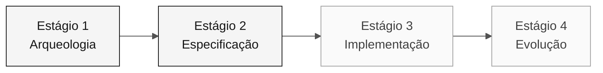

# Persona — Product Owner

> **Trilha:** [Kit do time](../../README.md) › [Personas](../OVERVIEW.md) › [Product Owner](README.md) › **PERSONA**

**Perfil completo da persona Product Owner.** Define a missão, as responsabilidades por estágio, as ferramentas, o handoff e as rubricas de avaliação.

| Campo | Valor |
|---|---|
| **Função** | Product Owner |
| **Dupla** | 1 · Visão (com Requirements Engineer) |
| **Estágios ativos** | Lidera o 1 (priorização) e o 2 (aprovação do escopo); apoia o 3 e o 4 |
| **Artefatos produzidos** | Glossário, lista priorizada, seção Escopo/Fora do escopo, Issues para o Agent |
| **Artefatos consumidos** | Catálogo de regras (Arqueologia), mapa de integrações (EA) |
| **Handoff para** | Dupla 2 (Arquitetura) no Estágio 1; Dupla 3 (Implementação) por meio da aprovação do escopo |

 

---

## Conceito

Product Owner é a pessoa responsável por traduzir as necessidades de negócio em um escopo executável. No setor de software, o PO define o "porquê", ou seja, qual problema o produto resolve, e decide o que entra e o que fica fora de cada ciclo de entrega.

Em uma modernização de legado como a do SIFAP (Sistema de Fiscalização e Administração de Pagamentos), essa função é ainda mais crítica. Sistemas com 29 anos acumulam regras implícitas que só fazem sentido quando alguém conhece seu histórico. O PO conecta cada decisão técnica a evidências e prioridades confirmadas. Sem essa atuação, o time corre o risco de modernizar código que não importa para o negócio.

**Exemplo concreto do SIFAP:** o programa `CALCBENF.NSN` calcula o valor do benefício por programa e faixa. O PO decide se esse cálculo compõe a feature fina da primeira versão ou vai para o backlog, com base no impacto real e nas evidências disponíveis.

---

## Onde você atua no SDLC

- **Recebe de:** ninguém, você inicia o ciclo
- **Faz handoff para:** Dupla 2 (Arquitetura) no Estágio 1; Dupla 3 (Implementação) por meio da aprovação do escopo

---

## Responsabilidades por estágio

| **Estágio** | O que você faz | Entrega que depende de você |
|---|---|---|
| **1 · Arqueologia** | Lidera a elaboração do glossário e registra os "porquês" por trás das regras. Mantém uma lista de questões de negócio em aberto. | Glossário + lista priorizada de pontos a esclarecer |
| **2 · Especificação** | Decide o que entra na v1 e o que vai para o backlog. Dá o voto final sobre o escopo. | Seção "Escopo e Fora do escopo" da especificação |
| **3 · Implementação** | Valida se as histórias de usuário continuam representando o negócio conforme o código surge. Desbloqueia questões funcionais. | Critérios de aceitação funcionais por feature |
| **4 · Evolução** | Escreve as Issues que o Agent consumirá. Valida se o PR entregue resolve a necessidade de negócio. | GitHub Issues bem escritas no repositório |

---

## Kit da persona

| **Artefato** | Finalidade |
|---|---|
| `.github/skills/persona-product-owner/SKILL.md` | Agente do Copilot configurado para especificação, backlog e aceitação |
| `/spec` — `persona-product-owner-spec.prompt.md` | Escreve uma seção de `specs/<NNN>-<feature>/spec.md` com base em histórias de usuário no formato EARS |
| `/update-spec` — `persona-product-owner-update-spec.prompt.md` | Atualiza a especificação quando uma feature muda |
| `/acceptance-check` — `persona-product-owner-acceptance-check.prompt.md` | Verifica se o código atende aos critérios de aceitação |

---

## Ferramentas e primitivas

- **Modo Ask do GitHub Copilot** para refinar histórias de usuário e critérios de aceitação.
- **GitHub Spec-Kit** no Estágio 2: use `/speckit.specify` e `/speckit.clarify` para transformar o escopo em requisitos testáveis.
- **Prompts e skills do kit**, atalhos para escrever histórias, fazer cortes de escopo e comunicar riscos.

**Cartões de referência relevantes:**

- [`../../09-cheat-sheets/copilot-3-modes.md`](../../09-cheat-sheets/copilot-3-modes.md), quando usar Ask, Plan e Agent.
- [`../../09-cheat-sheets/spec-kit-workflow.md`](../../09-cheat-sheets/spec-kit-workflow.md), `/speckit.specify` e `/speckit.clarify`.

---

## Checklist de integração

- [ ] **Ler este perfil.** Conheça a missão, as responsabilidades e o handoff.
- [ ] **Abrir o `README.md` do kit.** Confirme que os agentes e prompts aparecem no GitHub Copilot.
- [ ] **Identificar sua dupla.** Consulte [00-TEAM-FLOW.md](../../00-TEAM-FLOW.md).
- [ ] **Registrar o handoff.** Saiba de quem você recebe e para quem entrega ao fim de cada estágio.
- [ ] **Ter um exemplo de Issue bem escrita.** Consulte o modelo em [`../../04-evolution/GUIDE.md`](../../04-evolution/GUIDE.md).

---

## Como ter sucesso nesta função

- Diga "isso fica fora da v1" três vezes por dia sem hesitar.
- Conecte cada ADR a um impacto concreto para a pessoa usuária ou para a operação.
- Proteja o foco do time quando alguém sugerir refatorar algo que já funciona.
- Escreva as Issues do Estágio 4 com contexto suficiente para o Agent trabalhar sem fazer perguntas.

---

## Erros comuns e como evitá-los

| **Sintoma** | Causa | Correção |
|---|---|---|
| Time implementando features de baixo valor | O escopo não foi explicitamente reduzido | Liste os itens fora do escopo com a mesma clareza dos itens no escopo |
| Agent do Estágio 4 produz um resultado genérico | As Issues foram escritas sem contexto de negócio | Inclua critérios de aceitação concretos e uma referência ao REQ-ID |
| Estágio 3 termina incompleto | Nenhuma feature fina foi priorizada | Escolha uma feature completa de ponta a ponta, não metade de três |
| Discussões técnicas consomem o tempo do PO | O PO entra em detalhes de implementação | Redirecione para SA ou TL e registre a decisão como uma premissa |

---

## 3 exemplos de prompt

1. **(Ask)** "Analise os programas atribuídos à nossa dupla e liste as regras confirmadas. Para cada uma, proponha uma decisão de escopo com justificativa."
2. **(Ask)** "Revise estas 3 histórias de usuário e reescreva-as como GitHub Issues no formato consumido pelo Copilot Agent. Inclua contexto, requisitos funcionais como checklist e critérios de aceitação."
3. **(Ask)** "O time quer implementar mais features do que o tempo permite. Ajude-me a priorizar usando impacto, risco e evidências disponíveis."

---

## Se você ficar travado

| **Situação** | O que fazer |
|---|---|
| Dificuldade para priorizar | Compare impacto, risco, dependências e tempo disponível; registre a decisão |
| Não sabe como escrever uma Issue | Copie o modelo de [`../../04-evolution/GUIDE.md`](../../04-evolution/GUIDE.md) e adapte-o |
| O time quer incluir tudo no escopo | Diga: "Temos 70 minutos para a implementação; escolha uma feature fina" |
| Uma questão de negócio não tem resposta | Documente-a como uma premissa e continue |

---

## Dependências

| **Persona** | Relação | Artefato |
|---|---|---|
| Requirements Engineer | Depende de você | Priorização das regras que se tornarão EARS |
| Technical Lead | Depende de você | Escopo definido para calibrar o Estágio 3 |
| Developer | Depende de você (Estágio 4) | Issues bem escritas para o Agent |
| Enterprise Architect | Você depende dessa persona | Mapa de integrações para decisões de escopo |

---

## Como você é avaliado

- **Rubrica A2 (Coerência da especificação):** escopo claro, itens fora do escopo documentados.
- **Rubrica A7 (Experiência com o Agent):** Issues com contexto suficiente para o Agent produzir um PR útil.
- **Rubrica A6 (Colaboração):** PO que protege o foco do time.

---

### Continue lendo

| Anterior | Próximo |
|---|---|
| [Visão geral das 10 personas](../OVERVIEW.md) Tabela comparativa: dupla, liderança por estágio, padrões de emergência. | [Requirements Engineer](../02-requirements-engineer/PERSONA.md) Dupla 1 · Visão · escreve EARS com source_legacy. |

[Voltar ao índice do kit](../../README.md)
