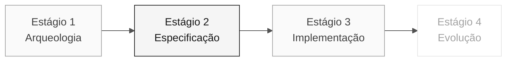

# Persona — Requirements Engineer

> **Trilha:** [Kit do time](../../README.md) › [Personas](../OVERVIEW.md) › [Requirements Engineer](README.md) › **PERSONA**

**Perfil completo da persona Requirements Engineer.** Define a missão, as responsabilidades por estágio, as ferramentas, o handoff e as rubricas de avaliação.

| Campo | Valor |
|---|---|
| **Função** | Requirements Engineer |
| **Dupla** | 1 · Visão (com Product Owner) |
| **Estágios ativos** | Lidera a conversa com `@archaeologist` no Estágio 1; colabora na especificação do Estágio 2 e apoia o 3 |
| **Artefatos produzidos** | Catálogo de regras, seção "Requisitos funcionais" em EARS, especificação viva |
| **Artefatos consumidos** | Priorização do PO, programas `.NSP` e `.NSN` do Estágio 1 |
| **Handoff para** | Dupla 2 (Arquitetura) no Estágio 2 |

 

---

## Conceito

Requirements Engineer transforma as regras descobertas no sistema legado em requisitos formais e testáveis. No setor, essa pessoa garante que o sistema em construção resolva o problema certo e que exista uma forma objetiva de verificar se ele foi construído corretamente.

No SIFAP (Sistema de Fiscalização e Administração de Pagamentos), as regras de negócio estão codificadas tacitamente em Natural, sem documentação, comentários ou manual atualizados. RE extrai essas regras dos programas `.NSP` e `.NSN`, classifica-as (regra de negócio, validação, cálculo, integração) e converte-as para EARS (Easy Approach to Requirements Syntax), com rastreabilidade explícita por meio de `source_legacy:`.

**Exemplo concreto do SIFAP:** RE lê uma regra confirmada em `VALBENEF.NSN`, atribui um REQ-ID e escreve o requisito em EARS sem ampliar o comportamento observado. A fonte segue o modelo `source_legacy: 01-archaeology/legacy-sifap/natural-programs/VALBENEF.NSN#L<start>-L<end>`.

---

## Onde você atua no SDLC

- **Recebe de:** PO (priorização) e Estágio 1 (catálogo de regras)
- **Faz handoff para:** Dupla 2 (Arquitetura) no Estágio 2

---

## Responsabilidades por estágio

| **Estágio** | O que você faz | Entrega que depende de você |
|---|---|---|
| **1 · Arqueologia** | Extrai regras candidatas dos programas Natural. Classifica-as como regra de negócio, validação, cálculo ou integração. | Catálogo de regras (tabela) |
| **2 · Especificação** | Converte o catálogo em requisitos EARS. Mantém a rastreabilidade legado → requisito. Estrutura a especificação com o PO. | Seção "Requisitos funcionais" na notação EARS |
| **3 · Implementação** | Responde a questões sobre requisitos durante a codificação. Ajusta a redação quando surge uma ambiguidade real. | Especificação viva, não congelada |
| **4 · Evolução** | Revisa se as duas Issues abrangem um novo requisito ou ajustam um requisito existente. | Coerência entre Issues e especificação |

---

## Kit da persona

| **Artefato** | Finalidade |
|---|---|
| `.github/skills/persona-requirements-engineer/SKILL.md` | Agente do Copilot configurado para análise de requisitos |
| `/spec-sync` — `persona-requirements-engineer-spec-sync.prompt.md` | Sincroniza a especificação com as mudanças no código |
| `/contradiction-check` — `persona-requirements-engineer-contradiction-check.prompt.md` | Detecta conflitos entre requisitos |
| `/ears-convert` — `persona-requirements-engineer-ears-convert.prompt.md` | Converte texto livre para EARS |
| `.github/instructions/requirements.instructions.md` | Convenções da documentação de requisitos |

---

## Ferramentas e primitivas

- **GitHub Spec-Kit**, `/speckit.specify` é o espaço de trabalho principal. Specify CLI gera a base da especificação que será refinada em EARS.
- **Modo Ask do GitHub Copilot** para validar a coerência entre os requisitos.
- **MCP/filesystem** do repositório para navegar pelos arquivos `.NSP` e `.NSN` legados e correlacioná-los com os requisitos.
- Prompts e skills do kit para extrair regras e convertê-las para EARS.

**Cartões de referência relevantes:**

- [`../../09-cheat-sheets/spec-kit-workflow.md`](../../09-cheat-sheets/spec-kit-workflow.md), `/speckit.specify` e `/speckit.clarify` com exemplos de EARS.
- [`../../09-cheat-sheets/model-routing.md`](../../09-cheat-sheets/model-routing.md), quando usar Claude Sonnet 4.6 ou Opus 4.6.

---

## Checklist de integração

- [ ] **Ler este perfil.** Conheça a missão, as responsabilidades e o handoff.
- [ ] **Abrir o `README.md` do kit.** Confirme que os agentes e prompts aparecem no GitHub Copilot.
- [ ] **Revisar os 6 padrões EARS.** Abra a seção "Notação EARS" em [`../../02-modern-spec/GUIDE.md`](../../02-modern-spec/GUIDE.md).
- [ ] **Identificar sua dupla.** Consulte [00-TEAM-FLOW.md](../../00-TEAM-FLOW.md).
- [ ] **Registrar o handoff.** Saiba de quem você recebe e para quem entrega ao fim de cada estágio.

---

## Como ter sucesso nesta função

- Seus requisitos usam verbos ativos e são testáveis.
- Cada regra legada tem rastreabilidade explícita para o requisito moderno por meio de `source_legacy:`.
- Você diz "isso é ambíguo; precisamos de uma decisão" antes que o código seja escrito.
- Use os seis padrões EARS sem confundi-los (ubíquo, orientado a evento, orientado a estado, comportamento indesejado, opcional, complexo).

---

## Erros comuns e como evitá-los

| **Sintoma** | Causa | Correção |
|---|---|---|
| Requisito sem critério de verificação | Foi escrito como parágrafo, não como EARS | Reescreva com o verbo "SHALL" e uma condição explícita |
| Regra legada sem correspondente | Arqueologia incompleta | Revise o catálogo de regras antes de concluir a especificação |
| Requisito duplica o conteúdo de uma ADR | Confusão entre requisito e decisão de design | Um requisito descreve comportamento; uma ADR registra uma decisão de arquitetura |
| "O sistema deve usar Redis" entra na especificação | Confusão entre requisito e implementação | Um requisito funcional não menciona tecnologia |

---

## 3 exemplos de prompt

1. **(Ask)** "Leia esta regra do SIFAP legado e converta-a para a notação EARS: [cole a regra]. Identifique qual dos 6 padrões EARS se aplica e explique por quê."
2. **(Ask)** "Analise estes 5 requisitos EARS e encontre: (a) ambiguidades que precisam de uma decisão do PO, (b) dependências entre eles e (c) requisitos conflitantes."
3. **(Plan)** "Em `spec.md`, planeje os requisitos EARS para as regras confirmadas no catálogo. Escolha o padrão EARS com base no comportamento observado."

---

## Se você ficar travado

| **Situação** | O que fazer |
|---|---|
| Não conhece EARS | Abra a seção "Notação EARS" em [`../../02-modern-spec/GUIDE.md`](../../02-modern-spec/GUIDE.md), com 6 padrões e exemplos |
| Requisito ambíguo | Escreva duas interpretações e pergunte ao PO qual está correta |
| Muitas regras e pouco tempo | Priorize as regras conforme o risco e o impacto registrados pelo time |
| Spec-Kit não funciona | Restaure a ferramenta antes de criar artefatos formais; eles pertencem a `specs/<NNN>-<feature>/spec.md` |

---

## Dependências

| **Persona** | Relação | Artefato |
|---|---|---|
| Product Owner | Você depende dessa persona | Priorização das regras |
| Developer | Depende de você | Requisitos claros para implementar |
| QA Engineer | Depende de você | Requisitos testáveis com critérios de verificação |
| Software Architect | Depende de você | Requisitos para projetar bounded contexts |

---

## Como você é avaliado

- **Rubrica A2 (Coerência da especificação):** requisitos em EARS, numerados e rastreáveis ao sistema legado.
- **Rubrica A1 (Arqueologia):** catálogo de regras com classificação.
- Critério: "Cada requisito tem um verbo ativo e é testável."

---

### Continue lendo

| Anterior | Próximo |
|---|---|
| [Product Owner](../01-product-owner/PERSONA.md) Dupla 1 · Visão · valida escopo e prioridades. | [Enterprise Architect](../03-enterprise-architect/PERSONA.md) Dupla 2 · Arquitetura · C4 + ADRs estruturais. |

[Voltar ao índice do kit](../../README.md)
