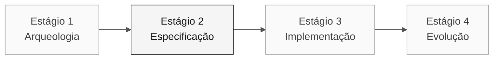

# Persona: Enterprise Architect

> **Trilha:** [Kit do Time](../../README.md) › [Personas](../OVERVIEW.md) › [Enterprise Architect](README.md) › **PERSONA**

**Perfil completo da persona Enterprise Architect.** Define a missão, as responsabilidades por estágio, as ferramentas, o handoff e as rubricas de avaliação.

| Campo | Valor |
|---|---|
| **Papel** | Enterprise Architect |
| **Dupla** | 2 · Arquitetura (com o Software Architect) |
| **Estágios ativos** | Lidera o 2 (C4 + ADRs estruturais); apoia o 1 e o 4 |
| **Artefatos produzidos** | Mapa de dependências externas, ADRs de topologia, validação de contratos |
| **Artefatos consumidos** | Catálogo de regras (Dupla 1), requisitos de integração (RE) |
| **Handoff para** | Dupla 3 (Implementação) e Dupla 4 (Qualidade) no Estágio 2; Dupla 5 (Operações) para Terraform |

 

---

## Conceito

O Enterprise Architect enxerga o sistema dentro de seu ecossistema organizacional e técnico. No mercado, esse papel garante que novas soluções se encaixem no contexto existente: contratos com sistemas externos, padrões corporativos de segurança e requisitos de governança.

No SIFAP (Sistema de Fiscalização e Administração de Pagamentos), isso envolve SIAFI, Banco do Brasil, INCRA, MDA e outros sistemas internos do governo. O EA sabe onde estão os contratos, quais são frágeis e quais podem ser alterados sem desencadear uma sequência de efeitos imprevistos. Sem esse mapeamento, a equipe de implementação pode criar um serviço que funciona localmente, mas falha em produção porque quebra um contrato de integração.

**Exemplo concreto do SIFAP:** `BATCHCON.NSP` concilia pagamentos com o SIAFI. O EA registra essa dependência confirmada, avalia os riscos do contrato e leva as opções de coexistência para decisão antes que o código seja escrito.

---

## Onde você atua no SDLC

- **Recebe de:** Dupla 1 (Visão) no Estágio 1: catálogo de regras e escopo
- **Faz handoff para:** Dupla 3 (Implementação) e Dupla 4 (Qualidade) no Estágio 2; Dupla 5 (Operações) para Terraform

---

## Responsabilidades por estágio

| **Estágio** | O que você faz | Entregável que depende de você |
|---|---|---|
| **1 · Arqueologia** | Identificar dependências e contratos externos que afetam a fatia. | Evidências de integração relevantes |
| **2 · Especificação** | Registrar somente as decisões de topologia que bloqueiam o plano. | ADR de topologia ou decisão de escopo, quando necessário |
| **3 · Implementação** | Validar se a implementação respeita os contratos projetados. Apoiar DevOps com Terraform em alto nível. | Validação da topologia implantada |
| **4 · Evolução** | Avaliar se as Issues do Estágio 4 têm implicações arquiteturais que exigem revisão prévia. | Avaliação de impacto |

---

## Kit da persona

| **Artefato** | Finalidade |
|---|---|
| `.github/skills/persona-enterprise-architect/SKILL.md` | Agente do Copilot configurado para arquitetura e segurança |
| `/create-constitution` — `persona-enterprise-architect-create-constitution.prompt.md` | Cria ou atualiza `.specify/memory/constitution.md` |
| `/create-adr` — `persona-enterprise-architect-create-adr.prompt.md` | Cria um ADR a partir de uma decisão da equipe |
| `/architecture-review` — `persona-enterprise-architect-architecture-review.prompt.md` | Revisa um design proposto em relação a contratos e riscos |
| `.github/instructions/security.instructions.md` | Convenções de segurança |
| `.github/instructions/infrastructure.instructions.md` | Convenções de IaC |

---

## Ferramentas e primitivas

- **Mermaid** e **C4** para diagramas de contexto e contêineres.
- **Modo Ask do GitHub Copilot** para testar a solidez das decisões de topologia.
- **GitHub Spec-Kit** com `/speckit.plan`: transforma a especificação em um plano técnico, decisões e contratos revisáveis.
- Skills do kit: prompts estruturados para análise de dependências.

**Cartões de referência relevantes:**

- [`../../09-cheat-sheets/spec-kit-workflow.md`](../../09-cheat-sheets/spec-kit-workflow.md): `/speckit.plan` e `/speckit.analyze`.
- [`../../09-cheat-sheets/model-routing.md`](../../09-cheat-sheets/model-routing.md): use Claude Opus 4.6 para análise de impacto arquitetural.

---

## Checklist de integração

- [ ] **Leia este perfil.** Conheça a missão, as responsabilidades e o handoff.
- [ ] **Abra o `README.md` do kit.** Confirme se os agentes e prompts aparecem no GitHub Copilot.
- [ ] **Identifique sua dupla.** Consulte [00-TEAM-FLOW.md](../../00-TEAM-FLOW.md).
- [ ] **Mapeie as integrações externas.** Liste SIAFI, BB, INCRA e outros sistemas presentes nos programas `.NSN` atribuídos.
- [ ] **Registre o handoff.** Saiba quem recebe o mapa de dependências e para qual artefato.

---

## Como ter sucesso neste papel

- O diagrama C4 de nível 1 pode ser compreendido por qualquer integrante não técnico da equipe em 30 segundos.
- Seus ADRs identificam o "caminho não escolhido" e explicam o motivo.
- Você fundamenta a estratégia Strangler Fig, de coexistência do SIFAP legado com o SIFAP 2.0, em raciocínio técnico, não em tendências.
- Você se alinha com o Software Architect sobre onde termina seu escopo e começa o dele.

---

## Erros comuns e como evitá-los

| **Sintoma** | Causa | Correção |
|---|---|---|
| O diagrama é incompreensível para pessoas não técnicas | Uso de C4 L3/L4 quando L1/L2 seria suficiente | Use L1 primeiro; aprofunde somente para responder a uma questão técnica específica |
| As integrações reais são ignoradas | Foco excessivo na estrutura interna | Liste SIAFI, BB e outros sistemas durante a Arqueologia |
| O trabalho é duplicado com o Software Architect | Limite de responsabilidade indefinido | Combine no início: o EA cuida de questões externas; o SA cuida de questões internas |
| ADR genérico e sem valor | "Usaremos Spring Boot" não é uma decisão de EA | Um ADR de EA responde "como nos conectamos ao X?", não "qual framework usamos?" |

---

## 3 exemplos de prompts

1. **(Ask)** "Crie um diagrama C4 de nível 1 com os atores e sistemas externos confirmados pela equipe."
2. **(Ask)** "Para esta dependência externa, quais riscos de disponibilidade precisamos avaliar? Proponha alternativas e seus trade-offs."
3. **(Ask)** "Compare as opções de integração levantadas pela equipe e estruture um ADR sem antecipar a decisão."

---

## Se você ficar bloqueado

| **Situação** | O que fazer |
|---|---|
| Não conhece C4 | Use um fluxograma Mermaid simples: caixas = sistemas, setas = integrações. Rotule as setas |
| Gastou tempo demais no C4 de nível 3 | Pare. Os níveis 1 e 2 são suficientes para esta imersão |
| Não conhece Mermaid | Peça ao Copilot: "Crie um diagrama C4 de nível 1 em Mermaid a partir destes atores e integrações confirmados" |
| Discordância com o Software Architect | Escreva um ADR com as duas opções e peça uma votação da equipe |

---

## Dependências

| **Persona** | Relação | Artefato |
|---|---|---|
| Software Architect | Depende de você | Dependências e decisões que afetam a fatia |
| DevOps Engineer | Depende de você | Topologia para Terraform |
| Developer | Depende de você (indiretamente) | Contratos de integração |
| Requirements Engineer | Você depende dessa persona | Requisitos de integração |

---

## Como você é avaliado

- **Rubrica A1 (Arqueologia):** mapa de dependências compreensível para pessoas não técnicas.
- **Rubrica A2 (Coerência da Especificação):** os ADRs identificam o "caminho não escolhido".
- Critério: "As decisões de escopo e as dependências relevantes são rastreáveis."

---

### Continue lendo

| Anterior | Próximo |
|---|---|
| [Requirements Engineer](../02-requirements-engineer/PERSONA.md) Dupla 1 · Visão · escreve EARS com source_legacy. | [Software Architect](../04-software-architect/PERSONA.md) Dupla 2 · Arquitetura · bounded contexts e módulos. |

[Voltar ao índice do kit](../../README.md)
