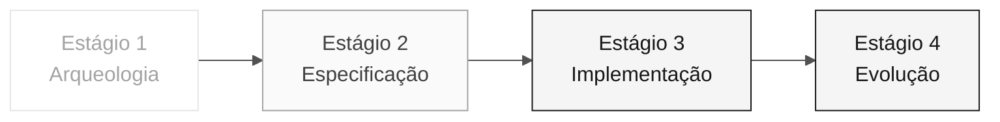

# Persona — Technical Lead

> **Trilha:** [Kit do Time](../../README.md) › [Personas](../OVERVIEW.md) › [Technical Lead](README.md) › **PERSONA**

**Perfil completo da persona Technical Lead.** Define a missão, as responsabilidades por estágio, as ferramentas, o handoff e as rubricas de avaliação.

| Campo | Valor |
|---|---|
| **Papel** | Technical Lead |
| **Dupla** | 3 · Implementação (com Developer) |
| **Estágios ativos** | Lidera o 3 (padrões e revisão), colidera o 4 e apoia o 2 |
| **Artefatos produzidos** | Padrões de implementação, revisões de PR e aplicação funcionando de ponta a ponta |
| **Artefatos consumidos** | REQ-IDs, ADRs e C4 (Dupla 2) |
| **Handoff para** | Dupla 5 (Operações) no Estágio 3 — código em execução |

  

---

## Conceito

O Technical Lead conecta a arquitetura definida no papel ao código escrito todos os dias. No setor, esse papel define padrões de implementação (convenções de código, estilo de testes e estrutura de módulos), desbloqueia o time quando alguém encontra uma dificuldade técnica e responde pela qualidade técnica das entregas.

No SIFAP (Sistema de Fiscalização e Administração de Pagamentos), o TL garante que a aplicação criada pelo time realmente funcione de ponta a ponta ao final do Estágio 3, em vez de apenas compilar. Isso inclui decisões como qual camada recebe a anotação `@Transactional`, como os erros são tratados e como os testes de integração são estruturados.

**Exemplo concreto no SIFAP:** quando o Developer implementa o endpoint de consulta de benefícios, o TL revisa o PR para verificar se a lógica de negócio está na camada correta, se o teste cobre os caminhos de sucesso e erro e se nenhum import cruza a fronteira de um bounded context.

---

## Onde você atua no SDLC

- **Recebe de:** Dupla 2 (Arquitetura) no Estágio 2 — REQ-IDs + ADRs + C4
- **Faz handoff para:** Dupla 5 (Operações) no Estágio 3 — código em execução

---

## Responsabilidades por estágio

| **Estágio** | O que você faz | Entrega que depende de você |
|---|---|---|
| **1 · Arqueologia** | Participa da análise priorizando programas críticos. Estima a complexidade. | Priorização baseada em esforço |
| **2 · Especificação** | Valida se a especificação cabe nos 70 minutos do Estágio 3. Sinaliza: "isso não cabe". | Calibração do escopo |
| **3 · Implementação** | Desbloqueia o time. Decide padrões (estilo de testes, transações e tratamento de erros). Revisa todos os PRs. | Aplicação funcionando de ponta a ponta |
| **4 · Evolução** | Revisa o PR do Agent linha por linha antes do merge. | PR com qualidade de produção |

---

## Kit da persona

| **Artefato** | Finalidade |
|---|---|
| `.github/skills/persona-technical-lead/SKILL.md` | Agente do Copilot configurado para governança técnica |
| `/setup-project` — `persona-technical-lead-setup-project.prompt.md` | Inicializa a estrutura do projeto |
| `/routing-table` — `persona-technical-lead-routing-table.prompt.md` | Gera uma tabela de roteamento de modelos por tarefa |
| `/audit-context` — `persona-technical-lead-audit-context.prompt.md` | Audita o contexto enviado ao Copilot |

---

## Ferramentas e primitivas

- **Copilot Plan** para refatorações em lote com uma sequência clara.
- **Modo Ask do GitHub Copilot** como par para decisões locais de design.
- **GitHub Spec-Kit** — apoio em `/speckit.tasks`, `/speckit.analyze` e no handoff para `/speckit.implement`.
- **Git MCP** para revisão de PR.

**Cartões de referência relevantes:**

- [`../../09-cheat-sheets/copilot-3-modes.md`](../../09-cheat-sheets/copilot-3-modes.md) — você alterna constantemente entre os três modos.
- [`../../09-cheat-sheets/spec-kit-workflow.md`](../../09-cheat-sheets/spec-kit-workflow.md) — `/speckit.tasks` e `/speckit.implement`.
- [`../../09-cheat-sheets/model-routing.md`](../../09-cheat-sheets/model-routing.md) — roteamento de modelos por tipo de tarefa.

---

## Checklist de integração

- [ ] **Leia este perfil.** Conheça a missão, as responsabilidades e o handoff.
- [ ] **Abra o `README.md` do kit.** Confirme se os agentes e prompts aparecem no GitHub Copilot.
- [ ] **Identifique sua dupla.** Consulte [00-TEAM-FLOW.md](../../00-TEAM-FLOW.md).
- [ ] **Defina dois padrões essenciais.** Antes do início do Estágio 3, escolha as convenções de transação e testes.
- [ ] **Registre o handoff.** Saiba o que DevOps deve receber ao final do Estágio 3.

---

## Como ter sucesso neste papel

- Responda a uma dúvida técnica em menos de cinco minutos. Não deixe ninguém sem atividade.
- Escreva revisões que façam o PR avançar, em vez de bloqueá-lo.
- Escolha dois padrões essenciais no início do Estágio 3 e mantenha-os inegociáveis (por exemplo, `@Transactional` somente na camada de serviço).
- Mantenha a CI verde nas branches de trabalho e nos PRs para `develop`.

---

## Erros comuns e como evitá-los

| **Sintoma** | Causa | Correção |
|---|---|---|
| Developer bloqueado por mais de 20 minutos | TL escreve código em vez de desbloquear o time | Pare o que estiver fazendo e responda à dúvida |
| PR bloqueado por detalhes estéticos | Revisão focada no estilo, não na correção | Revise os critérios: comportamento correto, teste presente e nenhuma violação de fronteira |
| Padrão muda no meio do Estágio 3 | A decisão não foi registrada no início | Defina os padrões antes de começar e documente-os em `CODEMAP.md` |
| Aplicação não funciona ao final | O gargalo não foi identificado a tempo | Execute um teste de integração completo a cada 30 minutos |

---

## Três exemplos de prompt

1. **(Ask)** "Revise este PR: verifique se ele segue as três camadas (domain/application/infrastructure), se o teste cobre os caminhos de sucesso + erro e se nenhum import cruza um bounded context."
2. **(Ask)** "Temos 70 minutos. Ajude a comparar estas features por evidências, dependências e esforço para escolher uma feature fina; não preencha requisitos ausentes."
3. **(Ask)** "O ambiente local falha com este erro: [cole aqui]. Diagnostique a causa raiz e proponha uma correção."

---

## Se você travar

| **Situação** | O que fazer |
|---|---|
| O ambiente local não inicia | Verifique: a porta 5432 está ocupada? As versões do Java/Node estão corretas? Contêineres antigos estão interferindo? Qual erro aparece nos logs do backend? |
| O time está lento | Pare e redistribua: "Dev A cuida do endpoint, Dev B cuida da migração e QA cuida do teste. Merge em 45 minutos." |
| O PR tem conflitos | Execute `git pull --rebase` e resolva os conflitos. Não deixe a branch divergir sem alinhamento com sua dupla |
| Você não sabe como escolher um padrão | Use a especificação, os ADRs e as instruções do kit como fontes; documente a decisão no PR |

---

## Dependências

| **Persona** | Relação | Artefato |
|---|---|---|
| Software Architect | Você depende dela | Estrutura de pacotes definida |
| Product Owner | Você depende dela | Escopo calibrado |
| Developer | Depende de você | Padrões e revisões |
| QA Engineer | Depende de você | Pipeline verde para executar os testes |
| DevOps Engineer | Depende de você | Build estável para o pipeline |

---

## Como você é avaliado

- **Rubrica A3 (Integridade técnica):** a aplicação criada pelo time funciona localmente e na CI.
- **Rubrica A6 (Colaboração):** ninguém fica bloqueado por mais de 20 minutos.
- Critério: "`main` verde o tempo todo, PRs revisados em menos de 15 minutos".

---

### Continue lendo

| Anterior | Próximo |
|---|---|
| [Software Architect](../04-software-architect/PERSONA.md) Dupla 2 · Arquitetura · bounded contexts e módulos. | [Developer](../06-developer/PERSONA.md) Dupla 3 · Implementação · Java + Next.js + testes. |

[Voltar ao índice do kit](../../README.md)
