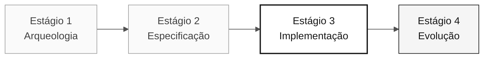

# Persona — Developer

> **Trilha:** [Kit do Time](../../README.md) › [Personas](../OVERVIEW.md) › [Developer](README.md) › **PERSONA**

**Perfil de referência da persona Developer na imersão de modernização do SIFAP.**

  

| Campo | Valor |
|---|---|
| **Papel** | Developer |
| **Dupla** | Dupla 3 — Implementação (com Technical Lead) |
| **Estágios ativos** | Estágio 3 — Implementação (lidera); Estágio 4 — Evolução (apoia) |
| **Artefatos produzidos** | Backend (Java 21 + Spring Boot 3.3), frontend (Next.js 15), testes (JUnit 5 + Testcontainers + Vitest) e PRs revisáveis |
| **Artefatos consumidos** | Requisitos EARS (Requirements Engineer), estrutura de pacotes e bounded contexts (Software Architect), migrações Flyway (DBA) |
| **Handoff para** | QA Engineer — código testável; DevOps Engineer — build estável |

---

## O que é esta persona

O Developer escreve o código. Na modernização do SIFAP (Sistema de Fiscalização e Administração de Pagamentos), essa persona traduz programas Natural e estruturas DDM/Adabas para Java 21 com Spring Boot 3.3, implementa o frontend em Next.js 15 com TypeScript estrito e garante que cada requisito EARS se torne um endpoint funcional com testes aprovados.

No framework Agentic Legacy Modernization, o Developer trabalha na camada de tradução (Translation Agent — Estágio 3) e acompanha o Review Agent no Estágio 4, intervindo quando o Copilot Agent se desvia dos padrões de arquitetura definidos pelo time.

## Onde você atua no SDLC

| Estágio | Responsabilidade | Entrega |
|---|---|---|
| **1 — Arqueologia** | Lê programas Natural no modo Ask do GitHub Copilot e produz um resumo compreensível para o time | Resumos narrativos dos programas |
| **2 — Especificação** | Trabalha em dupla com Requirements Engineer para antecipar problemas de implementação | Observações preventivas na spec |
| **3 — Implementação** | Implementa, testa, abre um PR, revisa o PR da dupla e itera | Backend + frontend da fatia priorizada |
| **4 — Evolução** | Acompanha o Copilot Agent, intervém quando necessário e conclui o que o Agent não terminou | PR do Agent pronto para merge |

## Responsabilidade principal

Transformar a spec em código executável usando o Copilot de modo deliberado: modo Ask para compreender, modo Plan para planejar mudanças em vários arquivos e modo Agent para delegar tarefas bem definidas. Faça commits diariamente.

## Competências principais

- Implementação em Java 21: records, sealed interfaces, virtual threads, Optional e Bean Validation
- Implementação em TypeScript: Next.js 15 App Router, Server Actions e `strict: true`
- TDD com JUnit 5, Testcontainers e Vitest
- Refatoração incremental com commits separados por intenção
- Alternância deliberada entre os três modos do Copilot

## Kit da persona

| Artefato | Caminho | Uso |
|---|---|---|
| Agente de implementação | `.github/skills/persona-developer/SKILL.md` | Implementação, TDD e correção de bugs |
| Prompt `/implement` | `.github/prompts/persona-developer-implement.prompt.md` | Iniciar a implementação a partir de uma spec |
| Prompt `/fix-bug` | `.github/prompts/persona-developer-fix-bug.prompt.md` | Ciclo compreender → reproduzir → corrigir → verificar |
| Prompt `/tdd` | `.github/prompts/persona-developer-tdd.prompt.md` | Escrever um teste antes da implementação |
| Prompt `/refactor` | `.github/prompts/persona-developer-refactor.prompt.md` | Refatorar sem alterar o comportamento |

## Ferramentas e modos do Copilot

| Ferramenta / modo | Quando usar |
|---|---|
| **Modo Ask do GitHub Copilot** | Compreender o código legado Natural e discutir o design antes da implementação |
| **Copilot Plan** | Modo principal no Estágio 3: planejar mudanças que afetam vários arquivos |
| **Copilot Agent** | Estágio 4: delegar tarefas bem definidas a partir de Issues |
| **Spec-Kit** (`/speckit.tasks`, `/speckit.implement`) | Consumir os artefatos de Software Architect e Requirements Engineer |
| **GitHub MCP** | Trabalhar com Issues e PRs sem sair do VS Code |

## Cartões de referência recomendados

- [`09-cheat-sheets/copilot-3-modes.md`](../../09-cheat-sheets/copilot-3-modes.md) — mapa para o dia; use-o constantemente
- [`09-cheat-sheets/spec-kit-workflow.md`](../../09-cheat-sheets/spec-kit-workflow.md) — `/speckit.tasks`, `/speckit.implement` e `/speckit.analyze`
- [`09-cheat-sheets/model-routing.md`](../../09-cheat-sheets/model-routing.md) — Haiku 4.5 para trechos simples, Sonnet 4.6 por padrão e Opus 4.6 para design

## Como desempenhar bem o papel

- [ ] **Use os três modos do GitHub Copilot de forma deliberada.** Ask nem sempre é o modo adequado.
- [ ] **Mantenha os commits pequenos e os PRs revisáveis.** Trate um assunto por PR.
- [ ] **Escreva os testes ao mesmo tempo que o código.** Nunca deixe para depois.
- [ ] **Não invista em abstrações prematuras durante o Estágio 3.** Prefira clareza a elegância.

## Erros comuns e como evitá-los

| Sintoma | Causa | Correção |
|---|---|---|
| Branch enorme acumulada por horas | PR sem foco | Abra um PR por feature ou camada |
| Copilot Agent usado para uma tarefa simples | Modo incorreto selecionado | Reserve Agent para tarefas com escopo claro e artefatos de entrada completos |
| Código sem testes descoberto às 16h | TDD adiado | Escreva o teste antes de avançar para o próximo comportamento |
| Longa espera pelo Opus 4.6 | Modelo maior que o necessário | Use Sonnet 4.6 por padrão e Opus somente para decisões de design |

## Combinações com outras personas

| Combinação | Observação |
|---|---|
| **Developer + Technical Lead** | Muito comum; você implementa enquanto o TL revisa e define padrões |
| **Developer + QA Engineer** | Você escreve a feature e os testes na mesma sessão |
| **Developer + DevOps Engineer** | Para times pequenos; você empacota e entrega |

## Prompts prontos para uso

1. **(Ask)** _"Explique o código legado selecionado e identifique somente comportamentos confirmados. Depois, proponha perguntas antes de implementá-los em Java."_
2. **(Plan)** _"Selecione os arquivos da feature priorizada. Planeje a mudança em domain, application, infrastructure, dados e testes."_
3. **(Agent)** _"Implemente a feature descrita nesta Issue: [cole a issue]. Siga a arquitetura de três camadas e inclua testes."_

## Padrões para emergências

| Situação | O que fazer |
|---|---|
| O código não compila | Execute `mvn test-compile` para ver o erro exato. Em geral, é um import ausente |
| A estrutura de pacotes é desconhecida | Consulte a estrutura definida pelo time: `domain/` → `application/` → `infrastructure/` |
| O Copilot gera código inadequado | Mude de Ask para Plan, selecione os arquivos relevantes e descreva a mudança |
| O teste falha sem motivo aparente | Leia o erro: uma NPE geralmente indica um mock ausente; uma asserção incorreta indica um valor esperado incorreto |

## Dependências

| Persona | Relação | Artefato |
|---|---|---|
| Software Architect | Você depende dela | Estrutura de pacotes e bounded contexts |
| Requirements Engineer | Você depende dela | Requisitos EARS para implementar |
| Technical Lead | Depende de você | PRs para revisar |
| QA Engineer | Depende de você | Código testável |
| DBA | Você depende dela | Migrações e modelo de dados |

## Como você é avaliado

- **Rubrica A3 — Integridade técnica:** endpoints funcionais e testes aprovados
- **Rubrica A4 — Uso deliberado do Copilot:** alternância deliberada entre Ask, Plan e Agent
- **Critério:** commits pequenos, PRs revisáveis e testes escritos junto com o código

---

### Continue lendo

| Anterior | Próximo |
|---|---|
| [Technical Lead — PERSONA](../05-technical-lead/PERSONA.md) Dupla 3 — Implementação — padrões e revisão de código. | [DBA — PERSONA](../07-dba/PERSONA.md) Dupla 4 — Qualidade — migrações Flyway e otimização de consultas. |

[Voltar ao índice do kit](../../README.md)
