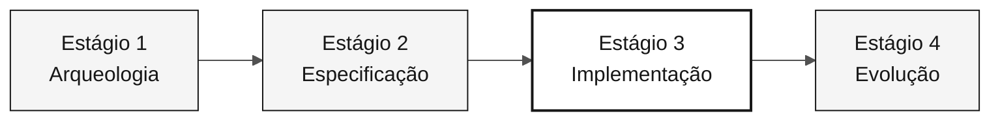

# Persona — DBA

> **Trilha:** [Kit do Time](../../README.md) › [Personas](../OVERVIEW.md) › [DBA](README.md) › **PERSONA**

**Perfil de referência da persona DBA na imersão de modernização do SIFAP.**

 -404040?style=flat-square) 

| Campo | Valor |
|---|---|
| **Papel** | DBA (Database Administrator) |
| **Dupla** | Dupla 4 — Qualidade (com QA Engineer) |
| **Estágios ativos** | Estágio 1 (mapeamento de DDMs), Estágio 2 (modelo lógico + ADR), Estágio 3 (lidera o schema), Estágio 4 (valida a integridade) |
| **Artefatos produzidos** | Mapa de DDMs para entidades relacionais, ADR de banco de dados, migrações Flyway, índices, dados iniciais de teste |
| **Artefatos consumidos** | DDMs do Adabas (Estágio 1), contextos delimitados (Software Architect), requisitos EARS (Requirements Engineer) |
| **Entrega para** | Developer — migrações prontas para JPA; DevOps Engineer — schema estável para Terraform |

---

## O que é esta persona

O DBA é responsável pela camada de dados do SIFAP 2.0. Na modernização do legado, isso significa ler os quatro DDMs do Adabas, que descrevem estruturas MU (multiple-value), PE (periodic) e FDT (File Definition Table), traduzi-los para um schema relacional normalizado no PostgreSQL 16 e garantir que as migrações Flyway sejam idempotentes, reversíveis e seguras para implantação contínua.

Por que isso importa: o modelo de dados é a base das entidades JPA do Developer e da infraestrutura provisionada por DevOps. Um schema frágil ou migrações irreversíveis comprometem todo o Estágio 3 e criam riscos graves em produção.

No framework Agentic Legacy Modernization, o DBA trabalha na fase de Assessment (Estágio 1) e na fase de Translation da camada de dados (Estágio 3).

## Onde você atua no SDLC

| Estágio | Responsabilidade | Entrega |
|---|---|---|
| **1 — Arqueologia** | Ler os quatro DDMs, mapear campos MU/PE para possíveis entidades relacionais e identificar campos-chave | Mapa de DDMs para entidades relacionais |
| **2 — Especificação** | Projetar o modelo lógico de dados e escrever o ADR do PostgreSQL (referência ADR 002) | Modelo de dados + ADR 002 |
| **3 — Implementação** | Escrever migrações Flyway, definir índices, criar dados iniciais de teste e responder a dúvidas sobre JPA/Hibernate | Schema PostgreSQL + dados iniciais |
| **4 — Evolução** | Verificar se os PRs do Copilot Agent alteram o schema com segurança (nova migração, nunca edições retroativas) | Integridade do schema preservada |

## Responsabilidade principal

Traduzir o modelo do Adabas necessário ao escopo selecionado para um schema relacional no PostgreSQL que preserve a integridade do negócio sem herdar as estruturas legadas do Adabas. Garantir migrações idempotentes e rastreabilidade completa das alterações de schema.

## Competências principais

- Leitura de DDMs do Adabas: campos simples, MU (multiple-value) e PE (periodic)
- Projeto de schema relacional normalizado no PostgreSQL 16
- Migrações Flyway: nomenclatura, idempotência e estratégia expand-contract
- Indexação baseada em consultas reais identificadas nos programas Natural
- Auditoria de consultas JPA/JPQL para evitar N+1 e injeção de SQL

## Kit de persona

| Artefato | Caminho | Uso |
|---|---|---|
| Agente DBA | `.github/agents/dba.agent.md` | Modelagem de dados, migrações e auditoria de SQL |
| Prompt `/migration` | `.github/prompts/persona-dba-migration.prompt.md` | Planejar e escrever uma migração Flyway |
| Prompt `/query-audit` | `.github/prompts/persona-dba-query-audit.prompt.md` | Auditar consultas quanto a desempenho e segurança |
| Instruções de banco de dados | `.github/instructions/database.instructions.md` | Convenções obrigatórias de banco de dados |

## Ferramentas e modos do Copilot

| Ferramenta / modo | Quando usar |
|---|---|
| **Modo Ask do GitHub Copilot** | Traduzir DDMs do Adabas para SQL do PostgreSQL; entender a semântica dos campos legados |
| **Copilot Plan** | Planejar lotes de migração; criar vários arquivos Flyway de uma vez |
| **PostgreSQL MCP** (se disponível) | Inspecionar o schema em execução e executar consultas exploratórias |
| **Spec-Kit** (`/speckit.plan`) | Declarar o modelo de dados para o Software Architect e o Developer |

## Cartões de referência recomendados

- [`09-cheat-sheets/spec-kit-workflow.md`](../../09-cheat-sheets/spec-kit-workflow.md) — declare o modelo de dados para `/speckit.plan` e revise-o com `/speckit.analyze`
- [`09-cheat-sheets/model-routing.md`](../../09-cheat-sheets/model-routing.md) — o Sonnet 4.6 é suficiente para a maioria dos trabalhos com SQL

## Como ter um bom desempenho

- [ ] **Torne toda migração reversível.** Nunca edite uma migração existente; crie uma nova: `V5__fix_xxx.sql`.
- [ ] **Documente as decisões de mapeamento de MU/PE.** Registre por que um campo MU se tornou uma tabela relacionada em vez de uma coluna `JSONB`.
- [ ] **Indexe as consultas críticas do ciclo mensal.** Regra prática: um campo usado em `WHERE` ou `JOIN` em uma tabela com mais de 100.000 linhas precisa de um índice.
- [ ] **Mantenha o armazenamento de auditoria somente para acréscimo.** Não use `DELETE` no schema de auditoria.

## Erros comuns e como evitá-los

| Sintoma | Causa | Correção |
|---|---|---|
| O schema usa colunas `JSONB` para dados estruturados | Hábito decorrente da flexibilidade do Adabas | Normalize campos PE e MU em tabelas relacionadas com chaves estrangeiras |
| A migração quebra o ambiente de outra pessoa do time | Migração não idempotente | Nunca altere um arquivo de migração existente; crie um arquivo com uma versão superior |
| Falta de índice em uma tabela crítica | Índice não baseado em evidências | Identifique as consultas nos programas Natural antes de definir índices |
| Desnormalização habitual | Reprodução do modelo do Adabas | Comece pelo modelo relacional canônico e desnormalize somente com evidências de desempenho medido |

## Combinações com outras personas

| Combinação | Observação |
|---|---|
| **DBA + Developer** | Você escreve suas migrações e algumas consultas JPA |
| **DBA + DevOps Engineer** | Você gerencia o PostgreSQL e o Terraform que o provisiona no Azure |

## Prompts prontos para uso

1. **(Ask)** _"Leia o DDM atribuído ao time e proponha alternativas de mapeamento relacional, incluindo os trade-offs que precisamos decidir."_
2. **(Plan)** _"Planeje uma migração Flyway para os campos, relacionamentos e índices exigidos pelo requisito EARS priorizado."_
3. **(Ask)** _"Revise este schema e identifique as restrições e os índices que precisam de evidências antes de serem criados."_

## Padrões para situações de emergência

| Situação | O que fazer |
|---|---|
| Formato de DDM desconhecido | Abra `01-archaeology/legacy-sifap/adabas-ddms/`; os comentários ajudam a explicar cada campo |
| Migração quebrada | Nunca edite uma migração existente. Crie uma nova: `V5__fix_xxx.sql` |
| Dúvida sobre qual índice criar | Para um campo usado em `WHERE` ou `JOIN` em uma tabela com mais de 100.000 linhas, crie o índice |
| PostgreSQL indisponível | Verifique se o Docker está em execução: `docker ps \| grep postgres` |

## Dependências

| Persona | Relação | Artefato |
|---|---|---|
| Software Architect | Você depende desta persona | Limites de contexto para o modelo |
| Developer | Depende de você | Migrações prontas para JPA |
| DevOps Engineer | Depende de você | Schema estável para Terraform |
| QA Engineer | Depende de você | Dados iniciais de teste |

## Como você é avaliado

- **Rubrica A3 — Integridade técnica:** migrações idempotentes, schema consistente com as entidades JPA
- **Rubrica A1 — Arqueologia:** mapa documentado de DDMs para entidades relacionais
- **Critério:** o armazenamento de auditoria é somente para acréscimo; não há `DELETE` no schema de auditoria

---

### Continue lendo

| Anterior | Próximo |
|---|---|
| [Developer — PERSONA](../06-developer/PERSONA.md) Dupla 3 — Implementação — Java 21 + Next.js 15 + testes. | [QA Engineer — PERSONA](../08-qa-engineer/PERSONA.md) Dupla 4 — Qualidade — testes de equivalência e cobertura. |

[Voltar ao índice do kit](../../README.md)
