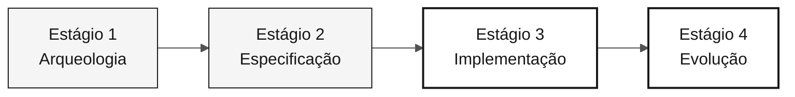

# Persona — QA Engineer

> **Trilha:** [Kit do Time](../../README.md) › [Personas](../OVERVIEW.md) › [QA Engineer](README.md) › **PERSONA**

**Perfil de referência da persona QA Engineer na imersão de modernização do SIFAP.**

  

| Campo | Valor |
|---|---|
| **Papel** | QA Engineer (Quality Assurance Engineer) |
| **Dupla** | Dupla 4 — Qualidade (com DBA) |
| **Estágios ativos** | Estágio 1 (cenários críticos), Estágio 2 (critérios de aceitação), Estágio 3 (colabora nos testes), Estágio 4 (valida a cobertura) |
| **Artefatos produzidos** | Suíte de testes (JUnit 5 + Testcontainers + Vitest), estratégia de testes, critérios de aceitação por REQ-ID, pipeline de CI verde |
| **Artefatos consumidos** | Requisitos EARS com REQ-IDs (Requirements Engineer), código testável (Developer), dados iniciais (DBA) |
| **Entrega para** | DevOps Engineer — CI confiável; time inteiro — pipeline verde |

---

## O que é esta persona

O QA Engineer transforma requisitos EARS em testes executáveis que comprovam a equivalência funcional entre o comportamento legado em Natural/Adabas e o código moderno em Java 21. Na modernização do SIFAP (Sistema de Fiscalização e Administração de Pagamentos), esta persona define a estratégia de testes, escreve os testes relevantes em vez de todos os testes possíveis e mantém o pipeline de CI verde durante todo o Estágio 3.

Por que isso importa: na modernização de legado, somente testes rastreáveis aos requisitos comprovam a equivalência funcional entre os sistemas antigo e novo. Sem o QA Engineer, o time não consegue saber se a tradução de Natural para Java preservou o comportamento correto do negócio.

No framework Agentic Legacy Modernization, o QA Engineer trabalha com o Test Gen Agent e o Security Agent no Estágio 3 e valida a cobertura nos PRs do Copilot Agent durante o Estágio 4.

## Onde você atua no SDLC

| Estágio | Responsabilidade | Entrega |
|---|---|---|
| **1 — Arqueologia** | Identificar cenários críticos nos programas Natural atribuídos | Cenários críticos por programa |
| **2 — Especificação** | Validar se todos os requisitos EARS são testáveis e propor critérios de aceitação concretos | Critérios de teste por REQ-ID |
| **3 — Implementação** | Escrever testes unitários e de integração para o comportamento priorizado; manter a CI verde | Suíte de testes + pipeline verde |
| **4 — Evolução** | Exigir que os PRs do Copilot Agent incluam testes e validar a cobertura dos novos cenários | Cobertura alinhada à feature |

## Responsabilidade principal

Definir a estratégia de testes do projeto. Escrever os testes críticos, não para perseguir 100% de cobertura, mas para cobrir os caminhos relevantes. Validar a rastreabilidade da especificação aos testes. Proteger o time contra um pipeline de CI falsamente verde, cujos testes sempre passam independentemente do comportamento.

## Competências principais

- JUnit 5: `@Test`, `@DisplayName`, `@ParameterizedTest`, AssertJ
- Testcontainers para integração com uma instância real do PostgreSQL 16
- Vitest + Testing Library para componentes do Next.js 15
- Rastreabilidade dos testes aos REQ-IDs por meio de comentários inline
- Análise de cobertura orientada a riscos, não a percentuais

## Kit de persona

| Artefato | Caminho | Uso |
|---|---|---|
| Agente QA Engineer | `.github/skills/persona-qa-engineer/SKILL.md` | Geração de testes, análise de cobertura e gates de qualidade |
| Prompt `/create-tests` | `.github/prompts/persona-qa-engineer-create-tests.prompt.md` | Gerar testes a partir de um requisito EARS |
| Prompt `/coverage-gaps` | `.github/prompts/persona-qa-engineer-coverage-gaps.prompt.md` | Identificar lacunas de cobertura |
| Prompt `/test-strategy` | `.github/prompts/persona-qa-engineer-test-strategy.prompt.md` | Definir a estratégia de testes do projeto |
| Instruções de testes | `.github/instructions/tests.instructions.md` | Convenções obrigatórias de testes |

## Ferramentas e modos do Copilot

| Ferramenta / modo | Quando usar |
|---|---|
| **Modo Ask do GitHub Copilot** | Gerar cenários de teste a partir de requisitos EARS; discutir lacunas de cobertura |
| **Copilot Plan** | Planejar esqueletos JUnit em lotes para uma fatia inteira |
| **Testcontainers** | Integrar com uma instância real do PostgreSQL; prefira-o ao Mockito nas camadas de repositório |
| **Spec-Kit** (`/speckit.analyze`) | Revisar tarefas de teste derivadas de `tasks.md` |
| **GitHub Actions MCP** | Monitorar a CI sem sair do VS Code |

## Cartões de referência recomendados

- [`09-cheat-sheets/spec-kit-workflow.md`](../../09-cheat-sheets/spec-kit-workflow.md) — `/speckit.analyze` e tarefas de teste em `tasks.md`
- [`09-cheat-sheets/copilot-3-modes.md`](../../09-cheat-sheets/copilot-3-modes.md) — use Plan para planejar a cobertura e Ask para discutir lacunas

## Como ter um bom desempenho

- [ ] **Cubra os caminhos relevantes.** Use REQ-IDs e evidências do legado, não um percentual de cobertura.
- [ ] **Mantenha a suíte de testes rápida.** A suíte completa deve ser executada em menos de dois minutos.
- [ ] **Escreva testes que falhem no primeiro bug.** Testes que sempre passam não validam o comportamento.
- [ ] **Mantenha a rastreabilidade.** Adicione `// REQ-NNN` a cada método de teste.

## Erros comuns e como evitá-los

| Sintoma | Causa | Correção |
|---|---|---|
| Perseguir 100% de cobertura e perder o prazo | Tratar a métrica como objetivo | Priorize os caminhos de risco identificados pelo time |
| Os testes validam o framework em vez do domínio | Foco na infraestrutura em vez do comportamento | Pergunte se a asserção falha quando o comportamento do negócio muda |
| Uso de mock quando Testcontainers era necessário | Conveniência | Use Testcontainers para repositórios e Mockito para serviços de domínio |
| CI vermelha ignorada por 20 minutos | Falta de responsável | O QA Engineer é responsável pela CI verde; não delegue essa responsabilidade |

## Combinações com outras personas

| Combinação | Observação |
|---|---|
| **QA + Developer** | Combinação mais comum e produtiva; escreva a feature e os testes na mesma sessão |
| **QA + Requirements Engineer** | Escreva o requisito e o teste correspondente |
| **QA + DevOps Engineer** | Evite quando possível; essa combinação sobrecarrega o Estágio 3 |

## Prompts prontos para uso

1. **(Ask)** _"Para este requisito EARS, gere cenários de teste que cubram o comportamento principal, os limites e as falhas relevantes."_
2. **(Plan)** _"Para a classe da feature priorizada, planeje testes de integração com os dados e as verificações necessários."_
3. **(Ask)** _"Analise a cobertura atual e identifique os caminhos não testados de maior risco. Priorize-os usando as evidências do time."_

## Padrões para situações de emergência

| Situação | O que fazer |
|---|---|
| JUnit 5 não é familiar | Use o padrão existente: `@Test`, `@DisplayName` e asserções AssertJ |
| Testcontainers não funciona | Verifique se o Docker está em execução; alternativa: teste unitário com Mockito |
| Muitos cenários e pouco tempo | Concentre-se no comportamento de maior risco identificado pelo time |
| A CI está vermelha, mas os testes locais passam | Problema de ambiente; verifique Docker/Testcontainers e a versão do Docker no runner |

## Dependências

| Persona | Relação | Artefato |
|---|---|---|
| Requirements Engineer | Você depende desta persona | Requisitos testáveis com critérios de aceitação |
| Developer | Você depende desta persona | Código testável |
| Technical Lead | Depende de você | Pipeline verde |
| DevOps Engineer | Depende de você | CI confiável |

## Como você é avaliado

- **Rubrica A3 — Integridade técnica:** testes aprovados, CI verde
- **Rubrica A2 — Especificação:** todos os requisitos têm critérios de verificação
- **Critério:** os testes falham no primeiro bug em vez de sempre passarem

---

### Continue lendo

| Anterior | Próximo |
|---|---|
| [DBA — PERSONA](../07-dba/PERSONA.md) Dupla 4 — Qualidade — migrações Flyway e otimização de consultas. | [DevOps Engineer — PERSONA](../09-devops-engineer/PERSONA.md) Dupla 5 — Operações — Terraform, GitHub Actions e runbook. |

[Voltar ao índice do kit](../../README.md)
