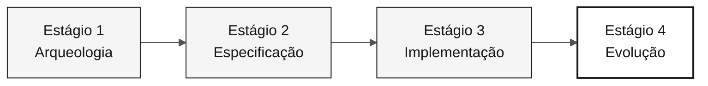

# Persona — DevOps Engineer

> **Trilha:** [Kit do Time](../../README.md) › [Personas](../OVERVIEW.md) › [DevOps Engineer](README.md) › **PERSONA**

**Perfil de referência da persona DevOps Engineer na imersão de modernização do SIFAP.**

  

| Campo | Valor |
|---|---|
| **Papel** | DevOps Engineer |
| **Dupla** | Dupla 5 — Operações (com Tech Writer) |
| **Estágios ativos** | Estágio 1 (validação das ferramentas), Estágio 2 (implicações operacionais), Estágio 3 (rascunho de CI), Estágio 4 (CI/IaC quando relevante) |
| **Artefatos produzidos** | Workflow do GitHub Actions (`ci.yml`), Dockerfile, módulos Terraform, ADR de estratégia de implantação e execução local documentada |
| **Artefatos consumidos** | Build estável (Technical Lead / Developer), topologia de infraestrutura (Enterprise Architect / Software Architect), schema estável (DBA) |
| **Handoff para** | Demonstração: execução local funcionando; produção: `terraform plan` válido |

---

## O que é esta persona

A pessoa DevOps Engineer é responsável pelo caminho entre um commit de código e algo que funciona de forma confiável. Na modernização do SIFAP (Sistema de Fiscalização e Administração de Pagamentos), essa persona garante que qualquer máquina do time consiga iniciar o ambiente local em menos de 60 segundos, que o GitHub Actions valide cada PR com lint, testes e build de imagens e que o Terraform descreva a topologia-alvo no Azure, mesmo quando ela não é aplicada durante a imersão.

Por que isso importa: um pipeline frágil ou um ambiente local ambíguo cria atrito para todas as duplas. A pessoa Developer perde tempo com erros de ambiente, a pessoa QA Engineer fica sem uma base estável de testes e a demonstração final corre o risco de sofrer uma falha operacional, não funcional.

No framework Agentic Legacy Modernization, a pessoa DevOps Engineer trabalha com o Deployment Agent no Estágio 4 e com o Security Agent no Estágio 3, configurando a infraestrutura para implantação contínua e coexistência entre os sistemas legado e moderno.

## Onde você atua no SDLC

| Estágio | Responsabilidade | Entrega |
|---|---|---|
| **1 — Arqueologia** | Validar as ferramentas locais e planejar o que o protótipo precisa para a execução local | Ambiente de trabalho validado |
| **2 — Especificação** | Registrar implicações operacionais somente quando bloquearem o plano da feature | Decisão operacional de apoio, se necessária |
| **3 — Implementação** | Rascunhar a estrutura do pipeline de CI para lint, testes e build | Rascunho de CI alinhado ao protótipo |
| **4 — Evolução** | Ajustar e validar CI/IaC somente quando forem relevantes para a Issue delegada | Validação operacional da entrega, quando aplicável |

## Responsabilidade principal

Builds reproduzíveis e pipeline verde. Na imersão: execução local documentada depois que o protótipo existe, rascunho de CI no Estágio 3 e ajustes de CI/IaC no Estágio 4 somente quando forem relevantes para a entrega.

## Competências principais

- GitHub Actions: workflows de CI/CD, cache de dependências e build de imagens Docker
- Terraform (provider Azure ~> 3.x): módulos por área de serviço (rede, computação, banco de dados e monitoramento)
- Docker e Docker Compose: cache de dependências do Maven, imagem final enxuta e verificações de integridade
- Observabilidade mínima: logs JSON estruturados, `/actuator/health` e métricas básicas
- Gerenciamento de segredos: Azure Key Vault e variáveis de ambiente da CI, nunca código ou `.env` versionado

## Kit de persona

| Artefato | Caminho | Uso |
|---|---|---|
| Agente DevOps Engineer | `.github/skills/persona-devops-engineer/SKILL.md` | CI/CD, infraestrutura como código, monitoramento e análise de incidentes |
| Prompt `/pipeline` | `.github/prompts/persona-devops-engineer-pipeline.prompt.md` | Criar ou aprimorar um workflow do GitHub Actions |
| Prompt `/iac-module` | `.github/prompts/persona-devops-engineer-iac-module.prompt.md` | Criar um módulo Terraform para um serviço do Azure |
| Prompt `/incident-rca` | `.github/prompts/persona-devops-engineer-incident-rca.prompt.md` | Analisar a causa raiz de um incidente |
| Instruções de CI/CD | `.github/instructions/cicd.instructions.md` | Convenções obrigatórias do pipeline |
| Instruções de infraestrutura | `.github/instructions/infrastructure.instructions.md` | Convenções obrigatórias de IaC |

## Ferramentas e modos do Copilot

| Ferramenta / Modo | Quando usar |
|---|---|
| **Modo Ask do GitHub Copilot** | Gerar workflows do GitHub Actions e entender erros da CI |
| **Copilot Plan** | Criar módulos Terraform em lote e planejar mudanças de infraestrutura em vários arquivos |
| **Copilot Agent** | Estágio 4: cadeias longas de CI com várias etapas |
| **Azure / Terraform MCP** (se habilitado) | Inspecionar recursos do Azure e o estado do Terraform |
| **Spec-Kit** (`/speckit.taskstoissues`) | Criar Issues operacionais a partir das tarefas |

## Cartões de referência recomendados

- [`09-cheat-sheets/spec-kit-workflow.md`](../../09-cheat-sheets/spec-kit-workflow.md) — `/speckit.taskstoissues`, `/speckit.analyze` e handoff da versão
- [`09-cheat-sheets/copilot-3-modes.md`](../../09-cheat-sheets/copilot-3-modes.md) — use Agent para pipelines com muitas etapas sequenciais

## Como ter um bom desempenho

- [ ] **Inicie o ambiente local em menos de 60 segundos.** Depois que o protótipo existir: aplicação + banco de dados com um comando.
- [ ] **Exija lint + teste + build de imagem na `main`.** Nenhuma dessas etapas é opcional.
- [ ] **Valide o `terraform plan` quando a feature exigir IaC.** Não crie infraestrutura apenas para cumprir uma meta.
- [ ] **Adicione logs estruturados e verificações de integridade no Estágio 3.** Não deixe essas tarefas para o Estágio 4.

## Erros comuns e como evitá-los

| Sintoma | Causa | Correção |
|---|---|---|
| O time perde uma hora na inicialização | Configuração local ambígua ou sem documentação | Documente o comando exato de inicialização antes do Estágio 3 |
| A CI executa somente testes unitários | O escopo do pipeline é restrito demais | Inclua o build da imagem e o lint desde a primeira versão |
| O Terraform tem 500 linhas e uma saída pouco clara | Módulo monolítico | Use um módulo por área de serviço do Azure |
| Segredo real em um `.env` versionado | Conveniência inicial | Armazene segredos somente no Azure Key Vault ou em variáveis da CI; adicione `.env` ao `.gitignore` imediatamente |

## Combinações com outras personas

| Combinação | Observação |
|---|---|
| **DevOps + DBA** | Gerenciam o PostgreSQL e o módulo Terraform que o provisiona |
| **DevOps + Tech Writer** | No Estágio 4, monitoram o Agent enquanto a pessoa Tech Writer documenta o runbook |

## Prompts prontos para uso

1. **(Ask)** _"Crie um workflow do GitHub Actions em `.github/workflows/ci.yml` que seja executado a cada push, configure o Java 21 com cache do Maven, execute os testes e crie uma imagem Docker."_
2. **(Plan)** _"Planeje o Dockerfile do backend: cache de dependências do Maven, uma imagem final menor e uma verificação de integridade."_
3. **(Ask)** _"O ambiente local leva 3 minutos para iniciar. Analise os arquivos criados pelo time e proponha 3 otimizações."_

## Procedimentos padrão de emergência

| Situação | O que fazer |
|---|---|
| O ambiente local não inicia | Checklist: (1) O Docker Desktop está em execução? (2) As portas 5432/8080/3000 estão livres? (3) As variáveis de ambiente estão definidas? (4) Os logs mostram a causa raiz? |
| A CI falha | Leia os logs do GitHub Actions; o erro mais comum é a versão incorreta do Java ou uma falha de cache |
| O `terraform plan` falha | Verifique: (1) O `terraform init` foi executado? (2) A versão do provider é compatível? (3) As variáveis obrigatórias estão definidas? |
| O GitHub Actions não é familiar | Copie `.github/workflows/build.yml` e adapte-o |

## Dependências

| Persona | Relação | Artefato |
|---|---|---|
| Technical Lead | Você depende dessa persona | Build estável para o pipeline |
| Enterprise Architect | Você depende dessa persona | Topologia para o Terraform |
| Developer | Depende de você | Ambiente local documentado, CI verde |
| DBA | Depende de você para a infraestrutura | PostgreSQL provisionado |
| QA Engineer | Depende de você | Pipeline que executa testes |

## Como você é avaliado

- **Rubrica A3 — Integridade técnica:** a execução local funciona e a CI está verde
- **Rubrica A4 — Copilot:** uso do Agent em pipelines com várias etapas
- **Critério:** build reproduzível; qualquer máquina do time executa o ambiente local documentado em menos de 60 segundos

---

### Continue lendo

| Anterior | Próximo |
|---|---|
| [QA Engineer — PERSONA](../08-qa-engineer/PERSONA.md) Dupla 4 — Qualidade — testes de equivalência e cobertura. | [Tech Writer — PERSONA](../10-tech-writer/PERSONA.md) Dupla 5 — Operações — documentação viva e relatório do Agent. |

[Voltar ao índice do kit](../../README.md)
