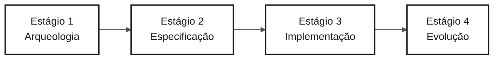

# Persona — Tech Writer

> **Trilha:** [Kit do Time](../../README.md) › [Personas](../OVERVIEW.md) › [Tech Writer](README.md) › **PERSONA**

**Perfil de referência da persona Tech Writer na imersão de modernização do SIFAP.**

  

| Campo | Valor |
|---|---|
| **Papel** | Tech Writer (Technical Writer) |
| **Dupla** | Dupla 5 — Operações (com DevOps Engineer) |
| **Estágios ativos** | Todos os estágios (atuação transversal); lidera o Estágio 4 — Evolução (relatório do Agent) |
| **Artefatos produzidos** | Glossário, relatório de descoberta (Estágio 1), spec e ADRs formatados (Estágio 2), README e `docs/` completos (Estágio 3), relatório de experiência com o Agent (Estágio 4) |
| **Artefatos consumidos** | Decisões e código de todas as duplas |
| **Handoff para** | Pessoas facilitadoras: relatório final do Estágio 4; Product Owner: glossário e relatórios legíveis |

---

## O que é esta persona

A pessoa Tech Writer transforma decisões e código em uma memória duradoura do projeto. Na modernização do SIFAP (Sistema de Fiscalização e Administração de Pagamentos), essa persona mantém o glossário de termos do legado Natural/Adabas (MU, PE, FDT, DDM, ciclo mensal), formaliza as decisões de arquitetura como ADRs (Architecture Decision Records) e garante que o README reflita o estado real da aplicação a cada hora da imersão, não apenas no final.

Por que isso importa: sem a atuação intencional da pessoa Tech Writer, os ADRs permanecem como arquivos vazios, o README continua com "TODO: adicionar instruções" e o conhecimento descoberto durante a imersão desaparece. A pessoa Tech Writer torna o aprendizado do time rastreável e transferível.

No framework Agentic Legacy Modernization, a pessoa Tech Writer trabalha com o Documentation Agent em todas as fases, mantendo a rastreabilidade e uma trilha de auditoria das decisões.

## Onde você atua no SDLC

| Estágio | Responsabilidade | Entrega |
|---|---|---|
| **1 — Arqueologia** | Manter o glossário e o catálogo em um formato legível; escrever o relatório de descoberta no final | Relatório do Estágio 1 |
| **2 — Especificação** | Revisar a consistência, a terminologia e a clareza da spec; formatar os ADRs com o modelo | Spec e ADRs no formato padrão |
| **3 — Implementação** | Transformar o README provisório em documentação real; registrar em `docs/` as decisões conforme elas surgem | README + `docs/` completos |
| **4 — Evolução** | Acompanhar o Copilot Agent e escrever um relatório honesto da experiência, cobrindo o que funcionou, falhou e foi aprendido | Relatório final do Estágio 4 |

## Responsabilidade principal

Manter a documentação viva durante todo o dia, não apenas no final. Evoluir o README a cada hora, escrever os ADRs quando as decisões são tomadas, manter o changelog e usar terminologia consistente durante toda a imersão.

## Competências principais

- Redação técnica no estilo Diátaxis: tutoriais, guias práticos, referência e explicação
- Formalização de ADRs: contexto, decisão e consequências, nada além e nada aquém
- Rastreabilidade entre documentação e código: endpoints, comandos e variáveis de ambiente reais
- Detecção de desvio entre documentação e código com `/doc-drift`
- Manutenção do glossário e uso de terminologia consistente em todo o projeto

## Kit de persona

| Artefato | Caminho | Uso |
|---|---|---|
| Agente Tech Writer | `.github/skills/persona-tech-writer/SKILL.md` | Documentação de API, README, `CODEMAP.md`, changelog e detecção de desvio |
| Prompt `/generate-docs` | `.github/prompts/persona-tech-writer-generate-docs.prompt.md` | Gerar documentação a partir do código |
| Prompt `/update-codemap` | `.github/prompts/persona-tech-writer-update-codemap.prompt.md` | Atualizar o mapa do código |
| Prompt `/doc-drift` | `.github/prompts/persona-tech-writer-doc-drift.prompt.md` | Detectar divergências entre a documentação e o código |

## Ferramentas e modos do Copilot

| Ferramenta / Modo | Quando usar |
|---|---|
| **Modo Ask do GitHub Copilot** | Revisar estilo, clareza e consistência terminológica |
| **Modo Ask do GitHub Copilot (redação longa)** | Rascunhar seções extensas de documentação técnica |
| **Spec-Kit** (`/speckit.*`) | Manter `spec.md`, `plan.md` e `tasks.md` gerados pela Specify CLI consistentes com a documentação do time |
| **GitHub MCP** | Fazer commits em `docs/` enquanto as outras duplas trabalham no código |

## Cartões de referência recomendados

- [`09-cheat-sheets/spec-kit-workflow.md`](../../09-cheat-sheets/spec-kit-workflow.md) — a Specify CLI gera `spec.md`, `plan.md` e `tasks.md`; mantenha esses arquivos consistentes com a documentação
- [`09-cheat-sheets/model-routing.md`](../../09-cheat-sheets/model-routing.md) — Haiku 4.5 para revisão de estilo; Sonnet 4.6 para redação de conteúdo

## Pontos de controle por horário

A pessoa Tech Writer é a persona mais transversal do time. Para não ficar esperando algo para documentar, siga estes pontos de controle:

| Período | O que fazer | Entrega visível |
|---|---|---|
| 11:00–12:00 | Ler os programas atribuídos à Dupla 5 e registrar termos que sustentam o escopo selecionado | Glossário com termos relevantes |
| 13:30–14:00 | Consolidar o vocabulário e as decisões necessárias para a feature fina | Apoio para a spec da feature |
| 14:00–15:00 | Revisar a clareza de `spec.md`, `plan.md` e `tasks.md`; registrar a decisão de escopo | Artefatos formais consistentes |
| 15:00–16:10 | Documentar os endpoints e comandos reais criados pelo protótipo | Documentação factual atualizada |
| 16:10–16:50 | Acompanhar o Agent e escrever `04-evolution/agent-experience-report.md` em tempo real | Relatório honesto concluído |

> [!NOTE]
> Se você não tiver nada para documentar depois de 30 minutos, pergunte à dupla que lidera o estágio: _"O que vocês decidiram nos últimos 30 minutos que ainda não foi registrado?"_ Quase sempre há algo.

## Como ter um bom desempenho

- [ ] **Dê contexto, decisão e consequências a cada ADR.** Nada além, nada aquém.
- [ ] **Evolua o README a cada hora.** Não apenas no final do dia.
- [ ] **Mantenha a terminologia consistente do início ao fim.** Se o projeto usa "ciclo", não use "rodada" no parágrafo seguinte.
- [ ] **Escreva um relatório honesto do Estágio 4.** Não promova o Agent; documente o que funcionou e o que falhou.

## Erros comuns e como evitá-los

| Sintoma | Causa | Correção |
|---|---|---|
| Nada foi escrito até o fim do Estágio 3 | Espera pelo código ficar "pronto" | Documente em tempo real; registre cada decisão quando ela for tomada |
| ADRs de uma linha | Confusão entre um registro e uma anotação | Use o modelo: contexto, decisão e consequências |
| O README ainda diz "TODO: adicionar instruções" | Adiamento | Comece com: (1) o que é o sistema, (2) como executá-lo, (3) endpoints disponíveis |
| O relatório do Agent contém somente elogios | Viés positivo | Documente atritos, intervenções manuais, alucinações e correções |

## Combinações com outras personas

| Combinação | Observação |
|---|---|
| **Tech Writer + Product Owner** | Documentam a motivação, a visão e o propósito do projeto |
| **Tech Writer + DevOps Engineer** | Documentam enquanto o pipeline é executado, produzindo um runbook natural |
| **Tech Writer + Requirements Engineer** | Combinação forte para times pequenos: estruturam e escrevem requisitos claros |

## Prompts prontos para uso

1. **(Ask)** _"Revise este README e identifique seções TODO, terminologia inconsistente e informações desatualizadas, como portas, credenciais e endpoints. Proponha correções."_
2. **(Plan)** _"Em ADR-001.md, planeje como preencher Contexto, Decisão e Consequências usando o modelo em `02-modern-spec/ADR-TEMPLATE.md`."_
3. **(Ask)** _"Crie um relatório honesto da experiência com o Copilot Agent: o que funcionou, o que nos surpreendeu e o que falhou. Use o modelo em `04-evolution/agent-experience-report.md`."_

## Procedimentos padrão de emergência

| Situação | O que fazer |
|---|---|
| O formato do ADR é desconhecido | Abra `02-modern-spec/ADR-TEMPLATE.md`, copie e preencha as três seções obrigatórias |
| O README está vazio | Comece com: (1) o que é o sistema, (2) como executá-lo, (3) endpoints disponíveis |
| O glossário está bloqueado | Use o modo Ask do GitHub Copilot: _"Liste as abreviações encontradas nos arquivos `.NSP` e `.NSN` atribuídos e cite a evidência de cada uma."_ |
| O relatório do Agent está vazio | Abra `04-evolution/agent-experience-report.md`; o modelo tem seções prontas para preencher |

## Dependências

| Persona | Relação | Artefato |
|---|---|---|
| Todas as duplas | Você depende delas | Decisões e código para documentar |
| Product Owner | Depende de você | Glossário e relatórios legíveis |
| QA Engineer | Depende indiretamente de você | Terminologia consistente na spec |
| Pessoas facilitadoras | Dependem de você | Relatório final do Estágio 4 |

## Como você é avaliado

- **Rubrica A2 — Spec:** documentação consistente e terminologia padronizada
- **Rubrica A7 — Agent:** relatório honesto e detalhado da experiência com o Copilot Agent
- **Critério:** README evoluído a cada hora; ADRs com contexto, decisão e consequências; nenhuma seção contém TODO

---

### Continue lendo

| Anterior | Próximo |
|---|---|
| [DevOps Engineer — PERSONA](../09-devops-engineer/PERSONA.md) Dupla 5 — Operações — Terraform, GitHub Actions e runbook. | [Estágio 1 — Arqueologia](../../01-archaeology/GUIDE.md) 11:00–12:00 — Leia o sistema legado e catalogue as regras de negócio. |

[Voltar ao índice do kit](../../README.md)
