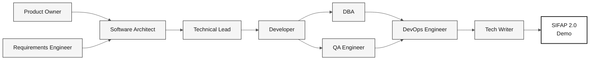

# Visão geral das 10 personas

> **Trilha:** [Kit do time](../README.md) › [Personas](README.md) › **Visão geral**

**Comparação das 10 personas em uma página.** Use este documento para escolher sua dupla, identificar quem lidera cada estágio e consultar os padrões de emergência.

| Campo | Valor |
|---|---|
| **Público-alvo** | Todos os participantes da imersão |
| **Pré-requisitos** | Nenhum |
| **Tempo estimado** | 5 min |
| **Resultado esperado** | Dupla selecionada e handoffs compreendidos |

> [!TIP]
> Cada integrante assume **duas personas** da mesma dupla. A dupla permanece unida durante toda a imersão, sem handoff interno entre suas duas personas.

---

## As cinco duplas

---

## Tabela completa das 10 personas

| **#** | Persona | Dupla | Lidera o estágio | Apoia | Ferramenta principal | Padrão para quando travar |
|---|---|---|---|---|---|---|
| 01 | [Product Owner](01-product-owner/PERSONA.md) | 1 · Visão | 1 (priorização), 2 (aprovação do escopo) | 3, 4 | Modo Ask do GitHub Copilot + spec.prompt | "Temos 70 minutos de implementação: escolha uma feature fina" |
| 02 | [Requirements Engineer](02-requirements-engineer/PERSONA.md) | 1 · Visão | 1 (`@archaeologist`) | 2, 3 | `/ears-convert` + Spec-Kit | Rastreie cada requisito até a evidência |
| 03 | [Enterprise Architect](03-enterprise-architect/PERSONA.md) | 2 · Arquitetura | 2 (C4 + ADRs estruturais) | 4 | Mermaid + template de ADR | Registre as alternativas no template |
| 04 | [Software Architect](04-software-architect/PERSONA.md) | 2 · Arquitetura | 2 (`@architect`, bounded contexts e módulos) | 3 | `/codemap` + impl-plan | Valide as suposições com o time |
| 05 | [Technical Lead](05-technical-lead/PERSONA.md) | 3 · Implementação | 3 (padrões, revisão) | 4, 2 | Modo Plan + audit-context | Implemente o requisito EARS priorizado |
| 06 | [Developer](06-developer/PERSONA.md) | 3 · Implementação | 3 (código) | 4 | Modo Plan + `/tdd` | Conclua somente um endpoint, incluindo o teste |
| 07 | [DBA](07-dba/PERSONA.md) | 4 · Qualidade | 3 (migrações Flyway) | 3 | `/migration` + query-audit | Derive o modelo dos DDMs |
| 08 | [QA Engineer](08-qa-engineer/PERSONA.md) | 4 · Qualidade | — | 2, 3, 4 | Skill test-strategy | Escreva um teste de aceitação por REQ-ID crítico |
| 09 | [DevOps Engineer](09-devops-engineer/PERSONA.md) | 5 · Operações | — | 3 (rascunho de CI), 4 (CI/IaC se relevante) | `/iac-module` + `/pipeline` | Valide somente a infraestrutura relevante para a entrega |
| 10 | [Tech Writer](10-tech-writer/PERSONA.md) | 5 · Operações | 4 (relatório do Agent) | Transversal (1, 2, 3) | Skills de Markdown + modo Ask do GitHub Copilot | Consolide as decisões do time |

---

## Quem lidera cada estágio

| **Estágio** | Horário | Liderança | Apoio |
|---|---|---|---|
| **1 · Arqueologia** | 11:00–12:00 + 13:30–14:00 | Todas as cinco duplas em paralelo (três programas cada) | — |
| **2 · Especificação** | 14:00–15:00 | Dupla 2 (EA + SA) | Dupla 1 (escopo), Dupla 5 (revisão) |
| **3 · Implementação** | 15:00–16:10 | Duplas 3 (TL + Dev) e 4 (DBA + QA) | Dupla 5 (esqueleto de CI) |
| **4 · Evolução** | 16:10–16:50 | Dupla 5 (DevOps + TW) | Dupla 3 (Issues + revisões de PR do Agent) |

---

## Cadeia de dependências

---

## Como escolher sua dupla

| Se sua experiência é em… | Considere a dupla |
|---|---|
| Negócios / produto | **1 · Visão** (PO + RE) |
| Arquitetura de sistemas | **2 · Arquitetura** (EA + SA) |
| Programação / desenvolvimento | **3 · Implementação** (TL + Dev) |
| Dados / testes | **4 · Qualidade** (DBA + QA) |
| Infraestrutura / documentação | **5 · Operações** (DevOps + TW) |

> [!NOTE]
> As duplas 1, 4 e 5 acomodam pessoas sem experiência técnica em programação. As duplas 2 e 3 exigem experiência técnica.

---

## Padrões de emergência

Cada `PERSONA.md` detalha uma seção para quando você travar. Veja uma orientação por persona:

- **PO:** "Temos 70 minutos de implementação; escolha uma feature fina."
- **RE:** Rastreie cada requisito EARS até a evidência e registre lacunas para esclarecimento.
- **EA:** Use o template de ADR para documentar as alternativas e a decisão do time.
- **SA:** Formule suposições de arquitetura e valide-as com o time.
- **TL:** Interrompa refatorações sem testes; revise os PRs da sua dupla.
- **Dev:** Um endpoint completo é melhor que cinco quebrados. Testcontainers é obrigatório.
- **DBA:** Modele a partir dos DDMs e nunca edite uma migração antiga.
- **QA:** Um teste por REQ-ID crítico. Caminho feliz + caminho de erro.
- **DevOps:** Somente `terraform plan`. Executar `apply` na imersão tem alto risco.
- **TW:** Pergunte à dupla que lidera o estágio: "O que vocês decidiram nos últimos 30 minutos que ainda não foi registrado?"

---

### Continue lendo

| Anterior | Próximo |
|---|---|
| [Setup](../00-SETUP.md) Configuração do laptop: Git, VS Code, Copilot, Spec-Kit e proteção de branch. | [Estágio 1 — Arqueologia](../01-archaeology/GUIDE.md) 11:00–12:00 + 13:30–14:00 · Leia o sistema legado e catalogue as regras de negócio. |

[Voltar ao índice do kit](../README.md)
