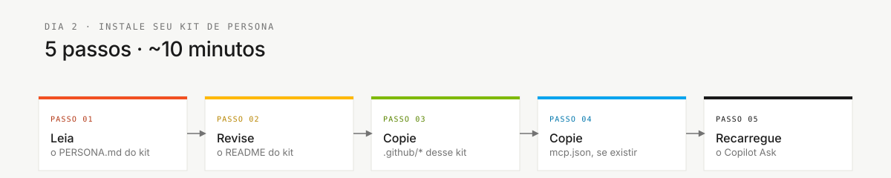

# Kits de persona

> **Trilha:** [Kit do time](../README.md) › **Personas**

**Guia de integração para as 10 personas da imersão.** Cada persona é um kit do Copilot especializado em um papel do SDLC, sustentado por uma skill que carrega sozinha; cada integrante escolhe e estuda duas personas da mesma dupla.

| Campo | Valor |
|---|---|
| **Público-alvo** | Todos os participantes da imersão |
| **Pré-requisitos** | [00-SETUP.md](../00-SETUP.md) concluído |
| **Tempo estimado** | 15 min |
| **Resultado esperado** | Duas personas identificadas, `.github/` validado e Copilot recarregado |


---

## Conceito

Uma persona é um kit do Copilot especializado em um papel específico do ciclo de desenvolvimento. Cada kit inclui uma **skill de papel**, prompts para tarefas recorrentes, instruções e o perfil `PERSONA.md`. A skill orienta como o Copilot responde e carrega **automaticamente** a partir da `description` dela, de modo que você nunca seleciona o seu papel — ele se compõe com o agente de estágio que o time tiver selecionado.

> [!IMPORTANT]
> Os papeis são skills, e não agentes. O kit tem cinco agentes: os quatro agentes de
> estágio mais o `@dba`, cujo ciclo de vida dos dados atravessa todos os estágios.
> Procurar `@product-owner` no seletor de agentes significa que o modelo mudou sob
> os seus pés — mantenha o agente de estágio selecionado e descreva o trabalho do
> papel. Consulte o [ADR-0002](../docs/adr/0002-team-roles-as-skills-not-agents.md).

No contexto do SIFAP (Sistema de Fiscalização e Administração de Pagamentos), cada papel tem responsabilidades diretas por artefatos concretos, desde o catálogo de regras Natural/Adabas até os testes de aceitação e o pipeline de CI. Ao estudar a persona, você sabe o que produzir, quem fornece suas entradas e quem recebe suas saídas.

---

## As cinco duplas

O time da imersão tem cinco pessoas, cada uma usando duas personas da mesma dupla. Essa distribuição cobre todo o SDLC.

| **Dupla** | Personas | Kits |
|---|---|---|
| **1 · Visão** | Product Owner + Requirements Engineer | `01-product-owner/` + `02-requirements-engineer/` |
| **2 · Arquitetura** | Enterprise Architect + Software Architect | `03-enterprise-architect/` + `04-software-architect/` |
| **3 · Implementação** | Technical Lead + Developer | `05-technical-lead/` + `06-developer/` |
| **4 · Qualidade** | DBA + QA Engineer | `07-dba/` + `08-qa-engineer/` |
| **5 · Operações** | DevOps Engineer + Tech Writer | `09-devops-engineer/` + `10-tech-writer/` |

---

## O que cada kit contém

| **Artefato** | Finalidade |
|---|---|
| `PERSONA.md` | Perfil completo: responsabilidades, handoffs, prompts e critérios de avaliação |
| `README.md` | Inventário dos artefatos do Copilot (caminhos em `.github/`) |
| `mcp.json` | Servidores MCP recomendados para o papel, quando disponíveis |

Os artefatos ativos estão consolidados no diretório `.github/` da raiz:

| **Artefato** | Caminho |
|---|---|
| Skill do papel, carregada automaticamente pela sua `description` | `.github/skills/persona-*/SKILL.md` |
| Prompts para tarefas recorrentes | `.github/prompts/persona-*.prompt.md` |
| Skills de técnica compartilhadas | `.github/skills/*/SKILL.md` |
| Regras específicas por tipo de arquivo | `.github/instructions/*.instructions.md` |
| Agentes de estágio mais o `dba` transversal, selecionados com `@nome` | `.github/agents/*.agent.md` |

---

## Kits disponíveis

| **#** | Kit | Papel na imersão |
|---|---|---|
| 01 | [Product Owner](./01-product-owner/PERSONA.md) | Prioridade, escopo, valor e narrativa da demo |
| 02 | [Requirements Engineer](./02-requirements-engineer/PERSONA.md) | Requisitos EARS, critérios de aceitação e rastreabilidade |
| 03 | [Enterprise Architect](./03-enterprise-architect/PERSONA.md) | Dependências externas e decisões de escopo |
| 04 | [Software Architect](./04-software-architect/PERSONA.md) | Plano técnico, fronteiras de módulos e ADRs quando necessários |
| 05 | [Technical Lead](./05-technical-lead/PERSONA.md) | Padrões, coordenação técnica e revisões de PR |
| 06 | [Developer](./06-developer/PERSONA.md) | Código Java/TypeScript, testes e integração |
| 07 | [DBA](./07-dba/PERSONA.md) | Modelo PostgreSQL, migrações e mapeamento de DDMs |
| 08 | [QA Engineer](./08-qa-engineer/PERSONA.md) | Estratégia de testes, cobertura e gates |
| 09 | [DevOps Engineer](./09-devops-engineer/PERSONA.md) | CI/CD, Terraform, secrets e implantação |
| 10 | [Tech Writer](./10-tech-writer/PERSONA.md) | Glossário, clareza de ADRs, README e runbook |

---

## Como ativar sua persona



> [!IMPORTANT]
> Conclua [00-SETUP.md](../00-SETUP.md) antes de prosseguir.

- [ ] **Identifique suas duas personas.** Encontre sua dupla em [00-TEAM-FLOW.md](../00-TEAM-FLOW.md).
- [ ] **Leia os dois perfis.** Abra `05-personas/<role>/PERSONA.md` para cada papel da sua dupla.
- [ ] **Valide o `.github/` consolidado.** Confirme que agentes, prompts, instruções e skills estão presentes:

  ```bash
  ls .github/agents .github/prompts .github/instructions .github/skills
  ```

- [ ] **Copie a configuração MCP somente quando necessário.** O facilitador indicará quando:

  ```bash
  [ -f 05-personas/06-developer/mcp.json ] && \
    mkdir -p .vscode && \
    cp 05-personas/06-developer/mcp.json .vscode/mcp.json
  ```

- [ ] **Recarregue o GitHub Copilot.** Abra a Paleta de Comandos e execute **Developer: Reload Window**.
- [ ] **Verifique agentes e prompts.** Digite `@` no painel do GitHub Copilot e confirme os agentes. Digite `/` e confirme os slash commands.

---

## Como estudar um kit em 10 minutos

- [ ] **Leia primeiro o `PERSONA.md`.** Missão, responsabilidades, handoffs e rubricas de avaliação.
- [ ] **Abra o `README.md` do kit.** Inventário de agentes, prompts, skills e MCPs.
- [ ] **Revise os prompts disponíveis.** Eles são atalhos para tarefas recorrentes, não substitutos do seu julgamento.
- [ ] **Confira as skills e instruções.** As skills contêm fluxos de trabalho; as instruções aplicam regras por tipo de arquivo.
- [ ] **Observe os handoffs.** Cada persona deve saber quem fornece suas entradas e quem recebe suas saídas.

---

## Critérios de conclusão da instalação

- [ ] Os dois perfis `PERSONA.md` da dupla foram lidos.
- [ ] O `.github/` consolidado contém agentes, prompts, instruções e skills.
- [ ] O `mcp.json` foi copiado para `.vscode/` quando disponível.
- [ ] O VS Code foi recarregado.
- [ ] Os agentes aparecem ao digitar `@` no GitHub Copilot.
- [ ] Os prompts aparecem ao digitar `/` no GitHub Copilot.

---

### Continue lendo

| Anterior | Próximo |
|---|---|
| [Setup](../00-SETUP.md)<br/><sub>Configuração do laptop: Git, VS Code, Copilot, Spec-Kit e proteção de branch.</sub> | [Visão geral das 10 personas](OVERVIEW.md)<br/><sub>Tabela comparativa: dupla, liderança por estágio e padrões de emergência.</sub> |

<sub>[Voltar ao índice do kit](../README.md)</sub>
