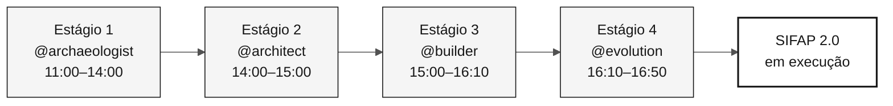

# Agentes de estágio — 4 agentes de contexto da imersão

> **Trilha:** [Kit do time](../README.md) › **Agentes de estágio**

**Os agentes de estágio são agentes personalizados do GitHub Copilot que concentram o contexto técnico de cada fase da imersão e garantem que todo o time interaja com o GitHub Copilot de forma consistente durante o mesmo estágio.**

| Campo | Valor |
|---|---|
| **Público-alvo** | Todo o time, leitura obrigatória antes do início da imersão |
| **Pré-requisitos** | GitHub Copilot ativo no VS Code |
| **Tempo estimado** | 10 min |
| **Estágio** | Todos |
| **Resultado esperado** | Saber qual agente usar, quando usá-lo e qual é a função dele |

---

## O que é um agente personalizado do GitHub Copilot?

Um agente personalizado do GitHub Copilot é definido em `.github/agents/*.agent.md`. Ele orienta o GitHub Copilot sobre o contexto, as ferramentas, o vocabulário e as restrições de uma tarefa específica.

Quando você seleciona `@archaeologist` no GitHub Copilot, o GitHub Copilot carrega as instruções desse agente e responde dentro desse escopo. Você não precisa repetir o contexto em cada mensagem.

**Por que isso importa nesta imersão:** sem agentes personalizados, cada integrante do time precisaria repetir o contexto do SIFAP, as regras de rastreabilidade e a stack de destino em todas as conversas. Os agentes de estágio eliminam essa repetição e criam um ritual compartilhado.

---

## Duas camadas de configuração

Esta imersão usa duas camadas de configuração do GitHub Copilot que funcionam em conjunto:

| Camada | O que faz | Primitiva | Local |
|---|---|---|---|
| **Papel** (coluna) | Define a responsabilidade individual: Product Owner, Developer, QA e outros | **Skill**, carregada automaticamente a partir da sua `description` | [`.github/skills/`](../.github/skills/), documentada em [`05-personas/`](../05-personas/) |
| **Estágio** (linha) | Define o contexto da fase e o escopo de ferramentas | **Agente**, selecionado com `@nome` | [`.github/agents/`](../.github/agents/); esta pasta explica o uso |

O papel responde "quem sou eu neste time?". O agente responde "em qual fase estamos
agora?". Cada pessoa mantém seus dois papeis durante todo o dia, enquanto o agente
de estágio muda conforme o cronograma avança.

Os papeis são **skills**, e não agentes, para que se componham com o agente de
estágio que estiver ativo: você mantém o `@builder` selecionado e o papel de QA
carrega sozinho quando você pede lacunas de cobertura. Um papel é exceção. O `@dba`
continua sendo um agente porque o ciclo de vida dos dados atravessa os quatro
estágios e possui prompts com escopo de ferramentas. Consulte o
[ADR-0002](../docs/adr/0002-team-roles-as-skills-not-agents.md).

---

## Os 4 agentes de estágio e o cronograma

| Estágio | Horário | Agente | Abordagem do agente | Objetivo |
|---|---|---|---|---|
| Estágio 1 — Arqueologia | 11:00–12:00 + 13:30–14:00 | [@archaeologist](01-archaeologist/README.md) | Investigativa | Ler o sistema legado, registrar evidências e delimitar uma feature |
| Estágio 2 — Especificação | 14:00–15:00 | [@architect](02-architect/README.md) | Analítica | Criar `spec.md`, `plan.md` e `tasks.md` com decisões de escopo |
| Estágio 3 — Implementação | 15:00–16:10 | [@builder](03-builder/README.md) | Construtiva | Criar código Java/Next.js rastreável, testes, migrações e endpoints |
| Estágio 4 — Evolução | 16:10–16:50 | [@evolution](04-evolution/README.md) | Operacional | Delegar uma Issue pequena e registrar o resultado da revisão |

---

## Como selecionar o agente no GitHub Copilot

- [ ] **Confirme o estágio atual** em [00-TEAM-FLOW.md](../00-TEAM-FLOW.md).
- [ ] **Abra o GitHub Copilot** no VS Code (`Ctrl+Alt+I` / `Cmd+Alt+I`).
- [ ] **Abra o seletor de agentes** (o ícone de arroba ou o menu de contexto no campo de mensagem).
- [ ] **Selecione o agente do estágio atual** (por exemplo, `@archaeologist`).
- [ ] **Abra o README do agente** na tabela acima e copie o prompt de abertura.
- [ ] **Conclua as entregas da Definição de Pronto do agente** até o gate de handoff.

> [!WARNING]
> Não pule o gate de handoff entre os estágios. Ele garante que o próximo agente receba evidências, decisões e pendências explícitas, e não apenas uma conversa no chat.

---

## Matriz de responsabilidades entre personas e agentes

O **Líder** conduz a conversa com o agente. Um **Colaborador** participa ativamente. Um **Observador** acompanha e responde às perguntas quando solicitado.

| Persona | @archaeologist | @architect | @builder | @evolution |
|---|---|---|---|---|
| Product Owner | Observador | Colaborador | Observador | Colaborador |
| Requirements Engineer | **Líder** | Colaborador | Observador | Observador |
| Enterprise Architect | Colaborador | Colaborador | Observador | Observador |
| Software Architect | Observador | **Líder** | Colaborador | Observador |
| Technical Lead | Observador | Colaborador | Colaborador | **Líder** |
| Developer | Observador | Observador | **Líder** | Colaborador |
| DBA | Colaborador | Observador | Colaborador | Observador |
| QA Engineer | Observador | Observador | Colaborador | Colaborador |
| DevOps Engineer | Observador | Observador | Colaborador | Colaborador |
| Tech Writer | Colaborador | Observador | Observador | Colaborador |

Para ver a versão detalhada, consulte [docs/persona-agent-matrix.md](../docs/persona-agent-matrix.md).

---

## Princípio: o agente não conhece seu sistema legado

Os agentes sabem **como** modernizar Natural/Adabas. Eles não sabem **o que** existe no sistema legado do seu time. Isso é intencional. O aprendizado acontece quando o time lê, discute e registra evidências.

| Solicitação inadequada | Resposta esperada do agente |
|---|---|
| "Conte tudo o que o sistema faz" | "Abra o primeiro arquivo e vamos lê-lo juntos." |
| "Crie a arquitetura sem ler o sistema legado" | "Ainda faltam evidências. Retorne ao Estágio 1." |
| "Implemente sem um REQ-ID" | "Falta rastreabilidade. Crie ou identifique o requisito." |

---

## Critérios de conclusão por estágio

- [ ] O time usa o mesmo agente durante o mesmo estágio.
- [ ] O líder sabe qual entrega deve resultar da conversa.
- [ ] O estágio termina com artefatos versionados no repositório, não apenas com uma conversa no chat.
- [ ] O próximo handoff recebe evidências, decisões e pendências explícitas.

---

### Continue lendo

| Anterior | Próximo |
|---|---|
| [Kits de persona](../05-personas/) Configuração individual por papel do time. | [@archaeologist](01-archaeologist/README.md) Estágio 1: leia o sistema legado Natural/Adabas. |

[Voltar ao índice do kit](../README.md)
