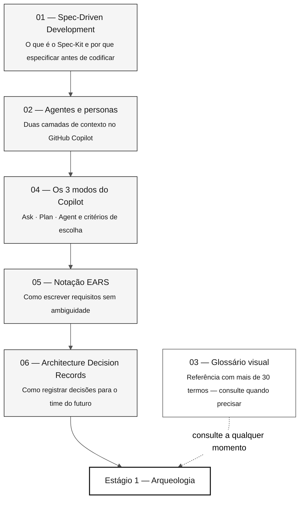

# 07 — Conceitos centrais da imersão

> **Trilha:** [Kit do Time](../README.md) › **Conceitos centrais**

**Este índice apresenta os conceitos essenciais da imersão de modernização do SIFAP — o que você vai aprender, em que ordem, quanto tempo leva e como cada conceito se conecta aos quatro estágios de trabalho.**

  

| Campo | Valor |
|---|---|
| **Público-alvo** | Qualquer pessoa do time, inclusive quem não é desenvolvedor |
| **Pré-requisitos** | Nenhum — este é o ponto de partida |
| **Tempo estimado** | 60–90 min para ler todos os documentos |
| **Resultado esperado** | Vocabulário compartilhado antes do Estágio 1 |

---

## O que você vai aprender

Cada arquivo desta pasta explica um conceito técnico de forma direta, usando exemplos reais do domínio do SIFAP (Sistema de Fiscalização e Administração de Pagamentos): pagamentos, benefícios e fiscalização. Depois de lê-los, você será capaz de:

- Explicar o ciclo do Spec-Kit sem recorrer à documentação
- Distinguir uma skill de papel de um agente de estágio e saber como as duas se compõem no GitHub Copilot
- Escolher o modo certo do Copilot (Ask, Plan ou Agent) para cada situação
- Escrever ou revisar um requisito EARS com `source_legacy:`
- Escrever ou avaliar um Architecture Decision Record (ADR)

---

## Trilha de aprendizado

---

## Documentos desta pasta

| # | Documento | Conceito central | Estágio principal |
|---|---|---|---|
| 01 | [Spec-Driven Development](01-spec-driven-development.md) | Ciclo do Spec-Kit: specify → plan → tasks → implement | Estágio 2 |
| 02 | [Agentes e personas](02-agents-and-personas.md) | Skill de papel que carrega sozinha × agente de estágio que você seleciona | Todos |
| 03 | [Glossário visual](03-visual-glossary.md) | Mais de 30 termos com definição, exemplo do SIFAP e referência | Todos |
| 04 | [Os 3 modos do Copilot](04-3-copilot-modes.md) | Ask · Plan · Agent — critérios e antipadrões | Todos |
| 05 | [Notação EARS](05-ears-notation.md) | 6 padrões EARS (5 básicos + Complex), REQ-ID e `source_legacy:` | Estágio 2 |
| 06 | [Architecture Decision Records](06-architecture-decision-records.md) | Anatomia, quando escrever e o ciclo de vida do ADR | Estágio 2 |
| 07 | [O método além do mainframe](07-method-beyond-mainframe.md) | Os mesmos quatro estágios aplicados a COBOL, Delphi, VB6, PL/SQL e monólitos sem documentação | Todos |

---

## Conexão com os quatro estágios

| Estágio | Documentos de referência nesta pasta |
|---|---|
| Estágio 1 — Arqueologia | Glossário (termos do legado: Natural, DDM, MU, PE, BR-NNN) |
| Estágio 2 — Especificação | Spec-Kit, agentes, EARS, ADR, glossário (EARS, REQ-ID, source_legacy) |
| Estágio 3 — Implementação | Os 3 modos do Copilot, glossário (JPA, Flyway, Testcontainers, Controller) |
| Estágio 4 — Evolução | Os 3 modos do Copilot (modo Agent), glossário (IaC, Terraform, CI/CD) |

---

## Verifique antes de continuar

Antes de começar o Estágio 1, confirme que você consegue responder a estas perguntas sem recorrer à documentação:

- [ ] O que é o Spec-Kit e para que serve o comando `/speckit.specify`?
- [ ] Qual é a diferença entre uma skill de papel (documentada em `05-personas/`, que vive em `.github/skills/`) e um agente de estágio (em `06-stage-agents/`)?
- [ ] Quando usar Ask em vez de Agent no Copilot?
- [ ] O que é EARS e por que o campo `source_legacy:` é obrigatório?
- [ ] O que é um ADR e em que situação você escreveria um?

Se você respondeu quatro das cinco, siga para [`../05-personas/`](../05-personas/) e leia os seus dois arquivos `PERSONA.md`.

---

### Continue lendo

| Anterior | Próximo |
|---|---|
| [Kit do Time](../README.md) Hub principal da imersão. | [Spec-Driven Development](01-spec-driven-development.md) Por que especificar antes de codificar e como o Spec-Kit estrutura o processo. |

[Voltar ao índice do kit](../README.md)
