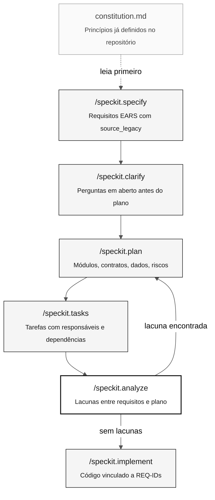

# Spec-Driven Development e Spec-Kit

> **Trilha:** [Kit do Time](../README.md) › [Conceitos](00-README.md) › **Spec-Driven Development**

**Spec-Driven Development (SDD) é a prática de especificar por completo o comportamento esperado antes de escrever código — e o Spec-Kit é o conjunto de comandos que estrutura esse processo no GitHub Copilot.**

  

| Campo | Valor |
|---|---|
| **Público-alvo** | Todas as personas, principalmente Requirements Engineer e Software Architect |
| **Pré-requisitos** | Ler os programas `.NSN` atribuídos no Estágio 1 |
| **Tempo estimado** | 20 minutos |
| **Estágio** | Estágio 2 — Especificação |
| **Resultado esperado** | Entender o ciclo do Spec-Kit e saber quando rodar cada comando |

---

## Conceito

Spec-Driven Development é uma abordagem em que o time produz uma especificação formal — com requisitos, plano de arquitetura e tarefas — antes de escrever qualquer código. Com isso, cinco pessoas trabalhando em paralelo constroem partes compatíveis do mesmo sistema em vez de cinco versões divergentes.

O **Spec-Kit** (repositório oficial: [github/spec-kit](https://github.com/github/spec-kit)) é a implementação prática de SDD para times que usam o GitHub Copilot. Ele fornece uma sequência de comandos no GitHub Copilot que conduz o time de uma ideia vaga até tarefas concretas com responsáveis e rastreabilidade.

---

## Por que isso importa nesta imersão

Na imersão do SIFAP, cinco pessoas têm algumas horas para modernizar um sistema de 29 anos. Sem uma especificação compartilhada, cada pessoa implementa a sua interpretação do legado — o que resulta em código incompatível, regras duplicadas ou funcionalidade faltando.

O Spec-Kit resolve esse problema ao impor o ciclo:

> especificar o comportamento esperado → planejar a arquitetura → distribuir tarefas → implementar

Nenhum código deve ser escrito antes que `/speckit.plan` tenha sido executado e validado.

---

## Como funciona

O ciclo completo do Spec-Kit tem sete comandos. Cada um produz um artefato concreto:



| Comando | O que produz | Quando usar |
|---|---|---|
| `/speckit.constitution` | Princípios gerais do sistema (stack, padrões, restrições) | Uma vez por projeto — já está em `.specify/memory/constitution.md` |
| `/speckit.specify` | Requisitos EARS com REQ-IDs e `source_legacy:` | No início do Estágio 2, para cada funcionalidade confirmada |
| `/speckit.clarify` | Perguntas sobre comportamentos sem evidência no legado | Depois de `specify`, antes de planejar |
| `/speckit.plan` | Módulos, contratos de API, modelo de dados e riscos | Depois de responder a todas as perguntas do `clarify` |
| `/speckit.tasks` | Tarefas com estimativas, responsáveis e dependências | Depois que o time aprova o plano |
| `/speckit.analyze` | Relatório de consistência: lacunas, conflitos e cobertura | Antes da implementação — obrigatório |
| `/speckit.implement` | Código, testes e migrações com REQ-IDs rastreáveis | Só depois que o `analyze` não reportar lacunas críticas |

---

## Exemplo no SIFAP

Suponha que o Estágio 1 tenha revelado que `CALCDSCT.NSP` calcula o valor líquido do benefício descontando as contribuições. O fluxo do Estágio 2 seria:

```bash
# 1. Verifique os princípios do sistema
cat .specify/memory/constitution.md

# 2. Especifique a funcionalidade
/speckit.specify calcular o valor líquido do benefício conforme CALCDSCT.NSP.
Inclua source_legacy em todos os requisitos.

# 3. Resolva as perguntas em aberto
/speckit.clarify
# Exemplo de pergunta gerada: "Quando uma contribuição está em atraso, o desconto
# é calculado sobre o valor bruto ou sobre o valor após os demais descontos?"
# → Responda consultando o código legado ou o PO antes de continuar.

# 4. Planeje a arquitetura
/speckit.plan
# Use a stack da imersão: Java 21 + Spring Boot 3.3 + PostgreSQL 16.

# 5. Distribua as tarefas
/speckit.tasks

# 6. Verifique a consistência
/speckit.analyze

# 7. Implemente
/speckit.implement
```

Todo REQ-ID gerado por `/speckit.specify` precisa conter uma linha `source_legacy:` apontando para o trecho exato do `.NSN`. Sem ela, o job de CI `legacy-traceability` rejeita o PR.

---

## Caso de uso

Use o Spec-Kit sempre que o time iniciar uma nova funcionalidade no Estágio 2. Mesmo quando a funcionalidade parece simples, rodar o ciclo completo evita o principal risco da imersão: **modernizar o que o time acha que o sistema faz em vez do que ele realmente faz**.

---

## Erros comuns e como evitá-los

| Sintoma | Causa | Correção |
|---|---|---|
| Código escrito antes do `plan` | O time pulou os passos iniciais | Volte ao `specify`. Código sem spec garante retrabalho. |
| `source_legacy:` ausente em um REQ-ID | Requisito escrito de memória, sem evidência no legado | Abra o `.NSN` correspondente e localize o trecho exato. |
| Doze perguntas vindas do `clarify` | Normal — não é problema | Responda a todas. Toda pergunta sem resposta vira um bug. |
| `analyze` reporta lacunas | Plano incompleto ou inconsistente | Não avance para o `implement`. Corrija o plano e rode de novo. |
| Spec-Kit não encontrado | Instalação incompleta | Consulte [`09-cheat-sheets/spec-kit-workflow.md`](../09-cheat-sheets/spec-kit-workflow.md). |

---

## Checklist de uso

- [ ] **Leia o `constitution.md` primeiro.** Confirme a stack, os padrões e as restrições do projeto.
- [ ] **Rode `/speckit.specify` com base em evidência do legado.** Nunca confie na memória.
- [ ] **Responda a todas as perguntas do `/speckit.clarify`.** Registre as decisões.
- [ ] **Faça o time aprovar o plano antes do `/speckit.tasks`.** O plano é um artefato compartilhado.
- [ ] **Rode `/speckit.analyze` e corrija as lacunas antes de implementar.**
- [ ] **Todo REQ-ID tem `source_legacy:` ou `[GREENFIELD] + justificativa`.**

---

## Referências

- [Repositório oficial do Spec-Kit](https://github.com/github/spec-kit)
- [Cartão de referência dos comandos](../09-cheat-sheets/spec-kit-workflow.md)
- [Guia do Estágio 2](../02-modern-spec/GUIDE.md)

---

### Continue lendo

| Anterior | Próximo |
|---|---|
| [Índice de conceitos](00-README.md)<br/><sub>O que você vai aprender e em que ordem.</sub> | [Agentes e personas](02-agents-and-personas.md)<br/><sub>As duas camadas de contexto no GitHub Copilot.</sub> |

<sub>[Voltar ao índice do kit](../README.md)</sub>
