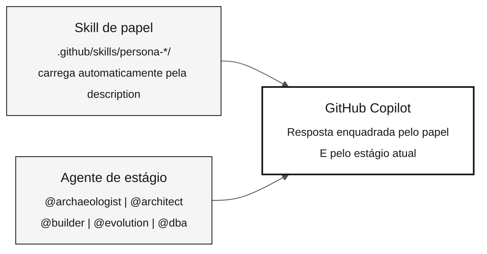

# Agentes e personas — as duas camadas de contexto

> **Trilha:** [Kit do Time](../README.md) › [Conceitos](00-README.md) › **Agentes e personas**

**O GitHub Copilot opera com duas camadas de contexto ao mesmo tempo: a persona, que define o papel individual de cada participante, e o agente de estágio, que define o enquadramento compartilhado pelo time. Saber combiná-las é essencial para obter respostas relevantes durante a imersão.**

  

| Campo | Valor |
|---|---|
| **Público-alvo** | Todas as personas |
| **Pré-requisitos** | Nenhum — leia antes do Estágio 1 |
| **Tempo estimado** | 20 minutos |
| **Estágio** | Todos os estágios |
| **Resultado esperado** | Saber selecionar agente e persona e usá-los juntos no GitHub Copilot |

---

## Conceito

A imersão usa **duas primitivas que se compõem**, e não dois agentes que competem:

- **Skill de papel** — a responsabilidade que você carrega pessoalmente. Ela vive em `.github/skills/` e carrega **automaticamente** quando o seu pedido casa com a `description` dela. Você nunca a seleciona.
- **Agente de estágio** — a fase em que todo o time está. Você o seleciona com `@nome` uma vez por estágio, e ele permanece selecionado.

As duas camadas coexistem por desenho. Você mantém o agente de estágio selecionado o dia inteiro, e a skill do seu papel se compõe com ele sempre que o trabalho exigir aquele papel.

> [!IMPORTANT]
> São **cinco agentes**, não quinze: os quatro agentes de estágio mais o `@dba`. Todo
> outro papel do time é uma skill, porque um papel atravessa os quatro estágios
> enquanto um agente marca apenas um. O ciclo de vida dos dados é a exceção que
> confirma a regra — ele atravessa todos os estágios, então não cabe dentro de um
> só. Consulte o [ADR-0002](../docs/adr/0002-team-roles-as-skills-not-agents.md).

---

## Por que isso importa

Sem um agente de estágio, cada pessoa do time recebe respostas com enquadramentos diferentes, o que torna a consistência impossível. Sem o conhecimento do papel, o Copilot responde como um assistente genérico, que não conhece a sua responsabilidade nem as fronteiras dela.

Com as duas camadas ativas, o Copilot sabe ao mesmo tempo:

- **Quem está perguntando** (fronteira do papel, procedimento e critério de qualidade)
- **Em que contexto o time está** (Estágio 1: arqueologia; Estágio 2: especificação; e assim por diante)

Os papeis são skills porque uma pessoa não troca de papel entre um estágio e outro. Um desenho que obrigava a selecionar o seu papel de novo em cada conversa — e depois selecionar o agente de estágio outra vez para recuperar o contexto do estágio — colocava as duas camadas brigando por um único seletor. As skills eliminam a seleção por completo.

---

## Como elas se combinam



---

## Camada 1 — Papeis (carregados automaticamente)

Cada participante cobre **dois papeis** e mantém os dois ao longo da imersão. O perfil de referência de cada um está em [`05-personas/`](../05-personas/); o conhecimento operacional é a skill correspondente em `.github/skills/`.

| Persona | Papel na imersão | Estágio de maior atuação |
|---|---|---|
| **Product Owner** | Define o escopo e valida requisitos com o negócio | Estágios 1 e 2 |
| **Requirements Engineer** | Lê o legado e converte regras em EARS | Estágios 1 e 2 |
| **Enterprise Architect** | Fornece a visão de sistema (C4 L1 e L2) | Estágio 2 |
| **Software Architect** | Define bounded contexts e contratos de API | Estágio 2 |
| **Technical Lead** | Conduz revisões de PR e decisões de implementação | Estágios 3 e 4 |
| **Developer** | Implementa código Java e Next.js | Estágio 3 |
| **DBA** | Modela dados, escreve migrações e otimiza consultas | Estágio 3 |
| **QA Engineer** | Escreve e valida testes de equivalência | Estágio 3 |
| **DevOps Engineer** | Configura CI/CD, Terraform e Actions | Estágio 4 |
| **Tech Writer** | Documenta APIs, ADRs e runbooks | Estágios 2 e 4 |

### O que cada papel inclui

| Artefato | Localização | Finalidade |
|---|---|---|
| `PERSONA.md` | `05-personas/0X-name/` | Perfil do papel: responsabilidades, entregáveis e slash commands |
| `SKILL.md` | `.github/skills/persona-*/` | Fronteira, procedimento e critério de qualidade do papel — carregados automaticamente |
| `*.prompt.md` | `.github/prompts/` | Slash commands específicos do papel, vinculados ao agente de estágio dono daquele momento |
| `*.instructions.md` | `.github/instructions/` | Regras aplicadas automaticamente aos caminhos de arquivo correspondentes |

> [!IMPORTANT]
> Leia os seus dois arquivos `PERSONA.md` antes de começar qualquer estágio. Você
> não seleciona a skill do seu papel: descreva o trabalho e ela carrega. Os slash
> commands só funcionam quando o contexto do repositório está carregado no GitHub
> Copilot.

---

## Camada 2 — Agentes de estágio (kit compartilhado)

No início de cada bloco de trabalho, todo o time seleciona o mesmo agente de estágio no GitHub Copilot. Isso garante que todas as pessoas recebam respostas com o mesmo enquadramento.

| Estágio | Agente | Enquadramento temático | Papéis que lideram |
|---|---|---|---|
| Estágio 1 — Arqueologia | [`@archaeologist`](../06-stage-agents/01-archaeologist/) | Leitura e interpretação do código legado Natural/Adabas | Requirements Engineer, Tech Writer |
| Estágio 2 — Especificação | [`@architect`](../06-stage-agents/02-architect/) | Especificações EARS, ADRs e o modelo C4 | Enterprise Architect, Software Architect |
| Estágio 3 — Implementação | [`@builder`](../06-stage-agents/03-builder/) | Código Java 21, JPA, Testcontainers e Next.js 15 | Developer, DBA, QA Engineer |
| Estágio 4 — Evolução | [`@evolution`](../06-stage-agents/04-evolution/) | Delegação para o modo Agent, IaC e CI/CD | DevOps Engineer, Tech Writer |

### Diferença na prática

| Sem agente de estágio selecionado | Com agente de estágio selecionado |
|---|---|
| O Copilot responde no contexto geral do repositório | O Copilot adota o enquadramento do estágio atual |
| Cada pessoa recebe respostas com ênfases diferentes | O time recebe respostas consistentes entre si |
| Pode sugerir ações inadequadas ao momento (por exemplo, código no Estágio 1) | Ele se mantém dentro do escopo do estágio atual |

---

## Como selecioná-los

### Skill de papel

Você não a seleciona. Descreva o trabalho com as suas palavras e a skill correspondente carrega a partir da `description` dela. Perguntar ao `@builder` "onde estão as nossas lacunas de cobertura?" carrega o papel de QA sem seleção nenhuma.

Para forçar um papel específico, nomeie-o: "use a skill `persona-qa-engineer`".

### Agente de estágio

1. No início de cada estágio, o facilitador anuncia qual agente o time vai usar.
2. Cada participante seleciona esse agente no GitHub Copilot e o mantém selecionado.
3. Selecionar outro agente **substitui** o ativo; agentes não se empilham. As skills de papel continuam carregando dentro do agente que estiver ativo.
4. Um prompt pode selecionar o próprio agente por meio de `agent:`; preserve as fronteiras de leitura e escrita do estágio atual.

### A exceção transversal

O `@dba` é um agente, e não uma skill, porque o ciclo de vida dos dados percorre os quatro estágios e possui prompts com escopo de ferramentas. Selecione-o quando o trabalho for migração de dados, reconciliação ou auditoria de consultas, e depois volte ao agente de estágio.

---

## Exemplo no SIFAP

**Cenário:** você é a Requirements Engineer no Estágio 2. O time acabou de concluir o Estágio 1.

```
1. O facilitador anuncia: "Selecionem @architect no chat."

2. Você seleciona @architect.
   Resultado: o GitHub Copilot passa a enquadrar as respostas
   no contexto de especificação e arquitetura.

3. Você usa o modo Ask para se orientar:
   "@architect, qual é a ordem recomendada para especificar
   as regras de business-rules-catalog.md?"

4. Com base na resposta, você roda o slash command do seu papel:
   /ears-convert BR-042: <regra de cálculo do benefício>
   Use CALCDSCT.NSP#L120-L198 como source_legacy.

5. O requisito EARS inclui um REQ-ID e source_legacy.
   O CI valida a rastreabilidade no PR.
```

---

## Erros comuns e como evitá-los

| Sintoma | Causa | Correção |
|---|---|---|
| O Copilot sugere código durante o Estágio 1 | Agente de estágio errado ou ausente | Selecione `@archaeologist` e confirme com o time |
| O slash command não é reconhecido | Janela do Copilot aberta fora da raiz do repositório | Reabra o VS Code na raiz do repositório |
| Respostas inconsistentes entre as pessoas do time | Cada pessoa selecionou um agente diferente | Confirme o agente ativo no início de cada estágio |
| O conhecimento do papel nunca aparece | O pedido foi vago demais para casar com a `description` de uma skill | Nomeie o trabalho, ou nomeie a skill: "use a skill `persona-qa-engineer`" |
| Procurar `@product-owner` no seletor | Os papeis viraram skills; somente os estágios e o `@dba` são agentes | Mantenha o agente de estágio e descreva o trabalho do papel |

---

## Checklist de ativação

- [ ] **Leia os dois arquivos `PERSONA.md` atribuídos a você.** Eles estão em `05-personas/`.
- [ ] **Teste um slash command da persona** no GitHub Copilot para confirmar que ela está ativa.
- [ ] **No início de cada estágio, selecione o agente correto** junto com o restante do time.
- [ ] **Confirme o agente ativo antes de fazer perguntas técnicas críticas.**

---

## Referências

- [Lista completa de personas](../05-personas/OVERVIEW.md)
- [Agentes de estágio](../06-stage-agents/)
- [Cartão dos 3 modos do Copilot](../09-cheat-sheets/copilot-3-modes.md)

---

### Continue lendo

| Anterior | Próximo |
|---|---|
| [Spec-Driven Development](01-spec-driven-development.md)<br/><sub>Por que especificar antes de codificar e o ciclo do Spec-Kit.</sub> | [Glossário visual](03-visual-glossary.md)<br/><sub>Mais de 30 termos com definição, exemplo do SIFAP e referência.</sub> |

<sub>[Voltar ao índice do kit](../README.md)</sub>
