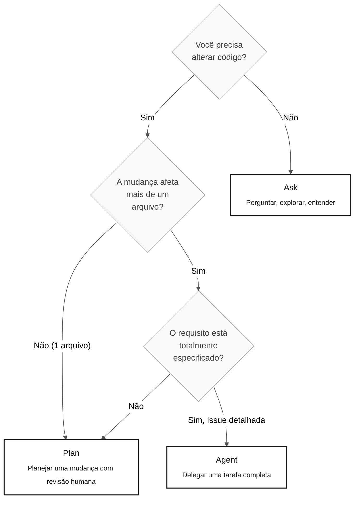

# Os 3 modos do Copilot — Ask, Plan e Agent

> **Trilha:** [Kit do Time](../README.md) › [Conceitos](00-README.md) › **Os 3 modos do Copilot**

**O GitHub Copilot opera em três modos distintos — Ask, Plan e Agent — e escolher o modo errado para uma tarefa desperdiça tempo. Este documento traz critérios objetivos para selecionar o modo certo em cada situação da imersão.**

  

| Campo | Valor |
|---|---|
| **Público-alvo** | Todas as personas |
| **Pré-requisitos** | Ler [Agentes e personas](02-agents-and-personas.md) |
| **Tempo estimado** | 15 minutos |
| **Estágio** | Todos os estágios |
| **Resultado esperado** | Saber sem hesitar qual modo usar para cada tarefa |

---

## Conceito

O GitHub Copilot oferece três modos de operação com níveis diferentes de autonomia, custo de tempo e resultado:

- **Ask** — modo conversacional. Você faz perguntas e recebe respostas em texto. Nenhum código é alterado.
- **Plan** — modo de planejamento. Você descreve uma mudança e o Copilot propõe um plano listando os arquivos a tocar e as alterações a fazer — antes da execução.
- **Agent** — modo autônomo. Você fornece uma tarefa bem definida, normalmente como uma Issue, e o Copilot lê o código, implementa a mudança e abre um PR de forma autônoma.

---

## Por que isso importa

Usar o modo errado tem consequências diretas:

- **Ask quando você deveria usar Plan:** você recebe orientação correta, mas precisa executar tudo manualmente, o que torna o trabalho mais lento que o necessário.
- **Agent quando você deveria usar Ask:** o Copilot altera vários arquivos com base em contexto incompleto, gerando um PR defeituoso que leva mais tempo para corrigir do que uma mudança manual.
- **Plan quando você deveria usar Agent:** você revisa um plano passo a passo para uma tarefa grande e bem definida, criando esforço manual desnecessário.

---

## Árvore de decisão



---

## Comparação dos três modos

| Critério | Ask | Plan | Agent |
|---|---|---|---|
| **O que faz** | Responde a perguntas em texto | Propõe um plano de mudança sem executá-lo | Implementa de forma autônoma e abre um PR |
| **Autonomia** | Nenhuma | Baixa (você aprova cada passo) | Alta (roda sem intervenção) |
| **Custo de tempo** | Baixo | Médio | Alto — só se justifica para tarefas grandes |
| **Quando usar** | Explorar, entender, responder a perguntas | Mudança em vários arquivos com revisão humana | Issue totalmente especificada, com contexto e critérios de aceitação |
| **Pré-requisito** | Nenhum | Contexto do que mudar | Issue com contexto, REQ-IDs, critérios de aceitação e rastreabilidade |
| **Risco de retrabalho** | Nenhum | Baixo | Alto se a Issue estiver incompleta |

---

## Exemplos de prompt por modo — contexto do SIFAP

### Ask — explorar o legado

```text
"Explique linha a linha o que o CALCDSCT.NSP faz.
Foque nas decisões de negócio. Ignore as rotinas de entrada e saída."
```

```text
"@archaeologist, quais campos do BENEFIC.ddm
são obrigatórios e quais são campos de valores múltiplos (MU)?"
```

### Plan — implementar um requisito com revisão

```text
"Plan: implementar o REQ-042 (calcular o valor líquido do benefício).
Liste os arquivos a criar ou modificar, a ordem das mudanças
e os testes de integração necessários.
NÃO implemente ainda — estou aguardando a aprovação do time."
```

```text
"Plan: criar a migração Flyway V3 para adicionar a coluna
status_pagamento à tabela beneficiario.
Mostre o script SQL e as mudanças necessárias na entidade JPA."
```

### Agent — delegar uma tarefa completa (Estágio 4)

```text
[Crie uma GitHub Issue contendo:]
- Título: Implementar o endpoint GET /api/v1/beneficiarios/{id}
- Contexto: REQ-042 especificado no Estágio 2 e mapeado para BeneficiarioService
- Critérios de aceitação: retorna 200 com um DTO, retorna 404 quando não encontrado,
  valida o UUID no path e inclui testes com Testcontainers para os dois cenários
- Rastreabilidade: REQ-042 › CALCDSCT.NSP#L120-L198
[Selecione o modo Agent e referencie a Issue]
```

---

## Antipadrões — o que não fazer

| Antipadrão | Consequência | Alternativa correta |
|---|---|---|
| Usar Agent para uma pergunta de dois minutos | Atraso, consumo de contexto e risco de mudanças indesejadas | Use Ask |
| Usar Ask para implementar um service inteiro | Você recebe orientação, mas executa tudo manualmente | Use Plan ou Agent |
| Delegar ao Agent sem uma Issue detalhada | O PR gerado contém código incorreto ou incompleto | Escreva a Issue completa antes de iniciar o Agent |
| Usar Plan durante o Estágio 1 (arqueologia) | O Copilot pode tentar modificar o legado | Use Ask com `@archaeologist` |
| Ignorar a saída do Plan antes da execução | Mudanças inesperadas em arquivos fora do plano | Leia e aprove o plano antes de confirmar |

---

## Custo de tempo estimado

Use estas estimativas para escolher um modo durante a imersão. O tempo real varia com a complexidade da tarefa:

| Modo | Tarefa simples | Tarefa média | Tarefa complexa |
|---|---|---|---|
| Ask | 1–2 min | 3–5 min | 5–10 min |
| Plan | 5–10 min (incluindo a revisão) | 15–20 min | 30+ min |
| Agent | Não recomendado | 20–30 min (incluindo a revisão do PR) | 45–90 min |

> [!WARNING]
> O tempo do Agent inclui a revisão do PR gerado. PRs com contexto incompleto podem exigir várias iterações.

---

## Referências

- [Cartão de uma página dos 3 modos](../09-cheat-sheets/copilot-3-modes.md)
- [Agentes e personas](02-agents-and-personas.md)
- [Guia do Estágio 4 — o modo Agent na prática](../04-evolution/GUIDE.md)

---

### Continue lendo

| Anterior | Próximo |
|---|---|
| [Glossário visual](03-visual-glossary.md)<br/><sub>Mais de 30 termos com definição e exemplos do SIFAP.</sub> | [Notação EARS](05-ears-notation.md)<br/><sub>Como escrever requisitos sem ambiguidade.</sub> |

<sub>[Voltar ao índice do kit](../README.md)</sub>
