# Notação EARS — requisitos sem ambiguidade

> **Trilha:** [Kit do Time](../README.md) › [Conceitos](00-README.md) › **Notação EARS**

**EARS (Easy Approach to Requirements Syntax) é um conjunto de seis padrões de linguagem que transforma requisitos vagos em declarações de formato fixo, testáveis automaticamente. É a notação obrigatória para todos os requisitos do SIFAP 2.0.**

  

| Campo | Valor |
|---|---|
| **Público-alvo** | Requirements Engineer, Software Architect, Product Owner |
| **Pré-requisitos** | Ler os programas `.NSN` atribuídos e [Spec-Driven Development](01-spec-driven-development.md) |
| **Tempo estimado** | 25 minutos |
| **Estágio** | Estágio 2 — Especificação |
| **Resultado esperado** | Escrever requisitos EARS válidos com REQ-ID e `source_legacy:` |

---

## Conceito

Um requisito mal escrito é a principal causa de retrabalho em projetos de modernização. Afirmações como "o sistema deve ser seguro" ou "processar os dados corretamente" não especificam o que o sistema faz, quando faz nem como verificar o resultado.

O EARS resolve esse problema com seis padrões de sintaxe. Cada padrão corresponde a um tipo de comportamento e produz uma declaração com teste objetivo. Se você não consegue imaginar um teste automatizado para um requisito, o requisito está vago.

---

## Por que isso importa no SIFAP

O SIFAP tem 29 anos de regras implícitas distribuídas em 15 membros Natural atribuídos, 12 programas `.NSP` e três subprogramas `.NSN`, além de quatro DDMs. Sem EARS, cada pessoa do time interpreta as regras de um jeito. Com EARS, a regra extraída da linha 142 do `CALCDSCT.NSP` vira uma única declaração, com teste associado e rastreabilidade até o código legado que a originou.

---

## Estrutura básica de um requisito

Todo requisito da imersão usa este formato YAML:

```yaml
REQ-NNN:
  pattern: <ubiquitous | event-driven | state-driven | optional | unwanted | complex>
  text: "<declaração EARS completa>"
  source_legacy: "<caminho>.NSN#L<início>-L<fim>"
  acceptance:
    - "<critério verificável 1>"
    - "<critério verificável 2>"
```

> [!CAUTION]
> O campo `source_legacy:` é obrigatório em todos os requisitos. O job de CI `legacy-traceability` rejeita PRs que contenham REQ-IDs sem esse campo.

---

## Os 5 padrões básicos EARS

### Padrão 1 — Ubiquitous (sempre se aplica)

**Quando usar:** a regra vale a todo momento, sem condição.

**Template:**

```
O sistema deve <ação>.
```

**Exemplo no SIFAP:**

```yaml
REQ-001:
  pattern: ubiquitous
  text: "O sistema deve registrar a data e a hora de toda alteração em registros de beneficiários."
  source_legacy: 01-archaeology/legacy-sifap/natural-programs/CADBENEF.NSP#L45-L52
  acceptance:
    - "Todo registro de beneficiário alterado contém um timestamp de modificação"
    - "O timestamp usa o fuso horário UTC"
```

**Exemplo ruim:**

```
O sistema deve prover auditoria completa.
```

Problema: "auditoria completa" não é testável.

---

### Padrão 2 — Event-driven (quando algo acontece)

**Quando usar:** a regra é disparada por um evento específico.

**Template:**

```
Quando <evento>, o sistema deve <ação>.
```

**Exemplo no SIFAP:**

```yaml
REQ-042:
  pattern: event-driven
  text: "Quando um pagamento de benefício é processado, o sistema deve calcular o valor líquido descontando as contribuições vigentes."
  source_legacy: 01-archaeology/legacy-sifap/natural-programs/CALCDSCT.NSP#L120-L198
  acceptance:
    - "Dado um beneficiário com valor bruto de R$ 1.000,00 e alíquota de contribuição de 11%, o valor líquido calculado é R$ 890,00"
    - "O resultado é gravado na tabela pagamentos com status CALCULATED"
```

**Exemplo ruim:**

```
Quando houver um pagamento, processe-o.
```

Problema: "processe" não descreve a ação esperada.

---

### Padrão 3 — State-driven (enquanto um estado persiste)

**Quando usar:** a regra vale enquanto o sistema ou a entidade estiver em determinado estado.

**Template:**

```
Enquanto <condição de estado>, o sistema deve <ação>.
```

**Exemplo no SIFAP:**

```yaml
REQ-078:
  pattern: state-driven
  text: "Enquanto o beneficiário estiver com status SUSPENDED, o sistema deve bloquear o processamento de novos pagamentos para esse beneficiário."
  source_legacy: 01-archaeology/legacy-sifap/natural-programs/VALELEG.NSN#L33-L41
  acceptance:
    - "A tentativa de processar um pagamento para um beneficiário SUSPENDED retorna o erro BENEFICIARY_SUSPENSO"
    - "Nenhum registro de pagamento é criado para um beneficiário SUSPENDED"
```

---

### Padrão 4 — Optional (quando uma funcionalidade opcional está presente)

**Quando usar:** a regra só vale quando a pessoa usuária habilitou uma opção ou selecionou uma configuração.

**Template:**

```
Onde <funcionalidade opcional estiver presente>, o sistema deve <ação>.
```

**Exemplo no SIFAP:**

```yaml
REQ-105:
  pattern: optional
  text: "Onde a pessoa operadora seleciona a exportação em CSV, o sistema deve gerar o arquivo com cabeçalho na primeira linha e codificação UTF-8."
  source_legacy: 01-archaeology/legacy-sifap/natural-programs/BATCHREL.NSP#L201-L215
  acceptance:
    - "O arquivo gerado tem extensão .csv"
    - "A primeira linha contém os nomes das colunas"
    - "O conteúdo usa codificação UTF-8"
```

---

### Padrão 5 — Unwanted behavior (o que não pode acontecer)

**Quando usar:** proibições explícitas, incluindo segurança, conformidade ou invariantes do sistema.

**Template:**

```
Se <condição indesejada>, então o sistema deve <resposta de mitigação>.
```

**Exemplo no SIFAP:**

```yaml
REQ-200:
  pattern: unwanted
  text: "O sistema não deve expor o CPF completo do beneficiário nas respostas da API — deve exibir apenas os quatro últimos dígitos."
  source_legacy: 01-archaeology/legacy-sifap/natural-programs/CADBENEF.NSP#L88-L90
  acceptance:
    - "O endpoint GET /api/v1/beneficiarios/{id} retorna o CPF no formato ***.***.***-XX"
    - "Os logs da aplicação nunca registram o CPF"
```

---

## Padrão 6 — Complex (combinação de padrões)

O sexto padrão EARS combina condições de estado, evento e opção em um único requisito. Ele é consistente com a terminologia de [`09-cheat-sheets/spec-kit-workflow.md`](../09-cheat-sheets/spec-kit-workflow.md), que lista os seis padrões EARS.

**Template:**

```
Enquanto <estado>, quando <evento>, onde <opção>, o sistema deve <ação>.
```

**Exemplo no SIFAP:**

```yaml
REQ-250:
  pattern: complex
  text: "Enquanto o beneficiário estiver com status ACTIVE, quando um novo pagamento é processado, onde o método selecionado é crédito em conta, o sistema deve registrar o número da conta bancária no histórico de pagamentos."
  source_legacy: 01-archaeology/legacy-sifap/natural-programs/VALELEG.NSN#L55-L72
  acceptance:
    - "Um pagamento de beneficiário ACTIVE com crédito em conta registra a conta bancária no histórico"
    - "Um pagamento para um beneficiário SUSPENDED não dispara esse fluxo"
```

> [!TIP]
> Use o padrão Complex com parcimônia. Se um requisito combina no máximo duas condições sem perder clareza, o Complex pode ser adequado. Se ficar difícil de ler, divida em dois REQ-IDs.

---

## De um requisito EARS para um teste

```mermaid
%%{init: {'theme':'neutral','themeVariables':{'fontFamily':'ui-sans-serif, system-ui, sans-serif','primaryColor':'#F5F5F5','primaryTextColor':'#171717','primaryBorderColor':'#171717','lineColor':'#525252','secondaryColor':'#FFFFFF','tertiaryColor':'#FAFAFA','background':'#FFFFFF'}}}%%
flowchart LR
    classDef step fill:#F5F5F5,stroke:#171717,color:#171717
    classDef gate fill:#FFFFFF,stroke:#171717,color:#171717,stroke-width:2px
    classDef muted fill:#FAFAFA,stroke:#A3A3A3,color:#404040

    A["Regra do legado<br/><sub>.NSN ou .ddm</sub>"]:::muted
    B["BR-NNN<br/><sub>business-rules-catalog.md</sub>"]:::step
    C["REQ-NNN (EARS)<br/><sub>pattern + text + source_legacy</sub>"]:::step
    D["Critérios de aceitação<br/><sub>acceptance: [...]</sub>"]:::step
    E["Teste automatizado<br/><sub>JUnit 5 + Testcontainers</sub>"]:::step
    F["CI verde<br/><sub>legacy-traceability aprovado</sub>"]:::gate

    A --> B --> C --> D --> E --> F
```



---

## O teste do espelho

Antes de considerar um requisito EARS concluído, pergunte:

> "Como eu testaria isso automaticamente?"

Se a resposta for vaga ou inexistente, o requisito está incompleto.

| Requisito vago | Requisito testável |
|---|---|
| O sistema deve ser seguro | O sistema não deve expor o CPF completo nas respostas da API |
| Processar os dados | Quando um pagamento é processado, calcular o valor líquido conforme a fórmula X |
| Auditoria completa | Quando um beneficiário é alterado, registrar a pessoa operadora, a data, os valores anteriores e os novos valores |
| Funcionar bem | Quando uma requisição é recebida, responder em até dois segundos sob carga normal |

---

## Checklist de validação EARS

- [ ] **Identificador único.** O REQ-ID existe e segue o formato `REQ-NNN`.
- [ ] **Padrão correto.** O padrão declarado em `pattern:` corresponde à estrutura do texto.
- [ ] **Texto sem ambiguidade.** Não usa "adequado", "eficiente", "completo" ou "seguro" sem definição quantitativa.
- [ ] **`source_legacy:` preenchido.** Aponta para um arquivo e linhas específicos ou declara `[GREENFIELD]` com justificativa.
- [ ] **Critérios de aceitação verificáveis.** Todo item de `acceptance:` descreve um cenário com entrada, ação e resultado esperado.
- [ ] **Teste imaginável.** É possível descrever um teste automatizado para cada critério de aceitação.
- [ ] **Tamanho adequado.** Se o requisito cobre mais de um comportamento distinto, divida em dois REQ-IDs.

---

## Erros comuns e como evitá-los

| Sintoma | Causa | Correção |
|---|---|---|
| Dúvida sobre qual padrão usar | A regra ainda não foi categorizada | Comece por event-driven (`Quando…`) — cobre 60% dos casos |
| Não encontra o `source_legacy:` | Requisito escrito de memória | Volte ao `.NSN` e localize o trecho. Sem evidência, não há requisito. |
| O requisito tem três parágrafos | Ele contém dois ou mais requisitos distintos | Divida. Um REQ-ID = um comportamento atômico. |
| O time não chega a um acordo sobre o texto | Ambiguidade no legado | Rode `/speckit.clarify` e registre a decisão em um ADR. |

---

## Prompts úteis no modo Ask do GitHub Copilot

```text
# Converter uma regra do catálogo para EARS
/ears-convert BR-042: <texto da regra confirmada pelo time>.
Use CALCDSCT.NSP#L120-L198 como source_legacy.

# Validar um requisito EARS já escrito
"@architect, este requisito EARS é testável? Como você escreveria o teste?
REQ-042: <texto do requisito>"

# Identificar lacunas de cobertura
/speckit.analyze
Quais regras confirmadas do catálogo ainda não têm um REQ-ID?
```

---

## Referências

- [Guia do Estágio 2](../02-modern-spec/GUIDE.md)
- [Cartão de referência do Spec-Kit](../09-cheat-sheets/spec-kit-workflow.md)
- [LEGACY-EXPLORATION-CHECKLIST](../01-archaeology/LEGACY-EXPLORATION-CHECKLIST.md)

---

### Continue lendo

| Anterior | Próximo |
|---|---|
| [Os 3 modos do Copilot](04-3-copilot-modes.md)<br/><sub>Ask, Plan e Agent — critérios de escolha.</sub> | [Architecture Decision Records](06-architecture-decision-records.md)<br/><sub>Como registrar decisões para o time do futuro.</sub> |

<sub>[Voltar ao índice do kit](../README.md)</sub>
