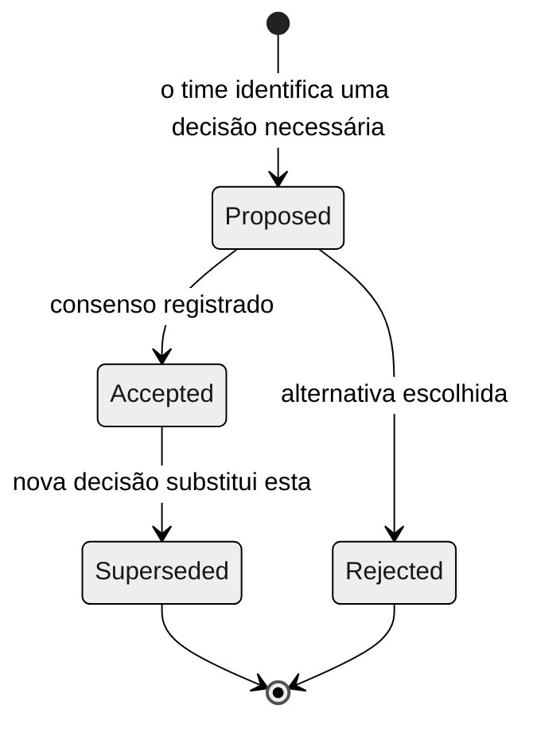

# Architecture Decision Records (ADR)

> **Trilha:** [Kit do Time](../README.md) › [Conceitos](00-README.md) › **Architecture Decision Records**

**Um Architecture Decision Record (ADR) é um documento curto que registra uma decisão de arquitetura relevante: o contexto que a motivou, a decisão tomada, as alternativas consideradas e as consequências. Ele garante que o raciocínio de hoje continue compreensível para quem trabalhar no sistema no futuro.**

  

| Campo | Valor |
|---|---|
| **Público-alvo** | Software Architect, Enterprise Architect, Technical Lead, Product Owner |
| **Pré-requisitos** | [Spec-Driven Development](01-spec-driven-development.md) |
| **Tempo estimado** | 20 minutos |
| **Estágio** | Estágio 2 — Especificação |
| **Resultado esperado** | Saber quando e como escrever um ADR válido para o SIFAP 2.0 |

---

## Conceito

Uma decisão de arquitetura é qualquer escolha técnica que afeta a estrutura, os contratos ou a operação de longo prazo do sistema. Exemplos incluem selecionar um padrão de arquitetura, definir como representar campos de valores múltiplos do Adabas no modelo relacional ou escolher uma estratégia de autenticação.

Decisões técnicas não documentadas viram "conhecimento tribal", dependente de quem estava na sala. Quando esse conhecimento não é registrado, times futuros tomam decisões contraditórias, introduzem redundância ou descartam trabalho por falta de contexto.

Um ADR formaliza o raciocínio em um arquivo Markdown guardado no repositório, ao lado do código que ele governa.

---

## Por que isso importa no SIFAP

O SIFAP tem 29 anos. O SIFAP 2.0 precisa durar pelo menos o mesmo tempo. Decisões tomadas durante a imersão — como representar grupos periódicos (PE) do Adabas, estruturar bounded contexts ou versionar a API — precisam ser registradas para que quem mantiver o sistema no futuro entenda por que ele foi construído assim.

Sem ADRs, o custo de manutenção aumenta a cada troca de time.

---

## Anatomia de um ADR

```markdown
# ADR-NNN: Título da decisão

**Status:** Proposed | Accepted | Rejected | Superseded by ADR-NNN
**Data:** YYYY-MM-DD
**Autores:** [nomes]

## Contexto

Descreva a situação que exige uma decisão: evidências, restrições,
riscos e o que acontece se nenhuma decisão for tomada agora.

## Decisão

Uma frase. "Escolhemos X usando Y."

## Alternativas consideradas

- **Alternativa A:** <descrição e motivo para aceitar ou rejeitar>
- **Alternativa B:** <descrição e motivo para aceitar ou rejeitar>

## Consequências

- Positiva: <benefício esperado>
- Negativa: <custo ou risco aceito>
- Observação: <condição que tornaria esta decisão obsoleta>
```

---

## Ciclo de vida de um ADR



> [!IMPORTANT]
> Nunca apague um ADR. Quando uma decisão é substituída, atualize o status dele para `Superseded by ADR-NNN` e crie um novo ADR explicando a nova decisão. O histórico do raciocínio é valioso.

---

## Quando escrever um ADR

Use o teste das três perguntas:

1. A decisão **afeta vários arquivos, módulos ou pessoas**?
2. **Reverter** a decisão custaria mais de um dia de trabalho?
3. Alguém do time perguntaria "por que fizemos assim?" daqui a seis meses?

Se duas ou mais respostas forem sim, escreva um ADR.

### Exemplos

| Decisão | Precisa de ADR | Justificativa |
|---|---|---|
| Usar Spring Boot 3.3 em vez de Quarkus | Sim | Afeta todos os módulos e é irreversível dentro do tempo da imersão |
| Representar campos MU do Adabas como tabela filha | Sim | Afeta o modelo de dados e os mapeamentos JPA em vários módulos |
| Adotar um Modular Monolith em vez de microsserviços | Sim | Decisão estrutural com impacto em todo o projeto |
| Versionar a API com o prefixo `/api/v1` | Sim | Afeta todos os contratos de API |
| Trocar `final` por `var` em uma variável local | Não | Local, reversível e sem impacto externo |
| Adicionar o Lombok como dependência | Sim | Afeta todos os módulos que o adotarem |
| Usar `@Autowired` em vez de injeção por construtor | Sim, se virar o padrão do time | Afeta todos os componentes Spring |

---

## Exemplo no SIFAP

O texto a seguir é um ADR realista que o time poderia escrever no Estágio 2 para uma decisão de mapeamento de dados:

```markdown
# ADR-003: Representação de grupos periódicos (PE) do Adabas no modelo relacional

**Status:** Accepted
**Data:** 2026-08-12
**Autores:** Software Architect, DBA

## Contexto

O DDM HISTORICO_PAYMENTS.ddm define um grupo periódico (PE) com até
12 ocorrências mensais dentro de cada registro de beneficiário.
O modelo relacional do PostgreSQL 16 não suporta grupos periódicos nativamente.
Precisamos decidir como preservar as ocorrências e a ordem delas no modelo moderno.

## Decisão

Mapear cada ocorrência do PE para uma linha na tabela historico_pagamentos,
com chave estrangeira para beneficiarios e uma coluna competencia (DATE)
para preservar a ordem cronológica.

## Alternativas consideradas

- **Coluna JSONB:** armazenar as 12 ocorrências como um array JSON.
  Rejeitada: dificulta consultar e indexar por período e viola o princípio
  de não reproduzir a complexidade do legado no novo modelo.
- **Tabela filha (escolhida):** cada ocorrência vira uma linha com FK.
  Aceita: consultas simples, indexável e compatível com JPA.

## Consequências

- Positiva: consultas eficientes por período; mapeamento JPA natural.
- Negativa: registros de beneficiário com histórico completo geram 12 linhas por
  beneficiário — uma contagem de linhas maior que no Adabas.
- Observação: se o volume passar de 10 milhões de linhas, avaliar particionamento
  por ano em um ADR futuro.
```

---

## Checklist de ADR concluído

- [ ] **Número sequencial** no formato `ADR-NNN`.
- [ ] **Status declarado:** Proposed, Accepted, Rejected ou Superseded.
- [ ] **Data e autores** registrados.
- [ ] **Contexto** explica por que a decisão é necessária agora, não apenas o que foi decidido.
- [ ] **Decisão em uma frase** — objetiva e sem ambiguidade.
- [ ] **Pelo menos duas alternativas** listadas, com os motivos da rejeição.
- [ ] **Consequências** incluem as negativas, além das positivas.
- [ ] **Cabe em uma página** — se não couber, provavelmente contém duas decisões separadas.
- [ ] **O Product Owner consegue ler e entender** o contexto e a decisão sem conhecimento técnico.

---

## Erros comuns e como evitá-los

| Sintoma | Causa | Correção |
|---|---|---|
| O ADR não lista alternativas | Pressão de tempo | Liste pelo menos duas, mesmo que brevemente. Sem alternativas, quem lê não entende o trade-off. |
| O ADR descreve apenas benefícios | Viés de confirmação | Toda decisão tem um custo. Se não há consequências negativas, o raciocínio está incompleto. |
| Decisão sem contexto | Começou pela decisão em vez do problema | Escreva o contexto primeiro. "Por que agora?" importa mais que "o quê?". |
| O ADR tem cinco páginas | Várias decisões estão misturadas | Divida. Um ADR = uma decisão. |
| O ADR foi apagado quando substituído | Gestão manual de arquivos | Marque como `Superseded by ADR-NNN`. Nunca apague. |

---

## Prompts úteis no modo Ask do GitHub Copilot

```text
# Estruturar um ADR
"@architect, registre um ADR sobre <decisão em aberto>.
Use as alternativas e evidências fornecidas pelo time.
NÃO escolha pelo time — apresente os trade-offs."

# Questionar uma decisão antes de aceitá-la
"@architect, leia o ADR-002 e faça o papel de advogado do diabo.
Quais são os três argumentos mais fortes para REJEITAR esta decisão?"

# Resolver um impasse do time
/speckit.clarify
"Não há consenso entre um Modular Monolith e microsserviços.
Liste prós e contras objetivos de cada um no contexto do SIFAP."
```

---

## Referências

- [Template de ADR em branco](../02-modern-spec/ADR-TEMPLATE.md)
- [Guia do Estágio 2](../02-modern-spec/GUIDE.md)
- [adr.github.io — padrão oficial](https://adr.github.io)

---

### Continue lendo

| Anterior | Próximo |
|---|---|
| [Notação EARS](05-ears-notation.md)<br/><sub>Como escrever requisitos sem ambiguidade.</sub> | [Personas (visão geral)](../05-personas/OVERVIEW.md)<br/><sub>Escolha os seus dois papéis na imersão.</sub> |

<sub>[Voltar ao índice do kit](../README.md)</sub>
