# 07 — O método além do mainframe

> **Trilha:** [Kit do Time](../README.md) › [Conceitos](00-README.md) › **Além do mainframe**

**Os quatro estágios são um método para qualquer sistema que ninguém mais compreende por completo, e o SIFAP é apenas o acervo que este kit entrega.** Depois desta leitura, você consegue conduzir o mesmo dia contra COBOL, Delphi, VB6, PL/SQL ou um monólito Java ou .NET sem documentação.

| Campo | Valor |
|---|---|
| **Público-alvo** | Quem vai aplicar o método fora desta imersão |
| **Pré-requisitos** | [Spec-Driven Development](01-spec-driven-development.md), [Os 3 modos do Copilot](04-3-copilot-modes.md) |
| **Tempo estimado** | 12 min |
| **Estágio** | Todos — leia depois do Estágio 1, aplique depois da imersão |
| **Resultado esperado** | Você sabe mapear a técnica de cada estágio para a sua própria stack legada |

 

---

## Conceito: o que realmente está sendo ensinado

Natural e Adabas são acidentais. O que torna o SIFAP difícil não é a sintaxe; são
quatro condições que nada têm a ver com o mainframe:

| Condição | Por que derrota uma reescrita | Onde ela também aparece |
|---|---|---|
| O comportamento vive apenas no código | Nenhuma especificação sobreviveu, então "o que ele deveria fazer" não tem responsável | Qualquer sistema sem documentação, de qualquer idade |
| As pessoas autoras não estão mais lá | A intenção não pode ser perguntada, apenas inferida | Qualquer sistema mais antigo que sua equipe |
| A documentação divergiu | Ler o manual produz respostas erradas com confiança | Todo sistema que tem manual |
| Os dados sobreviveram ao código | Schema, valores e regras discordam entre si | Todo banco de dados de vida longa |

Um sistema que atende a essas quatro condições é um sistema legado, tenha sido
escrito em 1997 em Natural ou em 2016 em Spring Boot. O método responde a essas
condições, não à linguagem.

> [!IMPORTANT]
> O inverso também vale. Um sistema COBOL com especificação atualizada, sua equipe
> original e dados conciliados não é um problema de modernização — é uma refatoração
> comum. Não aplique este método onde ele não é necessário.

---

## Como os quatro estágios se traduzem

Cada estágio tem uma técnica. Só as *extensões de arquivo* mudam entre stacks.

```mermaid
%%{init: {'theme':'neutral','themeVariables':{'fontFamily':'ui-sans-serif, system-ui, sans-serif','primaryColor':'#F5F5F5','primaryTextColor':'#171717','primaryBorderColor':'#171717','lineColor':'#525252','secondaryColor':'#FFFFFF','tertiaryColor':'#FAFAFA','background':'#FFFFFF'}}}%%
flowchart LR
    classDef step fill:#F5F5F5,stroke:#171717,color:#171717
    classDef muted fill:#FAFAFA,stroke:#A3A3A3,color:#404040
    classDef result fill:#FFFFFF,stroke:#171717,color:#171717,stroke-width:2px

    A["Estágio 1<br/>Inventariar + ler<br/><sub>evidência com citação de linhas</sub>"]:::step
    B["Estágio 2<br/>Especificar o que preservar<br/><sub>requisitos rastreáveis</sub>"]:::step
    C["Estágio 3<br/>Provar a equivalência<br/><sub>testes + dados migrados</sub>"]:::step
    D["Estágio 4<br/>Delegar e ampliar<br/><sub>uma capacidade que era bloqueada</sub>"]:::step
    L["Qualquer stack legada"]:::muted
    R["Um sistema que a equipe<br/>agora consegue mudar"]:::result

    L --> A --> B --> C --> D --> R
```

### Estágio 1 — Inventariar e ler

| Técnica | Natural/Adabas | COBOL/CICS/DB2 | Delphi / VB6 | PL/SQL / Oracle Forms | Monólito Java ou .NET |
|---|---|---|---|---|---|
| Enumerar as unidades | Membros de biblioteca `.NSP`, `.NSN` | Programas + livros `COPY` | `.pas`, `.dfm`, `.frm` | Packages, procedures | Classes por pacote |
| Encontrar os pontos de entrada | `CMSYNIN` no JCL | `EXEC PGM=` no JCL | Tratadores de eventos de formulário | Agendamentos de job, triggers | Controllers, `main`, jobs |
| Traçar o grafo de chamadas | `CALLNAT`, `INCLUDE`, `USING` | `CALL`, `COPY`, `EXEC CICS LINK` | `uses`, chamadas diretas | Dependências entre packages | Grafo de imports, wiring de DI |
| Ler o contrato de dados | DDM + FDT | Copybook + DCLGEN | Tipos embutidos na interface | Views do dicionário de dados | Entidades do ORM, DDL |
| Citar evidência | `CALCBENF.NSN#L40-L58` | `PGM.cbl#L40-L58` | `Unit.pas#L40-L58` | `pkg_calc.sql#L40-L58` | `BenefitService.java#L40-L58` |

A saída é idêntica em todas as colunas: um catálogo de regras em que cada linha cita
um arquivo e um intervalo de linhas, mais um registro de perguntas que ninguém ainda
consegue responder.

### Estágio 2 — Especificar o que preservar

A pergunta do Estágio 2 nunca muda: **qual comportamento observado é uma regra de
negócio e qual é um acidente da plataforma?** Os acidentes variam por stack.

| Stack | Acidente típico que não deve ser preservado |
|---|---|
| Natural/Adabas | Larguras de campo determinadas pela geometria do 3270; uma janela de século acrescentada para o Y2K |
| COBOL | Cláusulas `PIC` dimensionadas para registros em fita; flags de nível `88` no lugar de enums |
| Delphi / VB6 | Validação dentro de um evento de formulário porque não havia outro lugar para colocá-la |
| PL/SQL | Lógica de negócio em um trigger porque a aplicação não podia ser reimplantada |
| Monólito Java ou .NET | Uma solução de contorno para uma versão de framework que ninguém consegue atualizar |

Todo comportamento preservado ganha um requisito com citação de fonte. Toda mudança
deliberada ganha um registro de decisão que informa o que está sendo descartado e por quê.

### Estágio 3 — Provar a equivalência

A equivalência é sustentada por testes que executam as mesmas entradas nas duas
descrições do comportamento e pela conciliação de dados da origem ao destino.
Nenhum dos dois depende da linguagem de origem. O que muda é como obter uma linha de base:

| Origem da linha de base | Quando usá-la |
|---|---|
| Entradas e saídas registradas em produção | Disponíveis e autorizadas — a linha de base mais forte |
| Casos de teste derivados do código lido | O caso comum; mais fraco, e isso precisa ser declarado |
| Execução em paralelo com o sistema legado | Possível apenas quando o sistema legado ainda está em execução e autorizado |
| Sem linha de base | Registre a lacuna; não afirme equivalência |

### Estágio 4 — Delegar e ampliar

A disciplina de delegação independe da stack: uma issue delimitada, uma execução
autorizada e uma revisão humana do diff. O mesmo vale para o movimento final — uma
capacidade que o sistema legado não conseguia oferecer, justificada por uma restrição
que a equipe consegue citar.

| Stack | Uma restrição que costuma bloquear capacidade |
|---|---|
| Natural/Adabas | Geometria fixa de tela; saídas apenas por batch |
| COBOL | Arquivos orientados a registro sem superfície de consulta |
| Delphi / VB6 | Implantação apenas em desktop; sem caminho de acesso remoto |
| PL/SQL | Sem fronteira de API — todo consumidor é um cliente de banco de dados |
| Monólito Java ou .NET | Um único artefato implantável que não pode ser escalado ou liberado de forma independente |

---

## Aplique o método ao seu sistema

Responda a estas perguntas antes de adotar o método em qualquer lugar. Espaços em
branco são achados, não falhas.

- [ ] **Quais das quatro condições valem?** Nomeie-as para o seu sistema, com evidência.
- [ ] **Qual é a menor unidade de enumeração?** Um membro, um programa, um formulário, um package, uma classe.
- [ ] **Quais quatro tipos de aresta formam o seu grafo de chamadas?** Nomeie os seus equivalentes de `CALLNAT`, `INCLUDE`, `USING` e agendamento de jobs.
- [ ] **Onde o contrato de dados está declarado e ele ainda corresponde aos dados?** Nunca presuma que sim.
- [ ] **Qual é o seu formato de citação de evidência?** Combine-o antes que alguém leia código.
- [ ] **Qual linha de base você consegue obter legitimamente?** Decida isso antes de prometer equivalência.
- [ ] **Qual capacidade está bloqueada hoje e por quê?** Se você não consegue nomear a restrição, ainda não tem o Ato V.

---

## Casos de uso

**Use o método quando** o comportamento do sistema não estiver documentado, a equipe
original estiver indisponível e os dados precisarem sobreviver intactos à migração.

**Não o use quando** existir uma especificação atual e confiável, quando o sistema for
pequeno o bastante para ser lido em uma tarde ou quando a decisão for desativar o
sistema em vez de migrá-lo. Arqueologia em um sistema que você vai desligar é esforço
desperdiçado.

---

## Erros comuns e como evitá-los

| Sintoma | Causa | Correção |
|---|---|---|
| A equipe reescreve em vez de ler | A stack parece familiar, então as quatro condições são descartadas por suposição | Aplique o gate do Estágio 1 mesmo assim; familiaridade não é documentação |
| Requisitos sem fonte | A técnica foi portada, mas a regra de rastreabilidade foi abandonada | Mantenha a exigência de citação; é a parte que se transfere |
| Equivalência afirmada sem linha de base | Nenhum comportamento de produção registrado estava disponível e ninguém disse isso | Registre a força da linha de base junto com a afirmação |
| "Legado" usado como sinônimo de "antigo" | As quatro condições nunca foram testadas | Um sistema se qualifica pelas suas condições, não pela idade ou pela linguagem |
| A nova capacidade não tem justificativa | O Ato V foi tratado como uma vaga de funcionalidade | Exija uma restrição citável ou descarte a afirmação |

---

## Referências

- [Spec-Driven Development](01-spec-driven-development.md) — o ciclo de especificação que este método alimenta
- [Os 3 modos do Copilot](04-3-copilot-modes.md) — qual modo sustenta cada ato
- [Notação EARS](05-ears-notation.md) — o formato de requisito e seu campo de rastreabilidade
- [Estágio 1 — Arqueologia](../01-archaeology/GUIDE.md) — a técnica na sua forma Natural/Adabas
- [Estágio 4 — Evolução](../04-evolution/GUIDE.md) — delegação e a capacidade de fechamento

---

### Continue lendo

| Anterior | Próximo |
|---|---|
| [06 — Architecture Decision Records](06-architecture-decision-records.md) Como registrar decisões para a equipe do futuro. | [Estágio 1 — Arqueologia](../01-archaeology/GUIDE.md) Aplique o método ao acervo deste kit. |

[Voltar ao índice do kit](../README.md)
