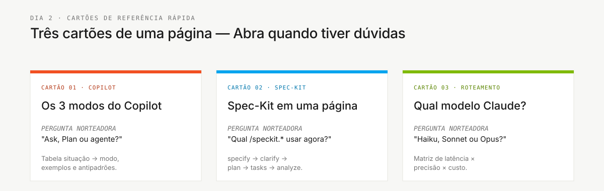

# Cartões de referência rápida

> **Trilha:** [Kit do Time](../README.md) › **Cartões de referência**

**Três cartões de uma página para consulta rápida durante a imersão: os modos do Copilot, o fluxo do Spec-Kit e a escolha de modelo.**

| Campo | Valor |
|---|---|
| **Público-alvo** | O time inteiro — resposta rápida sem ler um guia completo |
| **Pré-requisitos** | Nenhum |
| **Tempo estimado** | 2 min por cartão |
| **Estágio** | Todos |
| **Resultado esperado** | Saber qual cartão consultar para cada dúvida |

---

## Quando usá-los

Abra um cartão de referência quando precisar de uma resposta rápida sem ler um guia completo. Cada cartão responde a uma pergunta específica.

---

## Conteúdo

| Arquivo | Tema | Use quando |
|---|---|---|
| [`copilot-3-modes.md`](copilot-3-modes.md) | GitHub Copilot: modos Ask, Plan e Agent | Você está em dúvida sobre qual modo do Copilot usar |
| [`spec-kit-workflow.md`](spec-kit-workflow.md) | O fluxo do Spec-Kit em uma olhada | Você não sabe qual comando `/speckit.*` usar |
| [`model-routing.md`](model-routing.md) | Qual modelo de IA usar para cada tipo de tarefa | Você está decidindo entre Haiku, Sonnet e Opus |

---

### Continue lendo

| Anterior | Próximo |
|---|---|
| [Kits de persona — índice](../05-personas/README.md) 10 personas, cada uma conduzida por uma skill de papel que carrega automaticamente, com seus prompts e instruções. | [Copilot em 3 modos](copilot-3-modes.md) Quando usar Ask, Plan ou Agent — uma tabela de situação para modo. |

[Voltar ao índice do kit](../README.md)
