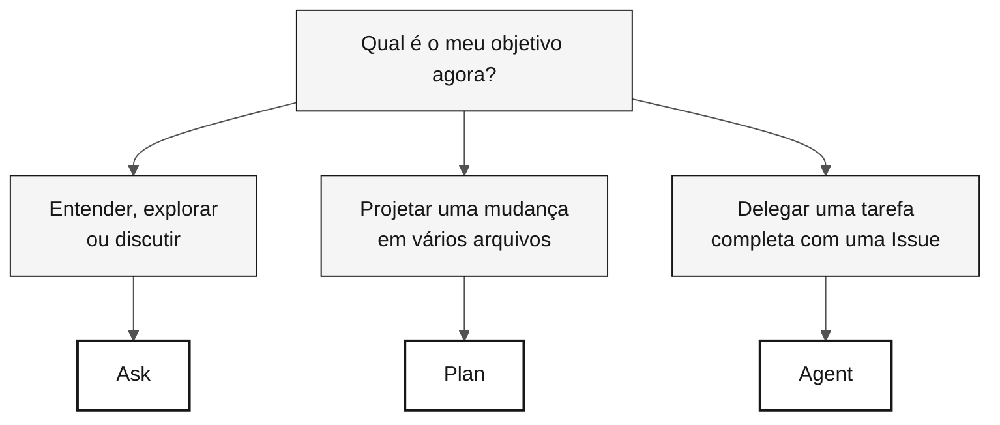

# GitHub Copilot em 3 modos — cartão de referência

> **Trilha:** [Kit do Time](../README.md) › [Cartões de referência](README.md) › **Os 3 modos do Copilot**

**Escolha o modo certo do Copilot antes de abrir o chat: Ask para explorar, Plan para desenhar mudanças e Agent para delegar tarefas completas.**

| Campo | Valor |
|---|---|
| **Público-alvo** | Qualquer pessoa do time antes de iniciar uma conversa com o Copilot |
| **Pré-requisitos** | GitHub Copilot ativo no VS Code |
| **Tempo estimado** | 2 min |
| **Estágio** | Todos |
| **Resultado esperado** | Saber qual modo usar na situação atual |

---

## O que são os 3 modos do Copilot?

O GitHub Copilot opera em três modos distintos, com níveis diferentes de autonomia e custo de contexto:

- **Ask** — modo conversacional. Você pergunta; o Copilot responde. Ele não altera arquivos automaticamente. Ideal para entender, explorar e discutir.
- **Plan** — modo de planejamento. O Copilot propõe um plano de mudança com escopo, arquivos e sequência explícitos. Você valida antes da execução.
- **Agent** — modo autônomo. O Copilot recebe uma tarefa completa, normalmente por uma Issue, e trabalha de forma independente até produzir um PR. Você revisa o resultado.

**Por que isso importa na imersão do SIFAP:** o modo errado desperdiça tempo. Usar Ask para uma implementação em vários arquivos pode levar horas; usar Agent para uma tarefa de cinco minutos é desperdício. A tabela abaixo resolve essa escolha em segundos.

---

## Tabela rápida de decisão

| Situação | Modo | Por quê |
|---|---|---|
| Entender código legado Natural/Adabas | **Ask** | Conversacional, baixo custo, reversível |
| Discutir design ou um trade-off | **Ask** | Exploratório, sem comprometer mudanças em arquivos |
| Avaliar um ADR antes de registrá-lo | **Ask** | Feedback antes de decidir |
| Desenhar uma mudança em vários arquivos | **Plan** | Plano explícito com escopo e sequência claros |
| Listar os testes necessários antes da implementação | **Plan** | Escopo visível antes da execução |
| Delegar uma Issue bem descrita (issue → PR) | **Agent** | Trabalha de forma independente; você revisa no fim |
| Automatizar uma cadeia longa de CI/IaC | **Agent** | Tarefa repetitiva com critérios claros |

---

## Fluxo visual de decisão

---

## Ask — perguntar e explorar

**Use quando** você ainda não sabe exatamente o que quer, ou quando quer entender, discutir ou avaliar um trade-off.

**Exemplos no contexto do SIFAP:**

- `"Explique o que este programa Natural faz, linha a linha."`
- `"Quais são os riscos de usar JSONB para armazenar o histórico de contas bancárias?"`
- `"Resuma este DDM em cinco linhas para alguém que não conhece Adabas."`
- `"Questione este ADR: {cole o ADR}."`

**Erros comuns:**

- Usar Ask para fazer mudanças em vários arquivos — use Plan ou Agent.
- Aceitar uma resposta sem validação — o Copilot pode alucinar; verifique.
- Escrever um prompt curto demais ("ajuda") — dê contexto: o que você tem, o que quer e o que já tentou.

---

## Plan — planejar mudanças

**Use quando** você sabe o que quer, precisa envolver vários arquivos e quer validar escopo, sequência e riscos antes da execução.

**Exemplos no contexto do SIFAP:**

- `"Planeje a criação do módulo <feature> usando a estrutura de pacotes acordada pelo time."`
- `"Liste os testes necessários para cada método público de <Service> antes da implementação."`
- `"Planeje a renomeação de <termo-legado> para <termo-moderno> em todo o projeto, em uma ordem segura."`
- `"Revise as migrações Flyway existentes e proponha uma sequência para adicionar rollback documentado."`

**Erros comuns:**

- Escopo amplo demais — divida em estágios menores.
- Não revisar o plano antes da execução — ajuste antes de autorizar.
- Misturar mudanças de lógica com renomeações — um PR por propósito.

---

## Agent — delegação autônoma

**Use quando** você tem uma Issue bem descrita, aceita que a tarefa vai levar tempo e está preparado para revisar um PR gerado de forma autônoma.

**Como preparar a Issue:**

- [ ] **Escreva o contexto** — o que existe hoje e o que deve existir depois.
- [ ] **Defina critérios de aceitação** — o comportamento verificável esperado.
- [ ] **Estabeleça limites** — o que o Agent deve e o que NÃO deve alterar.
- [ ] **Identifique os arquivos relevantes** — `"leia docs/adr/001.md antes de começar"`.

**Acompanhamento:** não interfira enquanto o Agent estiver rodando. Deixe-o terminar. Verifique o progresso a cada 10 minutos, se precisar.

**Revisão do PR do Agent:** revise exatamente como você revisaria um PR humano. Uma revisão rápida ainda é uma revisão.

**Erros comuns:**

- Issue vaga — o Agent entrega um resultado fora do escopo.
- Acionar o Agent para uma tarefa de cinco minutos que Ask ou Plan resolveriam.
- Fazer merge sem revisão porque o PR foi gerado automaticamente.

---

## Modos por persona

| Persona | Modo principal | Modo secundário |
|---|---|---|
| Product Owner | Ask (refinar histórias) | Plan (priorizar escopo) |
| Requirements Engineer | Ask (validar EARS) | Plan (organizar requisitos) |
| Software Architect | Ask (escolher um padrão) | Plan (desenhar um módulo) |
| Developer | Plan (mudanças em vários arquivos) | Ask, Agent |
| QA Engineer | Plan (cobertura e cenários) | Ask (discutir lacunas) |
| DevOps Engineer | Agent (cadeias longas de CI) | Plan (Terraform) |
| Tech Writer | Ask (revisão de estilo) | Plan (reestruturar um ADR) |

---

> [!TIP]
> **Regra prática.** Se você não soubesse que uma IA gerou o código, você o aceitaria no seu projeto? Se não, rejeite ou refine. O Copilot acelera quem tem conhecimento; ele não substitui o julgamento.

---

### Continue lendo

| Anterior | Próximo |
|---|---|
| [Cartões de referência](README.md) Índice dos três cartões de referência rápida. | [Spec-Kit em 1 página](spec-kit-workflow.md) Sequência: specify — clarify — plan — tasks — analyze. |

[Voltar ao índice do kit](../README.md)
