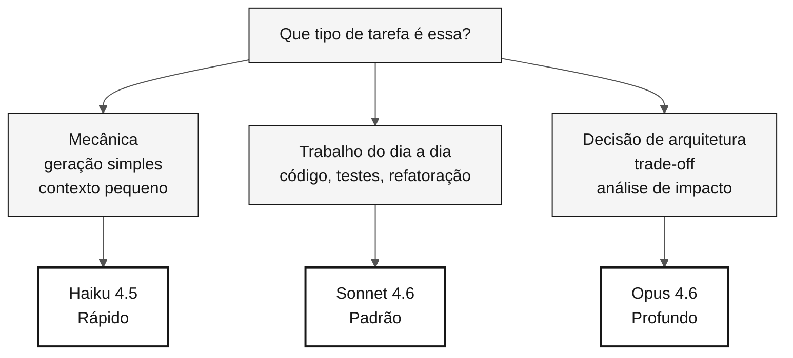

# Escolha de modelo Claude — cartão de referência

> **Trilha:** [Kit do Time](../README.md) › [Cartões de referência](README.md) › **Escolha de modelo**

**Use o menor modelo capaz de resolver a sua tarefa: Haiku para geração mecânica, Sonnet para o trabalho do dia a dia e Opus para decisões de arquitetura que afetam todo o projeto.**

| Campo | Valor |
|---|---|
| **Público-alvo** | Qualquer pessoa do time antes de enviar um prompt ao Copilot |
| **Pré-requisitos** | Nenhum |
| **Tempo estimado** | 2 min |
| **Estágio** | Todos |
| **Resultado esperado** | Escolher o modelo certo sem desperdiçar tempo nem custo |

---

## Princípio: o menor modelo suficiente

Um modelo maior significa mais capacidade e mais latência. Trocar de modelo custa menos que esperar 30 segundos pelo modelo errado.

> [!IMPORTANT]
> Usar Opus para uma tarefa mecânica desperdiça tempo. Usar Haiku para uma decisão de arquitetura cria risco. Escolha pelo tipo de tarefa, não pelo prestígio do modelo.

---

## Tabela rápida de decisão

| Tipo de tarefa | Modelo | Quando usar |
|---|---|---|
| Geração mecânica, transformação simples, contexto pequeno | **Haiku 4.5** | Gerar DDL repetitivo, escrever um teste unitário simples, ajustar YAML trivial |
| Código, testes, refatoração, explicação do dia a dia | **Sonnet 4.6** | Padrão para a maioria das tarefas da imersão |
| Decisão de arquitetura, análise de impacto, trade-off | **Opus 4.6** | Escolha de padrão, definição de bounded context, análise de risco |

---

## Fluxo visual de decisão

---

## Os três modelos

| Modelo | Custo relativo | Velocidade | Quando usar |
|---|---|---|---|
| **Haiku 4.5** | Baixo | Rápida | Tarefa mecânica, transformação simples, contexto pequeno |
| **Sonnet 4.6** | Médio | Média | Padrão do dia a dia: código, testes, refatoração, explicação |
| **Opus 4.6** | Alto | Lenta | Decisão de arquitetura, análise de impacto, discussão de trade-off |

---

## Escolha por persona e situação

### Product Owner e Requirements Engineer

| Situação | Modelo |
|---|---|
| Escrever uma user story | Sonnet |
| Refinar requisitos EARS existentes | Haiku |
| Decidir se um requisito entra na v1 ou na v2 | Opus (uma vez; decida e siga em frente) |

### Arquitetos (Enterprise + Software)

| Situação | Modelo |
|---|---|
| Desenhar um diagrama C4 em Mermaid | Sonnet |
| Escolher entre padrões (hexagonal vs. em camadas) | Opus |
| Gerar uma variação de sintaxe de um diagrama existente | Haiku |

### Technical Lead

| Situação | Modelo |
|---|---|
| Revisar um PR de tamanho médio | Sonnet |
| Decidir um padrão para todo o projeto | Opus no início; Sonnet para aplicar |
| Verificar se um trecho compila | Haiku |

### Developer

| Situação | Modelo |
|---|---|
| Implementar um service | Sonnet |
| Escrever um teste unitário simples | Haiku |
| Discutir a estrutura de classes antes de escrever o código | Opus |

### DBA

| Situação | Modelo |
|---|---|
| Traduzir um DDM do Adabas para SQL | Sonnet (Opus para casos complexos) |
| Gerar DDL repetitivo | Haiku |
| Decidir uma estratégia de particionamento | Opus |

### QA Engineer

| Situação | Modelo |
|---|---|
| Gerar um esqueleto de JUnit 5 | Haiku |
| Escrever um teste de integração não trivial | Sonnet |
| Escolher entre Testcontainers e um mock | Opus |

### DevOps Engineer

| Situação | Modelo |
|---|---|
| Gerar um YAML padrão de GitHub Actions | Sonnet |
| Ajustar comandos triviais do pipeline | Haiku |
| Decidir a topologia no Azure | Opus |

### Tech Writer

| Situação | Modelo |
|---|---|
| Revisar o estilo de um README | Haiku |
| Rascunhar um ADR | Sonnet |
| Decidir a estrutura geral da documentação | Opus, uma vez |

---

## Sinais de que você está usando o modelo errado

| Sintoma | Diagnóstico | Ação |
|---|---|---|
| Esperar 30 segundos por uma resposta trivial | O modelo é maior que o necessário | Troque por um modelo menor |
| Resposta superficial para uma decisão crítica | O modelo é menor que o necessário | Suba para o Opus |
| Resposta correta, mas sem discussão | O modelo é menor que o necessário | Suba para o Opus |
| Empilhar prompts para gerar centenas de arquivos | Modelo errado para uma tarefa em lote | Troque por Sonnet ou Haiku |

---

### Continue lendo

| Anterior | Próximo |
|---|---|
| [Spec-Kit em 1 página](spec-kit-workflow.md) Sequência: specify — clarify — plan — tasks — analyze. | [Cartões de referência](README.md) Índice dos três cartões de referência rápida. |

[Voltar ao índice do kit](../README.md)
