# Kit do time: imersão SIFAP 2.0

> **Trilha:** **Kit do time** (você está aqui)

Comece por [`00-START-HERE.md`](00-START-HERE.md).

## Idiomas do repositório

**A `main` permanece sempre em inglês e é a branch padrão.** Esta edição em português do Brasil fica na branch `portugues-br`; a edição em espanhol fica na `espanol`.

| Idioma | Branch | Documentação | Clone |
|---|---|---|---|
| **Português (BR)** | [`portugues-br`](https://github.com/workshop-gbb/datacorp-sifap-modernization-team-kit/tree/portugues-br) | [Comece aqui](00-START-HERE.md) · [Índice da documentação](docs/README.md) · [Instruções do Copilot](.github/copilot-instructions.md) | `git clone --branch portugues-br https://github.com/workshop-gbb/datacorp-sifap-modernization-team-kit.git` |
| **English** | [`main`](https://github.com/workshop-gbb/datacorp-sifap-modernization-team-kit/tree/main) | [Comece aqui (inglês)](https://github.com/workshop-gbb/datacorp-sifap-modernization-team-kit/blob/main/00-START-HERE.md) · [Índice da documentação (inglês)](https://github.com/workshop-gbb/datacorp-sifap-modernization-team-kit/blob/main/docs/README.md) · [Instruções do Copilot (inglês)](https://github.com/workshop-gbb/datacorp-sifap-modernization-team-kit/blob/main/.github/copilot-instructions.md) | `git clone --branch main https://github.com/workshop-gbb/datacorp-sifap-modernization-team-kit.git` |
| **Español** | [`espanol`](https://github.com/workshop-gbb/datacorp-sifap-modernization-team-kit/tree/espanol) | [Comece aqui (ES)](https://github.com/workshop-gbb/datacorp-sifap-modernization-team-kit/blob/espanol/00-START-HERE.md) · [Índice da documentação (ES)](https://github.com/workshop-gbb/datacorp-sifap-modernization-team-kit/blob/espanol/docs/README.md) · [Instruções do Copilot (ES)](https://github.com/workshop-gbb/datacorp-sifap-modernization-team-kit/blob/espanol/.github/copilot-instructions.md) | `git clone --branch espanol https://github.com/workshop-gbb/datacorp-sifap-modernization-team-kit.git` |

Leia o kit completo dos participantes diretamente neste repositório, no GitHub ou no VS Code. Use as branches acima para escolher o idioma da documentação.

- Mantenha a documentação e toda a prosa das primitivas do Copilot da `main` e da `develop` em inglês, independentemente do idioma da conversa.
- Mantenha a documentação e a prosa das primitivas do Copilot em português do Brasil na `portugues-br`; não faça merge da árvore traduzida na `main`.
- Mantenha a documentação e a prosa das primitivas em espanhol na `espanol`; traduções nunca substituem o inglês da `main` ou da `develop`.
- Preserve nomes de arquivos, caminhos, identificadores técnicos e fontes originais Natural/Adabas ao traduzir.
- Acrescente outros idiomas à tabela somente depois que suas branches existirem. O seletor pode mostrar os nomes nativos dos idiomas.

Os links relativos mantêm você na branch selecionada. Use a tabela acima para trocar o idioma da documentação.

---


**A missão em uma frase:** você e mais quatro pessoas do time têm **oito horas** para modernizar o **Sistema de Fiscalização e Administração de Pagamentos (SIFAP)**, de 29 anos, saindo do legado Natural/Adabas para Java 21 + Next.js 15, com rastreabilidade completa do código moderno até as regras de negócio originais.

  

As datas, os autores e o índice de nomes que este kit sustenta são transcritos dos
cabeçalhos das fontes em [`01-archaeology/legacy-sifap/CHRONOLOGY.md`](01-archaeology/legacy-sifap/CHRONOLOGY.md),
e as divergências que os documentos de época carregam de propósito estão registradas
em [divergência declarada](01-archaeology/legacy-sifap/DECLARED-DRIFT.md). Um guia do
kit que contradiz o cabeçalho de uma fonte é um defeito e reprova o job de CI
`chronology`; um documento de época que o contradiz é o exercício.

---

## Por onde começar (escolha seu perfil)

| Eu sou... | Comece por |
|---|---|
| **Primeira vez aqui ou perfil não técnico** | [`00-START-HERE.md`](00-START-HERE.md) - 15 minutos guiados |
| **Desenvolvedor, quero o cronograma** | [`00-TEAM-FLOW.md`](00-TEAM-FLOW.md) - 10 minutos |
| **Quero entender os conceitos primeiro** | [`07-concepts/`](07-concepts/) - conceitos centrais |
| **Quero preparar meu ambiente** | [`00-SETUP.md`](00-SETUP.md) - laptop + Copilot |
| **Como funciona o Git nesta imersão?** | [`00-GIT-WORKFLOW.md`](00-GIT-WORKFLOW.md) - uma branch por persona |
| **Algo deu errado** | [`docs/troubleshooting.md`](docs/troubleshooting.md) |
| **Sou o líder do time** | [`docs/CHECKLIST-LIDER.md`](docs/CHECKLIST-LIDER.md) - hora a hora |
| **Quero evitar erros comuns** | [`docs/lessons-learned.md`](docs/lessons-learned.md) |
| **Vou apresentar a demo** | [`docs/demo-script.md`](docs/demo-script.md) |
| **Quero ver o progresso do dia** | [`docs/STATUS.md`](docs/STATUS.md) |

---

## Escopo do kit dos participantes

Este repositório contém somente os materiais para o time realizar os exercícios da imersão.
A leitura e as atividades são feitas pelos arquivos do repositório, no GitHub ou no VS Code.

| Incluído | Finalidade |
|---|---|
| Guias dos quatro estágios e kits de persona | Orientar o trabalho de cada participante |
| Fontes Natural, DDMs, FDT e documentos históricos locais | Servir de insumo para a investigação e a rastreabilidade dos exercícios |
| Modelos de especificação, decisão, acompanhamento e apresentação | Ser preenchidos com as descobertas e entregas do próprio time |
| Primitivas do Copilot e verificações de CI | Apoiar a implementação e a validação realizadas pelos participantes |

> [!IMPORTANT]
> O site e seu processo de publicação pertencem ao repositório do instrutor, não a este kit.
> Este repositório não distribui demos prontas, gabaritos, soluções legadas ou modernas em execução,
> nem acessos e instruções de operação dos ambientes do instrutor.
> O código local do legado é material de leitura; cada time constrói sua própria solução.

---

## Como a imersão está organizada

A imersão tem **quatro estágios sequenciais** e **cinco duplas de persona** que trabalham em paralelo dentro de cada estágio. O objetivo final é uma demo funcionando do SIFAP 2.0.

```mermaid
%%{init: {'theme':'neutral','themeVariables':{'fontFamily':'ui-sans-serif, system-ui, sans-serif','primaryColor':'#F5F5F5','primaryTextColor':'#171717','primaryBorderColor':'#171717','lineColor':'#525252','secondaryColor':'#FFFFFF','tertiaryColor':'#FAFAFA','background':'#FFFFFF'}}}%%
flowchart LR
    classDef step fill:#F5F5F5,stroke:#171717,color:#171717
    classDef handoff fill:#FFFFFF,stroke:#525252,color:#171717
    classDef result fill:#FFFFFF,stroke:#171717,color:#171717,stroke-width:2px

    E1["Estágio 1<br/>Arqueologia<br/>@archaeologist"]:::step
    H1["Handoff H1<br/>sync de 5 min"]:::handoff
    E2["Estágio 2<br/>Especificação<br/>@architect"]:::step
    H2["Handoff H2<br/>sync de 5 min"]:::handoff
    E3["Estágio 3<br/>Implementação<br/>@builder"]:::step
    H3["Handoff H3<br/>sync de 5 min"]:::handoff
    E4["Estágio 4<br/>Evolução<br/>@evolution"]:::step
    R["SIFAP 2.0<br/>rodando"]:::result

    E1 --> H1 --> E2 --> H2 --> E3 --> H3 --> E4 --> R
```



- **Cinco pessoas** = cinco duplas de persona, cada dupla é coautora de dois papéis do SDLC
- **Quatro estágios** = cada estágio tem um agente do Copilot dedicado
- **Handoffs (H1, H2, H3)** = um sync de cinco minutos entre a dupla que sai do estágio e a que entra
- **CI verde** = um pipeline de integração aprovado valida cada Pull Request
- **Objetivo final** = uma demo ao vivo do SIFAP 2.0

---

## O arco narrativo

Os quatro estágios são um único argumento contínuo, não quatro exercícios
desconectados. Cada estágio responde a uma pergunta que o estágio anterior tornou
inevitável, e cada um é onde um modo diferente do Copilot justifica seu custo.

| Ato | Estágio | A pergunta | Modo do Copilot que o sustenta | Evidência que deixa |
|---|---|---|---|---|
| I — O sistema que ninguém entende | 1 | O que ele faz de fato? | **Ask** — ler, explicar, interrogar | Regras citadas como `file#Lstart-Lend` |
| II — Decidir o que preservar | 2 | O que é regra de negócio e o que é um acidente de 1997? | **Ask + Plan** | Requisitos EARS com `source_legacy:`, ADRs |
| III — Provar equivalência | 3 | O sistema novo se comporta como o antigo? | **Plan + Agent local** | Testes de equivalência, dados reconciliados |
| IV — Delegar o repetível | 4 | O que pode ser delegado com segurança? | **Coding agent** — da issue ao PR | Um PR revisado ou um bloqueio registrado |
| V — O retorno da migração | 4 | O que passou a ser possível e antes não era? | **Agent + revisão humana** | Uma capacidade `[GREENFIELD]`, justificada |

O Ato V é o que faz os Atos I a IV valerem a pena. Uma migração que apenas reproduz
o comportamento de 1997 gastou um dia para chegar onde a organização já estava. A
regra que mantém isso honesto: uma capacidade só conta como nova quando o time
consegue apontar a restrição do legado que a impedia. Veja o
[Estágio 4](04-evolution/GUIDE.md).

> [!NOTE]
> O método é a parte transferível. O SIFAP é Natural/Adabas porque esse é o corpus
> que este kit entrega, mas os mesmos cinco atos valem para COBOL/CICS, Delphi,
> VB6, PL/SQL e um monólito Java ou .NET sem documentação. O mapeamento está em
> [o método além do mainframe](07-concepts/07-method-beyond-mainframe.md).

---

## Estrutura do kit (ordem de leitura recomendada)

```text
workspace/
├── README.md                            <- você está aqui
├── 00-START-HERE.md                     <- 15 min para qualquer pessoa
├── 00-SETUP.md                          <- preparar laptop + Copilot
├── 00-TEAM-FLOW.md                      <- cronograma canônico do dia
├── 00-SITEMAP.md                        <- mapa visual do kit
├── 00-GIT-WORKFLOW.md                   <- branches, PRs, merges
│
├── 01-archaeology/                      ESTÁGIO 1 - ler o SIFAP legado
│   ├── GUIDE.md                         (passo a passo do estágio)
│   ├── LEGACY-EXPLORATION-CHECKLIST.md  (gate obrigatório antes do Estágio 2)
│   └── legacy-sifap/                    (24 membros Natural + 4 DDMs + 1 FDT)
├── 02-modern-spec/                      ESTÁGIO 2 - escrever EARS, ADRs, C4
├── 03-implementation/                   ESTÁGIO 3 - Java + Next.js + testes
├── 04-evolution/                        ESTÁGIO 4 - modo Agent + Terraform
│
├── 05-personas/                         10 personas (escolha 2 = sua dupla)
├── 06-stage-agents/                     4 agentes do Copilot (1 por estágio)
├── 07-concepts/                         conceitos centrais (EARS, ADR, SDD, agentes)
├── 09-cheat-sheets/                     3 cartões de referência rápida
│
├── docs/                                FAQ, troubleshooting, runbook, ADRs
├── assets/                              SVGs e diagramas
└── specs/                               artefatos Spec-Kit criados pelo time
```

---

## As cinco duplas (escolha a sua)

Cada pessoa assume **uma dupla** (duas personas) e a mantém o dia inteiro.

| Dupla | Personas | Fase do SDLC |
|---|---|---|
| **1 - Visão** | Product Owner + Requirements Engineer | Descoberta + Especificação |
| **2 - Arquitetura** | Enterprise Architect + Software Architect | Especificação + Design |
| **3 - Implementação** | Technical Lead + Developer | Implementação + Evolução |
| **4 - Qualidade** | DBA + QA Engineer | Implementação (dados + testes) |
| **5 - Operações** | DevOps Engineer + Tech Writer | Transversal + Evolução |

Detalhes de cada papel: [`05-personas/OVERVIEW.md`](05-personas/OVERVIEW.md)

---

## Ferramentas aprovadas: use somente estas

> [!IMPORTANT]
> A imersão roda sobre uma stack fixa. Misturar ferramentas alternativas fragmenta o time e quebra a rastreabilidade de spec para código para testes.

| Use | Não use |
|---|---|
| **VS Code** (ou Insiders) | Cursor, Windsurf, IntelliJ, Eclipse |
| **GitHub Copilot** (Ask + Plan + Agent) | Cline, Continue, Aider, Codeium, Tabnine |
| **GitHub Copilot CLI** (opcional) | Interfaces de chat web para gerar código |
| **Spec-Kit oficial** (`Specify CLI`) | Kiro, frameworks SDD alternativos |
| **GitHub** (Issues, PRs, Actions) | - |
| **Docker / Docker Compose** | Containerização legada de outro repositório |
| **Terraform** (provider Azure) | `terraform apply` sem revisão (use só `plan` até o Estágio 4) |

A justificativa completa e as verificações de CI: [`.github/copilot-instructions.md`](.github/copilot-instructions.md)

---

## Duas camadas: agentes de estágio e skills de papel

O kit separa **quando** você está trabalhando de **qual papel** você cobre. As duas
camadas ficam sempre ativas e se compõem, em vez de disputar um único seletor.

| Camada | Primitiva | Como carrega | O que responde |
|---|---|---|---|
| [`06-stage-agents/`](06-stage-agents/) | **Agente** — de `@archaeologist` a `@evolution` | Você seleciona uma vez por estágio no GitHub Copilot | "Em qual fase o time inteiro está agora?" |
| [`05-personas/`](05-personas/) | **Skill** — uma por papel, em `.github/skills/` | Carrega automaticamente a partir da sua `description` | "Qual responsabilidade eu carrego pessoalmente?" |

Mantenha o agente de estágio selecionado o dia inteiro e deixe a skill do seu papel
se compor com ele. Pedir lacunas de cobertura ao `@builder` carrega o papel de QA
sozinho; você nunca seleciona nada de novo.

São **cinco agentes**: os quatro agentes de estágio mais o `@dba`, porque o ciclo
de vida dos dados atravessa os quatro estágios e não cabe dentro de um só. Todo
outro papel do time é uma skill. O raciocínio está no
[ADR-0002](docs/adr/0002-team-roles-as-skills-not-agents.md).

Explicação completa: [`07-concepts/02-agents-and-personas.md`](07-concepts/02-agents-and-personas.md)

---

## Git: cada persona em sua própria branch

Cada dupla trabalha em **sua própria branch**, abre um **Pull Request** para `develop`, recebe revisão da dupla seguinte e faz merge. No fim do dia, o líder faz merge de `develop -> main`.

```text
spec/<NNN>-<feature>  <- Estágio 2 (RE + SA)
impl/<NNN>-<feature>  <- Estágio 3 (Dev + DBA + QA, criada a partir de develop)
infra/<componente>    <- Estágio 4 (DevOps)
docs/<topico>         <- Transversal (TW)
agent/<issue-NN>      <- Estágio 4 (Copilot Agent)
```

Detalhes e comandos de emergência: [`00-GIT-WORKFLOW.md`](00-GIT-WORKFLOW.md)

---

## Como usar este kit (3 passos)

### 1. Setup inicial (uma vez, ~45 min)

- [ ] **Prepare seu ambiente.** Siga [`00-SETUP.md`](00-SETUP.md).

```bash
# Clone e abra no VS Code
cd ~/Code
git clone --branch main <url-do-repo-do-seu-time> immersion-team-XX
cd immersion-team-XX
git checkout develop
code .
```

> [!NOTE]
> O kit não inclui protótipo pronto, scripts de bootstrap nem containerização herdada. Cada time cria `backend/`, `frontend/` e os arquivos de container/infra necessários durante o Estágio 3.

### 2. Aquecimento (~30 min, cada pessoa)

- [ ] **Leia o cronograma do dia.**

```bash
cat 00-TEAM-FLOW.md
```

- [ ] **Leia os conceitos centrais** (quem não é desenvolvedor: comece por aqui).

```bash
cat 07-concepts/00-README.md
```

- [ ] **Leia suas duas personas.**

```bash
cat 05-personas/XX-persona-A/PERSONA.md
cat 05-personas/YY-persona-B/PERSONA.md
```

- [ ] **Valide que os kits do Copilot estão consolidados.**

```bash
ls .github/agents .github/prompts .github/skills
```

### 3. Dia da imersão: siga os quatro estágios

- [ ] `01-archaeology/GUIDE.md` - ler o código legado, extrair regras
- [ ] `02-modern-spec/GUIDE.md` - EARS, ADRs, C4
- [ ] `03-implementation/GUIDE.md` - Java + Next.js + testes
- [ ] `04-evolution/GUIDE.md` - modo Agent + Terraform

---

## Por que isso importa

A maioria dos projetos de modernização falha não porque o time não sabe escrever Java, mas porque escreve Java para o **problema errado**. Os times modernizam o briefing, não o sistema. Perdem 29 anos de regras de negócio enterradas em código que ninguém lê.


Este kit existe para evitar isso:

- O código legado vem junto com a imersão (em [`01-archaeology/legacy-sifap/`](01-archaeology/legacy-sifap/))
- A rastreabilidade (`source_legacy:`) é exigida pelo CI
- Os handoffs H1, H2 e H3 estão agendados no cronograma
- Os papéis são explícitos (10 arquivos `PERSONA.md`)
- Você não precisa **inventar** o processo, precisa **executá-lo**

---

## Princípios didáticos deste kit

Todo documento aqui segue cinco princípios:

1. **Contexto primeiro** - onde o conceito se encaixa no SDLC e por que importa
2. **Passo a passo executável** - comandos, checklist ou uma sequência clara
3. **Exemplo concreto** - sempre exemplos do SIFAP, nunca abstrações
4. **Definição de pronto** - como saber que o passo terminou
5. **Troubleshooting** - onde há risco operacional, há uma seção de troubleshooting

---

## Glossário rápido

| Termo | Definição objetiva |
|---|---|
| **EARS** | Notação padrão para escrever requisitos sem ambiguidade; cada requisito segue um template fixo com condição, sujeito, ação e resultado esperado |
| **ADR** | Architecture Decision Record - registro formal de uma decisão de arquitetura, incluindo contexto, alternativas consideradas e consequências |
| **Spec-Kit** | Toolkit oficial do GitHub para desenvolvimento guiado por especificação; cria `spec.md`, `plan.md` e `tasks.md` para cada feature |
| **Persona-kit** | Artefatos do Copilot de um papel: seu `PERSONA.md`, a skill do papel em `.github/skills/` e seus prompts de slash command |
| **Agent-kit** | Agente do Copilot do estágio atual; cada estágio tem um agente dedicado (`@archaeologist`, `@architect`, `@builder`, `@evolution`), mais o `@dba` transversal |
| **source_legacy** | Campo obrigatório em cada requisito EARS que aponta para o arquivo `.NSP`/`.NSN` ou `.ddm` de origem; o CI verifica |
| **Bounded context** | Fronteira de domínio que agrupa conceitos com significado coerente (por exemplo: Pagamento, Benefício, Fiscalização no SIFAP) |
| **CI verde** | Estado em que o pipeline de integração contínua passa em todas as verificações; obrigatório antes do merge de um Pull Request |

Glossário completo, com mais de 30 termos: [`07-concepts/03-visual-glossary.md`](07-concepts/03-visual-glossary.md)

---

### Continue lendo

| Anterior | Próximo |
|---|---|
| - | [00 - Comece aqui](00-START-HERE.md)<br/><sub>Passo a passo de 15 minutos para qualquer pessoa.</sub> |

<sub>[Voltar ao índice do kit](README.md)</sub>
