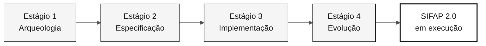

# Guia de estilo da documentação

> **Trilha:** [Kit do Time](../README.md) › [Documentação](README.md) › **Guia de estilo da documentação**

Este é o **contrato único de estilo** para TODOS os arquivos `.md` do repositório
`datacorp-mm-team-kit`, **exceto** os que ficam em `.github/` (não os modifique).

Objetivo: documentação moderna, educativa, profissional e sóbria, sem emojis,
sem analogias ao Super Mario e com diagramas Mermaid em tons neutros
(branco / cinza / preto), tabelas, checklists e blocos de destaque.

---

## 1. Regras absolutas (nunca viole)

| # | Regra |
|---|---|
| R1 | **Zero emojis.** Remova todos os emojis e caracteres pictográficos de títulos, tabelas, listas, destaques, blocos ASCII e corpo do texto. Substitua-os por palavras, badges cinza ou nada. |
| R2 | **Zero analogias ao Super Mario / Nintendo.** Remova Mario, Luigi, Peach, Daisy, Rosalina, Toad, Yoshi, Koopa, Goomba, Bowser, princesa, castelo, cogumelo, power-up, mundo 1-1, cano verde, estrela de invencibilidade, mana, XP, `raid`, `game over`, `boss` e `co-op`. Consulte a §2 para ver o vocabulário substituto. |
| R3 | **`hackathon`/`hackaton`/`workshop` → imersão.** O evento é uma imersão. Isso inclui nomes de diretórios de exemplo (`hackathon-team-XX` → `immersion-team-XX`), títulos e corpo do texto. As únicas exceções são identificadores reais que contêm a palavra: a organização `workshop-gbb`, o slug Enterprise `software-gbb-workshops`, o repositório `workshop-datacorp` e a tag de centro de custo `workshop-legacy-modernization` já aplicada ao lab implantado. |
| R4 | **Este guia rege `docs/` e as pastas numeradas dos estágios, não `.github/`.** As primitivas do Copilot em `.github/` seguem seu próprio padrão estrutural (modelos de agente, prompt, instrução e skill); uma revisão de documentação não deve reestruturá-las como prosa. Links que *apontam para* `.github/...` continuam válidos e devem ser preservados. |
| R5 | **Não invente novos fatos.** Preserve 100% das informações técnicas, comandos, caminhos, REQ-IDs, nomes de arquivos e tabelas de dados existentes. As mudanças tratam de forma, qualidade educativa e organização, não de fatos. |
| R6 | **Não quebre links.** Ao renomear um arquivo, atualize todos os links que apontam para ele. Os caminhos relativos devem permanecer corretos. |
| R7 | Mantenha a prosa da documentação em **inglês na `main` e na `develop`**, **português do Brasil na `portugues-br`** e **espanhol na `espanol`**. Siga a [política de idiomas](../README.md#idiomas-do-repositório); nomes nativos dos idiomas são permitidos no seletor, não seções traduzidas duplicadas na `main`. Preserve nomes de arquivos, caminhos, schemas, identificadores técnicos, comportamento do código e fontes legadas originais. As primitivas do Copilot ficam fora do escopo deste guia; seu idioma e sua estrutura seguem [`.github/PRIMITIVE-STANDARD.md`](../.github/PRIMITIVE-STANDARD.md). |

---

Antes de declarar qualquer data, autor ou versão do SIFAP em um arquivo de
`docs/` ou de uma pasta numerada de estágio, tome o dado de
[`01-archaeology/legacy-sifap/CHRONOLOGY.md`](../01-archaeology/legacy-sifap/CHRONOLOGY.md);
o job `chronology` da CI reprova um documento do kit que contradiga um cabeçalho
de fonte.

## 2. Vocabulário substituto (Mario → profissional)

| Termo anterior | Novo termo |
|---|---|
| Mundo 1 / 1-1 / Overworld | Estágio 1 — Arqueologia |
| Mundo 2 / 2-1 / Underground | Estágio 2 — Especificação |
| Mundo 3 / 3-1 / Athletic | Estágio 3 — Implementação |
| Castelo / 4-Castle / Bowser | Estágio 4 — Evolução |
| Princesa / resgatar a princesa | Objetivo final: SIFAP 2.0 em execução na demonstração |
| Cano verde | Handoff entre estágios |
| Estrela / estrela de invencibilidade | Pipeline de CI aprovado (CI verde) |
| Power-up / inventário / mochila | Kit de persona (prompts, skills, instruções) |
| Personagem jogável (Mario, Peach…) | A própria persona (Product Owner, Developer…) |
| Ataque / movimento especial / mana / XP | Modo do Copilot / slash command / custo de tempo |
| Cena de combate / `raid` / `boss` | Cenário de uso / exemplo prático / revisão de PR |
| `Game over` / cair em um buraco | Falha do projeto / risco / antipadrão |
| `Co-op` de cinco jogadores | Time de cinco pessoas trabalhando em cinco duplas de persona |
| Mario Maker | Ferramenta de autoria de especificações (Spec-Kit) |
| Receita de cogumelo | Modelo de requisito |
| Carta da princesa | Registro formal de decisão (ADR) |
| Yoshi engole tabelas | (reescreva literalmente: modelagem e otimização de dados) |

Quando uma analogia for o *único* conteúdo de uma seção, **substitua-a por conteúdo
educativo real**: uma definição do conceito, por que ele importa, um exemplo concreto
do SIFAP e um caso de uso. Não deixe a seção vazia nem apenas renomeie seu rótulo.

---

## 3. Estrutura canônica dos documentos

Todo arquivo `.md` (exceto modelos puros e arquivos de dados) segue esta ordem:

```markdown
# Título do documento

> **Trilha:** [Kit do Time](../README.md) › [Seção](README.md) › **Documento atual**

**Resumo em uma frase.** Uma única frase direta que explica o que a pessoa
conseguirá fazer após a leitura.

| Campo | Valor |
|---|---|
| **Público-alvo** | quem deve ler |
| **Pré-requisitos** | o que precisa saber/ter antes |
| **Tempo estimado** | 15 min |
| **Estágio** | Estágio 2 — Especificação |
| **Resultado esperado** | artefato concreto produzido |

---

## Conceito

Explicação educativa do conceito (o que é, por que existe e qual problema resolve).

## Como funciona

Diagrama Mermaid + explicação.

## Passo a passo

Checklist executável.

## Exemplo aplicado ao SIFAP

Exemplo concreto, nunca abstrato.

## Casos de uso

Quando usar / quando não usar.

## Critérios de conclusão

- [ ] item verificável

## Erros comuns e como evitá-los

Tabela de sintoma → causa → correção.

## Referências

Links relacionados.

---

### Continue lendo
(bloco de navegação, consulte a §8)
```

Adapte as seções ao conteúdo real do arquivo; não force seções vazias.
O que importa é: **contexto → conceito → prática → verificação → próximos passos**.

---

## 4. Diagramas Mermaid — tema neutro obrigatório

Substitua desenhos em arte ASCII por Mermaid sempre que o diagrama representar
fluxo, hierarquia, sequência, estados ou relações. Preserve blocos de terminal/código-fonte
como estão (eles não são diagramas).

### Paleta única (use exatamente estes valores)

| Papel | fill | stroke | color |
|---|---|---|---|
| Primário / destaque | `#F5F5F5` | `#171717` | `#171717` |
| Secundário | `#FFFFFF` | `#525252` | `#171717` |
| Terciário / apoio | `#FAFAFA` | `#A3A3A3` | `#404040` |
| Sombreado / inativo | `#E5E5E5` | `#737373` | `#404040` |
| Contorno forte (resultado) | `#FFFFFF` | `#171717` | `#171717` (stroke-width 2px) |

### Cabeçalho padrão obrigatório em todo bloco Mermaid



Regras do Mermaid:

- Sempre inclua o bloco `%%{init: ...}%%` acima (copie-o literalmente).
- Nunca use cores saturadas (azul, laranja, verde, vermelho, amarelo).
- Coloque os rótulos entre aspas duplas: `A["Texto"]`. Use `<br/>` para quebras de linha.
- Não use emojis dentro do diagrama.
- Tipos permitidos: `flowchart`, `sequenceDiagram`, `stateDiagram-v2`,
  `journey`, `gantt`, `mindmap`, `timeline`, `erDiagram`, `classDiagram`,
  `quadrantChart`, `C4Context`.
- Em diagramas grandes, prefira `flowchart TB` com um `subgraph` nomeado para cada área.
- Não use `linkStyle` com cor saturada; use `stroke:#525252` se necessário.

### Substitua sequências ASCII por Mermaid

Blocos como `A ──> B ──> C` ou caixas desenhadas com `┌─┐` devem se tornar Mermaid.
Árvores de diretório (`├──`) **podem permanecer** como blocos de código `text`, mas sem
emojis em seus nós.

---

## 5. Componentes visuais permitidos

### 5.1 Blocos de destaque (GitHub Alerts) — use no lugar de emojis

```markdown
> [!NOTE]
> Informação complementar útil.

> [!TIP]
> Atalho ou boa prática.

> [!IMPORTANT]
> Informação necessária para o sucesso.

> [!WARNING]
> Risco de perder trabalho ou quebrar a CI.

> [!CAUTION]
> Consequência negativa grave; ação proibida.
```

### 5.2 Badges — somente em escala de cinza

Use `flat-square` e somente estas cores: `171717`, `404040`, `737373`, `A3A3A3`, `E5E5E5`.

```markdown


```

Use no máximo três badges por documento, sempre imediatamente após o resumo. Nunca use cores.

### 5.3 Tabelas

Prefira uma tabela a uma lista sempre que houver duas ou mais dimensões (item × atributo).
Use cabeçalhos em **negrito** somente na primeira coluna quando ela for uma chave.
Alinhamento: `|---|---|` (padrão). Evite tabelas com mais de cinco colunas.

### 5.4 Checklists

Toda seção que descreve ações executáveis se torna um checklist GFM:

```markdown
## Passo a passo

- [ ] **Passo 1 — Leia os programas atribuídos.** Abra `01-archaeology/legacy-sifap/natural-programs/`.
- [ ] **Passo 2 — Registre as regras.** Preencha `business-rules-catalog.md`.
- [ ] **Passo 3 — Valide.** Execute `npm run lint:docs`.
```

Padrão do item: `- [ ] **Verbo no infinitivo — título curto.** Detalhe com caminho/comando.`

### 5.5 Blocos `<details>` para conteúdo opcional extenso

```markdown
<details>
<summary><strong>Exemplo completo do arquivo gerado</strong></summary>

...conteúdo...

</details>
```

### 5.6 Separadores

Use `---` entre as áreas principais do documento. Não use mais de um `---` consecutivo.

### 5.7 Imagens/SVGs existentes

Mantenha todas as referências existentes a `assets/*.svg`. Não remova imagens.
Garanta que todo `![...]` tenha **texto alternativo descritivo** (acessibilidade),
sem emojis.

---

## 6. Tom educativo (obrigatório)

Cada novo conceito deve incluir, nesta ordem:

1. **Definição** — o que é, em uma frase objetiva.
2. **Por que importa** — qual problema resolve nesta imersão.
3. **Como se aplica ao SIFAP** — um exemplo concreto do domínio (programas `.NSP`,
   subprogramas `.NSN`, DDMs `.ddm`, pagamentos, benefícios, fiscalizações).
4. **Caso de uso** — uma situação real em que a pessoa usará o conceito.
5. **Erro comum** — o que costuma dar errado.

Diretrizes de escrita:

- Use voz ativa e a segunda pessoa ("você faz", "abra o arquivo").
- Mantenha as frases curtas. Um parágrafo = uma ideia.
- Explique termos de domínio e arquitetura (`bounded context`, `pull request`,
  `packed decimal`) na primeira ocorrência: a pessoa é iniciante em pelo menos
  um lado da transição entre legado e moderno.
- Não use humor forçado, jargão de jogos ou exageros. Seja profissional e acolhedor.
- Nunca use "simplesmente", "apenas" ou "é fácil".

---

## 7. Glossário e termos do domínio

Mantenha e reforce: SIFAP (Sistema de Fiscalização e Administração de Pagamentos),
Natural, Adabas, DDM, FDT, EARS, REQ-ID, `source_legacy`, ADR, contexto delimitado,
Spec-Kit, Strangler Fig, Monólito Modular, Testcontainers.

Ao mencionar um termo pela primeira vez em um documento, forneça uma definição
curta entre parênteses ou em uma nota.

---

## 8. Rodapé de navegação padrão

Substitua os rodapés atuais por este formato (sem emojis):

```markdown
---

### Continue lendo

| Anterior | Próximo |
|---|---|
| Título anterior (`previous-file.md`)<br/><sub>Resumo em uma linha.</sub> | Próximo título (`next-file.md`)<br/><sub>Resumo em uma linha.</sub> |

<sub>[Voltar ao índice do kit](../README.md)</sub>
```

Se não houver documento anterior ou próximo, use `—` na célula.
Os blocos HTML `<table>` existentes devem ser convertidos para este formato.

---

## 9. Cabeçalho do arquivo

**Não adicione comentários inline `<!-- markdownlint-disable ... -->`.**
O `.markdownlint-cli2.jsonc` do repositório é a fonte única de verdade para a
configuração do lint e já desativa todas as regras que o kit precisa flexibilizar
(`MD003`, `MD013`, `MD025`, `MD026`, `MD028`, `MD029`, `MD033`, `MD034`,
`MD036`, `MD040`, `MD041`, `MD051`, `MD060`).

Pragmas inline são prejudiciais por dois motivos:

1. Eles duplicam a configuração, fazendo as duas fontes se afastarem ao longo do tempo.
2. Nas primitivas do Copilot (`.github/agents/`, `.github/prompts/`,
   `.github/skills/`, `.github/instructions/`), o comentário é carregado na
   janela de contexto do modelo, consumindo tokens com conteúdo sem valor
   instrutivo.

Adicione um pragma **somente** quando um único arquivo realmente precisar de uma
regra que não esteja desativada globalmente, e desative apenas essa regra. O único
exemplo atual é `docs/adr/0000-template.md`, que precisa de `MD024` porque o modelo
repete títulos deliberadamente:

```markdown
<!-- markdownlint-disable MD024 -->
```

Portanto, a primeira linha de cada arquivo é o título `# H1` (ou o frontmatter
YAML, quando o arquivo é uma primitiva do Copilot). Use apenas um `# H1` por arquivo.
Não pule níveis de título (`#` → `##` → `###`).

---

## 10. Renomeações de arquivo acordadas (07-concepts)

| Arquivo atual | Novo nome |
|---|---|
| `07-concepts/01-spec-kit-como-mario-maker.md` | `07-concepts/01-spec-driven-development.md` |
| `07-concepts/02-agentes-como-super-mario.md` | `07-concepts/02-agents-and-personas.md` |
| `07-concepts/05-ears-receita-de-cogumelo.md` | `07-concepts/05-ears-notation.md` |
| `07-concepts/06-adr-carta-da-princesa.md` | `07-concepts/06-architecture-decision-records.md` |

Os outros arquivos (`00-README.md`, `03-visual-glossary.md`,
`04-3-copilot-modes.md`) mantêm seus nomes.

Renomeie arquivos com `git mv`. Todo agente que encontrar links para os nomes
anteriores deve atualizá-los para os novos nomes.

---

## 11. Checklist de verificação por arquivo

Antes de considerar um arquivo concluído:

- [ ] Nenhum emoji (`grep -P '[\x{1F300}-\x{1FAFF}\x{2600}-\x{27BF}\x{2B00}-\x{2BFF}\x{FE0F}\x{2190}-\x{21FF}]'` não retorna resultados relevantes)
- [ ] Nenhuma referência a analogias de Mario/Nintendo/jogos
- [ ] Nenhuma ocorrência de `hackathon`/`hackaton`/`workshop` (o evento é uma imersão)
- [ ] Todo bloco Mermaid tem o cabeçalho `%%{init:...}%%` e a paleta neutra
- [ ] Todas as ações executáveis estão em checklists `- [ ]`
- [ ] Tabelas são usadas quando há duas ou mais dimensões
- [ ] Alertas GFM (`> [!NOTE]`) são usados no lugar de emojis de aviso
- [ ] O rodapé de navegação usa o formato da §8
- [ ] Os links relativos são válidos (o arquivo de destino existe)
- [ ] O conteúdo factual foi preservado

---

### Continue lendo

| Anterior | Próximo |
|---|---|
| [Índice da documentação](README.md)<br/><sub>Todos os documentos de apoio do kit.</sub> | [FAQ](FAQ.md)<br/><sub>Perguntas frequentes sobre a imersão.</sub> |

<sub>[Voltar ao índice do kit](../README.md)</sub>
