# Fluxo do SDLC e handoffs da imersão

> **Trilha:** [Kit do Time](../README.md) › [Documentação](README.md) › **Fluxo do SDLC**

**Guia dos contratos entre duplas** — resume os handoffs de artefatos sem mudar horários nem ampliar entregáveis.

| Campo | Valor |
|---|---|
| **Público-alvo** | O time inteiro |
| **Pré-requisitos** | Leia [`00-TEAM-FLOW.md`](../00-TEAM-FLOW.md) |
| **Resultado esperado** | Entender o que cada dupla entrega e o que a dupla seguinte recebe |

---

## Visão geral do fluxo

```mermaid
%%{init: {'theme':'neutral','themeVariables':{'fontFamily':'ui-sans-serif, system-ui, sans-serif','primaryColor':'#F5F5F5','primaryTextColor':'#171717','primaryBorderColor':'#171717','lineColor':'#525252','secondaryColor':'#FFFFFF','tertiaryColor':'#FAFAFA','background':'#FFFFFF'}}}%%
flowchart LR
    classDef step fill:#F5F5F5,stroke:#171717,color:#171717
    classDef hand fill:#FFFFFF,stroke:#525252,color:#171717
    classDef result fill:#FFFFFF,stroke:#171717,color:#171717,stroke-width:2px

    E1["Estágio 1<br/>Arqueologia<br/>11:00–14:00"]:::step
    H1["Handoff H1<br/>14:00"]:::hand
    E2["Estágio 2<br/>Especificação moderna<br/>14:00–15:00"]:::step
    H2["Handoff H2<br/>15:00"]:::hand
    E3["Estágio 3<br/>Implementação<br/>15:00–16:10"]:::step
    H3["Handoff H3<br/>16:10"]:::hand
    E4["Estágio 4<br/>Evolução<br/>16:10–16:50"]:::step
    DEMO["Demonstração<br/>17:00–17:30"]:::result

    E1 --> H1 --> E2 --> H2 --> E3 --> H3 --> E4 --> DEMO
```



---

## Cronograma oficial

| Horário | Estágio | Agente | Resultado esperado |
|---|---|---|---|
| 11:00–12:00 e 13:30–14:00 | 1 — Arqueologia | `@archaeologist` | Evidências do legado e uma funcionalidade fina definida |
| 14:00–15:00 | 2 — Especificação moderna | `@architect` | `spec.md`, `plan.md` e `tasks.md` |
| 15:00–16:10 | 3 — Implementação | `@builder` | Primeiro incremento testado da funcionalidade |
| 16:10–16:50 | 4 — Evolução | `@evolution` | Uma delegação ao Agent ou um backlog revisável |

---

## Estrutura formal dos artefatos

Os artefatos formais do Spec-Kit para uma funcionalidade ficam em:

```text
specs/<NNN>-<feature>/
├── spec.md
├── plan.md
└── tasks.md
```

`02-modern-spec/` armazena somente material de apoio e decisões de escopo. Não crie artefatos formais paralelos fora da pasta da funcionalidade.

---

## Checklist de handoff

| Handoff | Quando | De → Para | Entrega mínima | Pergunta de confirmação |
|---|---|---|---|---|
| **H1** | 14:00 | Dupla 1 → Dupla 2 | Fatia de escopo, evidências `.NSN`/`.ddm` e questões em aberto | "Lemos as fontes necessárias para a funcionalidade?" |
| **H2** | 15:00 | Dupla 2 → Duplas 3 e 4 | Caminho da funcionalidade, `spec.md`, `plan.md`, `tasks.md` e primeira tarefa | "A primeira tarefa e seus testes estão claros?" |
| **H3** | 16:10 | Duplas 3 e 4 → Dupla 5 | Status do incremento, testes executados e trabalho pendente | "O que pode ser delegado sem mudar o escopo?" |

Cada handoff é uma conversa síncrona de cinco minutos. Uma lacuna não autoriza inventar requisitos, fontes do legado ou arquitetura: reduza o escopo ou registre a pendência.

---

## Rastreabilidade

Antes de escrever EARS, a pessoa responsável lê a fonte do legado atribuída. Todo REQ-ID em `spec.md` inclui `source_legacy:` apontando para o arquivo `.NSN` ou `.ddm` correspondente, ou `[GREENFIELD]` com uma justificativa. A CI bloqueia pull requests para `develop` quando esse contrato é violado.

---

## Branches

Crie `spec/<NNN>-<feature>` a partir de `develop` e integre-a em `develop`. Depois, crie `impl/<NNN>-<feature>`, também a partir de `develop`. O fluxo é `spec/<NNN>-<feature>` → `develop` → `main`. Não existe branch `stage`.

---

### Continue lendo

| Anterior | Próximo |
|---|---|
| [Matriz persona-agente](persona-agent-matrix.md)<br/><sub>Quem lidera em cada estágio.</sub> | [Quatro agentes explicados](4-agents-explained.md)<br/><sub>Por que há quatro agentes.</sub> |

<sub>[Voltar ao índice do kit](../README.md)</sub>
