# specs/

> **Trilha:** [Kit do Time](../README.md) › **Especificações**

**Esta pasta armazena os artefatos do GitHub Spec-Kit. Para cada feature, o time registra o que deseja construir (`spec.md`), como construir (`plan.md`) e em qual ordem (`tasks.md`) antes de escrever código.**

  

| Campo | Valor |
|---|---|
| **Público-alvo** | Todas as duplas; a Dupla 2 cria os artefatos no Estágio 2 |
| **Pré-requisitos** | Feature selecionada no Estágio 2; handoff H1 concluído |
| **Estágio** | Estágio 2 — Especificação |
| **Resultado esperado** | Uma pasta `NNN-short-name` com `spec.md`, `plan.md` e `tasks.md` rastreáveis |

---

## Conceito: Spec-Driven Development

Spec-Driven Development (SDD) é a prática de especificar uma feature por completo, incluindo requisitos, plano técnico e tarefas, antes da implementação. O GitHub Spec-Kit automatiza esse fluxo com comandos de barra no GitHub Copilot.

**Por que isso importa:** sem uma especificação antecipada, o código cresce sem uma direção rastreável. A CI da imersão verifica se cada REQ-ID tem um `source_legacy:` que aponta para o sistema legado real. Isso garante que o SIFAP 2.0 implemente as regras do SIFAP original (Sistema de Fiscalização e Administração de Pagamentos).

**Caso de uso:** no Estágio 1, o time identifica que `CALCCORR.NSP` contém a lógica de cálculo do reajuste anual. No Estágio 2, essa lógica se torna o `REQ-015` em `spec.md`, com `source_legacy: 01-archaeology/legacy-sifap/natural-programs/CALCCORR.NSP`. No Estágio 3, o teste passa ou falha, completando a cadeia de rastreabilidade.

---

## Estrutura de pastas

Cada feature tem sua própria pasta:

```text
specs/
└── <NNN>-<feature>/
    ├── spec.md
    ├── plan.md
    └── tasks.md
```

O número (`NNN`) define a ordem de criação. O nome (`feature-name`) descreve o escopo em termos comportamentais. Evite nomes genéricos como `system` ou `backend`.

---

## Fluxo do Spec-Kit

```mermaid
%%{init: {'theme':'neutral','themeVariables':{'fontFamily':'ui-sans-serif, system-ui, sans-serif','primaryColor':'#F5F5F5','primaryTextColor':'#171717','primaryBorderColor':'#171717','lineColor':'#525252','secondaryColor':'#FFFFFF','tertiaryColor':'#FAFAFA','background':'#FFFFFF'}}}%%
flowchart LR
    classDef step fill:#F5F5F5,stroke:#171717,color:#171717
    classDef result fill:#FFFFFF,stroke:#171717,color:#171717,stroke-width:2px

    A["/speckit.specify"]:::step --> B["/speckit.clarify"]:::step
    B --> C["/speckit.plan"]:::step
    C --> D["/speckit.tasks"]:::step
    D --> E["/speckit.analyze"]:::step
    E --> F["/speckit.implement"]:::step
    F --> G["Código rastreado<br/>até os REQ-IDs"]:::result
```



| Comando | Artefato gerado | O que verificar |
|---|---|---|
| `/speckit.constitution` | `.specify/memory/constitution.md` | Regras não negociáveis do projeto |
| `/speckit.specify` | `spec.md` | REQ-IDs, padrões EARS, critérios de aceitação e `source_legacy:` |
| `/speckit.clarify` | Questões resolvidas na especificação | Ambiguidades eliminadas |
| `/speckit.plan` | `plan.md` | Arquitetura, dados, riscos e contratos |
| `/speckit.tasks` | `tasks.md` | Ordem de execução, testes e dependências |
| `/speckit.analyze` | Relatório de lacunas | Inconsistências resolvidas |
| `/speckit.implement` | Código em `backend/` e `frontend/` | A implementação segue a especificação |

---

## Passo a passo

- [ ] **Selecione uma descoberta do Estágio 1.** A feature precisa ter evidência do legado.
- [ ] **Crie a pasta da feature.** Use o padrão `NNN-short-name` em `specs/`.
- [ ] **Execute `/speckit.specify`.** Gere o `spec.md` com histórias de usuário, requisitos EARS, critérios de aceitação e `source_legacy:`.
- [ ] **Execute `/speckit.clarify`.** Resolva as questões antes do planejamento.
- [ ] **Execute `/speckit.plan`.** Gere o plano técnico, os riscos, os dados e os contratos em `plan.md`.
- [ ] **Execute `/speckit.tasks`.** Divida o plano em tarefas pequenas, testáveis e rastreáveis em `tasks.md`.
- [ ] **Execute `/speckit.analyze`.** Corrija as inconsistências antes da implementação.
- [ ] **Execute `/speckit.implement`.** Implemente somente depois que a especificação, o plano e as tarefas estiverem consistentes.

---

## Convenção de branches

> [!IMPORTANT]
> O fluxo correto de branches é `spec/<NNN>-<feature>` → `develop` → `main`. Não existe branch `stage`.

- Uma branch por especificação: `spec/<NNN>-<feature>`, criada a partir de `develop`.
- Depois do merge da especificação, crie as branches de implementação `impl/<NNN>-<feature>` a partir de `develop`, nunca a partir da branch de especificação.
- Os commits que implementam comportamento devem citar o REQ-ID: `Implements REQ-XXX`.

---

## Critérios de conclusão

- [ ] Cada feature tem uma pasta `NNN-short-name`.
- [ ] Cada requisito do legado tem `source_legacy:` apontando para `.NSN` ou `.ddm`.
- [ ] Cada requisito greenfield tem uma justificativa `[GREENFIELD]`.
- [ ] O `tasks.md` coloca os testes antes da implementação das regras de negócio.

---

## Relação com `02-modern-spec/`

`02-modern-spec/` não contém uma segunda especificação. Use essa pasta para registrar decisões de escopo e materiais de apoio do Estágio 2. Os requisitos EARS, o plano técnico e as tarefas da feature pertencem a `specs/<NNN>-<feature>/spec.md`, `plan.md` e `tasks.md`.

---

## Erros comuns e como evitá-los

| Sintoma | Causa | Correção |
|---|---|---|
| A CI rejeita o PR porque falta `source_legacy:` | Requisito escrito sem consultar o sistema legado | Releia o `.NSN` correspondente e adicione `source_legacy:` |
| `spec.md` aprovado sem critérios de aceitação | Requisito EARS escrito sem os padrões corretos | Reescreva-o usando um dos cinco padrões EARS |
| `tasks.md` não tem testes | Tarefas criadas sem considerar a verificação | Adicione pelo menos um teste para cada regra de negócio |
| A pasta tem um nome genérico (`backend-features`) | O nome não representa o comportamento | Renomeie-a para representar a feature real |

---

## Referências

- [Cartão de referência do Spec-Kit](../09-cheat-sheets/spec-kit-workflow.md)
- [Notação EARS](../07-concepts/05-ears-notation.md)
- [Spec-Kit oficial](https://github.com/github/spec-kit)
- [Spec-Driven Development](https://github.com/github/spec-kit/blob/main/spec-driven.md)

---

### Continue lendo

| Anterior | Próximo |
|---|---|
| [Spec-Kit em 1 página](../09-cheat-sheets/spec-kit-workflow.md)<br/><sub>Sequência: specify → clarify → plan → tasks → analyze.</sub> | [Estágio 2 — Especificação](../02-modern-spec/GUIDE.md)<br/><sub>Crie a especificação a partir da descoberta do time.</sub> |

<sub>[Voltar ao índice do kit](../README.md)</sub>
